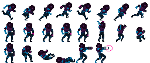
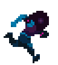

# Flip-book animation

逐帧动画由一系列静态图像连续显示组成。这种技术非常类似于传统的赛璐珞动画（参见 http://en.wikipedia.org/wiki/Traditional_animation）。由于每一帧都可以单独操作，该技术提供了无限的可能性。然而，由于每一帧都存储在独特的图像中，内存占用可能会很高。动画的平滑度也取决于每秒显示的图像数量，但增加图像数量通常也会增加工作量。Defold 逐帧动画要么作为添加到[图集](/manuals/atlas)中的单独图像存储，要么作为[瓷砖图源](/manuals/tilesource)存储，所有帧以水平序列排列。

  {.inline}
  {.inline}

## 播放逐帧动画

精灵和GUI方块节点可以播放逐帧动画，您可以在运行时对它们进行很好的控制。

精灵
: 要在运行时运行动画，您可以使用 [`sprite.play_flipbook()`](/ref/sprite/?q=play_flipbook#sprite.play_flipbook:url-id-[complete_function]-[play_properties]) 函数。请参见下面的示例。

GUI方块节点
: 要在运行时运行动画，您可以使用 [`gui.play_flipbook()`](/ref/gui/?q=play_flipbook#gui.play_flipbook:node-animation-[complete_function]-[play_properties]) 函数。请参见下面的示例。

::: sidenote
ping-pong 播放模式会将动画播放到最后一帧，然后反转顺序并播放回动画的**第二帧**，而不是回到第一帧。这样做是为了使动画链接更容易。
:::

### 精灵示例

假设您的游戏有一个"闪避"功能，允许玩家按下特定按钮进行闪避。您已经创建了四个动画来支持此功能的视觉反馈：

"idle"
: 玩家角色待机的循环动画。

"dodge_idle"
: 玩家角色在闪避姿态下待机的循环动画。

"start_dodge"
: 一次性过渡动画，将玩家角色从站立状态带到闪避状态。

"stop_dodge"
: 一次性过渡动画，将玩家角色从闪避状态带回站立状态。

以下脚本提供了逻辑：

```lua

local function play_idle_animation(self)
    if self.dodge then
        sprite.play_flipbook("#sprite", hash("dodge_idle"))
    else
        sprite.play_flipbook("#sprite", hash("idle"))
    end
end

function on_input(self, action_id, action)
    -- "dodge" 是我们的输入动作
    if action_id == hash("dodge") then
        if action.pressed then
            sprite.play_flipbook("#sprite", hash("start_dodge"), play_idle_animation)
            -- 记住我们正在闪避
            self.dodge = true
        elseif action.released then
            sprite.play_flipbook("#sprite", hash("stop_dodge"), play_idle_animation)
            -- 我们不再闪避了
            self.dodge = false
        end
    end
end
```

### GUI方块节点示例

当为节点选择动画或图像时，实际上您是在一次性分配图像源（图集或瓷砖图源）和默认动画。图像源在节点中静态设置，但当前要播放的动画可以在运行时更改。静态图像被视为单帧动画，因此在运行时更改图像相当于为节点播放不同的逐帧动画：

```lua
function init(self)
    local character_node = gui.get_node("character")
    -- 这要求节点在与我们正在播放的新动画/图像相同的图集或瓷砖图源中
    -- 具有默认动画。
    gui.play_flipbook(character_node, "jump_left")
end
```


## 完成回调函数

`sprite.play_flipbook()` 和 `gui.play_flipbook()` 函数支持一个可选的 Lua 回调函数作为最后一个参数。当动画播放到结束时，将调用此函数。对于循环动画，永远不会调用该函数。回调函数可用于在动画完成时触发事件或将多个动画链接在一起。示例：

```lua
local function flipbook_done(self)
    msg.post("#", "jump_completed")
end

function init(self)
    sprite.play_flipbook("#character", "jump_left", flipbook_done)
end
```

```lua
local function flipbook_done(self)
    msg.post("#", "jump_completed")
end

function init(self)
    gui.play_flipbook(gui.get_node("character"), "jump_left", flipbook_done)
end
```
