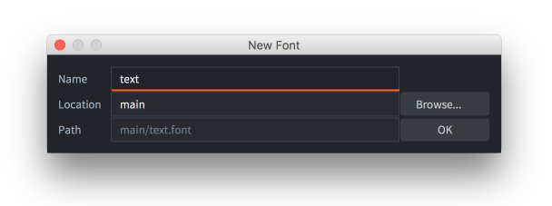
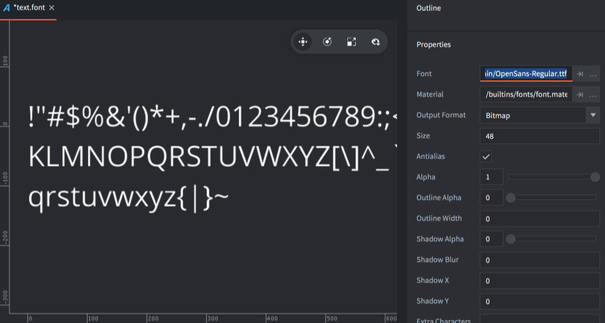
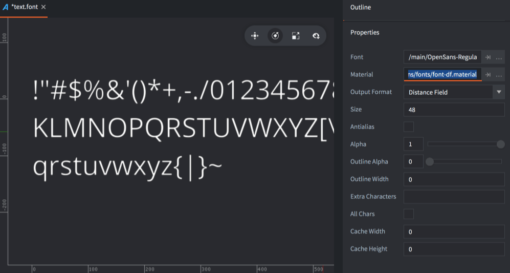
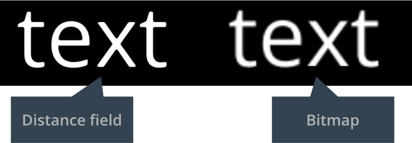
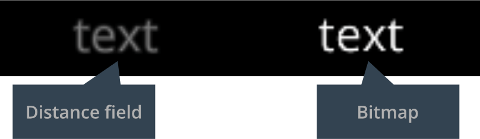

# 字体文件

字体用于在 Label 组件和 GUI 文本节点上显示文字. Defold 支持下列字体类型:

- TrueType
- OpenType
- BMFont

字体加入到 Defold 后会被自动转换成可以渲染的纹理. 文字渲染有两种技术, 各自都有优缺点:

- Bitmap
- Distance field

## 创建字体

在 Defold 中, 可以通过菜单栏 <kbd>File ▸ New...</kbd> 然后旋转 <kbd>Font</kbd> 来新建字体. 或者在 *Assets* 浏览器中 <kbd>右键点击</kbd> , 选择 <kbd>New... ▸ Font</kbd>.

{srcset="images/font/new_font_name@2x.png 2x"}

填写字体名并点击 <kbd>Ok</kbd>. 字体编辑器会自动打开.

{srcset="images/font/new_font@2x.png 2x"}

把字体文件拖放到 *Assets* 浏览器中.

设置字体的 *Font* 属性为所需字体文件然后设置其他所需属性.

## 属性

*Font*
: TTF, OTF 或者 *.fnt* 文件用以生成文字数据.

*Material*
: 渲染文字所用材质. distance field 和 BMFonts 不同格式所需材质不同 (详见下文).

*Output Format*
: 字体生成的纹理格式.

  - `TYPE_BITMAP` 把 OTF 或 TTF 的文字转换成为可以渲染的位图图表. 颜色通道决定了文字, 描边和阴影的颜色. 对于 *.fnt* 文件, 直接使用里面的位图纹理.
  - `TYPE_DISTANCE_FIELD` 也是把文字转换成纹理但是要记录每个像素到文字边缘的距离. 详情见下文.

*Render Mode*
: 文字渲染模式.

  - `MODE_SINGLE_LAYER` 为每个字母渲染一个四边形.
  - `MODE_MULTI_LAYER` 为文字, 描边和阴影分别渲染一个四边形. 从后往前渲染, 这样能够避免描边太大对前一个字母造成的遮挡. 这种渲染模式可以依照字体资源阴影 X/Y 属性, 准确渲染阴影位置.

*Size*
: 文字大小单位像素.

*Antialias*
: 生成位图时是否抗锯齿. 如果想要像素对齐效果则设置为0.

*Alpha*
: 文字透明度. 范围 0.0--1.0,  其中 0.0 表示透明 1.0 表示不透明.

*Outline Alpha*
: 描边透明度. 范围 0.0--1.0.

*Outline Width*
: 描边宽度单位像素. 0 代表无描边.

*Shadow Alpha*
: 阴影透明度. 范围 0.0--1.0.

::: 注意
内置文字材质着色器单层多层渲染模式下都支持文字阴影. 如果不需要分层渲染或者阴影渲染, 最好使用 builtins/font-singlelayer.fp 之类的简单版着色器.
:::

*Shadow Blur*
: 对于位图字体, 此设置代表文字阴影叠加计算次数. 对于 distance field 字体, 此设置代表文字阴影宽度像素数.

*Shadow X/Y*
: 阴影水平和垂直偏移. 只在输出格式为 `MODE_MULTI_LAYER` 时有效.

*Extra Characters*
: 默认字体包含 ASCII 字母表字符 (字符码 32-126). 如果需要更多字符, 需要手动在这里输入.

::: 注意
ASCII 字母表字符包含:
space ! " # $ % & ' ( ) * + , - . / 0 1 2 3 4 5 6 7 8 9 : ; < = > ? @ A B C D E F G H I J K L M N O P Q R S T U V W X Y Z [ \ ] ^ _ \` a b c d e f g h i j k l m n o p q r s t u v w x y z { | } ~
:::

*All Chars*
: 把字体可以显示的所有字符都打包进游戏中来.

*Cache Width/Height*
: 文字缓存大小限制. 渲染文字时, 先从缓存中查找字符. 如果没找到的话, 实际渲染前会先添加进缓存中. 如果缓存太小, 会造成溢出错误 (`ERROR:RENDER: Out of available cache cells! Consider increasing cache_width or cache_height for the font.`).

  设置为0代表自动管理缓存大小.

## Distance field 字体

Distance field 字体不存储位图像素而是存储像素到纹理边缘的距离. 这样在渲染文字时, 专用的着色器会通过距离数据渲染文字. Distance field 字体往往比位图数据量大, 但是对于尺寸控制更为灵活.

{srcset="images/font/df_font@2x.png 2x"}

这种字体要确保 *Material* 属性设置为 *builtins/fonts/font-df.material* (或其他 distance field 数据专用材质) --- 否则的话渲染会不正确.

## 位图 BMFont

Defold 还支持 "BMFont" 格式字体. 这种字体的字符都是由位图组成的. 而且, *.fnt* 文件保存了字符位置大小间距等信息. (注意 Defold 不支持 Phaser 等其他引擎用的 XML 格式的 *.fnt* 文件格式)

相比其他格式字体 BMFont 并无性能优势, 但是因为基于图片, 颜色阴影效果可以随意添加.

把 *.fnt* 和 *.png* 文件加入 Defold 项目中. 这些文件要保存在同一文件夹中. 新建字体然后设置 *font* 属性为 *.fnt* 文件. 确保 *output_format* 属性为 `TYPE_BITMAP`. Defold 会直接使用 PNG 文件而不用再生成位图.

::: 注意
要使用 BMFont, 需要使用工具软件来生成所需文件. 下面列举一些这样的工具:

* [Bitmap Font Generator](http://www.angelcode.com/products/bmfont/), AngelCode 开发的 Windows 版软件.
* [Shoebox](http://renderhjs.net/shoebox/), 免费的基于 Adobe Air 的可运行与 Windows 和 macOS 上的工具.
* [Hiero](https://github.com/libgdx/libgdx/wiki/Hiero), 基于 Java 的开源软件.
* [Glyph Designer](https://71squared.com/glyphdesigner), 71 Squared 开发的付费 macOS 应用.
* [bmGlyph](https://www.bmglyph.com), Sovapps 开发的付费 macOS 应用.
:::

{srcset="images/font/bm_font@2x.png 2x"}

要使用位图字体, 别忘了将其材质设置为 *builtins/fonts/font-fnt.material*.

## 举例与最佳实践

一般来说, 不用缩放的话位图字体最好. 因为渲染速度快.

Distance field 字体适用于需要放大文字的地方. 相对的位图字体放大需要填充更多像素会导致模糊的效果. 下例是字体尺寸 48 像素, 放大 4 倍.

{srcset="images/font/scale_up@2x.png 2x"}

位图字体缩小的时候没有什么问题,  GPU 还会帮助抗锯齿. 位图字体颜色保持得比 distance field 字体好. 下例是字体尺寸 48 像素, 缩小到 1/5:

{srcset="images/font/scale_down@2x.png 2x"}

Distance field 需要足够多的数据信息才能较好地显示出文字边角部位. 下例是字体尺寸 18  像素, 放大 10 倍. 可以看到边角信息严重不足:

{srcset="images/font/df_artifacts@2x.png 2x"}

如果不需要文字阴影和描边, 要将这两种属性设置为0. 否则, 阴影和描边仍然会生成, 造成不必要的内存浪费.

## 文字缓存
Defold 中字体在运行时包含两部分内容, 纹理和字体数据.

* 字体数据是一个字符表, 包含了字符对应的纹理及其字间距信息.
* 纹理在引擎内部称为 "glyph cache texture" 用以渲染显示文字.

运行时渲染文字的时候, 引擎会首先在文字缓存里查找需要的字符. 找不到的话再往缓存里添加这个字符.

每个字符纹理基于字体基准线排列在缓存中, 以便着色器计算字符纹理本地坐标. 这意味着可以动态实现渐变或者或者纹理混合之类的效果. 引擎通过一个叫做 `texture_size_recip` 的常量将缓存信息暴露给着色器, 这个四元数包含如下信息:

* `texture_size_recip.x` 是缓存宽度倒数
* `texture_size_recip.y` 是缓存高度倒数
* `texture_size_recip.z` 是单位宽度与缓存宽度的比
* `texture_size_recip.w` 是单位高度与缓存高度的比

例如 - 实现一个渐变渲染的片元着色器, 可以这么写:

`float horizontal_gradient = fract(var_texcoord0.y / texture_size_recip.w);`

更多详情请见 [着色器教程](/manuals/shader).