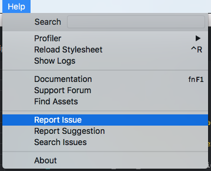

# 获取帮助

如果您在使用Defold时遇到问题，我们希望听到您的反馈，以便我们能够解决问题和/或帮助您解决难题！有多种方式可以讨论和报告问题。请选择最适合您的方式：

## 在论坛上报告问题

在我们的[论坛](https://forum.defold.com)上发布问题是讨论和获取帮助的好方法。根据您遇到的问题类型，在[问题](https://forum.defold.com/c/questions)或[错误](https://forum.defold.com/c/bugs)类别中发帖。记得在提问之前先[搜索](https://forum.defold.com/search)您的问题/问题，因为可能已经有解决方案了。

如果您有多个问题，请创建多个帖子。不要在同一帖子中提出不相关的问题。

### 必需信息
除非您提供所需信息，否则我们将无法提供支持：

**标题**
确保使用简短且描述性的标题。好的标题应该是"如何让游戏对象沿其旋转方向移动？"或"如何让精灵淡出？"。不好的标题是"我需要一些使用Defold的帮助！"或"我的游戏不工作了！"。

**描述错误（必需）**
对错误是什么的清晰简洁描述。

**复现步骤（必需）**
复现行为的步骤：
1. 转到'...'
2. 点击'....'
3. 滚动到'....'
4. 看到错误

**预期行为（必需）**
对您期望发生的事情的清晰简洁描述。

**Defold版本（必需）：**
  - 版本 [例如 1.2.155]

**平台（必需）：**
 - 平台：[例如 iOS, Android, Windows, macOS, Linux, HTML5]
 - 操作系统：[例如 iOS8.1, Windows 10, High Sierra]
 - 设备：[例如 iPhone6]

**最小复现案例项目（可选）：**
请附加一个可以复现错误的最小项目。这将极大地帮助尝试调查和修复错误的人。

**日志（可选）：**
请提供来自引擎、编辑器或构建服务器的相关日志。了解日志存储位置[请点击这里](#日志文件)。

**变通方法（可选）：**
如果有变通方法，请在此处描述。

**屏幕截图（可选）：**
如果适用，添加屏幕截图以帮助解释您的问题。

**附加上下文（可选）：**
在此处添加有关问题的任何其他上下文。


### 分享代码
当您分享代码时，建议以文本形式分享代码，而不是截图。以文本形式分享代码便于搜索、突出错误以及提出和进行修改。通过用三个\`\`\`包裹代码或用4个空格缩进来分享代码。

示例：

\`\`\`
print("Hello code!")
\`\`\`

结果：

```
print("Hello code!")
```


## 从编辑器报告问题

编辑器提供了一种方便的方式来报告问题。从编辑器中选择<kbd>帮助->报告问题</kbd>菜单选项来报告问题。



选择此菜单选项将带您到GitHub上的问题跟踪器。提供[日志文件](#日志文件)、有关您操作系统的信息、复现问题的步骤、可能的变通方法等。

::: important
您需要GitHub帐户才能以这种方式提交错误报告。
:::


## 在Discord上讨论问题

如果您在使用Defold时遇到问题，可以尝试在[Discord](https://www.defold.com/discord/)上提问。但是，我们建议将复杂问题和深入讨论发布在论坛上。另请注意，我们不接受通过Discord提交的错误报告。


# 日志文件

引擎、编辑器和构建服务器生成日志信息，这在寻求帮助和调试问题时非常有价值。报告问题时始终提供日志文件：

* [引擎日志](/manuals/debugging-game-and-system-logs)
* [编辑器日志](/manuals/editor#editor-logs)
* [构建服务器日志](/manuals/extensions#build-server-logs)
