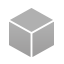

# Defold glossary

本词汇表简要介绍了您在Defold中遇到的所有内容。在大多数情况下，您会找到更多深入文档的链接。

## Animation set

{.left} 动画集资源包含一组.dae文件或其他.animationset文件，从中读取动画。将一个.animationset文件添加到另一个文件中很方便，如果您在多个模型之间共享部分动画集。有关详细信息，请参阅[模型动画手册](/manuals/model-animation/)。

## Atlas

{.left} 图集是一组单独的图像，出于性能和内存原因被编译成一张较大的图。它们可以包含静态图像或翻页动画图像序列。图集被各种组件使用，以共享图形资源。有关更多信息，请参阅[图集文档](/manuals/atlas)。

## Builtins

{.left} 内置项目文件夹是一个只读文件夹，包含有用的默认资源。在这里您可以找到默认渲染器、渲染脚本、材质等。如果您需要对这些资源进行自定义修改，只需将它们复制到您的项目中并按照您的需要进行编辑即可。

## Camera

{.left} 摄像机组件有助于决定游戏世界的哪些部分应该可见以及应该如何投影。一个常见的用例是将摄像机附加到玩家游戏对象，或者拥有一个带有摄像机的独立游戏对象，通过某种平滑算法跟随玩家移动。有关更多信息，请参阅[摄像机文档](/manuals/camera)。

## Collision object

{.left} 碰撞对象是扩展游戏对象物理属性（如空间形状、重量、摩擦力和恢复力）的组件。这些属性决定了碰撞对象应该如何与其他碰撞对象碰撞。最常见的碰撞对象类型是运动学对象、动态对象和触发器。运动学对象提供您必须手动响应的详细碰撞信息，动态对象由物理引擎自动模拟以遵守牛顿物理学定律。触发器是检测其他形状是否已进入或退出触发器的简单形状。有关其工作原理的详细信息，请参阅[物理文档](/manuals/physics)。

## Component

组件用于赋予游戏对象特定的表达和/或功能，如图形、动画、编码行为和声音。它们没有自己的生命，必须包含在游戏对象内。Defold中有多种类型的组件可用。有关组件的描述，请参阅[构建块手册](/manuals/building-blocks)。

## Collection

{.left} 集合是Defold创建模板的机制，或在其他引擎中称为"prefabs"，其中游戏对象的层次结构可以被重用。集合是包含游戏对象和其他集合的树结构。集合始终存储在文件中，并通过在编辑器中手动放置或通过生成动态地引入游戏。有关集合的描述，请参阅[构建块手册](/manuals/building-blocks)。

## Collection factory

{.left} 集合工厂组件用于将游戏对象层次结构动态生成到运行中的游戏中。有关详细信息，请参阅[集合工厂手册](/manuals/collection-factory)。

## Collection proxy

{.left} 集合代理用于在应用程序或游戏运行时动态加载和启用集合。集合代理最常见的用例是在游戏进行时加载关卡。有关详细信息，请参阅[集合代理文档](/manuals/collection-proxy)。

## Cubemap

{.left} 立方体贴图是一种特殊类型的纹理，由6种不同的纹理组成，这些纹理映射到立方体的侧面。这对于渲染天空盒和各种反射和光照贴图很有用。

## Debugging

在某个时刻，您的游戏会以意外的方式运行，您需要找出问题所在。学习如何调试是一门艺术，幸运的是，Defold附带了一个内置调试器来帮助您。有关更多信息，请参阅[调试手册](/manuals/debugging)。

## Display profiles

{.left} 显示配置文件资源文件用于指定GUI布局依赖于方向、纵横比或设备型号。它有助于使您的UI适应任何类型的设备。在[布局手册](/manuals/gui-layouts)中阅读更多内容。

## Factory

{.left} 在某些情况下，您无法手动将所有需要的游戏对象放置在集合中，您必须动态地、即时地创建游戏对象。例如，玩家可能会发射子弹，每次按下扳机时都应该动态生成并发射子弹。要动态创建游戏对象（来自预分配的对象池），您可以使用工厂组件。有关详细信息，请参阅[工厂手册](/manuals/factory)。

## Font

{.left} 字体资源是从TrueType或OpenType字体文件构建的。字体指定了渲染字体的大小以及渲染字体应具有的装饰类型（轮廓和阴影）。字体由GUI和标签组件使用。有关详细信息，请参阅[字体手册](/manuals/font/)。

## Fragment shader

{.left} 这是一个在图形处理器上运行的程序，用于多边形绘制到屏幕时每个像素（片段）的处理。片段着色器的目的是决定每个结果片段的颜色。这是通过计算、纹理查找（一个或多个）或查找和计算的组合来完成的。有关更多信息，请参阅[着色器手册](/manuals/shader)。

## Gamepads

{.left} 手柄资源文件定义了特定手柄设备输入如何映射到特定平台上的手柄输入触发器。有关详细信息，请参阅[输入手册](/manuals/input)。

## Game object

{.left} 游戏对象是简单对象，在游戏执行期间具有独立的生命周期。游戏对象是容器，通常配备有视觉或可听组件，如声音或精灵。它们也可以通过脚本组件配备行为。您在编辑器中创建游戏对象并将其放置在集合中，或者在运行时使用工厂动态生成它们。有关游戏对象的描述，请参阅[构建块手册](/manuals/building-blocks)。

## GUI

{.left} GUI组件包含用于构建用户界面的元素：文本以及有颜色和/或有纹理的块。元素可以组织成层次结构，进行脚本化和动画化。GUI组件通常用于创建抬头显示器、菜单系统和屏幕通知。GUI组件由GUI脚本控制，这些脚本定义GUI的行为并控制用户与GUI的交互。在[GUI文档](/manuals/gui)中阅读更多内容。

## GUI script

{.left} GUI脚本用于控制GUI组件的行为。它们控制GUI动画以及用户如何与GUI交互。有关Lua脚本在Defold中如何使用的详细信息，请参阅[Defold中的Lua手册](/manuals/lua)。

## Hot reload

Defold编辑器允许您在已经运行的游戏中更新内容，无论是在桌面还是设备上。此功能非常强大，可以大大改善开发工作流程。有关更多信息，请参阅[热重载手册](/manuals/hot-reload)。

## Input binding

{.left} 输入绑定文件定义了游戏应该如何解释硬件输入（鼠标、键盘、触摸屏和游戏手柄）。该文件将硬件输入绑定到高级输入_动作_，如"跳跃"和"向前移动"。在监听输入的脚本组件中，您能够编写游戏或应用程序在给定某些输入时应该采取的动作的脚本。有关详细信息，请参阅[输入文档](/manuals/input)。

## Label

{.left} 标签组件允许您将文本内容附加到任何游戏对象。它在屏幕上的游戏空间中渲染一段带有特定字体的文本。有关更多信息，请参阅[标签手册](/manuals/label)。

## Library

{.left} Defold允许您通过强大的库机制在项目之间共享数据。您可以使用它来设置可从所有项目访问的共享库，无论是为您自己还是整个团队。在[库文档](/manuals/libraries)中阅读有关库机制的更多信息。

## Lua language

Lua编程语言在Defold中用于创建游戏逻辑。Lua是一种强大、高效、非常小的脚本语言。它支持过程式编程、面向对象编程、函数式编程、数据驱动编程和数据描述。您可以在官方Lua主页https://www.lua.org/上阅读有关该语言的更多信息，并在[Defold中的Lua手册](/manuals/lua)中阅读相关信息。

## Lua module

{.left} Lua模块允许您构建项目结构并创建可重用的库代码。在[Lua模块手册](/manuals/modules/)中阅读更多相关信息。

## Material

{.left} 材质通过指定着色器及其属性来定义不同对象应该如何渲染。有关更多信息，请参阅[材质手册](/manuals/material)。

## Message

组件通过消息传递相互通信和与其他系统通信。组件还响应一组预定义的消息，这些消息会改变它们或触发特定动作。您发送消息来隐藏图形或推动物理对象。引擎还使用消息来通知组件事件，例如当物理形状碰撞时。消息传递机制需要为每个发送的消息指定接收者。因此，游戏中的一切都被唯一寻址。为了允许对象之间进行通信，Defold扩展了Lua的消息传递功能。Defold还提供了一组有用的函数库。

例如，在游戏对象上隐藏精灵组件所需的Lua代码如下：

```lua
msg.post("#weapon", "disable")
```

这里，`"#weapon"`是当前对象精灵组件的地址。`"disable"`是精灵组件响应的消息。有关消息传递如何工作的深入解释，请参阅[消息传递文档](/manuals/message-passing)。

## Model

{.left} 3D模型组件可以将glTF和Collada网格、骨骼和动画资源导入到您的游戏中。有关更多信息，请参阅[模型手册](/manuals/model/)。

## ParticleFX

{.left} 粒子在创建漂亮的视觉效果方面非常有用，特别是在游戏中。您可以使用它们来创建雾、烟、火、雨或落叶。Defold包含一个强大的粒子效果编辑器，允许您在游戏中实时运行效果时构建和调整效果。[ParticleFX文档](/manuals/particlefx)为您提供了其工作原理的详细信息。

## Profiling

良好的性能是游戏的关键，您必须能够进行性能和内存分析来测量您的游戏并识别需要修复的性能瓶颈和内存问题。有关Defold可用的分析工具的更多信息，请参阅[分析手册](/manuals/profiling)。

## Render

{.left} 渲染文件包含将游戏渲染到屏幕时使用的设置。渲染文件定义了用于渲染的渲染脚本以及要使用的材质。有关更多详细信息，请参阅[渲染手册](/manuals/render/)。

## Render script

{.left} 渲染脚本是一个Lua脚本，用于控制游戏或应用程序应该如何渲染到屏幕。有一个默认的渲染脚本涵盖了最常见的情况，但如果您需要自定义光照模型和其他效果，您可以编写自己的渲染脚本。有关渲染管道如何工作的更多详细信息，请参阅[渲染手册](/manuals/render/)，有关Lua脚本在Defold中如何使用的详细信息，请参阅[Defold中的Lua手册](/manuals/lua)。

## Script

{.left} 脚本是一个组件，包含定义游戏对象行为的程序。通过脚本，您可以指定游戏的规则，对象应该如何响应各种交互（与玩家以及其他对象）。所有脚本都用Lua编程语言编写。为了能够使用Defold工作，您或您团队中的某人需要学习如何用Lua编程。有关Lua的概述以及Lua脚本在Defold中如何使用的详细信息，请参阅[Defold中的Lua手册](/manuals/lua)。

## Sound

{.left} 声音组件负责播放特定的声音。目前，Defold支持WAV和Ogg Vorbis格式的声音文件。有关更多信息，请参阅[声音手册](/manuals/sound)。

## Sprite

{.left} 精灵是一个组件，用图形扩展游戏对象。它显示来自瓦片源或图集的图像。精灵内置支持翻页和骨骼动画。精灵通常用于角色和物品。

## Texture profiles

{.left} 纹理配置文件资源文件用于在打包过程中自动处理和压缩图像数据（图集、瓦片源、立方体贴图和用于模型、GUI等的独立纹理）。在[纹理配置文件手册](/manuals/texture-profiles)中阅读更多相关信息。

## Tile map

{.left} 瓦片地图组件在一个或多个重叠网格中显示来自瓦片源的图像。它们最常用于构建游戏环境：地面、墙壁、建筑物和障碍物。瓦片地图可以显示几个层叠在一起的层，具有指定的混合模式。这很有用，例如，将叶子放在草地背景瓦片上。还可以动态更改瓦片中显示的图像。这允许您，例如，通过简单地用描绘破损桥梁的瓦片替换瓦片并包含相应的物理形状，来摧毁一座桥梁并使其无法通行。有关更多信息，请参阅[瓦片地图文档](/manuals/tilemap)。

## Tile source

{.left} 瓦片源描述了一种纹理，该纹理由多个较小图像组成，每个图像大小相同。您可以从瓦片源中的一系列图像定义翻页动画。瓦片源还可以自动从图像数据计算碰撞形状。这对于创建对象可以碰撞和交互的瓦片化关卡非常有用。瓦片源由瓦片地图组件（以及精灵和粒子效果）使用，以共享图形资源。请注意，图集通常比瓦片源更适合。有关更多信息，请参阅[瓦片地图文档](/manuals/tilemap)。

## Vertex shader

{.left} 顶点着色器计算组件原始多边形形状的屏幕几何图形。对于任何类型的视觉组件，无论是精灵、瓦片地图还是模型，形状都由一组多边形顶点位置表示。顶点着色器程序处理每个顶点（在世界空间中）并计算原始顶点应该具有的结果坐标。有关更多信息，请参阅[着色器手册](/manuals/shader)。
