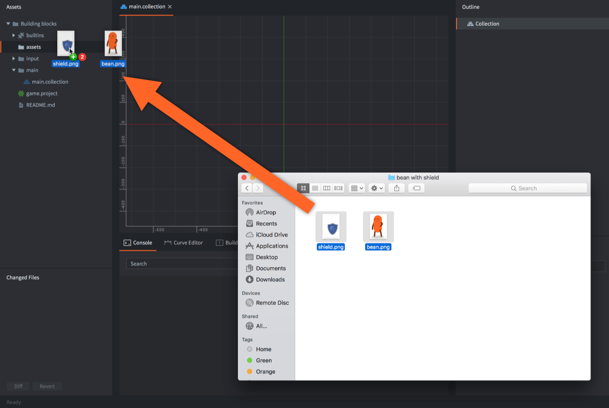
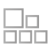
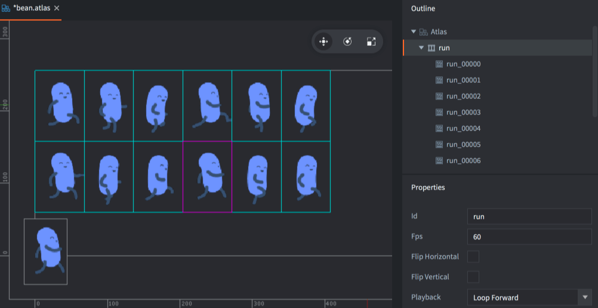
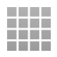
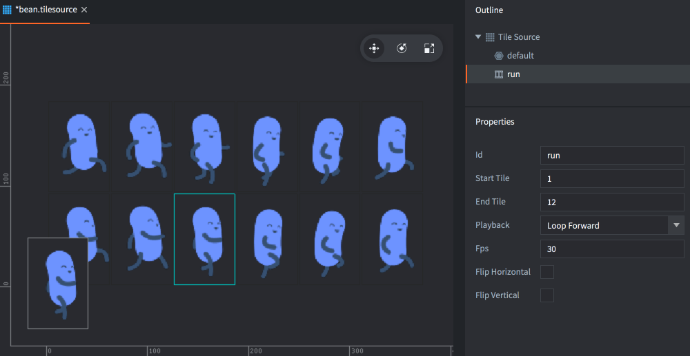
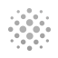
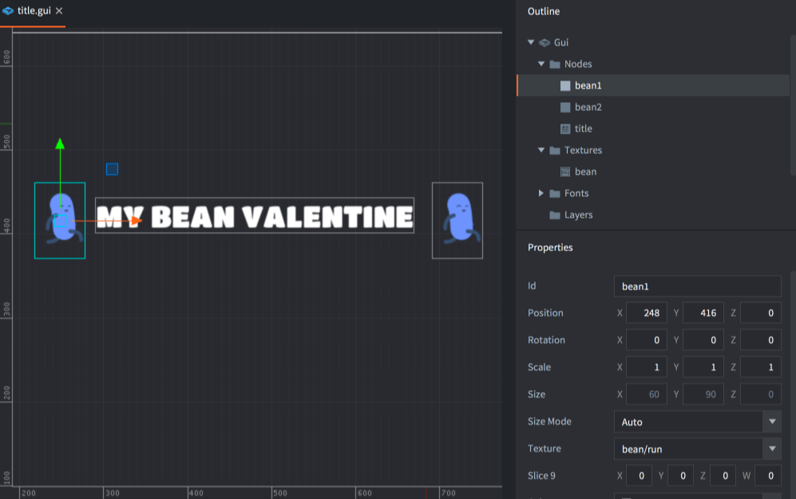
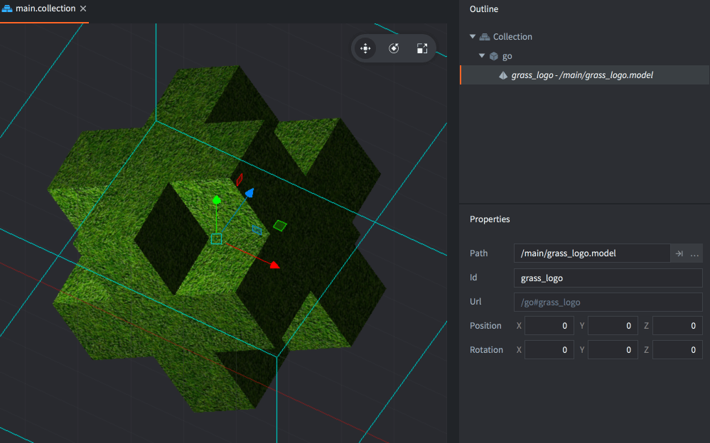

# 图像

Defold是一个全3D引擎, 但是设计上还是为2D提供强大支持的. 目前该引擎比较适用于开发2D游戏.

## 导入图片文件

Defold使用的资源全部保存在项目目录下. 需要显示什么样的图像，就要先导入图像资源. 要导入一个资源只要简单的把文件从电脑上拖拽到Defold编辑器的 _资源目录_.

{srcset="images/graphics/import@2x.png 2x"}

Defold支持PNG和JPEG图片格式. 如果需要模型, Defold支持Collada DAE格式.

## 图片资源

Defold中, 可视组件使用两种图片资源:

{.icon} 图集
: 图集由一组图片组成, 它们自动组成一张大图片. 图集中保存有图片和 *动画组*, 也就是逐帧动画的一组图片.

  {srcset="images/graphics/atlas@2x.png 2x"}

更多详情参见 [图集手册](/manuals/atlas).

{.icon} Tile Source
: 瓷砖图集是由一系列小图块按顺序拼贴而成的图片. 就像 _Sprite动画表_ 一样. 瓷砖图集可以包含逐帧动画, 只需指定动画的首尾帧. 瓷砖图块也可以自动生成其碰撞图形.

  {srcset="images/graphics/tilesource@2x.png 2x"}

更多详情参见 [Tile source manual](/manuals/tilesource).

## 可视组件

从图集或者瓷砖图集资源获得的数据可以用于几种可视组件:

{.icon}
: Sprite是可以在屏幕上显示的图片或者逐帧动画.

  {srcset="images/graphics/sprite@2x.png 2x"}

Sprite更多详情请见 [Sprite manual](/manuals/sprite).

{.icon} Tile Map
: 瓷砖地图组件是由瓷砖图集中的瓷砖 (包括瓷砖图及其碰撞图形) 组成的地图. 瓷砖地图不能使用普通图集资源.

  {srcset="images/graphics/tilemap@2x.png 2x"}

瓷砖地图更多详情请见 [Tilemap manual](/manuals/tilemap).

{.icon} Particle FX
: 粒子是粒子发射器所发射出来的，来自于图集或者瓷砖图集的一个个静态图片或者逐帧动画.

  {srcset="images/graphics/particles@2x.png 2x"}

粒子特效更多详情请见 [Particle fx manual](/manuals/particlefx).

{.icon} GUI（图形用户界面）
: GUI box 节点和 pie 节点同样使用来自图集和瓷砖图集的静态图片或者逐帧动画.

  {srcset="images/graphics/gui@2x.png 2x"}

GUI更多详情请见 [GUI manual](/manuals/gui).

{.icon} Spine 模型
: Spine 模型从 Spine 场景资源 中获取数据. 分为两部分:

  1. 一个记录骨骼动画的Spine Json文件.
  2. 一个由附加在骨骼上的图片组成的图集. Spine模型不能使用来自瓷砖地图的数据.

  {srcset="images/graphics/spine@2x.png 2x"}

Spine模型更多详情请见 [Spine model manual](/manuals/spine-model).


## 3D 图像

模型直接从图片文件获取数据，然后根据模型的UV映射到模型上:

{.icon} Model
: 3D模型

  {srcset="images/graphics/model@2x.png 2x"}

模型更多详情请见 [Model manual](/manuals/model).

Collada 支持
: Defold's 3D 需要你保存或者导出模型, 骨骼和动画数据为 _Collada_ 格式. 这是绝大多数3D建模软件所支持的格式. 包括 _Maya_, _3D Max_, _Blender_, _Sketchup_ 等等，都可以导入作品到 Defold.

  Defold 目前只支持烘焙动画. 动画需要每帧每个骨骼的数据矩阵, 而不是仅仅是关键帧上的移动旋转缩放数据.

  动画是线性插值的. 如果你想要曲线插值的动画，记得先烘焙再导出.

  不支持Collada中的动画剪辑. 要想一个模型多个动画, 就得分成多个 *.dae* 文件然后在Defold里合成一个 *.animationset* 文件.

材质，着色器和纹理
: 3D软件一般可以在模型上设置属性, 比如颜色和纹理. 这些信息会保存在导出的 Collada *.dae* 文件中. 根据游戏需要你要选择创建合适的 _高效的_ 模型材质. 材质由 _着色器程序_ 和渲染时使用的一组参数组成.

  你还需设计和实现一个合适的游戏摄像机.

  built-in materials 文件夹下有一个简单的3D材质. 如果你需要为模型设计自定义材质, 详情请参考 [Material documentation](/manuals/material). [Shader manual](/manuals/shader)介绍了着色器程序是如何工作的.

渲染模型
: 默认的渲染器是为2D游戏而不是3D模型打造的. 但是参考它然后加入简单的几行代码就能实现3D渲染. 比如:

  ```lua

  function init(self)
    self.model_pred = render.predicate({"model"})
    ...
  end

  function update()
    ...
    render.set_depth_mask(true)
    render.enable_state(render.STATE_DEPTH_TEST)
    render.set_projection(stretch_projection(-1000, 1000))  -- orthographic
    render.draw(self.model_pred)
    render.set_depth_mask(false)
    ...
  end
  ```

  渲染脚本如何工作详情请见 [Render documentation](/manuals/render).


## Z 排序

所有游戏对象和组件在 3D 空间中的位置由 vector3 对象来决定. 在2D图像中, X 和 Y 值决定了物体在"横" ，"竖" 轴的位置, Z 值决定了其在"深度"上的位置. Z轴位置可以让你控制可见物体的遮挡情况: Z 值为 1 的sprite会出现在 Z 值为 0 的sprite前面. 默认情况下, Defold 允许的 Z 值范围是 -1 到 1:

{srcset="images/graphics/z-order@2x.png 2x"}

-1 到 1 的远近限制使得Z轴的数值精度很高. 在制作3D游戏时, 你可能需要在自定义渲染脚本里调整这个限制. 更多详情请见 [Render manual](/manuals/render/).

## 混合模式

*Blend Mode* 属性定义了 sprite 如何和其后面的图像混合. 以下列举了支持的混合模式及其混合算法:

Alpha
: 普通混合: a~0~ * rgb~0~ + (1 - a~0~) * rgb~1~

Add
: 使用相应的 sprite 像素颜色值提亮背景: rgb~0~ + rgb~1~

Add Alpha (废弃!)
: 使用相应的可见 sprite 像素颜色值提亮背景: a~0~ * rgb~0~ + rgb~1~

Multiply
: 使用相应的 sprite 像素颜色值调暗背景: rgb~0~ * rgb~1~


## 纹理过滤和采样

你可以控制在纹理采样时完成的过滤方法. 比如当一个 _纹素_ (纹理上的一个像素) 不是和屏幕完美的像素对齐时，可以由过滤器决定显示结果 . 当你移动一个带纹理的图像元素少于一个像素时它就会发生. 下面的过滤方法是可选的:

Nearest
: 选取距离屏幕像素颜色最近的纹素. 如果你想要从纹理到屏幕显示完美的一对一像素映射就应该使用这种采样方法. 使用最近过滤方法所有物体移动的时候都是像素对齐的. 当 Sprite 慢慢移动时看起来可能会是一抽一抽的.

Linear
: 屏幕着色前纹素会和旁边的均值化. 当 Sprite 着色前会渗入像素，呈现出一个慢慢的，持续的动作 --从而使Sprite移动小于1个像素成为可能.

采样的设置保存在 [Project Settings](/manuals/project-settings) 文件中. 有两个设置:

default_texture_min_filter
: 纹素比屏幕像素小时的缩小过滤方法.

default_texture_mag_filter
: 纹素比屏幕像素大时的放大过滤方法.

两种设置都可接受 `linear` 或者 `nearest` 的设置. 比如:

```ini
[graphics]
default_texture_min_filter = nearest
default_texture_mag_filter = nearest
```

如果不设置, 两项默认都是 `linear`.

注意默认采样器使用 "game.project" 里的设置. 如果你为自定义材质指定了采样器, 你可以为每个采样器单独指定过滤方法. 详情请见 [Materials manual](/manuals/material/).

## 材质和着色器

默认材质和着色器文件位于项目的 "/builtins/materials/" 下. Sprite, 瓷砖, spine 模型 和 3D模型的默认材质从 "game.project" 中设置的采样和过滤中查找纹理. 片元着色器还使用与纹理颜色相乘的叫做 `tint` 的常量.

当游戏运行时，你可以使用 [`sprite.set_constant()`](/ref/sprite#sprite.set_constant) 和 [`sprite.reset_constant()`](/ref/sprite#sprite.reset_constant) 函数设置 `tint` 和其他着色常量设置 `tint` 和其他着色常量. sprite 以外的组件也有相应的函数.

[Materials manual](/manuals/material/) 解释了如何创建自定义材质.
