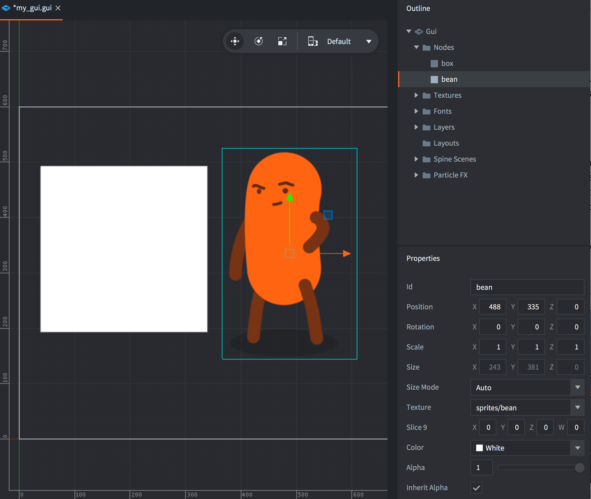
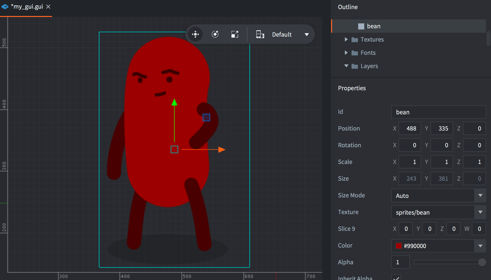
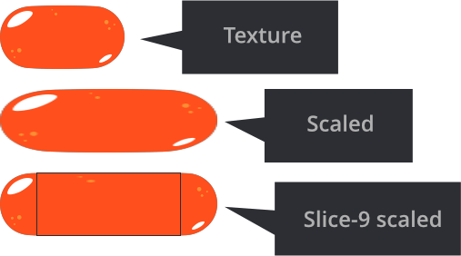
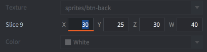
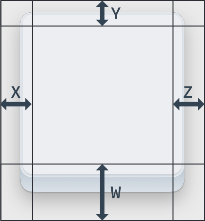
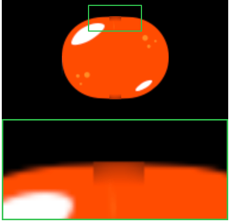

# GUI 方块节点

方块节点是一个可以填充颜色, 纹理或者动画的矩形.

## 添加方块节点

添加方块节点可以在 *Outline* 中 <kbd>右键点击</kbd> 然后选择 <kbd>Add ▸ Box</kbd>, 或者按 <kbd>A</kbd> 然后选择 <kbd>Box</kbd>.

你可以使用图集或者瓷砖图源里的图片或者动画添加到GUI上去. 要添加纹理 <kbd>右键点击</kbd>  *Outline* 中的 *Textures* 文件夹图标, 选择 <kbd>Add ▸ Textures...</kbd>. 然后设置方块节点的 *Texture* 属性:

{srcset="images/gui-box/create@2x.png 2x"}

注意方块节点的图像可以染色. 使用 color 加成到图片上面, 也就是说如果设置 color 为白色 (默认值) 则没有染色.

{srcset="images/gui-box/tinted@2x.png 2x"}

即使没有纹理设置, 方块节点也会被渲染, 或者不论把 alpha 设置成 `0`, 还是把 sized 设置成 `0, 0, 0`. 方块节点应该设置纹理以便渲染器合批而减少 draw call.

## 九宫格纹理

GUIs 对于其元素的大小改变是积极的: 面板和对话框总是应该填满其容纳的区域. 但是在缩放节点时纹理可能会产生问题.

通常, 引擎把纹理整个填充到方块节点的边界, 但是九宫格纹理可以指定纹理里的那些内容需要缩放:

{srcset="images/gui-box/scaling@2x.png 2x"}

九宫格方块节点包含4个像素数值分别代表左, 上, 右, 下有多少边缘不参与缩放:

{srcset="images/gui-box/slice9_properties@2x.png 2x"}

从左边开始, 顺时针设置:

{srcset="images/gui-box/slice9@2x.png 2x"}

- 角落部分不会被缩放.
- 边缘部分延单轴缩放. 左右边缘竖直缩放. 上下边缘水平缩放.
- 中央部分正常延两个轴缩放.

因为渲染器里 mipmapping 的工作方式, 部分缩放纹理可能会造成小问题. 当你把纹理一部分 _缩小_ 到比本身小的时候. 渲染器会自动选择一个低分辨率的 mipmap 来渲染这部分, 导致了这个小问题.

{srcset="images/gui-box/mipmap@2x.png 2x"}

为避免这类问题, 使用小图导进来之后只放大别缩小就行了.
