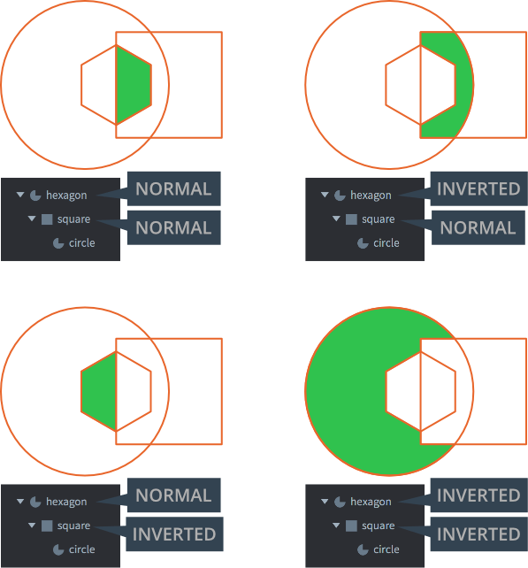

# 蒙版

GUI 节点可以作为 *蒙版* 节点---遮蔽影响其他节点的显示方式. 本教程介绍了其用法.

## 创建蒙版节点

方块, 文本 和 饼状图节点可以被裁剪. 要创建裁剪节点, 在 GUI 里添加一个节点, 然后设置相关属性:

Clipping Mode
: 裁剪模式.
  - `None` 不施加裁剪.
  - `Stencil` 施加裁剪.

Clipping Visible
: 选中则蒙版内容可见.

Clipping Inverted
: 选中则遮蔽内容反转.

然后把被裁剪节点作为蒙版子节点加入进来.

{srcset="images/gui-clipping/create@2x.png 2x"}

## 裁剪蒙版

原理上裁剪是把节点写入 *裁剪缓冲区*. 此缓冲区包含蒙版: 就是告诉显卡哪些像素该渲染，哪些不该渲染.

- 一个没有父蒙版的节点，如果设置了 clipping mode 为 `Stencil` 的话相当于把它的形状 (或者其反转形状) 写入裁剪蒙版保存在裁剪缓冲区当中.
- 如果一个蒙版节点有父蒙版那么它会继续裁剪父蒙版. 子蒙版不会 _继承_ 当前蒙版, 只会继续剪裁当前蒙版.
- 非蒙版节点作为蒙版的子节点的话，会被父蒙版层级裁剪渲染.

{srcset="images/gui-clipping/setup@2x.png 2x"}

这里, 我们建立了节点的三层结构:

- 六边形和矩形都是蒙版节点.
- 六边形是第一个蒙版, 矩形进一步裁剪.
- 园是最下层被裁剪的普通节点.

这种结构下可以有四种裁剪方式. 绿色标志出园被裁剪以后的样子. 结果如下所示:

{srcset="images/gui-clipping/modes@2x.png 2x"}

## 蒙版局限性

- 蒙版数最大不超过 256 个.
- _蒙版_ 节点最大嵌套8层. (只计算设置了蒙版的节点)
- 同层次蒙版不超过 127 个. 每深一层, 数目减半.
- 反转蒙版很耗性能. 最多8个反转蒙版并且每个反转蒙版会使非反转蒙版的最大数目减半.
- 裁剪渲染基于蒙版节点的 _几何形状_  (而非纹理). 设置 *Inverted clipper* 可以反转蒙版渲染.

## 层

层可以控制节点的渲染顺序 (以及渲染合批) . 当使用层与蒙版节点共同使用时，层的功能会被影响.

- 蒙版裁剪顺序优先与层顺序---不管节点属于那一层, 都会被父蒙版所裁剪.
- 层只负责图像显示顺序---进一步说, 蒙版节点的层设置只影响 _该蒙版层级_ 的显示顺序.

::: 注意
蒙版节点及其层级有层设置的话会优先显示，没有设置的话按照普通顺序显示.
:::

{srcset="images/gui-clipping/layers@2x.png 2x"}

这里蒙版节点 "ocular" 层设置为 "layer3" 然后 "bean" 节点设置成 "layer1". 所以被 ocular 剪裁的纹理显示在了 bean 的上层.

节点 "shield" 设置为 "layer2", 但是在显示顺序上与 "ocular" 和 "bean" 并不冲突. 要更改 "shield" 的显示顺序, 设置层级顺序即可.
