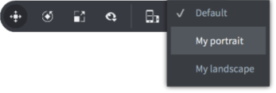
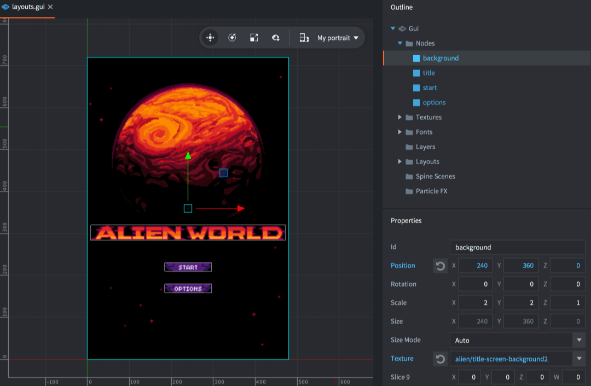

# 布局

Defold支持可自动适应移动设备上屏幕方向变化的GUI。通过使用此功能，您可以设计适合各种屏幕尺寸的方向和纵横比的GUI。也可以创建与特定设备型号匹配的布局。

## 新建显示档案

"game.project" 默认使用内置显示档案文件 ("builtins/render/default.display_profiles"). 默认 "横屏" (1280 像素宽 720 像素高) 和 "竖屏" (720 像素宽 1280 像素高). 未指定显示器型号以便适应各种设备.

要新建显示档案文件, 要么把 "builtins" 文件夹拷贝出来, 要么在  *Assets* 视图中 <kbd>右键点击</kbd> 然后选择 <kbd>New... ▸ Display Profiles</kbd>. 输入文件名然后点击 <kbd>Ok</kbd>.

编辑器会自动打开新建的文件. 在 *Profiles* 列表里点击 <kbd>+</kbd>. 给每个档案加入不同的 *限定*:

Width
: 限定宽度像素数.

Height
: 限定高度像素数.

Device Models
: 以逗号分隔的设备型号名称表. 型号名只要匹配设备型号的开头就算匹配成功, 例如 `iPhone10` 匹配 "iPhone10,\*" 的所有设备. 型号名带逗号的要使用双引号包裹, 例如 `"iPhone10,3", "iPhone10,6"` 匹配 iPhone X 那两种设备 (参考 https://www.theiphonewiki.com/wiki/Models). 注意调用 `sys.get_sys_info()` 函数在 Android 和 iOS 会返回设备名. 其他平台返回空字符, 也就是说这样的设备对于限定了设备型号的档案都无法匹配.

{srcset="images/gui-layouts/new_profiles@2x.png 2x"}

别忘了指定引擎使用你自己的档案文件. 打开 "game.project" 在 *display* 部分 *Display Profiles* 项里进行设置:

{srcset="images/gui-layouts/settings@2x.png 2x"}

::: 注意
目前 iOS 版开发用app的 *Dynamic Orientation* 设置不起作用, 不论设置为什么值, 应用屏幕都会自动旋转.
:::

勾选 *Dynamic Orientation* 选项可以使引用在屏幕上自动旋转以适应横屏竖屏. 游戏引擎也会根据横屏竖屏选取合适的界面布局.

## GUI 布局

显示档案里可以为用户界面设置各种布局. 为 GUI 常见添加布局, 在 *Outline* 视图的 *Layouts* 图标上右键点击然后选择 <kbd>Add ▸ Layout ▸ ...</kbd>:

{srcset="images/gui-layouts/add_layout@2x.png 2x"}

编辑用户界面时, 每个操作都是针对一种布局而进行. 即针对在 GUI 场景的工具栏的下拉框中选中的布局进行编辑操作. 如果未选择任何布局, 默认操作的是 *Default* 布局.

{srcset="images/gui-layouts/toolbar@2x.png 2x"}

{srcset="images/gui-layouts/portrait@2x.png 2x"}

选择指定布局之后每个节点的属性编辑都会 _覆盖_ *Default* 布局里的属性. 被覆盖的属性以蓝色高亮显示. 其节点同样以蓝色高亮显示. 属性旁边的重置按钮用来恢复默认属性值.

{srcset="images/gui-layouts/landscape@2x.png 2x"}

布局不会增加或减少节点, 只会覆盖节点属性. 如果某个布局需要减少节点可以把它移到屏幕之外或者使用脚本删除掉. 注意不要忘记当前选择的布局. 新建布局之后编辑器会自动把它设置为当前布局. 而且复制粘贴节点的时候尤其要考虑当前选择的布局, 包括复制节点的时候 *和* 粘贴节点的时候.

## 动态布局选择

动态布局匹配度根据以下规则为每个显示档案文件限制匹配评分:

1. 无设备型号限制或者匹配到了设备, 分数 (S) 加一.

2. 分数 (S) 的计算公式用到了显示器面积 (A), 面积限制 (A_Q), 显示器宽高比 (R) 和宽高比限制 (R_Q):


3. 如果屏幕方向 (横屏或者竖屏) 与限制匹配, 则分数最低的显示档案被采用.

4. 如果屏幕方向无匹配, 则另一方向分数最高的显示档案被采用.

5. 如果没有显示档案被采用, 则 *Default* 显示档案被采用.

*Default* 布局只在没有自定义布局时产生作用, 也就是说如果你只制作了 "横屏" 布局, *任何* 方向的设备屏幕都会匹配到这个布局, 直到你又制作了 "竖屏" 布局.

## 布局变换消息

当引擎发现屏幕方向被旋转, 就会向受影响的用户界面组件脚本发送一个 `layout_changed` 消息. 消息包含布局id的哈希值以便代码做针对性处理:

```lua
function on_message(self, message_id, message, sender)
  if message_id == hash("layout_changed") and message.id == hash("My Landscape") then
    -- 转换为横屏布局
  elseif message_id == hash("layout_changed") and message.id == hash("My Portrait") then
    -- 转换为竖屏布局
  end
end
```

而且当应用窗体 (游戏视口) 发生改变时, 包括屏幕方向改变时, 渲染脚本也会收到相应的消息.

```lua
function on_message(self, message_id, message)
  if message_id == hash("window_resized") then
    -- 窗体尺寸变化. message.width 与 message.height 对应
    -- 改变后窗口的宽和高.
  end
end
```

屏幕方向改变时, 用户界面布局管理器会根据定义好的布局和节点属性缩放节点. 但是非用户界面节点的游戏内容, 默认用另一个渲染管线进行渲染, 所以会在改变的窗体里进行拉伸. 不想要这种效果的话, 要么自己写渲染脚本, 要么使用 [摄像机](/assets/).
