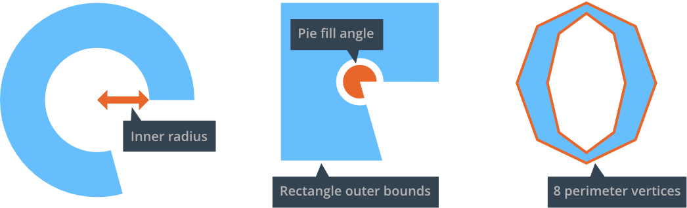

# GUI 饼状图节点

饼状图节点用以创建圆的或者椭圆的从实心到环状的可视对象.

## 创建饼状图节点

<kbd>右键点击</kbd>  *Outline* 中的 *Nodes* 部分，选择 <kbd>Add ▸ Pie</kbd>. 饼状图就创建好了.

{srcset="images/gui-pie/create@2x.png 2x"}

以下属性是饼状图节点的特有属性:

Inner Radius
: 节点的内半径, 延X轴.

Outer Bounds
: 节点外轮廓.

  - `Ellipse` 可以把节点扩展到外半径处.
  - `Rectangle` 可以把节点扩展到边界方框处.

Perimeter Vertices
: 图形的分段数, 就是360度一圈需要的顶点数.

Pie Fill Angle
: 饼状图的填充. 从右侧开始按逆时针方向.

{srcset="images/gui-pie/properties@2x.png 2x"}

如果为节点设置了纹理，那么纹理图会和边界框的角对应起来平铺.

## 运行时修改饼状图

饼状图节点同样可以控制 size, pivot, color 之类的属性. 此外还有饼状图特定属性:

```lua
local pienode = gui.get_node("my_pie_node")

-- get the outer bounds
local fill_angle = gui.get_fill_angle(pienode)

-- increase perimeter vertices
local vertices = gui.get_perimeter_vertices(pienode)
gui.set_perimeter_vertices(pienode, vertices + 1)

-- change outer bounds
gui.set_outer_bounds(pienode, gui.PIEBOUNDS_RECTANGLE)

-- animate the inner radius
gui.animate(pienode, "inner_radius", 100, gui.EASING_INOUTSINE, 2, 0, nil, gui.PLAYBACK_LOOP_PINGPONG)
```
