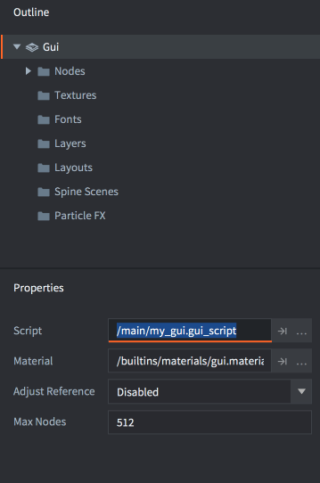
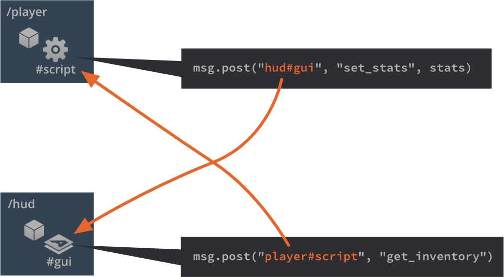
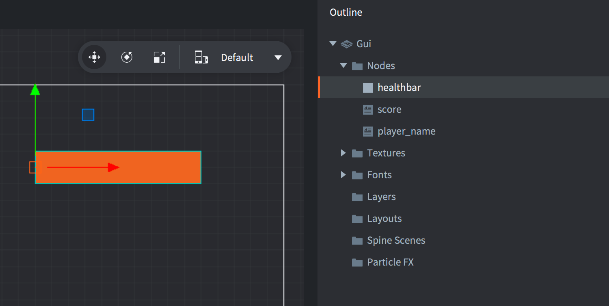

# GUI脚本

要控制GUI的逻辑和动画节点，您使用Lua脚本。GUI脚本与常规游戏对象脚本的工作方式相同，但保存为不同的文件类型，并且可以访问不同的函数集：`gui`模块函数。

## 向GUI添加脚本

要向GUI添加脚本，首先通过在*Assets*浏览器中<kbd>右键点击</kbd>一个位置并从弹出上下文菜单中选择<kbd>New ▸ Gui Script</kbd>来创建GUI脚本文件。

编辑器会自动打开新的脚本文件。它基于一个模板，并配备了空的生命周期函数，就像游戏对象脚本一样：

```lua
function init(self)
   -- 在此添加初始化代码
   -- 如果不需要，请删除此函数
end

function final(self)
   -- 在此添加最终化代码
   -- 如果不需要，请删除此函数
end

function update(self, dt)
   -- 在此添加更新代码
   -- 如果不需要，请删除此函数
end

function on_message(self, message_id, message, sender)
   -- 在此添加消息处理代码
   -- 如果不需要，请删除此函数
end

function on_input(self, action_id, action)
   -- 在此添加输入处理代码
   -- 如果不需要，请删除此函数
end

function on_reload(self)
   -- 在此添加输入处理代码
   -- 如果不需要，请删除此函数
end
```

要将脚本附加到GUI组件，请打开GUI组件原型文件（在其他引擎中也称为"prefabs"或"blueprints"），并在*Outline*中选择根节点以调出GUI*Properties*。将*Script*属性设置为脚本文件。



如果GUI组件已添加到游戏中某处的游戏对象，脚本现在将运行。

## "gui"命名空间

GUI脚本可以访问`gui`命名空间和[所有gui函数](/ref/gui)。`go`命名空间不可用，因此您需要将游戏对象逻辑分离到脚本组件中，并在GUI和游戏对象脚本之间进行通信。任何尝试使用`go`函数的操作都会导致错误：

```lua
function init(self)
   local id = go.get_id()
end
```

```txt
ERROR:SCRIPT: /main/my_gui.gui_script:2: You can only access go.* functions and values from a script instance (.script file)
stack traceback:
   [C]: in function 'get_id'
   /main/my_gui.gui_script:2: in function </main/my_gui.gui_script:1>
```

## 消息传递

任何附加了脚本的GUI组件都能够通过消息传递与游戏运行时环境中的其他对象通信，它的行为就像任何其他脚本组件一样。

您可以像处理任何其他脚本组件一样寻址GUI组件：

```lua
local stats = { score = 4711, stars = 3, health = 6 }
msg.post("hud#gui", "set_stats", stats)
```



## 寻址节点

GUI节点可以通过附加到组件的GUI脚本进行操作。每个节点必须在编辑器中设置唯一的*Id*：



*Id*允许脚本获取对节点的引用，并使用[gui命名空间函数](/ref/gui)对其进行操作：

```lua
-- 扩展血条10个单位
local healthbar_node = gui.get_node("healthbar")
local size = gui.get_size(healthbar_node)
size.x = size.x + 10
gui.set_size(healthbar_node, size)
```

## 动态创建节点

要在运行时使用脚本创建新节点，您有两个选择。第一个选择是通过调用`gui.new_[type]_node()`函数从头创建节点。这些函数返回对新节点的引用，您可以使用该引用来操作节点：

```lua
-- 创建新方框节点
local new_position = vmath.vector3(400, 300, 0)
local new_size = vmath.vector3(450, 400, 0)
local new_boxnode = gui.new_box_node(new_position, new_size)
gui.set_color(new_boxnode, vmath.vector4(0.2, 0.26, 0.32, 1))

-- 创建新文本节点
local new_textnode = gui.new_text_node(new_position, "Hello!")
gui.set_font(new_textnode, "sourcesans")
gui.set_color(new_textnode, vmath.vector4(0.69, 0.6, 0.8, 1.0))
```


创建新节点的另一种方法是使用`gui.clone()`函数克隆现有节点，或使用`gui.clone_tree()`函数克隆节点树：

```lua
-- 克隆血条
local healthbar_node = gui.get_node("healthbar")
local healthbar_node_2 = gui.clone(healthbar_node)

-- 克隆按钮节点树
local button = gui.get_node("my_button")
local new_button_nodes = gui.clone_tree(button)

-- 获取新树的根节点
local new_root = new_button_nodes["my_button"]

-- 将根节点（及其子节点）向右移动300个单位
local root_position = gui.get_position(new_root)
root_position.x = root_position.x + 300
gui.set_position(new_root, root_position)
```

## 动态节点ID

动态创建的节点没有分配ID。这是设计上的选择。从`gui.new_[type]_node()`、`gui.clone()`和`gui.clone_tree()`返回的引用是访问节点所必需的唯一内容，您应该跟踪该引用。

```lua
-- 添加文本节点
local new_textnode = gui.new_text_node(vmath.vector3(100, 100, 0), "Hello!")
-- "new_textnode"包含对节点的引用。
-- 节点没有ID，这很好。我们没有理由想要
-- 在我们已经有引用的情况下使用gui.get_node()。
```
