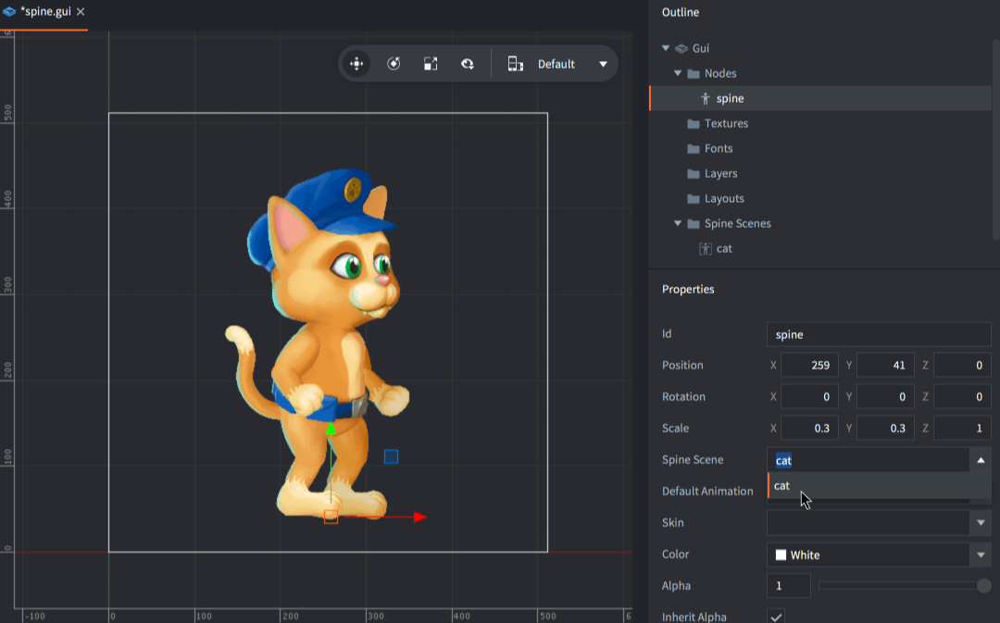
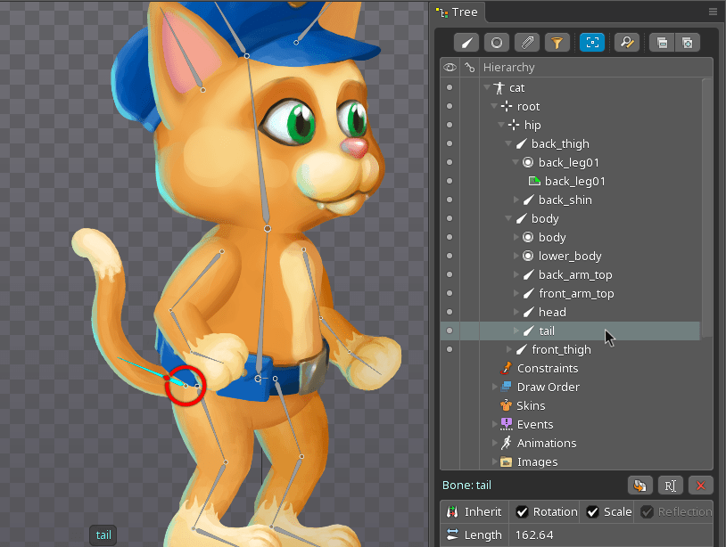

# GUI Spine 节点

Spine 动画模型可以作为 GUI 节点也可以作为游戏对象加入场景. 本教程介绍了导入的 Spine 动画数据在 GUI 场景下的使用.

## 创建 spine 节点

首先你应该导入动画数据并建立 Spine Scene 资源. [Spine 动画](/manuals/spine) 文档介绍了其方法.

接着，Spine Scene 资源的内容要加入到 GUI 场景中去. 加入方法 <kbd>右键点击</kbd>  *Outline* 中的 *Spine Scenes* 部分，选择 <kbd>Add ▸ Spine Scenes...</kbd>. 选择要加入的 Spine Scenes (可加多个).

{srcset="images/gui-spine/add@2x.png 2x"}

最后，<kbd>右键点击</kbd> *Outline* 中的 *Nodes* 部分，选择 <kbd>Add ▸ Spine</kbd> 来创建 Spine 节点.

{srcset="images/gui-spine/new_node@2x.png 2x"}

新节点自动被选中. 注意设置其属性:

Spine Scene
: 此节点使用的 Spine Scene 数据源.

Spine Default Animation
: 场景初始化时节点默认的动画.

Skin
: 场景初始化时节点用于动画的皮肤.

## 运行时动画控制

使用脚本可以在运行时控制Spine节点. 要在一个节点上开始播放动画, 只要调用 [`gui.play_spine()`](/ref/gui/#gui.play_spine_anim:node-animation_id-playback-[play_properties]-[complete_function]) 函数:

```lua
local catnode = gui.get_node("cat_note")
local blend_time = 0.3
gui.play_spine(catnode, hash("run"), gui.PLAYBACK_ONCE_FORWARD, blend_time, function(self, node)
    print("Animation done!")
end)
```

## 骨骼层级

Spine 骨架中的各个骨骼都可以像 GUI 节点一样使用. 节点名就是 Spine 里设置的骨骼名.

{srcset="images/gui-spine/bone@2x.png 2x"}

比如, 要做一个骨骼节点下增添一个节点, 使用 [`gui.get_spine_bone()`](/ref/gui#gui.get_spine_bone) 函数加节点名来获取此节点，然后再在上面加入一个节点:

```lua
-- Attach a text node to the tail of the cat
local cat = gui.get_node("cat_node")
local textnode = gui.new_text_node(vmath.vector3(400, 0, 0), "Hello tail!")
local tail = gui.get_spine_bone(cat, "tail")
gui.set_parent(textnode, tail)
```

同样可以用 [`gui.get_node()`](/ref/gui#gui.get_node) 函数获取骨骼节点, 此时引用名要用 Spine 节点名加正斜杠斜杠 (`/`) 加子节点名:

```lua
-- Attach a text node to the tail of the cat
local textnode = gui.new_text_node(vmath.vector3(400, 0, 0), "Hello tail!")
local tail = gui.get_node("cat_node/tail")
gui.set_parent(textnode, tail)
```
