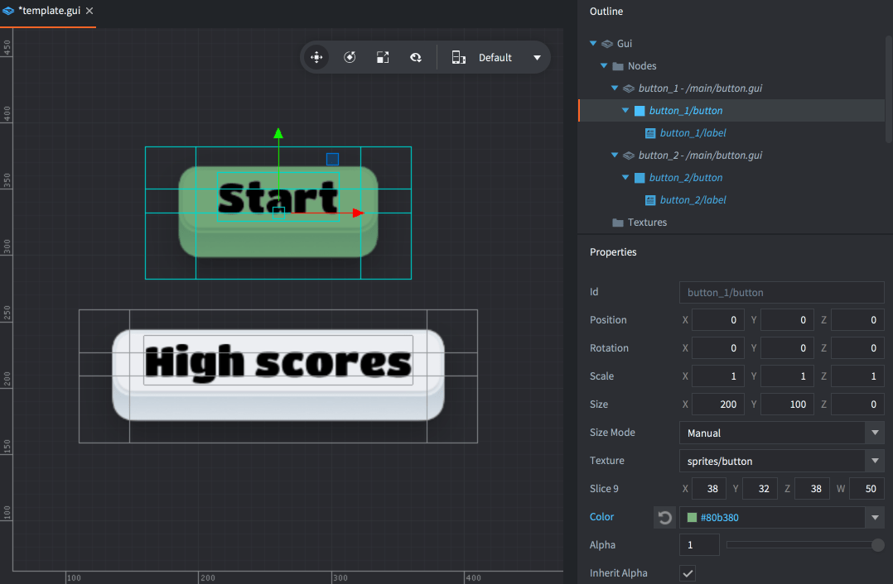
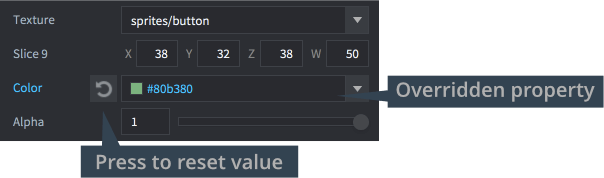

# GUI 模板节点

GUI 模板节点提供了基于模板或者叫 "prefabs"基于模板或者叫 "prefabs" 创建可重用 GUI 组件的有效机制. 本教程介绍了如何使用这一特性.

GUI 模板是 GUI 某个场景的实例化版本. GUI 模板里节点的设置可以覆盖GUI场景的设定.

## 创建模板

GUI 模板也是一种场景, 创建和普通场景一样. 在 *Assets* 面板里某位置上 <kbd>右键点击</kbd> 然后选择 <kbd>New... ▸ Gui</kbd>.

{srcset="images/gui-templates/create@2x.png 2x"}

输入名称并保存. 注意节点都是参照模板原点设置位置的, 所以模板位置也最好设置成 0, 0, 0.

## 创建模板节点

一个模板可以创建许多实例. 先创建或者打开 GUI 场景, 然后 <kbd>右键点击</kbd> *Outline* 视图里的 *Nodes* 部分, 然后选择 <kbd>Add ▸ Template</kbd>.

{srcset="images/gui-templates/create_instance@2x.png 2x"}

然后便可以在GUI场景里设置 *Template* 的属性.

一个模板可以创建多个实例节点, 实例里的每个节点都可以修改自身属性, 比如位置,  颜色, 大小, 纹理之类的.

{srcset="images/gui-templates/instances@2x.png 2x"}

更改了的属性会以蓝色显示. 点击重置按钮可以退回成原始的模板属性:

{srcset="images/gui-templates/properties@2x.png 2x"}

被修改了属性的节点也会在 *Outline* 视图中以蓝色显示:

{srcset="images/gui-templates/outline@2x.png 2x"}

这些模板实例以折叠方式在 *Outline* 视图中显示. 然而, 你要明确它 *不是一个普通节点*. 同样, 运行时也没有模板的概念, 只是其所有节点存在着.

有些模板实例会自动以 模板名加正斜杠 (`"/"`) 加 *Id* 的形式命名.

## 运行时修改模板

代码访问节点只需使用模板 *Id* 作为前缀加上实例节点名即可:

```lua
if gui.pick_node(gui.get_node("button_1/button"), x, y) then
    -- Do something...
end
```

模板本身没有实例. 如果需要根节点, 请在模板里面添加.

如果脚本被添加到 GUI 场景里, 那么此脚本不存在于节点树状结构中. 每个 GUI 场景可以添加一个脚本, 实例化的时候脚本执行与 GUI 场景之上.
