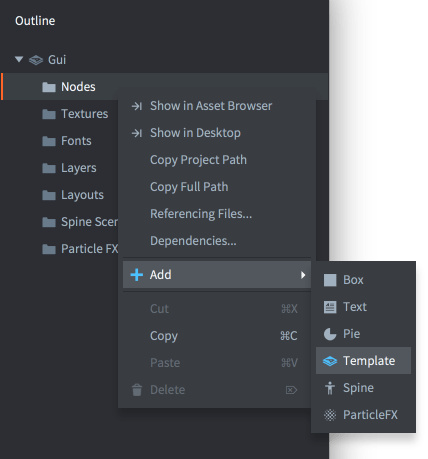
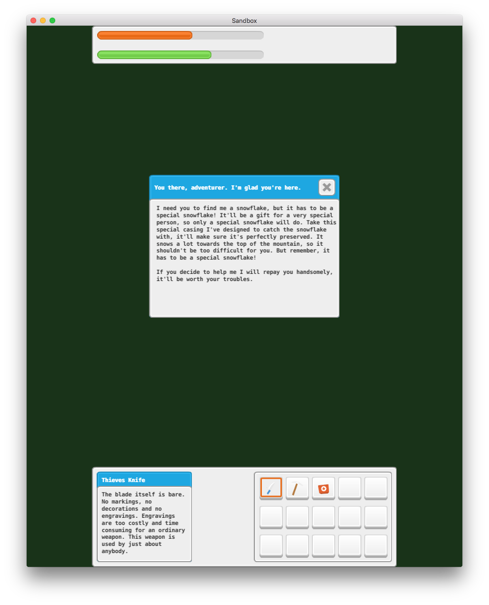
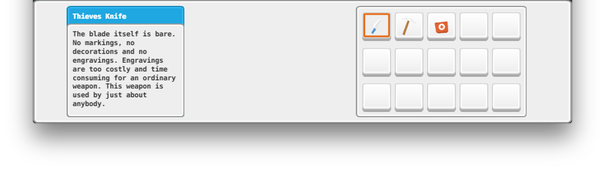

# GUI

Defold 提供了 GUI 编辑器以及与之配套的脚本用以实现用户界面.

Defold 的图形用户界面是被放在集合里的, 依附于游戏对象的 GUI 组件. 这种组件有如下特点:

* 简单且功能强大的布局功能, 可以适配各种分辨率和纵横比的屏幕
* 通过 *GUI 脚本* 进行逻辑控制.
* 界面 (默认) 被渲染于其他内容之上, 于视口摄像机无关, GUI 始终保持最上端显示. 这种特性可以根据需要手动修改.

界面独立于游戏内容. 所以集合编辑器里并不显示界面元素. 但是界面必须依附于一个游戏对象而这个游戏对象要被放在集合里. 具体放在集合什么位置上并不影响界面的位置.

## 创建界面文件

GUI 的创建基于一个模板文件. 要新建GUI文件, 在 *Assets* 浏览器中 <kbd>右键点击</kbd> 然后选择 <kbd>New ▸ Gui</kbd>. 为文件命名然后点击 <kbd>Ok</kbd>.

{srcset="images/gui/new_gui_file@2x.png 2x"}

Defold 会自动启动场景编辑器打开这个文件.

{srcset="images/gui/new_gui@2x.png 2x"}

*大纲* 视图里列出了所有 GUI:s 内容: 节点及其资源列表(见下文).

中间编辑区显示 GUI. 右上角的工具栏有 *移动*, *旋转* 和 *缩放* 工具, 以及一个 [布局](/manuals/gui-layouts) 选择器.

{srcset="images/gui/toolbar@2x.png 2x"}

当前布局用白色方框表示, 其宽度高度是在项目配置文件里设置的.

在 *大纲* 视图中选中根节点 "Gui" 就会显示出当前GUI的 *属性*:

Script
: 当前界面的GUI脚本.

Material
: 当前界面的渲染用材质.

Adjust Reference
: 控制节点的 *Adjust Mode* 算法:

  - `Per Node` 当父节点或屏幕大小改变时, 调整各个节点大小.
  - `Disable` 关闭调整. 各个节点保持不变.

Max Nodes
: 界面最大节点数.

## 资源

界面的结构与集合不同, 是分门别类的. *Outline* 视图中可以看到所有资源都被按照其类型分配到 "子文件夹" 下:

{srcset="images/gui/dependencies@2x.png 2x"}

要添加资源, <kbd>右键点击k</kbd> *Outline* 里的 "Gui" 根节点, 然后从上下文菜单中选择 <kbd>Add ▸ [资源类型]</kbd>.

也可以在相应类型文件夹上 <kbd>右键点击</kbd> 然后选择 <kbd>Add ▸ [资源类型]</kbd>.

## 节点类型

界面有节点组成. 节点是一种类似游戏对象的元素. 可以进行位移 (移动, 旋转和缩放) 并且以父子树形结构排列. 有以下几种节点类型:

Box node
: {.left}
  显示为纯色, 纹理或者逐帧动画的矩形. 详情请见 [方块节点教程](/manuals/gui-box).

<div style="clear: both;"></div>

Text node
: {.left}
  显示文字. 详情请见 [文本节点教程](/manuals/gui-text).

<div style="clear: both;"></div>

Pie node
: {.left}
  圆形或椭圆饼图. 详情请见 [饼图节点教程](/manuals/gui-pie).

<div style="clear: both;"></div>

Template node
: {.left}
  模板用来基于其他界面文件创建节点实例. 详情请见 [模板节点教程](/manuals/gui-template).

<div style="clear: both;"></div>

ParticleFX node
: {.left}
  显示粒子特效. 详情请见 [粒子特效节点教程](/manuals/gui-particlefx).

<div style="clear: both;"></div>

右键点击 *Nodes* 文件夹选择 <kbd>Add ▸</kbd> 然后点击 <kbd>Box</kbd>, <kbd>Text</kbd>, <kbd>Pie</kbd>, <kbd>Template</kbd> 或 <kbd>ParticleFx</kbd> 即可创建节点.

{srcset="images/gui/add_node@2x.png 2x"}

还可以用快捷键 <kbd>A</kbd> 来创建节点.

## 节点属性

节点有自身属性:

Id
: 节点id. 每个id是这个界面中的唯一值.

Position, Rotation and Scale
: 节点位移. 可以使用 *移动*, *旋转* 和 *缩放* 工具自由修改. 也可以用脚本动画形式控制这些值.

Size (box, text 和 pie 节点)
: 默认尺寸设置为自动, 如果需要手动设定尺寸可以设置 *Size Mode* 为 `Manual`. 节点尺寸决定了节点接收输入操作的范围. 此值也可使用脚本动画进行控制.

Size Mode (box 和 pie 节点)
: 如果设为 `Automatic` 则自动计算并设置节点尺寸. 如果设为 `Manual` 则需手动设置节点尺寸.

Enabled
: 如果未选中, 则节点不会被渲染, 不会被动画驱动且不能使用 `gui.pick_node()` 返回节点. 可以使用 `gui.set_enabled()` 和 `gui.is_enabled()` 函数手动打开或检查该属性.

Visible
: 如果未选中, 则节点不会被渲染, 但是可以被动画驱动且可以使用 `gui.pick_node()` 返回节点. 可以使用 `gui.set_visible()` 和 `gui.get_visible()` 函数手动打开或检查该属性.

Text (text 节点)
: 节点上显示的文字.

Line Break (text 节点)
: 文字基于节点宽度换行.

Font (text 节点)
: 文字字体.

Texture (box 和 pie 节点)
: 节点上显示的纹理. 可以使用图集和瓷砖图源的图片或动画.

Slice 9 (box 节点)
: 缩放九宫格. 详情请见 [box 节点教程](/manuals/gui-box).

Inner Radius (pie 节点)
: 节点内半径, 延 X 轴. 详情请见 [pie 节点教程](/manuals/gui-pie).

Outer Bounds (pie 节点)
: 节点外轮廓. 详情请见 [pie 节点教程](/manuals/gui-pie).

Perimeter Vertices (pie 节点)
: 图形的分段数, 就是360度一圈需要的顶点数. 详情请见 [Pie 节点教程](/manuals/gui-pie)

Pie Fill Angle (pie 节点)
: 饼状图的填充. 详情请见 [Pie 节点教程](/manuals/gui-pie)

Template (template 节点)
: 节点模板界面文件. 详情请见 [Template 节点教程](/manuals/gui-template)

ParticleFX (particlefx 节点)
: 节点上显示的粒子特效. 详情请见 [ParticleFX 节点教程](/manuals/gui-particlefx)

Color
: 节点颜色. 如果用纹理填充, 则对纹理进行染色. 颜色可由脚本动画控制.

Alpha
: 节点不透明度. 不透明度可由脚本动画控制.

Inherit Alpha
: 继承父节点不透明度. 最终结果是父节点与此节点不透明度的叠加.

Leading (text 节点)
: 每行开头空白. `0` 无空白. 默认值为 `1`.

Tracking (text 节点)
: 字符间距缩放值. 默认值为 0.

Layer
: 把此节点分配给层. 详情请见下文.

Blend mode
: 混合模式控制其与下层颜色混合后的结果:
  - `Alpha` 覆盖下层颜色. 有的软件将其称作 "普通" 混合模式.
  - `Add` 叠加下层颜色. 有的软件将其称作 "增强" 混合模式.
  - `Multiply` 与下层颜色相乘.

Pivot
: 节点的轴点. 可以看作是节点 "中心点". 各种旋转缩放等操作都基于这个轴点.

  可选值有 `Center`, `North`, `South`, `East`, `West`, `North West`, `North East`, `South West` 和 `South East`.

  {srcset="images/gui/pivot@2x.png 2x"}

  如果修改了节点的轴点, 节点会适当移动以保证坐标位置不变. 对于文本节点来说 `Center` 意味着文字居中对齐, `West` 意味着文字左对齐, `East` 意味着文字右对齐.

X Anchor, Y Anchor
: 锚点控制着当窗体或者父节点拉伸时当前节点位置如何处理.

  {srcset="images/gui/anchoring_unadjusted@2x.png 2x"}

  可选值有:

  - `None` (*X轴* 和 *Y轴*) 相对于窗体或者父节点的中心, 保持自身位置.
  - `Left` 或 `Right` (*X轴*) 缩放水平方向位置以便保持其相对于窗体或者父节点宽度方向上的百分比位置不变.
  - `Top` 或 `Bottom` (*Y轴*) 缩放垂直方向位置以便保持其相对于窗体或者父节点高度方向上的百分比位置不变.

  {srcset="images/gui/anchoring@2x.png 2x"}

Adjust Mode
: 节点调整模式. 调整模式控制着当窗体或者父节点拉伸时当前节点尺寸如何处理.

  这里有一个节点放置在逻辑分辨率为横屏的场景中:

  {srcset="images/gui/unadjusted@2x.png 2x"}

  当场景需要填充竖屏时. 每个节点都会被拉伸. 但是如果使用了适当的调整模式, 节点内容的长宽比可以保持不变. 可选值有:

  - `Fit` 缩放节点内容,使其等于拉伸的边界框宽度或高度, 以数值最小者为准. 换句话说, 内容将拉伸到父级的边界.
  - `Zoom` 缩放节点内容,使其等于拉伸的边界框宽度或高度, 以数值最大者为准. 换句话说, 内容将超越过父级的边界.
  - `Stretch` 拉伸节点内容, 使其填充父级的边界框.

  {srcset="images/gui/adjusted@2x.png 2x"}

  如果场景的 *Adjust Reference* 设置为 `Disabled` 的话, 此设置被忽略.

Clipping Mode (box 和 pie 节点)
: 剔除模式:

  - `None` 正常渲染.
  - `Stencil` 以当前节点边框作为子节点蒙版.

  详情请见 [GUI 蒙版教程](/manuals/gui-clipping)

Clipping Visible (box 和 pie 节点)
: 蒙版可见. 详情请见 [GUI clipping manual](/manuals/gui-clipping)

Clipping Inverted (box 和 pie 节点)
: 反转蒙版. 详情请见 [GUI clipping manual](/manuals/gui-clipping)


## 原点, 锚点和调整模式

轴点, 锚点和调整模式互相配合可以给设计者很大的发挥空间. 但是但凭想象很难搞清楚它们对应的具体功能. 这里列举了一个具体的例子, 屏幕分辨率 640x1136 的界面:


 界面的 X 和 Y 锚点为 None 调整模式为 left. 上面板轴点为 North, 下面板轴点为 South 上面版里的进度条轴点为 West. 其他节点轴点都为 Center. 如果把窗体拉宽, 看看会发生什么:



如果我们希望上下面板保持屏幕宽度要怎么做? 可以把两个面板的调整模式设置为 Stretch:


出不多了. 上下两个面板会拉伸并一直保持屏幕宽度大小, 但是进度条和下面版的内容位置不太对. 要是想让进度条于上面版左对齐, 修改 X 锚点为 Left:


上面版完美了. 进度条本身轴点是 West 也就是说让它们的左端 (轴点) 与父级面板左边缘 (X 锚点) 对齐.

然后再把下面版左边方块的 X 锚点设置为 Left, 右边方块的 X 锚点设置为 Right, 就会变成这样:



结果还是不太对. 我们想让两个方块分别呆在下面版的左右两端. 但是轴点搞错了:


两个方块的轴点都是 Center. 也就是说当窗体变宽时方块的位置 (轴点) 处于相对于边缘的固定位置上. 本例中左边方块在 640x1136 分辨率窗口中大约位于离左边界 17% 的地方:


屏幕缩放时它保持这个 17% 的位置:


如果把左边方块轴点设为 West, 右边方块设为 East 结果就是我们想要的样子了:


## 绘制顺序

节点基于 "Nodes" 文件夹的排序进行绘制. 最高处节点最先绘制, 也就是会被放置于其他节点的后面. 最下面的节点最后绘制, 即它会位于其他节点前面. 至于节点 Z 值并不影响绘制顺序; 但是记得如果Z值超过了渲染脚本的渲染范围就不被渲染了. 可以使用层来覆盖这个默认的绘制顺序 (见下文).

{srcset="images/gui/draw_order@2x.png 2x"}

选中节点按 <kbd>Alt + Up/Down</kbd> 移动其在列表中的排序.

排序也可使用脚本控制:

```lua
local bean_node = gui.get_node("bean")
local shield_node = gui.get_node("shield")

if gui.get_index(shield_node) < gui.get_index(bean_node) then
  gui.move_above(shield_node, bean_node)
end
```

## 父子结构

把节点拖放到另一节点上就组成了一个父子结构. 子节点基于父节点轴点继承父节点的位移 (位置, 旋转和缩放).

{srcset="images/gui/parent_child@2x.png 2x"}

父节点先于子节点进行绘制. 使用层可以改变这个顺序还可以优化性能 (见下文).


## 层与 drawcall

Layers 可以方便控制节点绘制顺序以及减少drawcall. 引擎绘制界面前, 会根据以下规则合批渲染:

- 节点类型相同.
- 节点纹理源自同一张图集或瓷砖图源.
- 节点的渲染模式相同.
- 节点使用的字体相同.

如果有一条不符合, 就会破坏合批产生另一个drawcall. 蒙版和被蒙节点必然会破坏合批产生drawcall.

树形结构对于节点管理非常方便. 但是不同类型节点的混合一定会打破合批渲染:

{srcset="images/gui/break_batch@2x.png 2x"}

渲染管线被迫为不同类型的节点建立不同的渲染批次. 这三个按钮就会产生6次drawcall.

要是使用层, 就可以重塑节点的绘制顺序, 渲染管线就能更好地进行合批减少drawcall. 第一步新建层. 在 *Outline* 的 "Layers" 文件夹上 <kbd>右键点击</kbd> 然后选择 <kbd>Add ▸ Layer</kbd>. 在 *Properties* 视图中填充 *Name* 属性给层命名.

{srcset="images/gui/layers@2x.png 2x"}

现在给每个节点的 *Layer* 属性都分配适当的层. 层的绘制顺序优先级高于默认情况, 所以把按钮底图都分配给 "graphics" 层, 文本节点都分配给 "text" 层, 那么界面绘制的顺序就是这样的:

* 先绘制 "graphics" 层里的节点:

  1. "button-1"
  2. "button-2"
  3. "button-3"

* 再绘制 "text" 层里的节点:

  4. "button-text-1"
  5. "button-text-2"
  6. "button-text-3"

这样一来合批就成形了, 不再需要那么多drawcall了!

注意如果子节点没有设置分配层默认继承分配父节点所在的层. 没有设置分配层的节点会被归为 "null" 层, 这个层最先被绘制.
