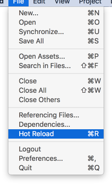
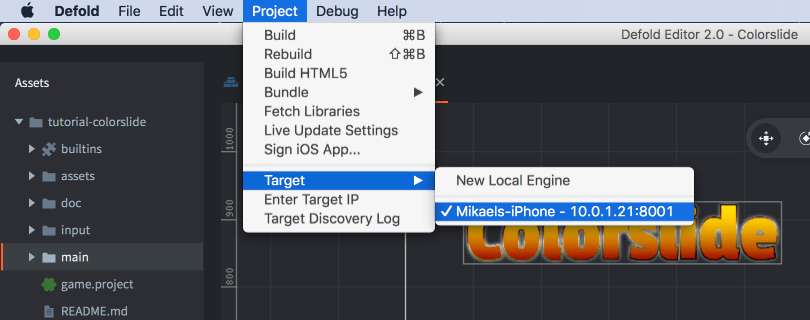
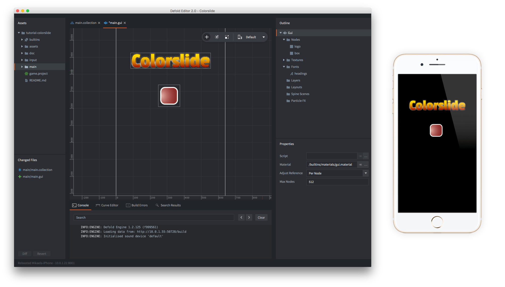
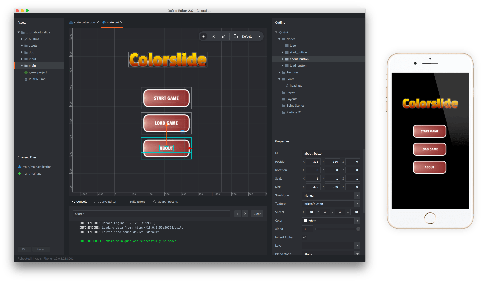

# 热重载资源

Defold允许您对资源进行热重载。在开发游戏时，此功能可以极大地加快某些任务的速度。它允许您在游戏运行时更改游戏的代码和内容。常见用例包括：

- 在Lua脚本中调整游戏参数。
- 编辑和调整图形元素（如粒子效果或GUI元素）并在适当的上下文中查看结果。
- 编辑和调整着色器代码并在适当的上下文中查看结果。
- 通过重启关卡、设置状态等来促进游戏测试---而无需停止游戏。

## 如何热重载

从编辑器启动游戏（<kbd>Project ▸ Build</kbd>）。

然后要重新加载更新的资源，只需选择菜单项<kbd>File ▸ Hot Reload</kbd>或按键盘上相应的快捷键：



## 在设备上热重载

热重载在设备上和桌面上一样有效。要在设备上使用它，请在您的移动设备上运行游戏的调试版本，或运行[开发应用](/manuals/dev-app)，然后在编辑器中选择它作为目标：



现在当您构建并运行时，编辑器会将所有资源上传到设备上运行的应用程序并启动游戏。从那时起，您热重载的任何文件都将在设备上更新。

例如，要在手机上运行的游戏中显示的GUI上添加几个按钮，只需打开GUI文件：



添加新按钮，保存并热重载GUI文件。您现在可以在手机屏幕上看到新按钮：



当您热重载文件时，引擎将在控制台中打印每个重新加载的资源文件。

## 重新加载脚本

任何重新加载的Lua脚本文件都将在运行的Lua环境中重新执行。

```lua
local my_value = 10

function update(self, dt)
    print(my_value)
end
```

将`my_value`更改为11并热重载文件将立即生效：

```text
...
DEBUG:SCRIPT: 10
DEBUG:SCRIPT: 10
DEBUG:SCRIPT: 10
INFO:RESOURCE: /main/hunter.scriptc was successfully reloaded.
DEBUG:SCRIPT: 11
DEBUG:SCRIPT: 11
DEBUG:SCRIPT: 11
...
```

请注意，热重载不会改变生命周期函数的执行。例如，热重载时不会调用`init()`。但是，如果您重新定义生命周期函数，将使用新版本。

## 重新加载Lua模块

只要您在模块文件中将变量添加到全局作用域，重新加载文件将更改这些全局变量：

```lua
--- my_module.lua
my_module = {}
my_module.val = 10
```

```lua
-- user.script
require "my_module"

function update(self, dt)
    print(my_module.val) -- hot reload "my_module.lua" and the new value will print
end
```

常见的Lua模块模式是构造一个本地表，填充它然后返回它：

```lua
--- my_module.lua
local M = {} -- a new table object is created here
M.val = 10
return M
```

```lua
-- user.script
local mm = require "my_module"

function update(self, dt)
    print(mm.val) -- will print 10 even if you change and hot reload "my_module.lua"
end
```

更改并重新加载"my_module.lua"将_不会_改变"user.script"的行为。有关原因以及如何避免此陷阱的更多信息，请参见[模块手册](/manuals/modules)。

## on_reload()函数

每个脚本组件都可以定义`on_reload()`函数。如果存在，它将在脚本重新加载时被调用。这对于检查或更改数据、发送消息等非常有用：

```lua
function on_reload(self)
    print(self.velocity)

    msg.post("/level#controller", "setup")
end
```

## 重新加载着色器代码

重新加载顶点和片段着色器时，GLSL代码会被图形驱动程序重新编译并上传到GPU。如果着色器代码导致崩溃，这是很容易发生的，因为GLSL是在非常低的级别上编写的，它将使引擎崩溃。
