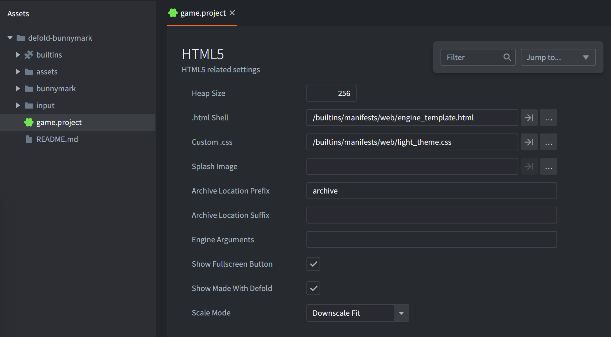
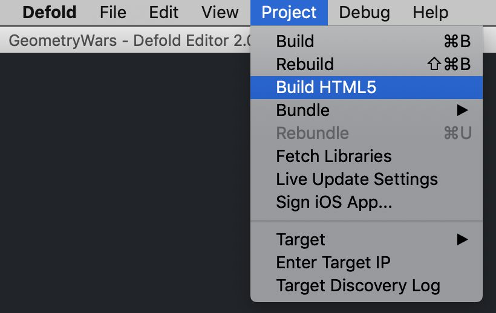
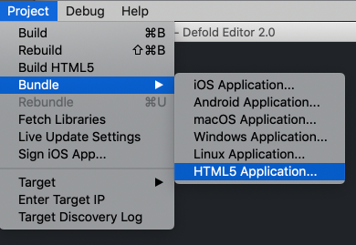
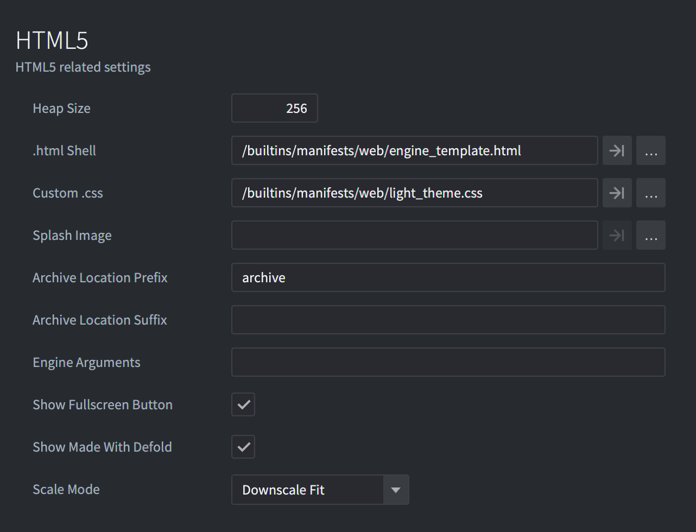
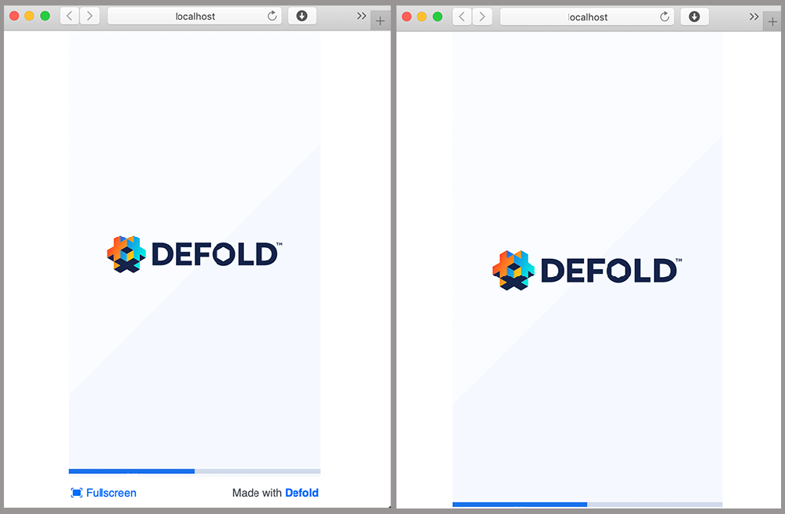
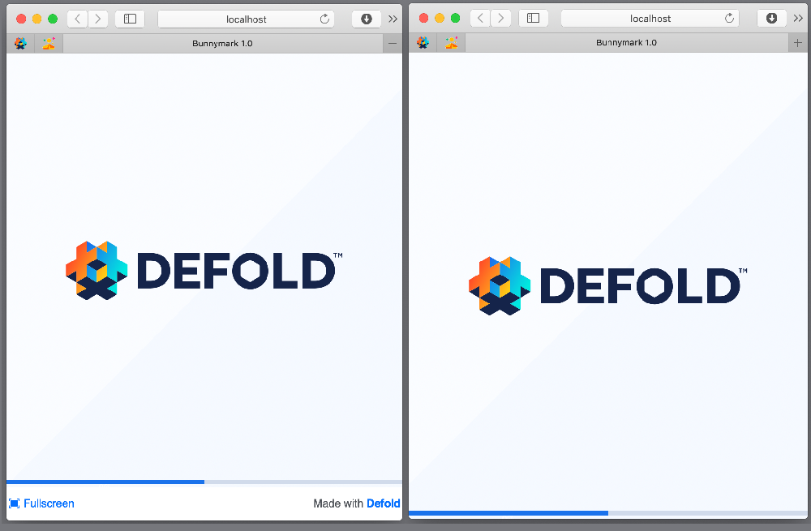
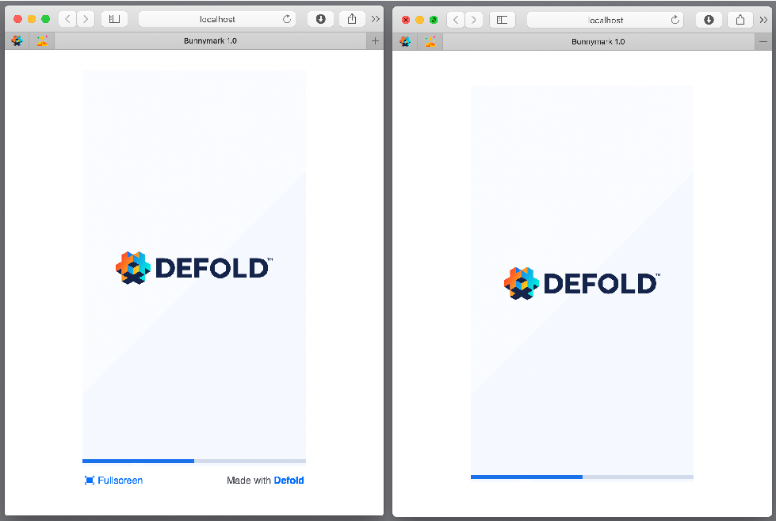
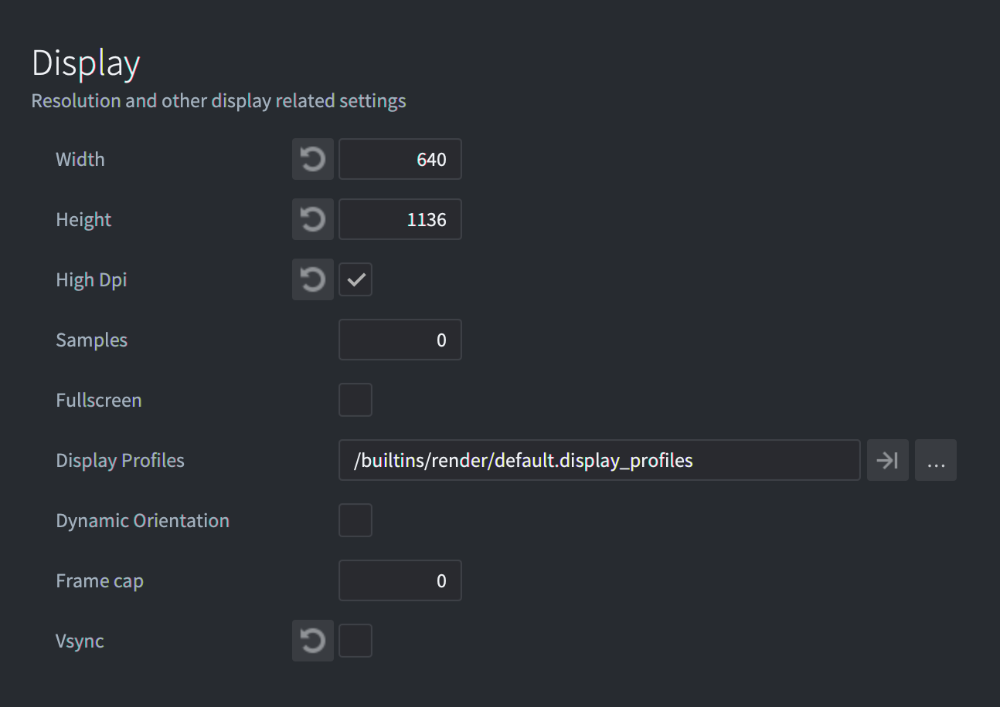
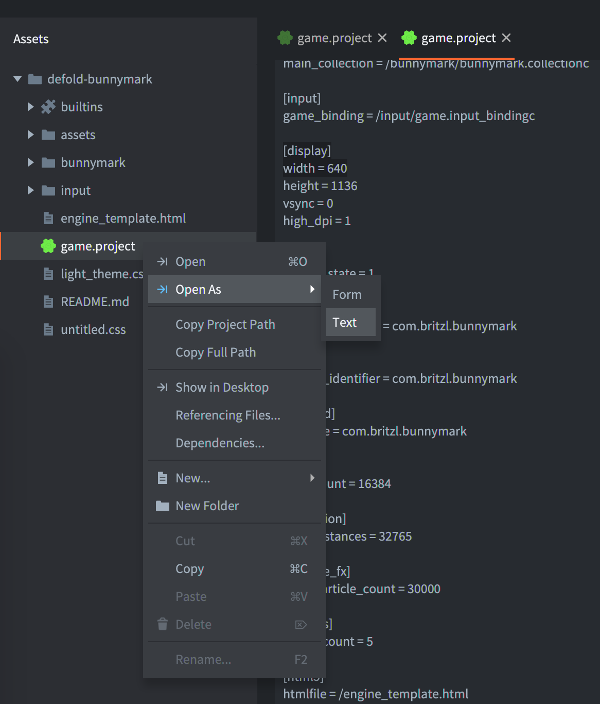

# HTML5 开发

通过编辑器编译菜单可以看到, Defold 支持导出 HTML5 游戏. 进一步说, 游戏会通过一个模板系统嵌入到一个 HTML 页面之中.

*game.project* 文件包含了 HTML5 相关设置:



## Heap size

Defold 通过 Emscripten (详见 http://en.wikipedia.org/wiki/Emscripten) 支持 HTML5 导出. 简单地说, 它为应用的运行建立了一个虚拟内存堆. 默认情况下, 引擎分配了一块内存 (256MB). 这对一般游戏足够了. 通过游戏优化, 可以做到申请内存最小化. 要调整内存分配, 步骤如下:

1. 设置 *heap_size* 为需要的值. 以兆字节表示.
2. 打包 HTML5 游戏 (见下文)

## 测试 HTML5 游戏

要测试 HTML5 游戏, 需要先启动一个 HTTP 服务程序. Defold 可以通过 <kbd>Project ▸ Build HTML5</kbd> 启动内建 HTTP 服务.



要测试 HTML5 游戏, 把游戏上传到远程 HTTP 服务器或者使用本地服务程序, 比如, 使用 python 自带的 HTTP 服务.
Python 2:
> python -m SimpleHTTPServer

Python 3:
> python -m http.server

或者
> python3 -m http.server

::: important
不能直接用浏览器打开 HTML5 游戏的 `index.html` 文件. 要通过服务器访问打开.
:::

::: important
如果在控制台见到 "wasm streaming compile failed: TypeError: Failed to execute ‘compile’ on ‘WebAssembly’: Incorrect response MIME type. Expected ‘application/wasm’." 错误, 请确保你的服务器设置了 `application/wasm` MIME 类型对应 .wasm 文件.
:::

## HTML5游戏打包

Defold 打包 HTML5 游戏很简单, 跟其他平台一样: 从菜单栏选择 <kbd>Project ▸ Bundle... ▸ HTML5 Application...</kbd> :



可以选择让 HTML5 包含 `asm.js` 和一个 Defold 引擎 WebAssembly (wasm) 双版本. 多数情况下选择 WebAssembly 版就够了, 因为 [所有主流浏览器都支持 WebAssembly](https://caniuse.com/wasm).

::: important
即使包含了 `asm.js` 和 `wasm` 双版本, 浏览器加载游戏时也只是下载其中一个. 如果浏览器支持 WebAssembly 则优先下载 WebAssembly 版, 否则回撤下载 asm.js 版.
:::

当点选 <kbd>Create bundle</kbd> 按钮会弹出目录对话框让你选择应用的保存位置. 等输出工作完成, 你会获得应用所需的所有文件.

## 已知问题和局限性

* Hot Reload - HTML5 游戏不支持热更新. Defold 应用必须通过服务器加载运行才能接收热更新. 纯浏览器网页无法获得热更新.
* Internet Explorer 11
  * Audio - Defold 使用 HTML5 _WebAudio_ (详见 http://www.w3.org/TR/webaudio) 来处理声音, 目前 Internet Explorer 11 还不支持. 所以这种情况下没有声音.
  * WebGL - Microsoft 没有完全实现 _WebGL_ API (详见 https://www.khronos.org/registry/webgl/specs/latest/). 所以, 较其他浏览器而言对WebGL支持不好.
  * Full screen - 全屏模式在浏览器中不可靠.
* Chrome
  * Slow debug builds - 为了在 HTML5 平台更好地调试我们开启了校验所有 WebGL 图像调用来检测错误. 但是这样做在 Chrome 上会运行缓慢. 可以把 *game.project* 里的 *Engine Arguments* 部分设置为 `–-verify-graphics-calls=false` 来关闭图像调用校验.
* 游戏手柄支持 - 对于 HTML5 平台的游戏手柄支持与配置[参见手柄教程](/manuals/input-gamepads/#gamepads-in-html5).

## 自定义HTML5打包

针对 HTML5 版本的游戏, Defold 提供了一个默认模板网页. 其中包含的样式和脚本代码决定了游戏的显示方式.

游戏输出时, 这个页面也会重新生成. 如果想要自定义网页模板需要在项目设置里手动配置. 要配置的话, 打开 Defold 编辑器的 *game.project* 文件然后找到 *html5* 部分:



关于每个选项详情请见 [形目设置教程](/manuals/project-settings/#HTML5).

::: important
`builtins` 文件夹下的默认 html/css 模板文件是不能直接修改的. 要先从 `builtins` 里把文件拷贝出来然后再在 *game.project* 文件里指明要使用的文件的位置.
:::

::: important
网页 canvas 不能有 border 或者 padding. 否则的话, 鼠标输入坐标会产生偏差.
:::

可以在 *game.project* 文件里禁用 `Fullscreen` 按钮以及 `Made with Defold` 链接.
Defold 提供了 index.html 文件的亮暗两种风格. 默认亮风格但是可以在 `Custom CSS` 修改成暗风格. 在 `Scale Mode` 部分还预定义了四种缩放模式可供选择.

::: important
各种缩放模式计算时考虑了当前屏幕 DPI 以支持 *game.project* 里的 `High Dpi` 选项 (在 `Display` 部分)
:::

### Fit 和 Downscale Fit

使用 `Fit` 模式 canvas 会以原始比例缩放来适配当前屏幕. `Downscale Fit` 的区别在于, 如果内嵌网页比游戏 canvas 小, 则游戏缩小；反之则以原始大小显示而并不放大=.



### Stretch

使用 `Stretch` 模式 canvas 会充满整个内嵌网页.



### No Scale
使用 `No Scale` 模式游戏 canvas 大小保持在 *game.project* 文件里 `[display]` 部分设置的值.



## Tokens

使用 [Mustache 模板语言](https://mustache.github.io/mustache.5.html) 创建 `index.html` 文件. 编译或打包时, HTML 和 CSS 文件会基于项目设置填充模板里面对应的 Tokens. 这些 Tokens 通常使用双大括号或者三层大括号标注 (`{{TOKEN}}` 或者 `{{{TOKEN}}}`), 用哪种取决于标注里面有没有转义字符. 这种方法便于频繁修改以及代码重用.

::: sidenote
关于 Mustache 模板语言详情请见 [官方手册](https://mustache.github.io/mustache.5.html).
:::

*game.project* 里的设置都可以使用标注来引用. 比如说, 引用 `Display` 里 `Width` 的值:



用普通文本编辑器打开 *game.project* 找到想引用的 `[section_name]` 部分. 像这样引用设置的值: `{{section_name.field}}` 或者 `{{{section_name.field}}}`.



比如, 在 HTML 模板的 JavaScript 里:

```javascript
function doSomething() {
    var x = {{display.width}};
    // ...
}
```

而且, 我们还可以自定义标注:

DEFOLD_SPLASH_IMAGE
: 溅射屏幕图片文件名, 如果 *game.project* 里的 `html5.splash_image` 为空, 则设置为 `false`.


```css
{{#DEFOLD_SPLASH_IMAGE}}
		background-image: url("{{DEFOLD_SPLASH_IMAGE}}");
{{/DEFOLD_SPLASH_IMAGE}}
```

exe-name
: 不包含任何非法符号的项目名


DEFOLD_CUSTOM_CSS_INLINE
: 这里就是在 *game.project* 里设置的内联 CSS 文件的地方.


```html
<style>
{{{DEFOLD_CUSTOM_CSS_INLINE}}}
</style>
```

::: sidenote
内联块要出现在主程序脚本加载之前. 因为里面有 HTML 标签, 所以要用三层大括号 `{{{TOKEN}}}` 来引用它.
:::

DEFOLD_SCALE_MODE_IS_DOWNSCALE_FIT
: 如果 `html5.scale_mode` 是 `Downscale Fit` 的话则值为 `true`.

DEFOLD_SCALE_MODE_IS_FIT
: 如果 `html5.scale_mode` 是 `Fit` 的话则值为 `true`.

DEFOLD_SCALE_MODE_IS_NO_SCALE
: 如果 `html5.scale_mode` 是 `No Scale` 的话则值为 `true`.

DEFOLD_SCALE_MODE_IS_STRETCH
: 如果 `html5.scale_mode` 是 `Stretch` 的话则值为 `true`.

DEFOLD_HEAP_SIZE
: 在 *game.project* 里设置的内存大小, `html5.heap_size` 的值以字节为单位.

DEFOLD_ENGINE_ARGUMENTS
: 在 *game.project* 里设置的引擎参数, `html5.engine_arguments` 以逗号 `,` 分隔.


## 额外参数

要创建自定义模板, 可以为引擎加载提供额外参数:

`Module.runApp("canvas", extra_params)` - 通过指定canvas启动游戏

'extra_params' 可选的额外参数对象, 包含如下属性:

```
'archive_location_filter':
    包地址过滤.

'unsupported_webgl_callback':
    如果不支持 WebGL 则需调用的回调函数.

'engine_arguments':
    传入引擎的参数列表 (字符串).

'persistent_storage':
    是否使用持久化存储的布尔值.

'custom_heap_size':
    自定义内存使用的大小.

'disable_context_menu':
    为 true 的话则在canvas上关闭右键上下文弹出菜单.

'retry_time':
    文件下载失败重试时间间隔.

'retry_count':
    文件下载失败充实次数.

'can_not_download_file_callback':
    如果重试次数已满但是仍没有得到文件则需调用的回调函数.
*/
```

## HTML5 的文件操作

HTML5 支持 `sys.save()`, `sys.load()` 和 `io.open()` 之类的文件操作, 但是与其他平台实现方法不同. 基于安全考虑浏览器里运行的 Javascript 无权直接读写本地文件. Emscripten (即 Defold) 使用 [IndexedDB](https://developer.mozilla.org/en-US/docs/Web/API/IndexedDB_API/Using_IndexedDB) 代替, 它是基于浏览器的持久化存储方案, 基于浏览器的虚拟文件系统. 与其他平台的区别主要是比直接读写文件要慢而且实质上读写的是一个数据库. 浏览器开发者工具通常都提供了 IndexedDB 的读写功能.


## 给 HTML5 游戏传递参数

一些情况下我们需要在游戏启动前或者启动时为其提供某些参数. 可能是用户 id, session 令牌或者告诉游戏启动时为当前玩家加载哪一关. 有多种方法实现这样的功能, 下面就列举一些.

### 引擎参数

用于在引进加载时指定引擎参数. 这些参数在运行时可以使用 `sys.get_config()` 得到. 在 `index.html` 里修改 `extra_params` 对象的 `engine_arguments` 项, 加入键值对以提供参数:


```
    <script id='engine-setup' type='text/javascript'>
    var extra_params = {
        ...,
        engine_arguments: ["–config=foo1=bar1","--config=foo2=bar2"],
        ...
    }
```

也可以在项目 *game.project* 的 HTML5 部分加入如 `"–config=foo1=bar1","--config=foo2=bar2"` 的引擎参数, 它们会被注入到自动生成的 index.html 文件中.

运行时可以这样取得引擎参数:

```lua
local foo1 = sys.get_config("foo1")
local foo2 = sys.get_config("foo2")
print(foo1) -- bar1
print(foo2) -- bar2
```


### 在 URL 中提供参数

可以在游戏页面的 URL 中提供参数, 然后在运行时读取:

```
https://www.mygame.com/index.html?foo1=bar1&foo2=bar2
```

```lua
local url = html5.run("window.location")
print(url)
```

下面提供一个获取所有查询参数并把它们保存为 Lua 表的函数:

```lua
local function get_query_parameters()
    local url = html5.run("window.location")
    -- get the query part of the url (the bit after ?)
    local query = url:match(".*?(.*)")
    if not query then
        return {}
    end

    local params = {}
    -- iterate over all key value pairs
    for kvp in query:gmatch("([^&]+)") do
        local key, value = kvp:match("(.+)=(.+)")
        params[key] = value
    end
    return params
end

function init(self)
    local params = get_query_parameters()
    print(params.foo1) -- bar1
end
```


## 问答
:[HTML5 问答](../shared/html5-faq.md)
