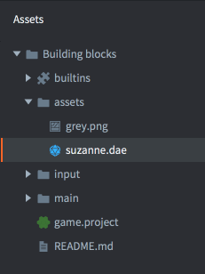
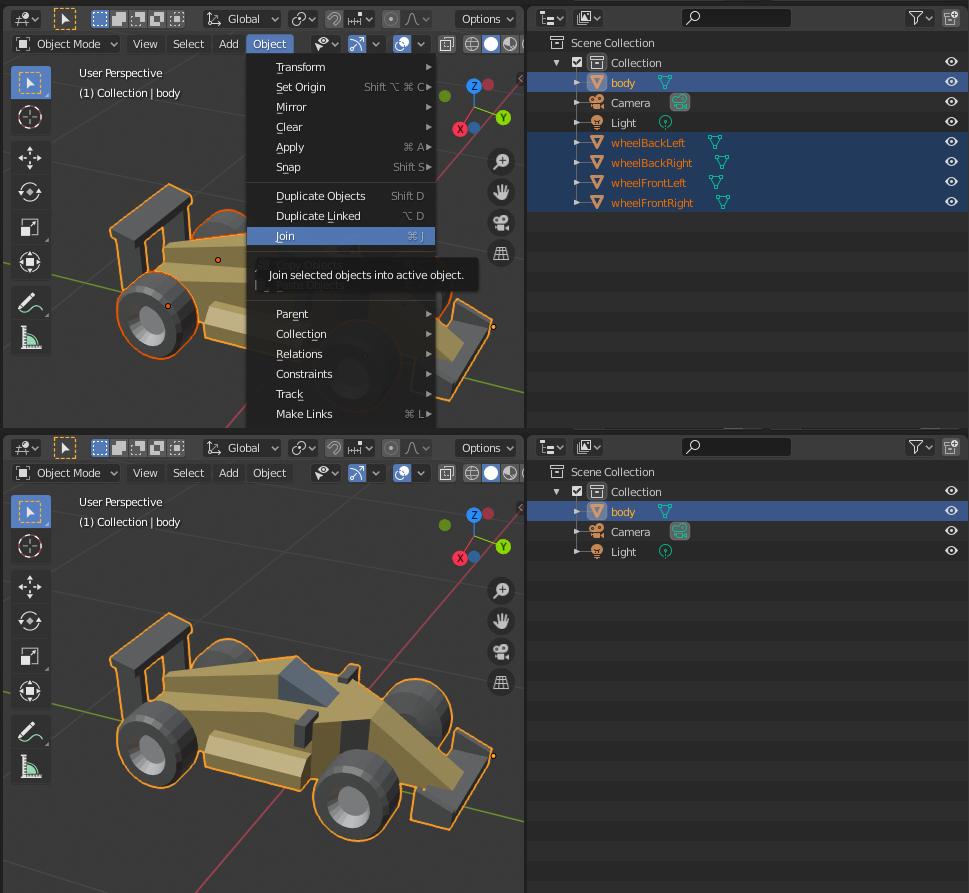
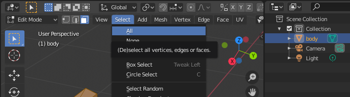
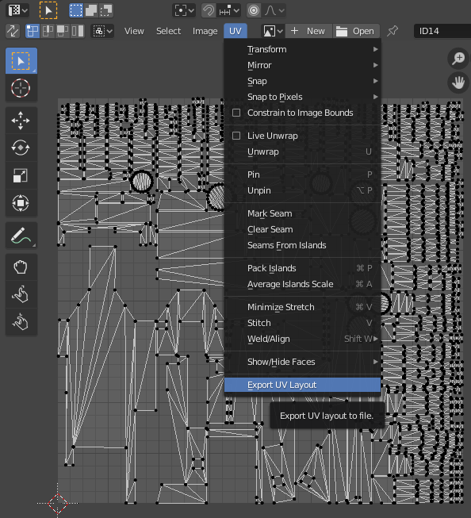
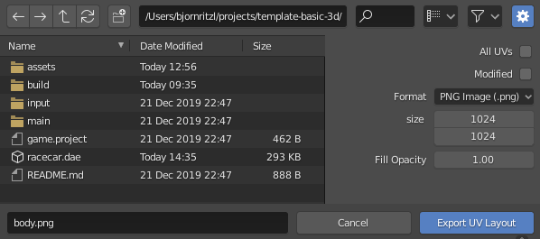
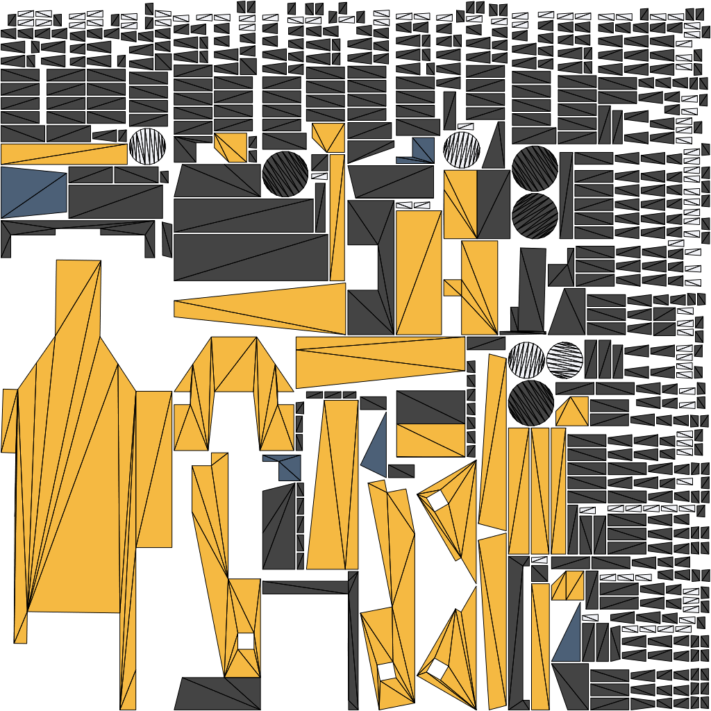

# 导入3D模型
Defold 目前支持 GL Transmission Format *.glTF* 和 Collada *.dae* 格式的模型,骨骼和动画. 可以使用类似 Maya, 3D Max, Sketchup 和 Blender 的软件保存或者转换3D模型为Collada格式. Blender 是一个著名的3D建模, 动画及渲染软件. 它在 Windows, macOS 和 Linux 都能运行并且在 http://www.blender.org 上免费下载.

## 导入模型到 Defold
要导入模型, 只需将 *.gltf* 文件或者 *.dae* 文件及其相应贴图拖拽至 *资源面板* 即可.

## 使用模型
当模型导入到 Defold 之后即可在 [模型组件](/manuals/model) 上使用它.

## 导出 glTF 和 Collada 格式文件
导出的 *.gltf* 或 *.dae* 文件包含模型所有的点, 边和面的信息, 如果模型贴了图, 同时还包含 _UV 坐标_ (用于确定纹理如何铺在模型表面), 以及骨架骨骼和动画数据.

* 关于多边形网格的解释详见 http://en.wikipedia.org/wiki/Polygon_mesh.

* UV 坐标和 UV 映射的解释详见 http://en.wikipedia.org/wiki/UV_mapping.

Defold 对于导出的动画作了一些限制:

* Defold 目前只支持烘焙好的动画. 动画每一关键帧每个骨骼都要提供矩阵数据而不是位置, 旋转和缩放这样分开的数据.

* 动画都是线性插值的. 如果需要曲线插值请在导出前预烘焙好.

* 不支持 Collada 的动画片段. 一个模型如有多个动画, 请分别导出 *.dae* 文件然后在 Defold 中合并成一个 *.animationset* 文件.

### 需求
导出模型的时候需遵循以下需求:

* 模型必须由单个网格组成
* 模型必须使用单个材质
* 导出的 *.gltf* 文件要嵌入网格数据. 附带于其他文件的二进制网格数据不受支持. 

可以使用 Blender 来组合多个网格. 选中所有网格, 按 `CTRL`/`CMD` + `J` 来进行组合操作.

#### 删除材质
可以使用 Blender 删除模型上的多余材质. 选中要删除的材质, 按 `-` 来进行删除.

### 导出纹理
如果模型没有纹理, 可以使用 Blender 来生成一个. 这个工作要在删除多余材质之前完成. 从选择网格及其所有的点开始:

选中所有点后即可展开UV:

接下来就可以把它保存为图片文件作为网格纹理:

### 从 Blender 中导出
从导出菜单选项中导出模型文件. 选中模型然后点选导出模型菜单项, 选中 "Selection Only" 选项即可导出文件.

