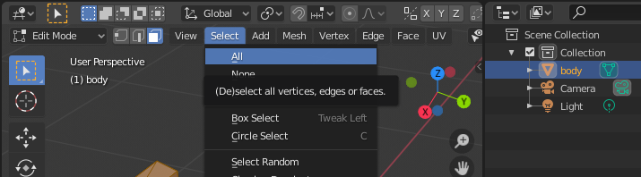

# 导入3D模型
Defold 支持 glTF 2.0（GL Transmission Format）格式的模型、骨骼和动画。3D 模型请使用 *.gltf* 或 *.glb* 文件。glTF 是一种现代格式，专为在游戏引擎和实时应用中传输和加载 3D 数据而设计。

您可以使用 Maya、3ds Max、SketchUp 和 Blender 等工具来创建 3D 模型，或将模型转换为 glTF。

Blender 是一款功能强大且流行的 3D 建模、动画和渲染程序。它可在 Windows、macOS 和 Linux 上运行，并可从 [https://www.blender.org](https://www.blender.org) 免费获取。

## 导入到Defold
要导入模型，请将 *.gltf* 或 *.glb* 文件拖放到 Defold 编辑器的 *Assets* 面板中。

glTF 常见有两种存储方式：

* *.glb* 是单个二进制文件。它包含模型数据，也可能包含打包的纹理图像。当您希望以单个文件移动或存储模型时，这种方式很方便。
* *.gltf* 是基于文本的 JSON 文件。它通常会引用一个单独的 *.bin* 文件作为网格数据，并引用单独的纹理图像，例如 *.png* 或 *.jpg*。使用这种方式时，请将所有被引用的文件添加到项目中，并保持它们的相对路径不变。

如果模型需要在 Defold 中使用纹理，请将纹理图像作为单独资源导入。即使源 glTF/GLB 文件包含嵌入图像，也必须通过模型组件的材质纹理属性分配纹理。

::: sidenote
从 Defold 1.13.0 开始，Defold 会保留导入的 glTF 文件中的位置和变换，并且在导入时不会自动将模型重新居中。编辑器预览和运行时会一致地使用导入的变换：蒙皮网格或以骨骼为父节点的网格会保留相对于骨架的局部变换，而刚性网格会保留其展平后的世界空间位置。

如果使用旧版 Defold 创建的模型在重新导入后位置或方向发生变化，请在 Blender 或其他创作工具中修正变换，然后重新导出 *.gltf* 或 *.glb* 文件。
:::

## 使用模型
导入模型后，请在[模型组件](/manuals/model)中使用它：

1. 在 *Assets* 面板中通过 <kbd>New... ▸ Model</kbd> 创建 Model 文件，或通过 <kbd>Add Component ▸ Model</kbd> 将 Model 组件直接添加到游戏对象。
2. 将 *Mesh* 属性设置为包含网格的已导入 *.gltf* 或 *.glb* 文件。
3. 对于动画模型，将 *Skeleton* 属性设置为包含骨架的 *.gltf* 或 *.glb* 文件。当网格、骨架和动画一起导出时，这通常与 *Mesh* 使用同一个文件。
4. 为动画创建 *Animation Set* 文件，并将其分配给 *Animations* 属性。如果希望动画自动开始，请设置 *Default Animation*。
5. 将 *Material* 属性设置为适合模型的材质。内置的 *model.material*、*model_instances.material*、*model_skinned.material* 和 *model_skinned_instances.material* 文件都是有用的起点。
6. 将材质纹理属性（例如 *Texture*）设置为导入的纹理图像文件。如果材质使用多个纹理，请在相应的材质纹理字段中分配每个纹理。

## 导出为glTF
导出的 *.gltf* 或 *.glb* 文件包含构成模型的所有顶点、边和面，以及 _UV 坐标_（如果已定义，则表示纹理图像的哪部分映射到网格的特定部分）、骨架中的骨骼和动画数据。

* 关于多边形网格的详细描述可以在 http://en.wikipedia.org/wiki/Polygon_mesh 找到。

* UV 坐标和 UV 映射在 http://en.wikipedia.org/wiki/UV_mapping 中有描述。

Defold 对导出的动画数据施加了一些限制：

* Defold 目前只支持烘焙动画。动画需要为每个关键帧的每个动画骨骼提供矩阵，而不是将位置、旋转和缩放作为单独的键。

* 动画也是线性插值的。如果您使用更高级的曲线插值，动画需要由导出器预先烘焙。

### 要求
导出模型时，请记住不同工具和引擎对 glTF 的支持可能不同。请使用 glTF 2.0；如果模型使用纹理，请确保模型具有正确的 UV 坐标；当纹理需要分配给模型组件时，请单独导入纹理图像。

虽然我们的目标是完全支持 glTF 格式，但我们还没有完全实现。
如果缺少某个功能，请在[我们的仓库](https://github.com/defold/defold/issues)中为其提出功能请求。

### 导出纹理
如果您还没有模型的纹理，可以使用 Blender 生成一个。您应该在从模型中移除额外材质之前执行此操作。首先选择网格及其所有顶点：

当所有顶点被选中后，您可以展开网格以获取 UV 布局：

然后您可以继续将 UV 布局导出为可用作纹理的图像：

### 使用Blender导出
使用 <kbd>File ▸ Export ▸ glTF 2.0 (.glb/.gltf)</kbd> 从 Blender 导出模型。

导出前选择一个或多个对象，如果只想导出所选对象，请启用 *Selected Objects*。

选择一个 *Format* 选项：

* *glTF Binary (.glb)* 会创建一个文件。当您希望模型易于作为单个资源移动或存储时，请使用此选项。
* *glTF Separate (.gltf + .bin + textures)* 会为模型描述、二进制数据和纹理创建单独文件。当您希望编辑纹理图像或在 Defold 中单独分配它们时，请使用此选项。

如果模型包含动画，请启用动画导出并确保动画已烘焙。如果模型使用纹理，请确保网格已有 UV 展开，并且纹理图像导出为 Defold 可以导入的格式，例如 PNG 或 JPEG。

