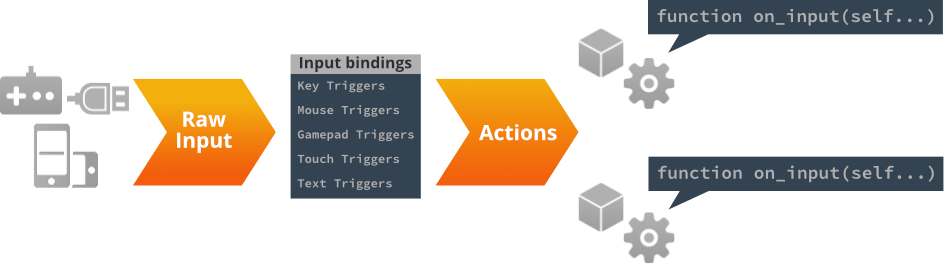
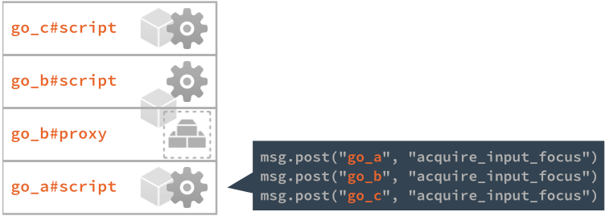
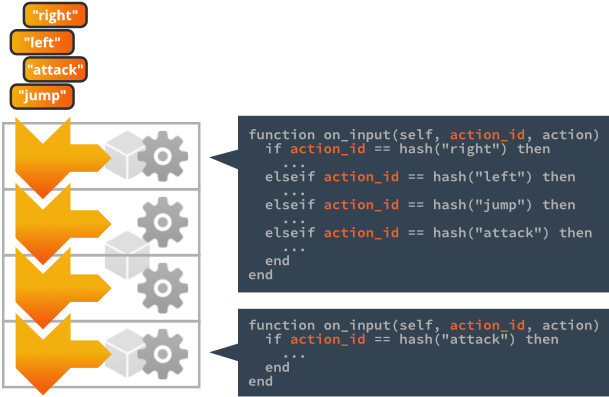
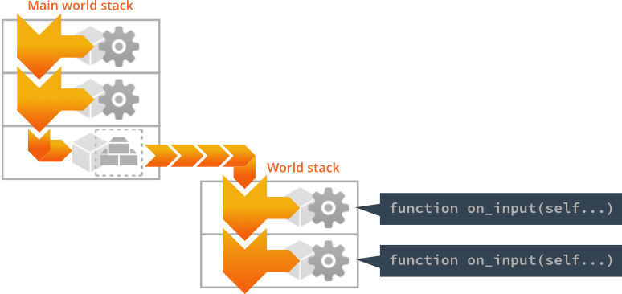
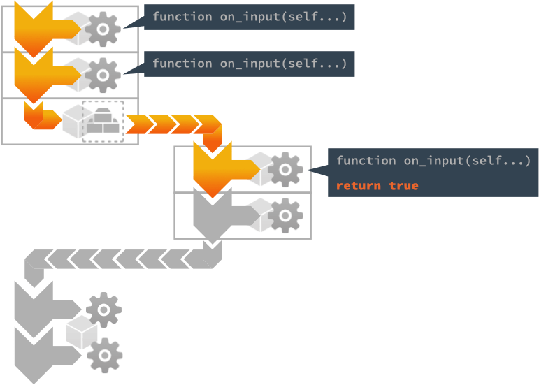

# 输入

所有用户输入都由引擎捕获，并作为操作分派给已获取输入焦点并实现了`on_input()`函数的游戏对象中的脚本和GUI脚本组件。本手册解释了如何设置绑定以捕获输入，以及如何创建响应输入的代码。

输入系统使用一组简单而强大的概念，允许您按照适合游戏的方式管理输入。



设备
: 输入设备是计算机或移动设备的一部分或插入其中的设备，为Defold运行时提供原始系统级输入。支持以下设备类型：

  1. 键盘 (包括按键输入和文本输入)
  2. 鼠标 (位置, 按键, 滚轮输入)
  3. 单点/多点触摸屏 (iOS, Android 设备和 HTML5 手机端)
  4. 游戏手柄 (操作系统负责将其输入发送给游戏然后映射给脚本. 详见 [游戏手柄配置文件](#gamepads-settings-file))

输入绑定
: 在输入发送到脚本之前，来自设备的原始输入通过输入绑定表转换为有意义的*操作*。

操作
: 操作通过您在输入绑定文件中列出的（哈希）名称来标识。每个操作还包含有关输入的相关数据：按钮是按下还是释放，鼠标和触摸的坐标等。

输入监听器
: 任何脚本组件或GUI脚本都可以通过*获取输入焦点*来接收输入操作。可以同时激活多个监听器。

输入栈
: 输入监听器列表，第一个获取焦点的组件在栈底，最后一个获取焦点的组件在栈顶。

消耗输入
: 脚本可以选择消耗接收到的输入，阻止栈中更下方的监听器接收它。

## 设置输入绑定

输入绑定是项目范围的表，允许您指定设备输入在分派到脚本组件和GUI脚本之前如何转换为命名的*操作*。您可以创建一个新的输入绑定文件，在*Assets*视图中<kbd>右键点击</kbd>一个位置并选择<kbd>New... ▸ Input Binding</kbd>。要使引擎使用新文件，请更改*game.project*中的*Game Binding*条目。


所有新项目模板都会自动创建一个默认的输入绑定文件，因此通常不需要创建新的绑定文件。默认文件名为"game.input_binding"，可以在项目根目录的"input"文件夹中找到。<kbd>双击</kbd>该文件在编辑器中打开：


要创建新绑定，点击相关触发类型部分底部的<kbd>+</kbd>按钮。每个条目有两个字段：

*输入*
: 要监听的原始输入，从可用输入的滚动列表中选择。

*操作*
: 给输入操作指定的名称，当它们被创建并分派到您的脚本时使用。可以将相同的操作名称分配给多个输入。例如，您可以将<kbd>空格</kbd>键和游戏手柄"A"按钮绑定到操作`jump`。请注意，存在一个已知错误，即触摸输入不幸不能与其他输入具有相同的操作名称。

## 触发器类型

您可以创建五种设备特定的触发器类型：

键触发器
: 单键键盘输入。每个键分别映射到相应的操作。在[键和文本输入手册](/manuals/input-key-and-text)中了解更多。

文本触发器
: 文本触发器用于读取任意文本输入。在[键和文本输入手册](/manuals/input-key-and-text)中了解更多。

鼠标触发器
: 来自鼠标按钮和滚轮的输入。在[鼠标和触摸输入手册](/manuals/input-mouse-and-touch)中了解更多。

触摸触发器
: 单点和多点触摸类型触发器在iOS和Android设备上的原生应用程序和HTML5包中可用。在[鼠标和触摸手册](/manuals/input-mouse-and-touch)中了解更多。

游戏手柄触发器
: 游戏手柄触发器允许您将标准游戏手柄输入绑定到游戏功能。在[游戏手柄手册](/manuals/input-gamepads)中了解更多。

### 加速度计输入

除了上面列出的五种不同触发器类型外，Defold还在原生Android和iOS应用程序中支持加速度计输入。在*game.project*文件的Input部分中勾选Use Accelerometer框。

```lua
function on_input(self, action_id, action)
    if action.acc_x and action.acc_y and action.acc_z then
        -- 对加速度计数据做出反应
    end
end
```

## 输入焦点

要在脚本组件或GUI脚本中监听输入操作，应将`acquire_input_focus`消息发送到持有该组件的游戏对象：

```lua
-- 告诉当前游戏对象（"."）获取输入焦点
msg.post(".", "acquire_input_focus")
```

此消息指示引擎将游戏对象中具有输入功能的组件（脚本组件、GUI组件和集合代理）添加到*输入栈*中。游戏对象组件被放在输入栈的顶部；最后添加的组件将位于栈顶。请注意，如果游戏对象包含多个具有输入功能的组件，所有组件都将被添加到栈中：



如果已经获取输入焦点的游戏对象再次这样做，其组件将被移动到栈顶。


## 输入分派和 on_input()

输入操作根据输入栈进行分派，从顶部到底部。



栈上任何包含`on_input()`函数的组件都将调用该函数，在帧期间每个输入操作调用一次，并带有以下参数：

`self`
: 当前脚本实例。

`action_id`
: 操作的哈希名称，如在输入绑定中设置的那样。

`action`
: 包含有关操作的有用数据的表，如输入的值、其位置（绝对和增量位置）、按钮输入是否`按下`等。有关可用操作字段的详细信息，请参阅[on_input()](/ref/go#on_input)。

```lua
function on_input(self, action_id, action)
  if action_id == hash("left") and action.pressed then
    -- 左移
    local pos = go.get_position()
    pos.x = pos.x - 100
    go.set_position(pos)
  elseif action_id == hash("right") and action.pressed then
    -- 右移
    local pos = go.get_position()
    pos.x = pos.x + 100
    go.set_position(pos)
  end
end
```


### 输入焦点和集合代理组件

每个通过集合代理动态加载的游戏世界都有自己的输入栈。为了使操作分派到达加载世界的输入栈，代理组件必须位于主世界的输入栈上。加载世界栈上的所有组件都在分派继续向下主栈之前被处理：



::: important
忘记发送`acquire_input_focus`给持有集合代理组件的游戏对象是一个常见错误。跳过这一步将阻止输入到达加载世界输入栈上的任何组件。
:::


### 释放输入

要停止监听输入操作，请将`release_input_focus`消息发送到游戏对象。此消息将从输入栈中移除游戏对象的任何组件：

```lua
-- 告诉当前游戏对象（"."）释放输入焦点。
msg.post(".", "release_input_focus")
```


## 消耗输入

组件的`on_input()`可以主动控制操作是否应该进一步传递到栈的下方：

- 如果`on_input()`返回`false`，或者省略返回值（这暗示了一个`nil`返回，在Lua中是假值），输入操作将被传递到输入栈上的下一个组件。
- 如果`on_input()`返回`true`，输入被消耗。输入栈中更下方的任何组件都不会接收到输入。请注意，这适用于*所有*输入栈。代理加载世界栈上的组件可以消耗输入，阻止主栈上的组件接收输入：



有许多很好的用例，其中输入消耗提供了一种简单而强大的方式，在游戏的不同部分之间转移输入。例如，如果您需要一个弹出菜单，暂时是游戏中唯一监听输入的部分：


暂停菜单最初是隐藏的（禁用的），当玩家触摸"PAUSE" HUD项时，它被启用：

```lua
function on_input(self, action_id, action)
    if action_id == hash("mouse_press") and action.pressed then
        -- 玩家按下了PAUSE吗？
        local pausenode = gui.get_node("pause")
        if gui.pick_node(pausenode, action.x, action.y) then
            -- 告诉暂停菜单接管。
            msg.post("pause_menu", "show")
        end
    end
end
```


暂停菜单GUI获取输入焦点并消耗输入，防止除弹出菜单相关之外的任何输入：

```lua
function on_message(self, message_id, message, sender)
  if message_id == hash("show") then
    -- 显示暂停菜单。
    local node = gui.get_node("pause_menu")
    gui.set_enabled(node, true)

    -- 获取输入。
    msg.post(".", "acquire_input_focus")
  end
end

function on_input(self, action_id, action)
  if action_id == hash("mouse_press") and action.pressed then

    -- 做一些事情...

    local resumenode = gui.get_node("resume")
    if gui.pick_node(resumenode, action.x, action.y) then
        -- 隐藏暂停菜单
        local node = gui.get_node("pause_menu")
        gui.set_enabled(node, false)

        -- 释放输入。
        msg.post(".", "release_input_focus")
    end
  end

  -- 消耗所有输入。输入栈中位于我们下方的任何内容
  -- 在我们释放输入焦点之前都不会看到输入。
  return true
end
```
