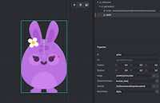

# 欢迎来到 Defold

Defold 被设计为一个专业的游戏开发平台. 它能帮助开发团队设计, 构建以及 _发布_ 游戏产品. 它并不高度集成一切功能. 目前也没有特别复杂的组件. 相对的, 我们相信Defold可以为开发团队提供简便的, 适于多人共同开发合作的工具. 这就需要你来手动完成一些工作, 与此同时也使得你的道路和目标更加明晰.

不管是菜鸟还是老司机, 你可能一时无法充分理解我们的理念. 对此我们鼓励你去实验, 看教程, 看教程和API文档, 在论坛里积极学习和关注其他使用Defold的老同志.

## 从哪开始?

我们有许多文档, 比如开发教程, API 文档, 实例项目和教程. 如果不知道从哪学起, 这里有些重点内容:

#### 编辑器
{.left} [编辑器概述](/manuals/editor/) 是个能让你快速入门的介绍, 使用可视的工具进行创作和代码编写. 如果你对 3D 建模软件和各种代码编辑器比较熟悉, 那我们的编辑器看起来会很亲切, 虽说可能在某些地方还是和你想象的稍有区别.

#### 简单实例
{.left} [简单实例集](/examples/) 直接展示出了各个功能运行时的小例子. 在这里你可以看到这些功能在Defold里是如何实现的.

#### Lua 语言
{.left} [Defold 使用 Lua](/manuals/lua/) 来控制所有游戏逻辑. 引擎是高效 C++ 程序, 但是其控制脚本是高层 Lua 语言. 如果你编写过 Python, Javascript 或者其他高级语言代码, 你就会发现 Lua 非常好理解. 没写过脚本程序的, 可以先从Lua教程开始学.

#### 游戏教程
{.left} 我们相信做是学的最好方法. 这就是我们花费很多精力在Defold [编辑器](/manuals/editor/) 里集成一些教程和复杂关卡的原因.打开一两个教程跟着做一遍就知道 Defold 是怎么编译和工作的了.

#### Defold 的资源组成
{.left} [Defold 游戏由许多资源构成](/manuals/building-blocks/), 有些和其他游戏引擎类似. 还有另一些 Defold 里特有的, 用熟才感觉方便的东西. 要想知道Defold的底层工作方式可以先从资源教程学起.

#### 社区论坛
{.left} [论坛](//forum.defold.com/) 是一个互相学习的好地方. 我们的社区很友好, 我们的老司机在游戏开发, 尤其是 Defold 开发方面都很精通. 如果你卡壳了, 可以来论坛寻求帮助!

不管从哪开始学习 Defold, 都可以随时回来这个页面再深入理解 Defold 提供的功能和方法. 哪里不理解或者哪里写错了都可以跟我们说. 我们的初衷就是把这套教程做的尽善尽美.

希望你能使用 Defold 创作出绝妙的游戏来!
