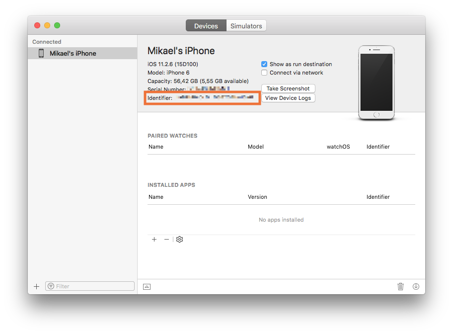
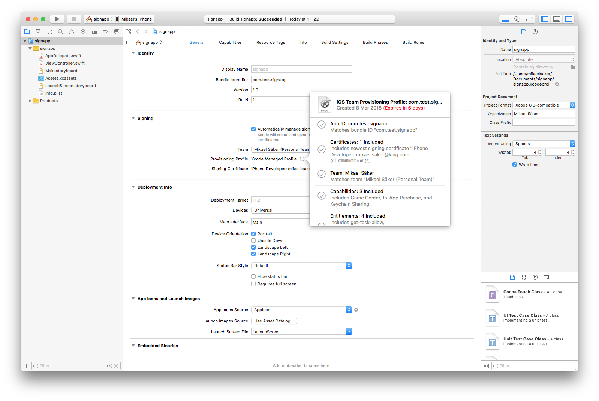

# iOS 开发

::: sidenote
为 iOS 打包游戏仅适用于 Mac 版本的 Defold 编辑器。
:::

iOS 要求 _所有_ 你想要在手机或平板电脑上运行的应用 _必须_ 使用 Apple 颁发的证书和配置文件进行签名。本手册解释了为 iOS 打包游戏所涉及的步骤。在开发过程中，通过 [开发应用](/manuals/dev-app) 运行游戏通常是首选，因为它允许你直接将内容和代码热重载到你的设备上。

## Apple 的代码签名过程

与 iOS 应用相关的安全性由多个组件组成。你可以通过注册 [Apple 的 iOS 开发者计划](https://developer.apple.com/programs/) 获得所需工具的访问权限。注册后，请前往 [Apple 开发者会员中心](https://developer.apple.com/membercenter/index.action)。


*证书、标识符和配置文件* 部分包含了你需要的所有工具。从这里你可以创建、删除和编辑：

证书
: Apple 颁发的加密证书，用于标识你作为开发者的身份。你可以创建开发或生产证书。开发者证书允许你在沙盒测试环境中测试某些功能，例如应用内购买机制。生产证书用于对最终应用进行签名以便上传到 App Store。在将应用放到设备上进行测试之前，你需要使用证书对应用进行签名。

标识符
: 用于各种用途的标识符。可以注册通配符标识符（即 `some.prefix.*`），这些标识符可以用于多个应用。应用 ID 可以包含应用服务信息，例如应用是否启用 Passbook 集成、Game Center 等。此类应用 ID 不能是通配符标识符。为了使应用服务正常工作，你的应用的 *包标识符* 必须与应用 ID 标识符匹配。

设备
: 每个开发设备都需要使用其 UDID（唯一设备标识符，见下文）进行注册。

配置文件
: 配置文件将证书与应用 ID 和设备列表相关联。它们指明哪个开发者的哪个应用被允许在哪些设备上运行。

在 Defold 中为游戏和应用签名时，你需要有效的证书和有效的配置文件。

::: sidenote
你可以在会员中心主页上执行的一些操作也可以在 Xcode 开发环境中执行---前提是你已安装了 Xcode。
:::

设备标识符 (UDID)
: iOS 设备的 UDID 可以通过 wifi 或线缆将设备连接到计算机来找到。打开 Xcode 并选择 <kbd>Window ▸ Devices and Simulators</kbd>。当你选择设备时，会显示序列号和标识符。

  

  如果你没有安装 Xcode，你可以在 iTunes 中找到标识符。点击设备符号并选择你的设备。

  

  1. 在 *摘要* 页面上，找到 *序列号*。
  2. 点击 *序列号* 一次，使该字段变为 *UDID*。如果你反复点击，将会显示设备的几条信息。继续点击直到显示 *UDID*。
  3. 右键点击长 UDID 字符串并选择 <kbd>复制</kbd> 将标识符复制到剪贴板，这样你就可以在 Apple 开发者会员中心注册设备时轻松地将其粘贴到 UDID 字段中。

## 使用免费的 Apple 开发者账户进行开发

从 Xcode 7 开始，任何人都可以安装 Xcode 并免费进行设备开发。你不必注册 iOS 开发者计划。相反，Xcode 会自动为你作为开发者颁发一个证书（有效期1年）和针对你的应用的配置文件（在你的特定设备上有效一周）。

1. 连接你的设备。
2. 安装 Xcode。
3. 向 Xcode 添加新账户并使用你的 Apple ID 登录。
4. 创建一个新项目。最简单的"单视图应用"即可。
5. 选择你的"团队"（为你自动创建）并为应用提供一个包标识符。

::: important
记下包标识符，因为你必须在你的 Defold 项目中使用相同的包标识符。
:::

6. 确保 Xcode 已为应用创建了 *配置文件* 和 *签名证书*。

   

7. 在你的设备上构建应用。第一次，Xcode 会要求你启用开发者模式，并会用调试器支持准备设备。这可能需要一段时间。
8. 当你验证应用可以正常工作后，在磁盘上找到它。你可以在"报告导航器"的构建报告中查看构建位置。

   

9. 找到应用，右键单击它并选择 <kbd>显示包内容</kbd>。

   

10. 将"embedded.mobileprovision"文件复制到你驱动器上你将找到它的某个位置。

   

此配置文件可以与你的代码签名身份一起使用，在 Defold 中为应用签名，有效期为一周。

当配置文件过期时，你需要在 Xcode 中再次构建应用并获取新的临时配置文件，如上所述。

## 创建 iOS 应用包

当你拥有代码签名身份和配置文件后，你就可以从编辑器中为你的游戏创建独立的应用包。只需从菜单中选择 <kbd>Project ▸ Bundle... ▸ iOS Application...</kbd>。


选择你的代码签名身份并浏览你的移动配置文件。选择要打包的架构（32位、64位和iOS模拟器）以及变体（Debug或Release）。你可以选择取消选中`Sign application`复选框以跳过签名过程，然后在稍后阶段手动签名。

::: important
在 iOS 模拟器上测试游戏时，你 **必须** 取消选中 `Sign application` 复选框。你将能够安装应用程序，但它无法启动。
:::

按*创建包*，然后系统会提示你指定包将在你的计算机上的哪个位置创建。

{.left}

你在 *game.project* 项目设置文件的 [iOS 部分](/manuals/project-settings/#ios) 中指定要使用的图标、启动屏幕故事板等。

:[Build Variants](../shared/build-variants.md)

## 在已连接的 iPhone 上安装和启动包

你可以使用编辑器的打包对话框中的"在已连接设备上安装"和"启动已安装应用"复选框来安装和启动构建的包：


你需要安装 [ios-deploy](https://github.com/ios-control/ios-deploy) 命令行工具才能使此功能工作。安装它的最简单方法是使用 Homebrew：
```
$ brew install ios-deploy
```

如果编辑器无法检测到 ios-deploy 工具的安装位置，你需要在 [首选项](/manuals/editor-preferences/#tools) 中指定它。 

### 创建故事板

你使用 Xcode 创建故事板文件。启动 Xcode 并创建一个新项目。选择 iOS 和单视图应用：


点击 Next 并继续配置你的项目。输入产品名称：


点击 Create 完成该过程。你的项目现已创建，我们可以继续创建故事板：


拖放图像以将其导入项目。接下来选择 `Assets.xcassets` 并将图像拖放到 `Assets.xcassets`：


打开 `LaunchScreen.storyboard` 并点击加号按钮（<kbd>+</kbd>）。在对话框中输入"imageview"以查找 ImageView 组件。


将图像视图组件拖放到故事板上：


从图像下拉列表中选择你之前添加到 `Assets.xcassets` 的图像：


定位图像并进行你需要的任何其他调整，也许添加标签或其他 UI 元素。完成后，将活动方案设置为"Build -> Any iOS Device (arm64, armv7)"（或"Generic iOS Device"）并选择 Product -> Build。等待构建过程完成。

::: sidenote
如果"Any iOS Device (arm64)"中只有 `arm64` 选项，请在"Project -> Basic -> Deployment"设置中将 `iOS Deployment target` 更改为 10.3。这将使你的故事板与 `armv7` 设备（例如 iPhone5c）兼容。
:::

如果你在故事板中使用图像，它们不会自动包含在你的 `LaunchScreen.storyboardc` 中。使用 *game.project* 中的 `Bundle Resources` 字段来包含资源。
例如，在 Defold 项目中创建 `LaunchScreen` 文件夹，并在其中创建 `ios` 文件夹（`ios` 文件夹仅用于包含这些文件到 ios 包中），然后将你的文件放入 `LaunchScreen/ios/`。在 `Bundle Resources` 中添加此路径。


最后一步是将编译的 `LaunchScreen.storyboardc` 文件复制到你的 Defold 项目。在 Finder 中打开以下位置并将 `LaunchScreen.storyboardc` 文件复制到你的 Defold 项目：

    /Library/Developer/Xcode/DerivedData/YOUR-PRODUCT-NAME-cbqnwzfisotwygbybxohrhambkjy/Build/Intermediates.noindex/YOUR-PRODUCT-NAME.build/Debug-iphonesimulator/YOUR-PRODUCT-NAME.build/Base.lproj/LaunchScreen.storyboardc

::: sidenote
论坛用户 Sergey Lerg 已经整理了[展示此过程的视频教程](https://www.youtube.com/watch?v=6jU8wGp3OwA&feature=emb_logo)。
:::

一旦你有了故事板文件，就可以从 *game.project* 中引用它。


### 创建图标资源目录

::: sidenote
从 Defold 1.2.175 开始需要此设置。
:::

使用资源目录是 Apple 管理应用图标的首选方式。实际上，这是提供 App Store 列表中使用的图标的唯一方法。你以与故事板相同的方式创建资源目录，使用 Xcode。启动 Xcode 并创建一个新项目。选择 iOS 和单视图应用：


点击 Next 并继续配置你的项目。输入产品名称：


点击 Create 完成该过程。你的项目现已创建，我们可以继续创建资源目录：


将图像拖放到代表不同支持图标大小的空框中：


::: sidenote
不要为通知、设置或 Spotlight 添加任何图标。
:::

完成后，将活动方案设置为"Build -> Any iOS Device (arm64)"（或"Generic iOS Device"）并选择 <kbd>Product</kbd> -> <kbd>Build</kbd>。等待构建过程完成。

::: sidenote
确保你为"Any iOS Device (arm64)"或"Generic iOS Device"构建，否则在上传构建时你会得到 `ERROR ITMS-90704` 错误。
:::


最后一步是将编译的 `Assets.car` 文件复制到你的 Defold 项目。在 Finder 中打开以下位置并将 `Assets.car` 文件复制到你的 Defold 项目：

    /Library/Developer/Xcode/DerivedData/YOUR-PRODUCT-NAME-cbqnwzfisotwygbybxohrhambkjy/Build/Products/Debug-iphoneos/Icons.app/Assets.car

一旦你有了资源目录文件，就可以从 *game.project* 中引用它和图标：


::: sidenote
App Store 图标不必从 *game.project* 中引用。上传到 iTunes Connect 时，它会自动从 `Assets.car` 文件中提取。
:::


## 安装 iOS 应用包

编辑器会写入一个 *.ipa* 文件，这是一个 iOS 应用包。要在你的设备上安装该文件，你可以使用以下工具之一：

* 通过 Xcode 的"设备和模拟器"窗口
* [`ios-deploy`](https://github.com/ios-control/ios-deploy) 命令行工具
* 来自 macOS App Store 的 [`Apple Configurator 2`](https://apps.apple.com/us/app/apple-configurator-2/)
* iTunes

你还可以使用 `xcrun simctl` 命令行工具与通过 Xcode 提供的 iOS 模拟器一起工作：

```
# 显示可用设备列表
xcrun simctl list

# 启动 iPhone X 模拟器
xcrun simctl boot "iPhone X"

# 将 your.app 安装到已启动的模拟器
xcrun simctl install booted your.app

# 启动模拟器
open /Applications/Xcode.app/Contents/Developer/Applications/Simulator.app
```

:[Apple 隐私清单](../shared/apple-privacy-manifest.md)


## 出口合规信息

当你将游戏提交到 App Store 时，你将被要求提供有关游戏中使用加密的出口合规信息。[Apple 解释了为什么这是必需的](https://developer.apple.com/documentation/security/complying_with_encryption_export_regulations)：

"当你将应用提交到 TestFlight 或 App Store 时，你将应用上传到美国的服务器。如果你在美国或加拿大之外分发你的应用，无论你的法律实体位于何处，你的应用都受美国出口法律的约束。如果你的应用使用、访问、包含、实现或合并加密，这被视为加密软件的出口，这意味着你的应用必须符合美国的出口合规要求，以及你分发应用所在国家的进口合规要求。"

Defold 游戏引擎将加密用于以下目的：

* 通过安全通道进行调用（即 HTTPS 和 SSL）
* Lua 代码的版权保护（以防止复制）

Defold 引擎中这些加密的使用在美国和欧盟法律下免于出口合规文件要求。大多数 Defold 项目将保持豁免，但添加其他加密方法可能会改变此状态。你有责任确保你的项目符合这些法律和 App Store 规则的要求。有关更多信息，请参阅 Apple 的[出口合规概述](https://help.apple.com/app-store-connect/#/dev88f5c7bf9)。

如果你认为你的项目是豁免的，请在项目的 `Info.plist` 中将 [`ITSAppUsesNonExemptEncryption`](https://developer.apple.com/documentation/bundleresources/information-property-list/itsappusesnonexemptencryption) 键设置为 `False`，有关详细信息，请参阅[应用程序清单](/manuals/extensions-manifest-merge-tool)。


## 常见问题
:[iOS FAQ](../shared/ios-faq.md)
