# iOS 开发

::: sidenote
必須使用 Mac版 Defold編輯器 才能打包 iOS 項目.
:::

iOS 要求 _所有_ 运行于手机或者平板电脑上的应用 _必须_ 使用 Apple 核发的 certificate 和 provisioning profile 进行签名. 本教程介绍了 iOS 平台的游戏打包. 在开发阶段, 推荐使用 [开发用app](/manuals/dev-app) 以利用热重载功能实现对移动设备的无线推送.

## Apple 签名过程

iOS 应用安全包含几个要素. 通过访问 [Apple's iOS Developer Program](https://developer.apple.com/programs/) 可以得到必要的工具. 如需注册, 请访问 [Apple's Developer Member Center](https://developer.apple.com/membercenter/index.action).

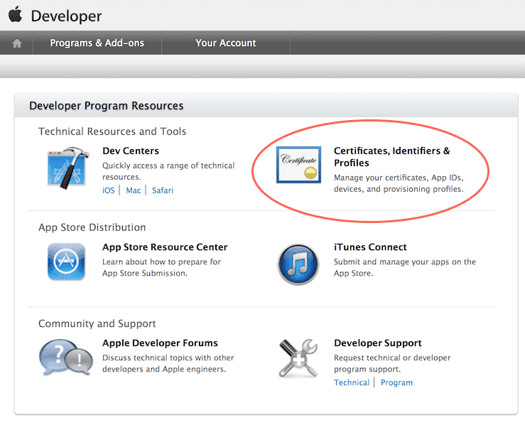

*Certificates, Identifiers & Profiles* 部分包含了所有所需工具. 在这里可以创建, 删除和编辑:

Certificates
: Apple 为开发者颁发的加密证书. 分为开发证书和发布证书两种. 开发证书用以在沙盒环境中测试某些功能比如应用内购. 发布证书是将应用发布到 App Store 时用的证书. 在设备上测试之前要用证书对应用进行签名.

Identifiers
: 应用id. 用于多个应用的通配符id (类似 `some.prefix.*`) 是允许的. 应用id也在集成某些服务时使用, 比如 Passbook, Game Center 之类的. 这种情况下不支持通配符id. 因为使用服务时 *bundle identifier* 必须与应用id一致.

Devices
: 用于开发的设备要注册 UDID (Unique Device IDentifier, 见下文).

Provisioning Profiles
: 提供商档案与应用id与开发设备的证书相关. 这样可以确保让谁的哪个应用可以运行于哪个设备上.

在 Defold 中给应用做签名时, 需要提供加密证书和提供商档案文件.

::: sidenote
Member Center 页面的一些功能在 Xcode 里也可以进行---前提是先安装好Xcode.
:::

Device identifier (UDID)
: iOS 设备的 UDID 可以通过wifi或者线路连接计算机查找. 打开 Xcode 选择 <kbd>Window ▸ Devices and Simulators</kbd>. 选中设备就会显示出序列号和UDID.

  

  如果没安装 Xcode也可以从 iTunes 里查看. 首先选中要查看的设备.

  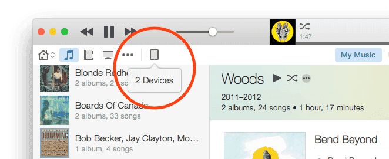

  1. 在 *Summary* 页, 可以找到 *Serial Number*.
  2. 点击 *Serial Number* 一次, 它会切换成 *UDID*. 再点击下去还会显示其他设备信息. 这里我们找到 *UDID* 即可.
  3. 右键点击 UDID 那一长串字符, 选择 <kbd>Copy</kbd> 即可将其存入剪贴板, 在 Apple 开发中心注册设备时就可以直接粘贴填入了.

## 使用免费账户开发应用

从 Xcode 7 开始, 所有人都被允许安装 Xcode 并且免费开发设备应用. 无需注册iOS开发者. Xcode 会为设备自动核发一个临时开发者证书 (有效期1年) 和一个临时应用提供商档案 (有效期1周).

1. 连接设备.
2. 安装 Xcode.
3. 在 Xcode 注册并登录 Apple ID.
4. 新建项目. 最简单的 "Single View App" 就好.
5. 选择 "Team" (自动生成) 并为app设置 bundle identifier.
6. 确保 Xcode 为app生成了 *Provisioning Profile* 和 *Signing Certificate*.

   

7. 编译并且在设备上运行. 首次运行, Xcode 会提示打开开发者模式并为调试做好准备. 可能要等待一会儿.
8. 确定应用正常运行后, 在硬盘上找到编译好的app. 可以在 "Report Navigator" 的编译报告里找到app位置.

   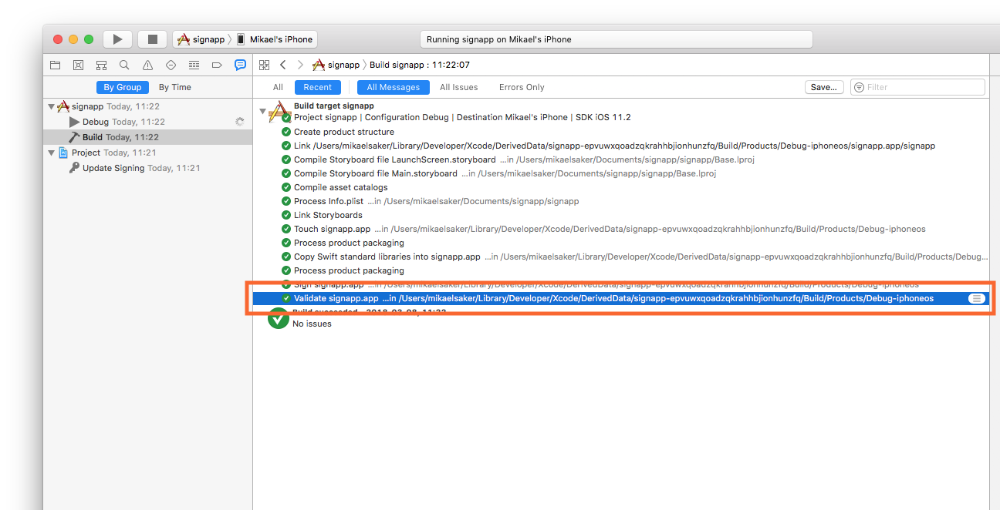

9. 找到app, 右键选择 <kbd>Show Package Contents</kbd>.

   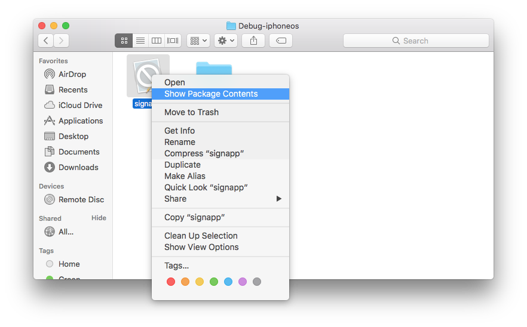

10. 把 "embedded.mobileprovision" 文件拷贝出来.

   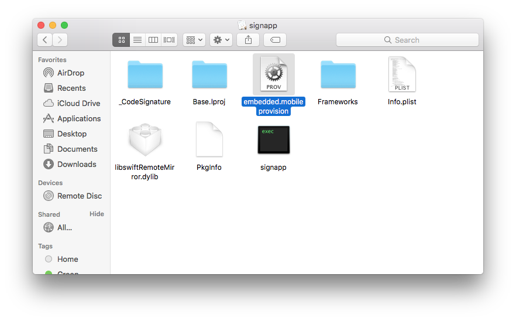

这个供应商档案文件连同加密证书可以在 Defold 为应用签名, 有效期为一周.

档案过期后, 可以在 Xcode 里如法炮制再次生成临时档案文件.

## iOS应用打包

如果你有加密证书和这个供应商档案文件, 就可以在编辑器里打包应用了. 从菜单中选择 <kbd>Project ▸ Bundle... ▸ iOS Application...</kbd>.

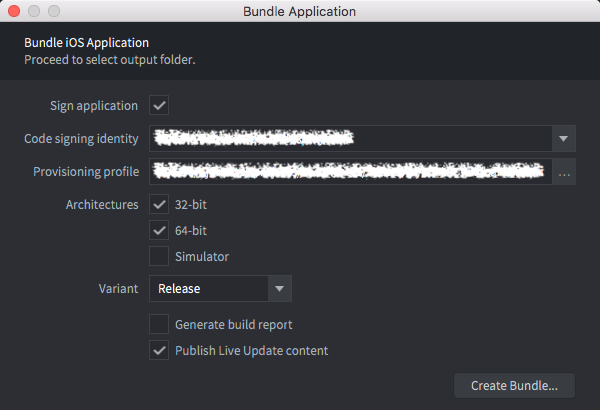

选择证书和档案. 设置架构 (32 bit, 64 bit 和 iOS 模拟器) 再选择打包模式 (Debug 或者 Release). 也可以取消选择 `Sign application` 跳过签名步骤留待后面完成.

::: sidenote
要在模拟器中测试游戏 **必须取消** `Sign application` 选项. 否则的话游戏能安装却不能运行.
:::

点击 *Create Bundle* 并选择打包应用存放位置.

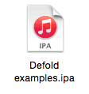{.left}

可以在 *game.project* 项目配置文件的 [iOS 部分](/manuals/project-settings/#iOS) 设置应用的图标, 启动屏幕 storyboard 等等.

### 创建 storyboard

使用 Xcode 创建 storyboard. 启动 Xcode 新建一个项目. 选择 iOS 和单视图应用:

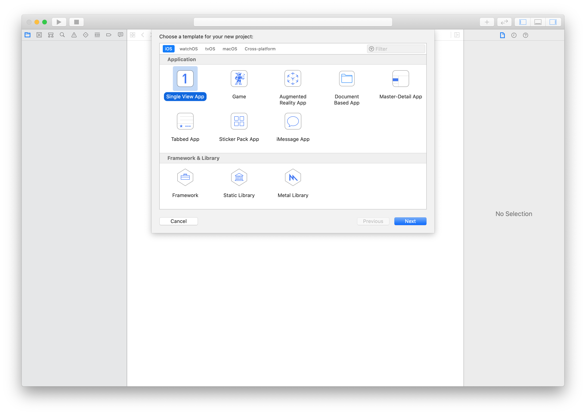

点击 Next 继续配置项目并输入名称:

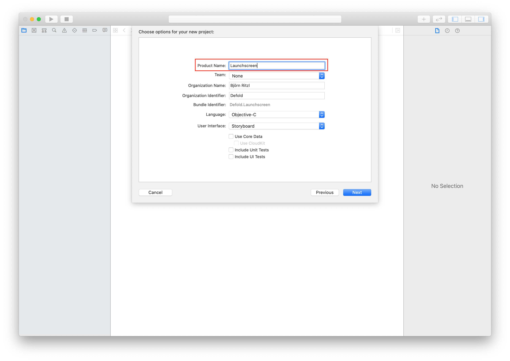

点击 Create 完成项目创建. 接下来就可以创建 storyboard 了:


把需要的图片拖入项目. 然后打开 `Assets.xcassets`, 再把图片拖放到 `Assets.xcassets` 中去:

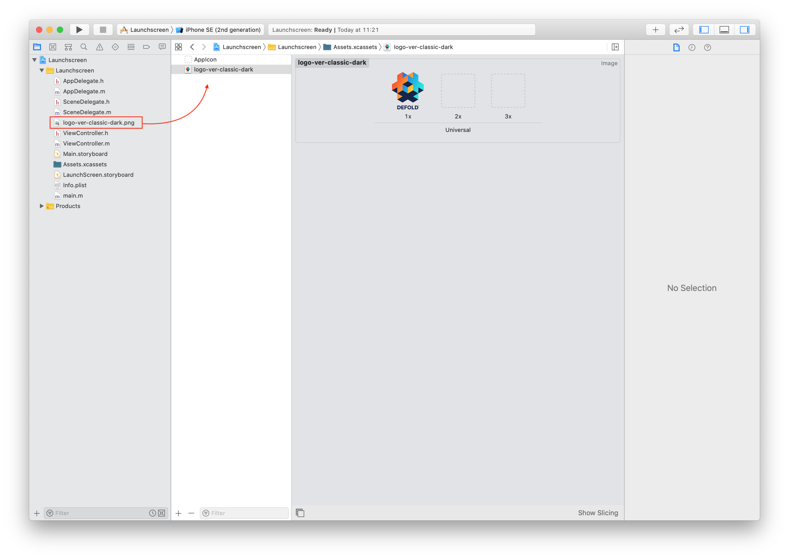

打开 `LaunchScreen.storyboard` 点击加号 (<kbd>+</kbd>) 按钮. 输入 "imageview" 找到 ImageView 控件.


把控件拖放到 storyboard 上:

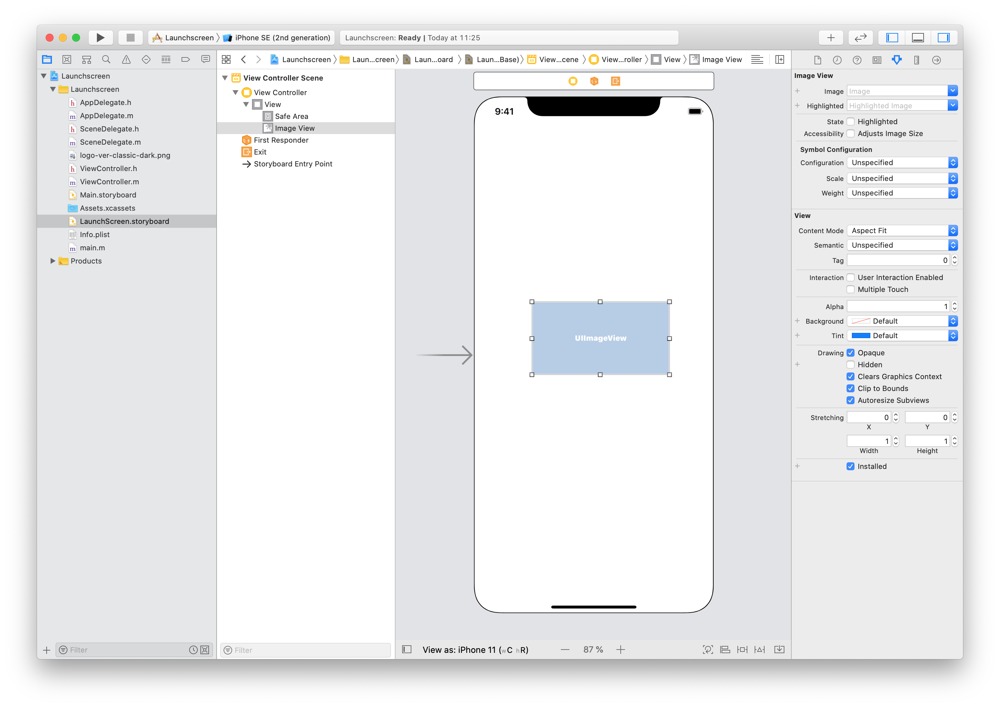

从下拉列表中选择刚才放入 `Assets.xcassets` 的图片:

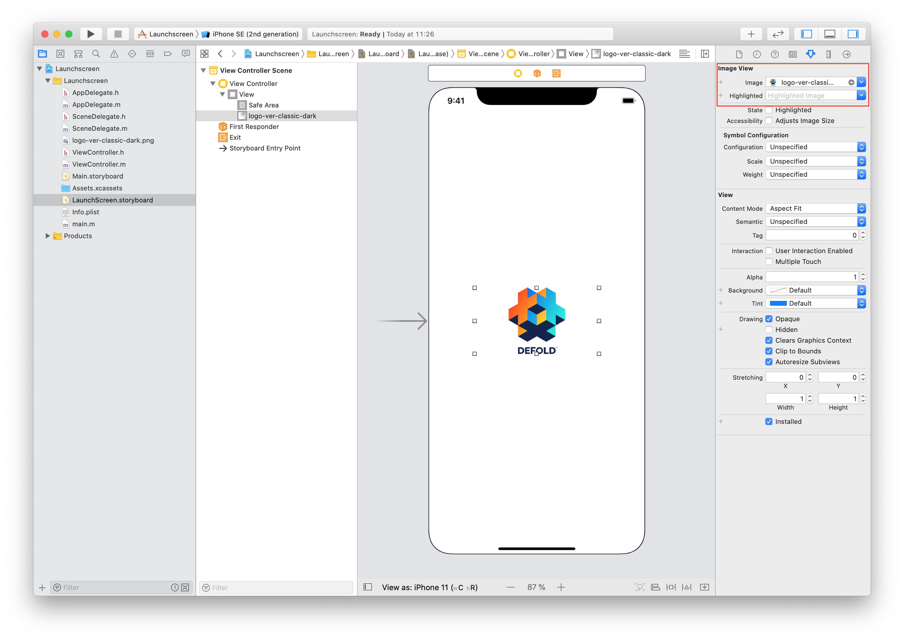

摆放好位置定义好组件, 比如可以加个标签什么的. 配置好之后选择 "Build -> Any iOS Device (arm64, armv7)"(或者 "Generic iOS Device") 然后 Product -> Build. 等待编译完成.

::: sidenote
如果你的 "Any iOS Device (arm64)" 里只有一个 `arm64` 选项, 则需要把 "Project -> Basic -> Deployment" 里的 `iOS Deployment target` 设置为 10.3. 这样你的 storyboard 才能支持 `armv7` 设备 (比如 iPhone5c)  
:::

在 storyboard 里使用的图片不会自动包含进 `LaunchScreen.storyboardc` 里. 要在 `game.project` 的 `Bundle Resources` 选项中配置需要包含的图片资源.
例如, 在 Defold 项目目录下有个 `LaunchScreen` 文件夹, 里面包含 `ios` 文件夹 (`ios` 文件夹下的文件只针对 ios 打包使用), 所以先要把资源文件放入 `LaunchScreen/ios/`. 然后配置 `Bundle Resources` 为此路径.


最后一步, 拷贝编译生成的 `LaunchScreen.storyboardc` 文件. 打开仿达, 把 `LaunchScreen.storyboardc` 文件粘贴到你的 Defold 项目目录:


    /Library/Developer/Xcode/DerivedData/YOUR-PRODUCT-NAME-cbqnwzfisotwygbybxohrhambkjy/Build/Intermediates.noindex/YOUR-PRODUCT-NAME.build/Debug-iphonesimulator/YOUR-PRODUCT-NAME.build/Base.lproj/LaunchScreen.storyboardc

::: sidenote
社区牛人 Sergey Lerg 已把上述步骤 [录成了视频](https://www.youtube.com/watch?v=6jU8wGp3OwA&feature=emb_logo) 供大家参考.
:::

得到 storyboard 文件之後就可以在 *game.project* 裏引用它了.


### 建立圖標資源列表

::: sidenote
從 Defold 1.2.175 版本開始需要這個設置.
:::

Apple 建議使用圖標資源列表來管理應用圖標. 這也是能讓你的圖標在 App Store 裏展示出來的唯一方法. 建立圖標資源表跟建立 storyboard 類似, 也要使用 Xcode. 啓動 Xcode 新建項目. 選擇 iOS and Single View App:


點擊 Next 進行設置操作. 輸入產品名:


點擊 Create 完成配置工作. 此時項目已經建立, 接著就可以繼續建立資源列表了:


依據圖標大小把圖片分別拖放到空白方框裏:


::: sidenote
Notifications, Settings 和 Spotlight 這三項不要拖放圖標.
:::

完成之后, 配置好之后选择 "Build -> Any iOS Device (arm64, armv7)"(或者 "Generic iOS Device") 然后 Product -> Build. 等待编译完成.

::: sidenote
确保编译目标为 "Any iOS Device (arm64)" 或者 "Generic iOS Device", 否则上传游戏时会报 `ERROR ITMS-90704` 错误.
:::


最後一步是將編譯好的 `Assets.car` 文件拷貝到你的 Defold 項目中去. 打開訪達依照如下路徑找到 `Assets.car` 文件, 將其複製到 Defold 項目中:

    /Library/Developer/Xcode/DerivedData/YOUR-PRODUCT-NAME-cbqnwzfisotwygbybxohrhambkjy/Build/Products/Debug-iphoneos/Icons.app/Assets.car

得到圖標資源列表文件之後就可以在 *game.project* 裏引用它和其中的圖標了:


::: sidenote
無需在 *game.project* 裏設置 App Store 的圖標. App 上傳到 iTunes Connect 時, 圖標會自動從 `Assets.car` 文件中選取並解壓出來.
:::


## 安装 iOS 打包应用

编辑器对iOS应用打包后生成 *.ipa* 文件. 要安装此文件, 可以使用以下所列举工具之一:

* Xcode 的 "Devices and Simulators" 窗口
* [ios-deploy](https://github.com/ios-control/ios-deploy) 命令行工具
* macOS App Store 里的 [Apple Configurator 2](https://apps.apple.com/us/app/apple-configurator-2/)
* iTunes

可以使用 `xcrun simctl` 命令行工具与 Xcode 的 iOS 模拟器进行交互:

```
# 显示可用设备列表
xcrun simctl list

# 启动 iPhone X 模拟器
xcrun simctl boot "iPhone X"

# 在模拟器上安装 your.app
xcrun simctl install booted your.app

# 启动模拟器
open /Applications/Xcode.app/Contents/Developer/Applications/Simulator.app
```


## 出口合规信息

将游戏上传到 App Store 时要提供加密部分的出口合规信息. [Apple 在此解释了这个需求的原因](https://developer.apple.com/documentation/security/complying_with_encryption_export_regulations):

"把应用往 TestFlight 或者 App Store 上传的时候, 你是把应用上传到了美国的服务器上. 一旦要把应用分发到美国或者加拿大之外的国家, 无论你的法人实体在哪里, 都必须遵守美国出口法案. 如果你的应用使用, 访问, 包含, 实现, 或者汇入了加密内容, 就会被视作加密软件出口, 这意味着你的应用必须符合美国出口法案的要求, 同时也要符合你的出口目的国家的法律需求."

相关文档:

* 出口合规概要 - https://help.apple.com/app-store-connect/#/dev88f5c7bf9
* 查看游戏是否符合出口规范 - https://help.apple.com/app-store-connect/#/dev63c95e436

Defold 引擎会对以下内容实施加密:

* 加密信道调用 (如 HTTPS 和 SSL)
* Lua 代码版权保护


## 常見問題
:[iOS FAQ](../shared/ios-faq.md)
