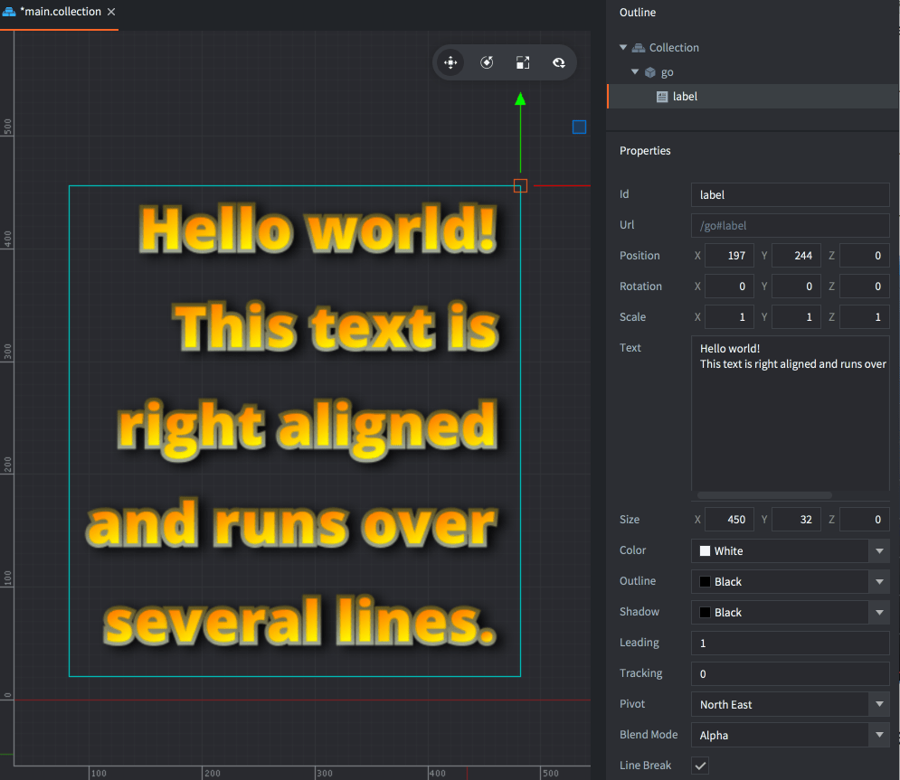

# Label

*Label* 组件能在游戏空间中渲染出一些文本. 默认连同 sprite 和瓷砖图一起排序和渲染. 组件的各种属性控制着文本如何被渲染. Defold 的 GUI 也能显示文本但是难以把它放在游戏世界里. Label 可以更容易做到这一点.

## 创建 label

要创建一个 Label 组件, 在游戏对象上 <kbd>右键点击</kbd> 选择 <kbd>Add Component ▸ Label</kbd>.

{srcset="images/label/add_label@2x.png 2x"}

(如果你希望从一个模板创建多个 label 可以: 在 *Assets* 浏览器里的文件夹上 <kbd>右键点击</kbd> 选择 <kbd>New... ▸ Label</kbd> 来创建Label文件, 然后再在任意游戏对象上把它作为组件添加上去)

{srcset="images/label/label@2x.png 2x"}

设置 *Font* 属性为需要使用的字体还要确定 *Material* 属性的设置与字体相匹配:

{srcset="images/label/font_material@2x.png 2x"}

## Label 属性

除了 *Id*, *Position*, *Rotation* 和 *Scale* 外还有一些特有属性:

*Text*
: label的文本.

*Size*
: 边界方块的大小. 如果 *Line Break* 设置了某值, 文本就会在相应宽度换行.

*Color*
: 文本的颜色.

*Outline*
: 描边的颜色.

*Shadow*
: 阴影的颜色.

::: 注意
默认材质出于性能原因关闭了阴影渲染.
:::

*Leading*
: 行间距倍数. 设置为 0 则没有行间距. 默认是 1.

*Tracking*
: 字间距倍数. 默认是 0.

*Pivot*
: 文本的锚点. 此值关系到文本对齐效果 (详见下文).

*Blend Mode*
: 此 label 渲染时使用的混合模式.

*Line Break*
: 文本对齐与锚点相关, 此属性可以让文本流动几行. 节点宽度决定文本在哪里换行.文本对齐与锚点相关, 此属性可以让文本溢出几行. 节点宽度决定文本在哪里换行. 注意文本换行处要留有空间.

*Font*
: 此 label 所使用的字体资源.

*Material*
: 用于渲染此 label 所使用的材质. 确保选中的材质是为你所使用的字体 (bitmap, distance field or BMFont) 创建的.

### 混合模式
*Blend Mode* 属性决定了 label 与其下层图像如何进行颜色混合. 计算时配置了如下算法:

Alpha
: 普通混合: a~0~ * rgb~0~ + (1 - a~0~) * rgb~1~

Add
: 使用 label 的像素值提亮背景: rgb~0~ + rgb~1~

Multiply
: 使用 label 的像素值调暗背景: rgb~0~ * rgb~1~

### 锚点和对齐

你可以通过设置锚点来改变文本的对齐方式.

*Center*
: 如果锚点设置成 `Center`, `North` 或者 `South`, 则文本居中对齐.

*Left*
: 如果锚点设置成任何 `West` 模式, 则文本左对齐.

*Right*
: 如果锚点设置成任何 `East` 模式, 则文本右对齐.

{srcset="images/label/align@2x.png 2x"}

## 运行时控制操作

你可以使用在运行时操控 labels 的文本以及其他一系列的值.

`color`
: label颜色 (`vector4`)

`outline`
: label描边颜色 (`vector4`)

`shadow`
: label阴影颜色 (`vector4`)

`scale`
: label缩放, 要么是 `number` 用于等比缩放, 要么是 `vector3` 分轴向缩放.

`size`
: label大小 (`vector3`)

```lua
function init(self)
    -- Set the text of the "my_label" component in the same game object
    -- as this script.
    label.set_text("#my_label", "New text")
end
```

```lua
function init(self)
    -- Set the color of the "my_label" component in the same game object
    -- as this script. Color is a RGBA value stored in a vector4.
    local grey = vmath.vector4(0.5, 0.5, 0.5, 1.0)
    go.set("#my_label", "color", grey)

    -- ...and remove the outline, by setting its alpha to 0...
    go.set("#my_label", "outline.w", 0)

    -- ...and scale it x2 along x axis.
    local scale_x = go.get("#my_label", "scale.x")
    go.set("#my_label", "scale.x", scale_x * 2)
end
```
