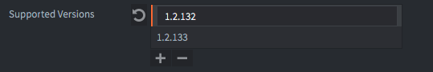
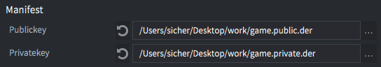
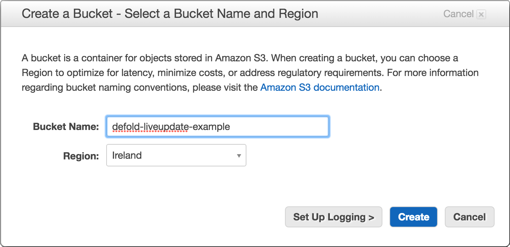
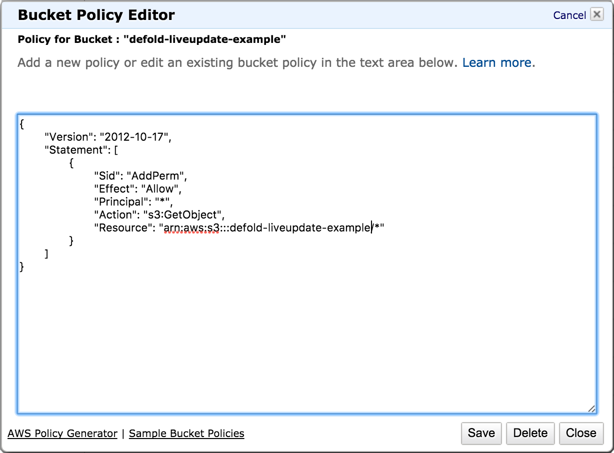
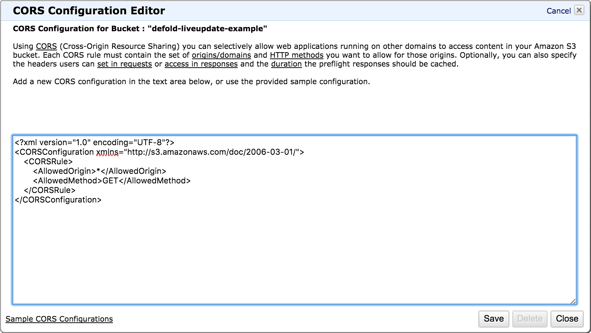

# 目前热更新机制正在升级, 本教程可能随时变化

# 热更新

打包游戏时, Defold 把所有游戏资源装进游戏包当中. 多数情况下这样做很好因为游戏运行时引擎要快速找到加载所需要的各种资源. 但是, 有一些情况下需要将资源加载推迟到后续阶段. 比如:

- 你的游戏设计了好几个章节但是只免费提供第一章节给玩家试玩以便让玩家决定是否购买游戏的后续章节.
- 你做了个 HTML5 游戏. 在浏览器里, 一个程序的所有内容全部加载完成这个程序才能运行. 可以用一个小程序让游戏先展示出来, 大量自由数据下载留到后面再说.
- 你的游戏包含大量资源数据 (图片, 视频之类的) 所以需要一种按需求的下载和加载机制. 这样就能保证游戏包不会太大.

热更新扩展了集合代理的概念允许引擎在运行时获取和存储未被打入游戏包的资源数据.

## 准备工作

假设我们有个很大的, 高分辨率的图片. 图片放在sprite里, sprite放在游戏对象里, 游戏对象放在集合里:


动态加载这个集合, 只需使用集合代理组件并将它指向 *monalisa.collection* 即可. 集合里的资源合适加载入内存取决于发给集合代理的 `load` 消息. 如果要进一步控制资源文件的话,

勾选集合代理属性 *Exclude* 即可, 打包时会把 *monalisa.collection* 的内容排除于包外.


## 热更新配置

游戏打包时需要知道把包外的资源保存在哪里了. 项目设置里的热更新配置明确了这个保存位置. 点击 <kbd>Project ▸ Live update Settings...</kbd> 来创建热更新配置文件. 在 `game.project` 里, 指定打包时所使用的热更新配置文件. 不同运行环境可以对于不同配置, 比如游戏环境, 测试环境, 开发环境等.


目前 Defold 支持两种包外资源的保存模式. 可以在设置窗口里的 *Mode* 下拉菜单中选择:

`Amazon`
: 让 Defold 自动把包外资源上传到 Amazon Web Service (AWS) S3 服务器上. 填写 AWS *凭证* 名, 选择合适的 *服务器* 在提供一个 *前缀* 名. [关于 AWS 账户注册请见下文](#setting_up_amazon_web_service).

`Zip`
: 让 Defold 把包外资源打成 zip 包. 并且在配置里 *Export path* 项指定存放路径.


## 热更新脚本

热更新集合代理和普通集合代理差不多, 只是有一个重要区别. 如果在资源还没下载好的时候发送 `load` 消息的话就会导致失败报错.

所以发送 `load` 之前, 一定要确保资源的完整性. 把完整的资源下载并保存好. 一下代码假设资源保存在 Amazon S3, 一个叫做 "my-game-bucket" 的服务器上, 前缀为 `my-resources`.

```lua
function init(self)
    self.resources_pending = 0 -- <1>
    msg.post("#", "attempt_load_resources")
end

-- 下载热更新用到的包外资源进行本地保存时会调用此函数
local function resource_store_response(self, hexdigest, status)
    if status == true then
        -- 加载成功
        print("Resource data stored: " .. hexdigest)

        -- 还差一个资源
        self.resources_pending = self.resources_pending - 1

        -- 全部保存好了, 可以开始加载了
        if self.resources_pending == 0 then
            msg.post("#proxy", "load") -- <8>
        end
    else
        -- 错误! 资源数据保存失败.
        print("Failed to store resource data: " .. hexdigest)
    end
end

function on_message(self, message_id, message, sender)
    if message_id == hash("attempt_load_resources") then
        local missing_resources = collectionproxy.missing_resources("#proxy") -- <2>

        -- 为缺失的而且没被尝试下载过的资源初始化下载请求.
        for _,resource_hash in ipairs(missing_resources) do
            msg.post("#", "attempt_download", { resource_hash = resource_hash})
        end

        self.resources_pending = #missing_resources -- <3>

        -- 如果游戏是从编辑器运行的, 那么全部资源都存在本地.
        if self.resources_pending == 0 then
            msg.post("#proxy", "load")
        end
    elseif message_id == hash("attempt_download") then
        local manifest = resource.get_current_manifest() -- <4>
        local base_url = "https://my-game-bucket.s3.amazonaws.com/my-resources/" -- <5>
        http.request(base_url .. message.resource_hash, "GET", function(self, id, response)
            if response.status == 200 or response.status == 304 then -- <6>
                -- 得到ok响应.
                print("storing " .. message.resource_hash)
                resource.store_resource(manifest, response.response, message.resource_hash, resource_store_response) -- <7>
            else
                -- 错误! 资源下载失败.
                print("Failed to download resource: " .. message.resource_hash)
            end
        end)
    elseif message_id == hash("proxy_loaded") then
        msg.post(sender, "init")
        msg.post(sender, "enable")
    end
end
```
1. 一个计数器记录了还剩多少资源需要下载保存. 注意此处未做错误处理, 产品级游戏要跟踪好下载和保存的各种情况.
2. 得到需要下载保存的资源.
3. 计数器更新.
4. 资源需求清单.
5. 本例中资源保存于 Amazon S3. 如果使用zip包保存资源, 需要调用 `http.request()` 连同资源托管地址进行下载.
6. 文件缓存好之后 Amazon 返回状态 304.
7. 下载完成, 开始保存.
8. 保存成功, 资源计数器清零. 此时可以放心发送 "load" 消息给集合代理. 注意如果下载保存任何地方出错, 计数器都不会清零.

一切准备就绪, 我们可以尝试启动这个程序. 但是从编辑器运行并不会下载任何东西. 因为热更新是游戏包的功能. 编辑器运行时游戏未打包. 所以, 要测试热更新必须先给游戏打包.

## 热更新应用打包

打包很简单. 选择 <kbd>Project ▸ Bundle ▸ ...</kbd> 然后选择目标平台. 此时会弹出对话框:


打包时, 指定资源被排除在包外. 勾选 *Publish Live update content*, 来让 Defold 把包外资源自动上传给 Amazon 或者打成zip包, 取决于热更新配置 (见上文). 资源清单也会被生成出来.

点击 *Package* 然后指定保存位置. 打包好之后就能测试热更新功能了.

## 清单文件

清单是一种内部数据结构用来保存编译所需的所有资源列表连同每个资源的哈希值. 热更新使用清单来确定哪些资源是游戏的一部分, 哪些资源不在本地需要下载, 还要确定下载的资源是否完整.

从用户角度来看, 清单是一个数字句柄, 将如何管理资源的细节留给引擎去做.

## 清单更新

每次热更新都会在本地保存一份更新的清单. 应用启动时会使用最新的清单代替包内的清单. 这对于游戏后续通过热更新来修改增添资源很重要, 尤其是第一版游戏打包时并不知道的资源.

当把资源上传到 Amazon 服务器或打包成zip资源包的时候, 清单也会被加入到那些资源当中. 名称为 `liveupdate.game.dmanifest`.

保存清单后首次启动引擎时会生成一个游戏包版本文件 `bundle.ver`. 用来判断保存清单之后游戏有无改动, 比如说一次完整的 app store 更新. 如果是这样的话清单将从文件系统中删除并使用更新版本游戏包中的清单代替. 也就是说完整 app store 更新会清除上次保存的清单. 而通过热更新下载到本地的资源不被清除.

### Manifest verification
When storing a new manifest the manifest data will be verified before it is actually written to disk. The verification consists of a number of checks:

* Correct binary file format.
* Supports the currently running engine version or any other supported version entry from the settings.
* Cryptographic signature.
* Signed using the same public-private key pair as the bundled manifest.
* Verify that all resources the manifest expects to be in the bundle actually are in the bundle.

From the user's perspective the verification process is completely opaque but it is important to note the steps involved to avoid the most common pitfalls.

::: important
If you see a "ERROR:RESOURCE: Byte mismatch in decrypted manifest signature. Different keys used for signing?" error in the console on HTML5 builds it is likely that your webserver doesn't serve the excluded content or updated manifest file using the correct MIME type. Make sure the MIME type is `application/octet-stream`. You can add a `.htaccess` file with a single `AddType application/octet-stream .` line to the folder where the live update resources are downloaded from.
:::

### Supported engine versions
A manifest will always support the Defold version used when generating it. If you want to support any additional engine versions, add them to the list in the Live update settings. This can be useful if your live game uses a different Defold version than the one you are using to generate the manifest with.



### Generating keys for signing
The manifest signature is used to verify that no one with malicious intent has tampered with the content, and that the bundled manifest and the new manifest were signed using the same keys. The signing is done as a part of the bundling process.
A public/private key pair is used to cryptographically sign the manifest. Signing uses 512/1024/2048-bit RSA keys in `.der`-format that the user needs to supply. You can generate these using the `openssl` tool:

```sh
$ openssl genrsa -out private_raw.key 1024
$ openssl pkcs8 -topk8 -inform pem -in private_raw.key -outform der -nocrypt -out private.der
$ openssl rsa -in private_raw.key -outform DER -RSAPublicKey_out -pubout -out public.der
```
This will output `private_raw.key` (can be safely deleted), `private.der`, and `public.der`. To use the keys for signing open the Live update settings view and point respective fields to the generated keys.



### Scripting with Live update manifest
Adding to the scripting example above, we add the following callback function

```lua
local function store_manifest_cb(self, status)
    if status == resource.LIVEUPDATE_OK then
        print("Successfully stored manifest!")
    else
        print("Failed to store manifest, status: ", status)
    end
end
```

and the following to ```on_message``` to handle message ```attempt_download_manifest```:

```lua
...
elseif message_id == hash("attempt_download_manifest") then
    local base_url = "https://my-game-bucket.s3.amazonaws.com/my-resources/" -- <1>
    http.request(base_url .. MANIFEST_FILENAME, "GET", function(self, id, response)
        if response.status == 200 or response.status == 304 then
            -- We got the response ok.
            print("verifying and storing manifest " .. MANIFEST_FILENAME)
            resource.store_manifest(response.response, store_manifest_cb) -- <2>
        else
            -- ERROR! Failed to download manifest!
            print("Failed to download manifest: " .. MANIFEST_FILENAME)
        end
    end)
end
```
1. The manifest will be stored on S3 next to the rest of the Live update resources. As before, if you create a Zip archive with resources you need to host the files somewhere and reference their location when downloading them with `http.request()`.
2. Similar to how resources are downloaded and stored, the call to `resource.store_manifest` takes the downloaded manifest data and a callback as arguments. The function will verify the manifest and persist it to local storage.

If `resource.store_manifest` succeeds, the new manifest is now located in local storage. The next time the engine starts this manifest will be used instead of the one bundled with the game.

### Caveats
There are a few gotchas that might be good to know if you plan to use this feature to store a new manifest with Live update.

* It is only possible to add or modify resources referenced by collection proxies that are tagged as `Exclude` in the new manifest. No changes should be made to already bundled resources or resources not in excluded collection proxies. For example, doing changes in a script that is referenced by a bundled collection will cause the resource system to look for that resource in the bundled data archive. But since the shipped game bundle has not changed (only the manifest has) the changed script will not be found and consequently cannot be loaded.

* Even though this feature allows you to quickly push bug fixes or new features to a live game without doing a full app store release, it should be used with care. Pushing out a new manifest should involve the same processes as when doing a full release with everything that that entails (testing, QA, etc.).

## Setting up Amazon Web Service

To use the Defold Live update feature together with Amazon services you need an Amazon Web Services account. If you don't already have an account you can create one here https://aws.amazon.com/.

This section will explain how to create a new user with limited access on Amazon Web Services that can be used together with the Defold editor to automatically upload Live update resources when you bundle your game, as well as how to configure Amazon S3 to allow game clients to retrieve resources. For additional information about how you can configure Amazon S3, please see the [Amazon S3 documentation](http://docs.aws.amazon.com/AmazonS3/latest/dev/Welcome.html).

1. Create a bucket for Live update resources

    Open up the `Services` menu and select `S3` which is located under the _Storage_ category ([Amazon S3 Console](https://console.aws.amazon.com/s3)). You will see all your existing buckets together with the option to create a new bucket. Though it is possible to use an existing bucket, we recommend that you create a new bucket for Live update resources so that you can easily restrict access.

    

2. Add a bucket policy to your bucket

    Select the bucket you wish to use, open the *Properties* panel and expand the *Permissions* option within the panel. Open up the bucket policy by clicking on the *Add bucket policy* button. The bucket policy in this example will allow an anonymous user to retrieve files from the bucket, which will allow a game client to download the Live update resources that are required by the game. For additional information about bucket policies, please see [the Amazon documentation](https://docs.aws.amazon.com/AmazonS3/latest/dev/using-iam-policies.html).

    ```json
    {
        "Version": "2012-10-17",
        "Statement": [
            {
                "Sid": "AddPerm",
                "Effect": "Allow",
                "Principal": "*",
                "Action": "s3:GetObject",
                "Resource": "arn:aws:s3:::defold-liveupdate-example/*"
            }
        ]
    }
    ```

    

3. Add a CORS configuration to your bucket (Optional)

    [Cross-Origin Resource Sharing (CORS)](https://en.wikipedia.org/wiki/Cross-origin_resource_sharing) is a mechanism that allows a website to retrieve a resource from a different domain using JavaScript. If you intend to publish your game as an HTML5 client, you will need to add a CORS configuration to your bucket.

    Select the bucket you wish to use, open the *Properties* panel and expand the *Permissions* option within the panel. Open up the bucket policy by clicking on the *Add CORS Configuration* button. The configuration in this example will allow access from any website by specifying a wildcard domain, though it is possible to restrict this access further if you know on which domains you will make you game available. For additional information about Amazon CORS configuration, please see [the Amazon documentation](https://docs.aws.amazon.com/AmazonS3/latest/dev/cors.html).

    ```xml
    <?xml version="1.0" encoding="UTF-8"?>
    <CORSConfiguration xmlns="http://s3.amazonaws.com/doc/2006-03-01/">
        <CORSRule>
            <AllowedOrigin>*</AllowedOrigin>
            <AllowedMethod>GET</AllowedMethod>
        </CORSRule>
    </CORSConfiguration>
    ```

    

4. Create IAM policy

    Open up the *Services* menu and select *IAM* which is located under the _Security, Identity & Compliance_ category ([Amazon IAM Console](https://console.aws.amazon.com/iam)). Select *Policies* in the menu to the left and you will see all your existing policies together with the option to create a new policy.

    Click the button *Create Policy*, and then choose to _Create Your Own Policy_. The policy in this example will allow a user to list all buckets, which is only required when configuring a Defold project for Live update. It will also allow the user to get the Access Control List (ACL) and upload resources to the specific bucket used for Live update resources. For additional information about Amazon Identity and Access Management (IAM), please see [the Amazon documentation](http://docs.aws.amazon.com/IAM/latest/UserGuide/access.html).

    ```json
    {
        "Version": "2012-10-17",
        "Statement": [
            {
                "Effect": "Allow",
                "Action": [
                    "s3:ListAllMyBuckets"
                ],
                "Resource": "arn:aws:s3:::*"
            },
            {
                "Effect": "Allow",
                "Action": [
                    "s3:GetBucketAcl"
                ],
                "Resource": "arn:aws:s3:::defold-liveupdate-example"
            },
            {
                "Effect": "Allow",
                "Action": [
                    "s3:PutObject"
                ],
                "Resource": "arn:aws:s3:::defold-liveupdate-example/*"
            }
        ]
    }
    ```

    

5. Create a user for programmatic access

    Open up the *Services* menu and select *IAM* which is located under the _Security, Identity & Compliance_ category ([Amazon IAM Console](https://console.aws.amazon.com/iam)). Select *Users* in the menu to the left and you will see all your existing users together with the option to add a new user. Though it is possible to use an existing user, we recommend that you add a new user for Live update resources so that you can easily restrict access.

    Click the button *Add User*, provide a username and choose *Programmatic access* as *Access type*, then press *Next: Permissions*. Select *Attach existing policies directly* and choose the policy you created in step 4.

    When you've completed the process you will be provided with an *Access key ID* and a *Secret access key*.

    ::: important
    It is *very important* that you store those keys since you will not be able to retrieve them from Amazon after you leave the page.
    :::

6. Create a credentials profile file

    At this point you should have created a bucket, configured a bucket policy, added a CORS configuration, created a user policy and created a new user. The only thing that remains is to create a [credentials profile file](https://aws.amazon.com/blogs/security/a-new-and-standardized-way-to-manage-credentials-in-the-aws-sdks) so that the Defold editor can access the bucket on your behalf.

    Create a new directory *.aws* in your home folder, and create a file called *credentials* within the new directory.

    ```bash
    $ mkdir ~/.aws
    $ touch ~/.aws/credentials
    ```

    The file *~/.aws/credentials* will contain your credentials to access Amazon Web Services through programmatic access and is a standardised way to manage AWS credentials. Open the file in a text editor and enter your *Access key ID* and *Secret access key* in the format shown below.

    ```ini
    [defold-liveupdate-example]
    aws_access_key_id = <Access key ID>
    aws_secret_access_key = <Secret access key>
    ```

    The identifier specified within the brackets, in this example _defold-liveupdate-example_, is the same identifier that you should provide when configuring your project's Live update settings in the Defold editor.

    

## Development caveats

Debugging
: When running a bundled version of your game, you don't have direct access to a console. This causes problems for debugging. However, you can run the application from the command line or by double clicking the executable in the bundle directly:

  

  Now the game starts with a shell window that will output any `print()` statements:

  

Forcing re-download of resources
: When an application stores resources, they end up on disk on the local computer or handheld device. If you restart the application, the resources are there and ready. When developing you might want to remove resources and force the application to download them again.

  Defold creates a folder with the name of the hash of the created bundle on the device in the application support folder. If you delete the files in this folder, the application will invalidate the resources from the manifest and you can download and store them again.

  

  The location of the application support folder depends on the operating system. It can be found with `print(sys.get_save_file("", ""))`.