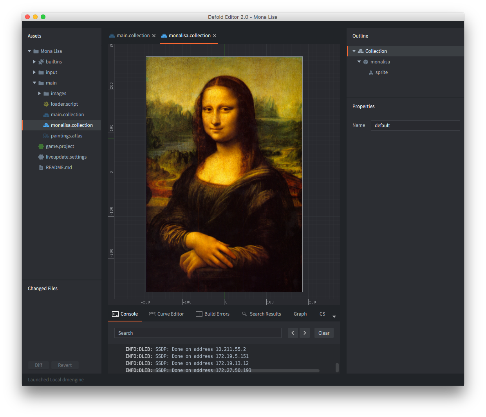
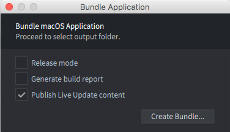

# Live Update

当打包游戏时，Defold 将所有游戏资源打包到生成的平台特定包中。在大多数情况下，这是首选的，因为运行中的引擎可以即时访问所有资源，并可以从存储中快速加载它们。然而，在某些情况下，您可能希望将资源的加载推迟到稍后阶段。例如：

- 您的游戏包含一系列章节，您希望只包含第一章供玩家试用，然后再决定是否要继续游戏的其余部分。
- 您的游戏针对 HTML5。在浏览器上，从存储中加载应用程序意味着整个应用程序包必须在启动前下载完毕。在这样的平台上，您可能希望发送一个最小的启动包，并在下载其余游戏资源之前让应用程序快速启动并运行。
- 您的游戏包含非常大的资源（图像、视频等），您希望推迟它们的下载，直到它们即将在游戏中显示。这是为了保持安装大小较小。

Live Update 功能扩展了集合代理的概念，提供了一种机制，允许运行时获取和存储在构建时有意排除在应用程序包之外的资源。

它允许您将内容分割成多个归档文件：

* _基础归档文件_
* 关卡公共文件
* 关卡包 1
* 关卡包 2
* ...

## 准备 Live Update 内容

假设我们正在制作一个包含大型、高分辨率图像资源的游戏。游戏将这些图像保存在包含游戏对象和带有图像的精灵的集合中：



要让引擎动态加载这样的集合，我们可以简单地添加一个集合代理组件并将其指向 *`monalisa.collection`*。现在游戏可以通过向集合代理发送 `load` 消息来选择何时将集合中的内容从存储加载到内存中。然而，我们希望更进一步，自己控制集合中包含的资源的加载。

这只需在集合代理属性中勾选 *排除* 复选框，告诉 Defold 在创建应用程序包时将 *`monalisa.collection`* 中的任何内容排除在外。

::: important
基础游戏包引用的任何资源都不会被排除。
:::


## Live Update 设置

当 Defold 创建应用程序包时，它需要将任何排除的资源存储在某处。Live Update 的项目设置控制这些资源的位置。这些设置可以在 <kbd>Project ▸ Live update Settings...</kbd> 下找到。这将创建一个设置文件（如果尚不存在）。在 *game.project* 中，选择打包时使用的 live-update 设置文件。这允许为不同的环境使用不同的 live-update 设置，例如生产环境、QA、开发环境等。


目前 Defold 有两种方式可以存储资源。在设置窗口的 *模式* 下拉菜单中选择方法：

`Zip`
: 此选项告诉 Defold 创建一个包含任何排除资源的 Zip 归档文件。归档文件保存在 *导出路径* 设置中指定的位置。

`Folder`  
: 此选项告诉 Defold 创建一个包含所有排除资源的文件夹。它的工作方式与 Zip 完全相同，但使用目录而不是归档文件。这在您需要在上传前对文件进行后处理并计划自己将它们打包成归档文件的情况下可能很有用。

`Amazon`
: 此选项告诉 Defold 自动将排除的资源上传到 Amazon Web Service (AWS) S3 存储桶。填写您的 AWS *凭证配置文件* 名称，选择适当的 *存储桶* 并提供 *前缀* 名称。您可以在此 [aws 指南](/manuals/live-update-aws) 中阅读有关如何设置 AWS 账户的更多信息。

## 使用 Live Update 进行打包

::: important
从编辑器构建和运行（<kbd>Project ▸ Build</kbd>）不支持 Live Update。为了测试 Live Update，您需要打包项目。
:::

使用 Live Update 进行打包很容易。选择 <kbd>Project ▸ Bundle ▸ ...</kbd>，然后选择您要为其创建应用程序包的平台。这将打开打包对话框：



打包时，任何排除的资源都将被排除在应用程序包之外。通过勾选 *发布 Live update 内容* 复选框，您告诉 Defold 根据您设置 Live Update 设置的方式（见上文）将排除的资源上传到 Amazon 或创建 Zip 归档文件。包的清单文件也将包含在排除的资源中。

点击 *打包* 并选择应用程序包的位置。现在您可以启动应用程序并检查一切是否按预期工作。

## .zip 归档文件

live update .zip 文件包含从基础游戏包中排除的文件。

虽然我们当前的流水线只支持创建单个 .zip 文件，但实际上可以将该 zip 文件拆分为更小的 .zip 文件。这允许游戏的下载量更小：关卡包、季节性内容等。每个 .zip 文件还包含一个清单文件，描述 .zip 文件中包含的每个资源的元数据。

## 拆分 .zip 归档文件

通常希望将被排除的内容拆分为几个较小的归档文件，以便更精细地控制资源使用。一个这样的例子是将基于关卡的游戏拆分为多个关卡包。另一个是将不同节日主题的 UI 装饰放入单独的归档文件中，并仅加载和挂载日历中当前活动的主题。

资源图存储在 `build/default/game.graph.json` 中，每次项目打包时都会自动生成。生成的文件包含项目中所有资源的列表以及每个资源的依赖关系。示例条目：

```json
{
  "path" : "/game/player.goc",
  "hexDigest" : "caa342ec99794de45b63735b203e83ba60d7e5a1",
  "children" : [ "/game/ship.spritec", "/game/player.scriptc" ]
}
```

每个条目都有一个 `path`，表示项目中资源的唯一路径。`hexDigest` 表示资源的加密指纹，它将是 liveupdate .zip 归档文件中使用的文件名。最后，`children` 字段是此资源依赖的其他依赖项的列表。在上面的示例中，`/game/player.goc` 依赖于精灵和脚本组件。

您可以解析 `game.graph.json` 文件并使用此信息来识别资源图中的条目组，并将其相应的资源与原始清单文件一起存储在单独的归档文件中（清单文件将在运行时进行修剪，以便它仅包含归档文件中的文件）。

## 内容验证

live update 系统的主要特性之一是您现在可以使用许多内容归档文件，可能来自许多不同的 Defold 版本。

`liveupdate.add_mount()` 的默认行为是在附加挂载点时添加引擎版本检查。
这意味着游戏基础归档文件和 live update 归档文件需要同时使用相同的引擎版本创建，使用打包选项。这将使客户端以前下载的任何归档文件无效，强制它们重新下载内容。

此行为可以通过选项标志关闭。
关闭时，内容验证责任完全由开发者承担，以保证每个 live update 归档文件都能在运行的引擎上工作。

我们建议为每个挂载点存储一些元数据，以便 _在启动时_，开发者可以决定是否应该删除挂载点/归档文件。
一种方法是在游戏打包后向 zip 归档文件添加一个额外的文件。例如，通过插入一个 `metadata.json`，其中包含游戏所需的任何相关信息。然后，在启动时，游戏可以使用 `sys.load_resource("/metadata.json")` 检索它。_请注意，您需要为每个挂载点的自定义数据使用唯一的名称，否则挂载点将为您提供具有最高优先级的文件_

如果不这样做，您最终可能会面临内容与引擎完全不兼容的情况，迫使其退出。

## 挂载点

live update 系统可以同时使用多个内容归档文件。
每个归档文件都"挂载"到引擎的资源系统，带有名称和优先级。

如果两个归档文件都有相同的文件 `sprite.texturec`，引擎将从具有最高优先级的挂载点加载文件。

引擎不保留对挂载点中任何资源的引用。一旦资源加载到内存中，归档文件可能会被卸载。资源将保留在内存中，直到它们被卸载。

挂载点在引擎重启时会自动重新添加。

::: sidenote
挂载归档文件不会复制或移动归档文件。引擎只存储归档文件的路径。因此，开发者可以随时删除归档文件，挂载点也将在下次启动时被删除。
:::

## 使用 Live Update 进行脚本编写

要实际使用 live update 内容，您需要将数据下载并挂载到您的游戏中。
阅读更多关于[如何使用 live update 进行脚本编写的内容](/manuals/live-update-scripting)。

## 开发注意事项

调试
: 当运行游戏的打包版本时，您没有直接访问控制台的权限。这会导致调试问题。但是，您可以从命令行运行应用程序，或者通过双击包中的可执行文件直接运行：

  

  现在游戏启动时带有一个 shell 窗口，将输出任何 `print()` 语句：

  

强制重新下载资源
: 开发者可以将内容下载到他们希望的任何文件/文件夹，但它们通常位于应用程序路径下。应用程序支持文件夹的位置取决于操作系统。可以使用 `print(sys.get_save_file("", ""))` 找到它。

  文件 liveupdate.mounts 位于"本地存储"下，其路径在启动时输出到控制台"INFO:LIVEUPDATE: Live update folder located at: ..."

  
