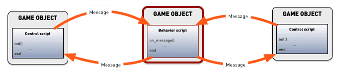
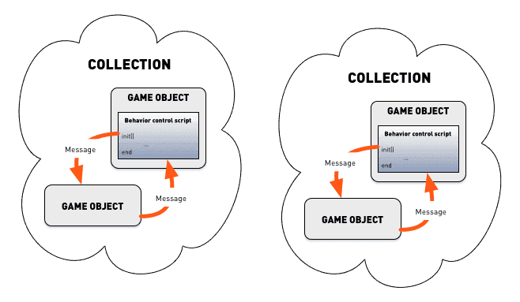

# Defold 中的 Lua

Defold 引擎嵌入了 Lua 语言用以编写脚本. Lua 是一种轻量级脚本语言, 不但功能强大, 而且速度块, 易于嵌入. 它被广泛运用于游戏脚本编程. Lua 程序是简单过程语法. 脚本动态地输入并且运行于字节码解释器上. 它包含了自动内存管理和垃圾处理功能.

本教程简要介绍 Lua 编程的基本知识以及 Defold 中使用 Lua 的注意事项. 如果你有 Python, Perl, Ruby, Javascript 或者其他类似动态语言的使用经验就会非常容易上手. 如果你是编程新手可以先学习一本 Lua 入门书. 市面上这样的书有很多.

## Lua 版本
我们力争让 Defold 在各个平台表现一致, 但是不同平台对于 Lua 版本使用略有不同. 对 HTML5 和 iOS 64 bit 平台我们使用 Lua 5.1 对其他平台我们使用 LuaJIT. LuaJIT 基于 5.1 还包含了一些特有功能.

::: 注意
要真正做到跨所有平台建议只使用 Lua 5.1 功能.
:::

Defold 包含所有 [Lua 5.1 标准库](http://www.lua.org/manual/5.1/manual.html#5) 连同 socket 和少量操作系统功能库:

  - base (`assert()`, `error()`, `print()`, `ipairs()`, `require()` 等等)
  - coroutine
  - package
  - string
  - table
  - math
  - io
  - os
  - debug
  - socket (参考 [LuaSocket](https://github.com/diegonehab/luasocket))
  - bitop (参考 [BitOp](http://bitop.luajit.org/api.html))

所有库的用法都可以在 [API 文档](/ref/go) 中找到.

## Lua 书籍和资源

### 在綫資源

* [Programming in Lua (first edition)](http://www.lua.org/pil/contents.html) 已有第二版.
* [Lua 5.1 reference manual](http://www.lua.org/manual/5.1/)
* [Learn Lua in 15 Minutes](http://tylerneylon.com/a/learn-lua/)
* [Awesome Lua - tutorial section](https://github.com/LewisJEllis/awesome-lua#tutorials)

### 書籍
* [Programming in Lua](https://www.amazon.com/gp/product/8590379868/ref=dbs_a_def_rwt_hsch_vapi_taft_p1_i0) - Lua 官方教材, 可以爲開發者打下堅實的 Lua 語言基礎. 作者 Roberto Ierusalimschy, 是此語言的主架構師.
* [Lua programming gems](https://www.amazon.com/Programming-Gems-Luiz-Henrique-Figueiredo/dp/8590379841) - 這裏的文章給開發 Lua 程序提供了許多小技巧.
* [Lua 5.1 reference manual](https://www.amazon.com/gp/product/8590379833/ref=dbs_a_def_rwt_hsch_vapi_taft_p1_i4) - 同時具有在綫資源 (見上文)
* [Beginning Lua Programming](https://www.amazon.com/Beginning-Lua-Programming-Kurt-Jung/dp/0470069171)

## 语法

程序拥有简单易读的语法. 语句每行一句后面不需要结尾符. 也可以使用分号 `;` 作为语句结尾. 关键字界定代码块, 以 `end` 关键字作为结尾. 注释可以是块注释也可以是行注释:

```lua
--[[
这里是块注释
可以占用好几行.
--]]

a = 10
b = 20 ; c = 30 -- 一行定义俩变量

if my_variable == 3 then
    call_some_function(true) -- 这是一个行注释
else
    call_another_function(false)
end
```

## 变量和数据类型

Lua 是动态类型语言也就是说变量没有固定类型, 但是值有类型. 不像固定类型语言, 可以给变量规定一个类型. Lua 里有8种值类型:

`nil`
: 此类型只有一个值 `nil`. 通常用来表达找不到值, 比如合法值未指派.

  ```lua
  print(my_var) -- 输出 'nil' 因为 'my_var' 还没赋值
  ```

boolean
: 此类型有两个值 `true` 或者 `false`. `false` 或 `nil` 都表示逻辑假. 其他值都表示逻辑真.

  ```lua
  flag = true
  if flag then
      print("flag is true")
  else
      print("flag is false")
  end

  if my_var then
      print("my_var is not nil nor false!")
  end

  if not my_var then
      print("my_var is either nil or false!")
  end
  ```

number
: 在内部数字要么是 64 字位 _整数_ 要么是 64 字位 _浮点数_ . Lua 需要时会自动转换这两种类型所以一般不必关心转换问题.

  ```lua
  print(10) --> 输出 '10'
  print(10.0) --> '10'
  print(10.000000000001) --> '10.000000000001'

  a = 5 -- 整数
  b = 7/3 -- 浮点数
  print(a - b) --> '2.6666666666667'
  ```

string
: 字符串是由 8 比特值组成的字节串, 包含嵌入0 (`\0`). Lua 字符串内部不再细分类型所以可以存储任何数据. 字符串由单引号或者双引号分隔. Lua 会在运行时根据需要自动转换字符串与数字值. 字符串可以使用 `..` 操作符进行连接.

  字符串支持以下类C语言转义字符:

  | 序列 | 含义 |
  | -------- | --------- |
  | `\a`     | 响铃       |
  | `\b`     | 退格 |
  | `\f`     | 表格填充  |
  | `\n`     | 下一行    |
  | `\r`     | 回车 |
  | `\t`     | 水平制表符 |
  | `\v`     | 垂直制表符   |
  | `\\`     | 反斜杠      |
  | `\"`     | 双引号   |
  | `\'`     | 单引号   |
  | `\[`     | 左中括号    |
  | `\]`     | 右中括号   |
  | `\ddd`   | 数字占位符, 其中 ddd 表示3个 _浮点_ 数字 |

  ```lua
  my_string = "hello"
  another_string = 'world'
  print(my_string .. another_string) --> "helloworld"

  print("10.2" + 1) --> 11.2
  print(my_string + 1) -- error, can't convert "hello"
  print(my_string .. 1) --> "hello1"

  print("one\nstring") --> one
                       --> string

  print("\097bc") --> "abc"

  multi_line_string = [[
  Here is a chunk of text that runs over several lines. This is all
  put into the string and is sometimes very handy.
  ]]
  ```

function
: 函数是 Lua 里的第一类值, 可就是说可以当作参数传递也可以当作返回值返回. 给变量赋值函数值即保存了该函数的引用. 你可以把匿名函数赋值给变量, 但是 Lua 提供了更方便的语法糖 (`function name(param1, param2) ... end`).

  ```lua
  -- 赋值 'my_plus' 为函数
  my_plus = function(p, q)
      return p + q
  end

  print(my_plus(4, 5)) --> 9

  -- 函数 'my_mult' 标准声明
  function my_mult(p, q)
      return p * q
  end

  print(my_mult(4, 5)) --> 20

  -- 把函数 'func' 用作参数
  function operate(func, p, q)
      return func(p, q) -- Calls the provided function with parameters 'p' and 'q'
  end

  print(operate(my_plus, 4, 5)) --> 9
  print(operate(my_mult, 4, 5)) --> 20

  -- 创建 adder 函数并返回该函数
  function create_adder(n)
      return function(a)
          return a + n
      end
  end

  adder = create_adder(2)
  print(adder(3)) --> 5
  print(adder(10)) --> 12
  ```

table
: 表是 Lua 中唯一的数据结构. 它们类似于数组 _实体_ 用以代表链表, 数组, 序列, 符号表, 集, 记录, 图表, 树等等. 表都是匿名的, 如果把变量赋值为表, 那么变量会保存其引用. 初始化表中序列时, 投一个索引是 `1`, 而不是 `0`.

  ```lua
  -- 初始化表中序列
  weekdays = {"Sunday", "Monday", "Tuesday", "Wednesday",
              "Thursday", "Friday", "Saturday"}
  print(weekdays[1]) --> "Sunday"
  print(weekdays[5]) --> "Thursday"

  -- 初始化表作为记录使用
  moons = { Earth = { "Moon" },
            Uranus = { "Puck", "Miranda", "Ariel", "Umbriel", "Titania", "Oberon" } }
  print(moons.Uranus[3]) --> "Ariel"

  -- 使用构造符号 {} 创建一个表
  a = 1
  t = {}
  t[1] = "first"
  t[a + 1] = "second"
  t.x = 1 -- same as t["x"] = 1

  -- 迭代表中键值对
  for key, value in pairs(t) do
      print(key, value)
  end
  --> 1   first
  --> 2   second
  --> x   1

  u = t -- u 和 t 都保存了对表的引用
  u[1] = "changed"

  for key, value in pairs(t) do --再次迭代t!
      print(key, value)
  end
  --> 1   changed
  --> 2   second
  --> x   1
  ```

userdata
: 用户数据允许把任意 C 数据保存在 Lua 变量里. Defold 使用 Lua userdata 对象存储哈希值 (hash), URL 地址 (url), 数学对象 (vector3, vector4, matrix4, quaternion), 游戏对象, GUI 节点 (node), 渲染优先级 (predicate), 渲染目标 (render_target) 以及渲染常量缓存 (constant_buffer)

thread
: 线程是各个独立运行的程序部分用以实现协程. 详见下文.

## Operators

算数运算符
: 算数运算符 `+`, `-`, `*`, `/`, 一元 `-` (求负) 和指数运算 `^`.

  ```lua
  a = -1
  print(a * 2 + 3 / 4^5) --> -1.9970703125
  ```

  Lua 能在运行时按需自动转换数字与字符串. 对字符串的数学操作都会进行数字化尝试:

  ```lua
  print("10" + 1) --> 11
  ```

关系/比较 操作符
: `<` (小于), `>` (大于), `<=` (小于等于), `>=` (大于等于), `==` (相等), `~=` (不等). 这些操作都返回 `true` 或者 `false`. 不同类型值使用不同比较方法. 如果类型相同, 就比较它们的值的大小. Lua 使用引用对比表, 用户数据, 和函数. 引用同一对象的两个值是相等的.

  ```lua
  a = 5
  b = 6

  if a <= b then
      print("a is less than or equal to b")
  end

  print("A" < "a") --> true
  print("aa" < "ab") --> true
  print(10 == "10") --> false
  print(tostring(10) == "10") --> true
  ```

逻辑操作
: `and`, `or`, 和 `not`. `and` 遇见第一个参数是 `false` 的话就返回这个参数, 否则返回第二个参数. `or` 遇见第一个参数不是 `false` 就返回第一个参数, 否则返回第二个参数.

  ```lua
  print(true or false) --> true
  print(true and false) --> false
  print(not false) --> true

  if a == 5 and b == 6 then
      print("a is 5 and b is 6")
  end
  ```

连接
: 字符串可以用 `..` 操作符连接. 连接时遇到的数字自动转化为字符串.

  ```lua
  print("donkey" .. "kong") --> "donkeykong"
  print(1 .. 2) --> "12"
  ```

长度
: 一元取长度操作符 `#`. 字符串的长度是字节数. 表的长度是其内容序列长度, 从第 `1` 个索引开始计数, 直到遇到最后一个不是 `nil` 的内容. 注意: 如果遇到了 `nil` 值, 则长度计数到 `nil` 值前一个索引内容.

  ```lua
  s = "donkey"
  print(#s) --> 6

  t = { "a", "b", "c", "d" }
  print(#t) --> 4

  u = { a = 1, b = 2, c = 3 }
  print(#u) --> 0

  v = { "a", "b", nil }
  print(#v) --> 2
  ```

## 流程控制

Lua 提供了常用的流程控制集.

if---then---else
: 判断条件, 是 true 的话执行 `then` 部分, 否则执行 (可选的) `else` 部分. 不想嵌套使用 `if` 的话可以使用 `elseif`. 这也可以代替 Lua 没有的 switch 语句.

  ```lua
  a = 5
  b = 4

  if a < b then
      print("a is smaller than b")
  end

  if a == '1' then
      print("a is 1")
  elseif a == '2' then
      print("a is 2")
  elseif a == '3' then
      print("a is 3")
  else
      print("I have no idea what a is...")
  end
  ```

while
: 只要条件为 true 就循环执行 do 部分.

  ```lua
  weekdays = {"Sunday", "Monday", "Tuesday", "Wednesday",
              "Thursday", "Friday", "Saturday"}

  -- 输出每一天
  i = 1
  while weekdays[i] do
      print(weekdays[i])
      i = i + 1
  end
  ```

repeat---until
: 重复执行 repeat 部分直到条件判断为 true. 条件判断在后面所以 repeat 部分至少会执行一次.

  ```lua
  weekdays = {"Sunday", "Monday", "Tuesday", "Wednesday",
              "Thursday", "Friday", "Saturday"}

  -- 输出每一天
  i = 0
  repeat
      i = i + 1
      print(weekdays[i])
  until weekdays[i] == "Saturday"
  ```

for
: Lua 有两种 `for` 循环: 数值的和通用的. 数值的 `for` 需要 2 到 3 个参数而通用的 `for` 使用  _迭代器_ 函数迭代表中所有内容.

  ```lua
  -- 输出数字 1 到 10
  for i = 1, 10 do
      print(i)
  end

  -- 输出数字 1 到 10 而且每次步进 2 个值
  for i = 1, 10, 2 do
      print(i)
  end

  -- 输出数字 10 到 1
  for i=10, 1, -1 do
      print(i)
  end

  t = { "a", "b", "c", "d" }
  -- 迭代序列输出内容
  for i, v in ipairs(t) do
      print(v)
  end
  ```

break 和 return
: 使用 `break` 声明可以从 `for`, `while` 或者 `repeat` 循环内部跳出. 使用 `return` 可以从函数返回值或者结束函数执行返回调用处. `break` 或 `return` 只允许出现在代码块最后一行.

  ```lua
  a = 1
  while true do
      a = a + 1
      if a >= 100 then
          break
      end
  end

  function my_add(a, b)
      return a + b
  end

  print(my_add(10, 12)) --> 22
  ```

## 本地, 全局和词法范围

你声明的所有变量默认都是全局的, 也就是说它们在所有 Lua 运行时上下文中都可以访问. 通过使用描述字 `local`, 可以把变量的有效范围限制在本地范围内.

每个 Lua 源文件自定一个范围. 在文件顶级上定义 local 就是对这个 Lua 脚本文件而言是本地变量. 每个函数每个控制流代码块都能形成嵌套的范围结构. 也可以使用 `do` 和 `end` 关键字自己创建出一个范围结构. Lua 是词法范围的, 也就是说封闭的代码块里都能访问 _local_ 变量. 注意本地变量要先定义再使用.

```lua
function my_func(a, b)
    -- 'a' 和 'b' 是函数本地变量并在函数范围内有效

    do
        local x = 1
    end

    print(x) --> nil. 'x' 在 do-end 范围之外无效
    print(foo) --> nil. 'foo' 的定义在 'my_func' 之后
    print(foo_global) --> "value 2"
end

local foo = "value 1"
foo_global = "value 2"

print(foo) --> "value 1". 'foo' 经过定义就变成文件范围本地有效了.
```

注意如果你在文件中定义了 `local` 的函数 (通常是个好主意) 你需要注意一下声明顺序. 需要被调用的函数要在调用前事先声明.

```lua
local func2 -- 提前声明 'func2'

local function func1(a)
    print("func1")
    func2(a)
end

function func2(a) -- or func2 = function(a)
    print("func2")
    if a < 10 then
        func1(a + 1)
    end
end

function init(self)
    func1(1)
end
```

如果你在函数里嵌套了函数, 其内部同样能访问外部的本地变量. 可以用来实现很强大的功能.

```lua
function create_counter(x)
    -- 'x' is a local variable in 'create_counter'
    return function()
        x = x + 1
        return x
    end
end

count1 = create_counter(10)
count2 = create_counter(20)
print(count1()) --> 11
print(count2()) --> 21
print(count1()) --> 12
```

## 变量覆盖

代码块中的本地变量会覆盖有效范围更大的同名变量.

```lua
my_global = "global"
print(my_global) -->"global"

local v = "local"
print(v) --> "local"

local function test(v)
    print(v)
end

function init(self)
    v = "apple"
    print(v) --> "apple"
    test("banana") --> "banana"
end
```

## Coroutines

函数的执行是从头执行到尾的, 中间没有停止的办法. 协程则不然, 在某些情况下协程会很方便. 比如要做个单帧动画把游戏对象的 y 位置从 0 开始每帧移到一个指定位置, 连续移动5帧. 我们可以在 `update()` 函数里创建计数器和一个位置表. 然而, 如果使用协程实现的话就更加的简洁明了易扩展. 位置列表可以全部存储在协程里面.

协程 yields 时会返回调用者处继续执行但是保存协程运行的位置以便后续协程的继续执行.

```lua
-- 这就是协程
local function sequence(self)
    coroutine.yield(120)
    coroutine.yield(320)
    coroutine.yield(510)
    coroutine.yield(240)
    return 440 -- 返回最后一个值
end

function init(self)
    self.co = coroutine.create(sequence) -- 创建协程. 'self.co' 是线程对象
    go.set_position(vmath.vector3(100, 0, 0)) -- 设置初始位置
end

function update(self, dt)
    local status, y_pos = coroutine.resume(self.co, self) -- 继续运行协程.
    if status then
        -- 如果协程还没运行完, 则使用协程返回的位置值
        go.set_position(vmath.vector3(100, y_pos, 0))
    end
end
```


## Defold 里的 Lua 上下文

你定义的所有变量默认是全局的, 也就是说在 Lua 运行时上下文中到处都可以访问. Defold 在 *game.project*里有个 *shared_state* 设置用以控制上下文. 如果此项开启, 所有脚本, GUI 脚本和渲染脚本全部运行在一个 Lua 环境中而且全局变量随处可见. 如果此项关闭, 引擎会使用不同的环境运行 GUI 脚本和渲染脚本.


Defold 允许在多个游戏对象上使用相同的脚本组件. 相同脚本的本地变量在各个使用它的组件中共享.

```lua
-- 'my_global_value' 可以被所有脚本, gui 脚本, 渲染脚本以及模块 (Lua 文件) 访问
my_global_value = "global scope"

-- 此变量可以被所有使用本脚本文件的组件访问
local script_value = "script scope"

function init(self, dt)
    -- 这个变量只在本组件中可以访问
    self.foo = "self scope"

    -- 这个变量只在init函数里而且必须在声明之后才可以访问
    local local_foo = "local scope"
    print(local_foo)
end

function update(self, dt)
    print(self.foo)
    print(my_global_value)
    print(script_value)
    print(local_foo) -- 在 init() 之外此变量不可访问
end
```

## 性能考虑

高性能游戏都要跑 60 FPS 考虑不周的小问题可以引发大不满. 这里有一些追求性能考虑的事情虽然有的不算是问题.

先从简单的开始. 不带不必要的循环, 直接的代码最好. 确实需要遍历列表时, 要消息列表长度很大的情况. 以下代码在高性能笔记本上运行需要1毫秒多一点, 但是对于每帧只有16毫秒 (60 FPS) 的游戏也算不少了, 因为还要给引擎运行渲染脚本, 物理模拟等等都相当耗时.

```lua
local t = socket.gettime()
local table = {}
for i=1,2000 do
    table[i] = vmath.vector3(i, i, i)
end
print((socket.gettime() - t) * 1000)

-- DEBUG:SCRIPT: 0.40388
```

可以使用 `socket.gettime()` (系统启动秒数) 来测试代码执行时间.

## 内存和垃圾收集

Lua 默认在后台自动运行垃圾收集功能以回收运行时分配出去的内存资源. 一次大量的垃圾回收会耗时很久所以最好的办法就是尽量减少垃圾积累:

* 本地变量会自动释放不会产生垃圾. (比如 `local v = 42`)
* 每一个 _新的不重复的_ 字符串都是一个新对象. 代码 `local s = "some_string"` 就创建了新对象然后把引用赋给 `s`. 本地 `s` 不会产生垃圾, 但是字符串对象会. 同样字符串定义多次不会过多增加内存占用.
* 每次运行表的构造代码 (`{ ... }`) 就能创建新表.
* 执行 _函数声明_ 就创建了闭包对象. (比如, 执行 `function () ... end`, 不是调用定义的还函数)
* 未知参数函数 (`function(v, ...) end`) 在函数每次被 _调用_ 时为省略的参数提供存储表 (Lua 5.2 版之前, 或者不使用 LuaJIT).
* `dofile()` 和 `dostring()`
* Userdata 对象

很多情况下你都可以重用已有的对象而不必重新创建对象. 比如. 下面的代码经常出现在 `update()` 里:

```lua
-- 重置速度
self.velocity = vmath.vector3()
```

经常会忘记 `vmath.vector3()` 会生成新对象. 让我们看看一个 `vector3` 会占用多少内存:

```lua
print(collectgarbage("count") * 1024)       -- 88634
local v = vmath.vector3()
print(collectgarbage("count") * 1024)       -- 88704. 70 字节内存被分配
```

调用 `collectgarbage()` 后内存占用增加了 70 字节, 但这不仅是给 `vector3` 对象的. 每次输出 `collectgarbage()` 结果用的字符串自己还占用 22 字节:

```lua
print(collectgarbage("count") * 1024)       -- 88611
print(collectgarbage("count") * 1024)       -- 88633. 22 字节内存被分配
```

所以一个 `vector3` 应该占 70-22=48 字节. 虽然不大, 但是要是在 60 FPS 游戏每帧 _都创建一个_ 的话每秒内存占用就会瞬间增长至 2.8 kB. 有 360 个这样的脚本组件仅凭 `vector3` 每帧就会产生大概1M的内存垃圾. 数字增长会非常迅速. 这样在 Lua 进行垃圾回收时很可能卡顿 ---尤其是在移动平台上.

解决方案之一就是创建一个 `vector3` 然后只用这一个. 比如说, 清零 `vector3` 时可以这么做:

```lua
-- 不使用 self.velocity = vmath.vector3() 带来的额外消耗
-- 而只把要使用的矢量属性清零即可
self.velocity.x = 0
self.velocity.y = 0
self.velocity.z = 0
```

垃圾回收的默认设置可能不是所有情况都适用. 如果你的游戏在垃圾回收时卡顿了, 你可以通过 [`collectgarbage()`](/ref/base/#collectgarbage) 函数进行调节. 比如, 一小段时间内每帧都回收同时使用小 `步进` 值. 通过以下代码可以查看当前内存占用大小:

```lua
print(collectgarbage("count") * 1024)
```

## 最佳实践

一个常见的设计理念是如何为共享行为建立代码结构. 列举方法如下.

封装到模块里
: 把行为封装在模块里可以方便地在代码中共享 (包括 GUI 代码). 写模块函数时最好使用严格模式. 很多情况下有必要保存状态和其他信息 (或者使用更为简洁的设计). 如果要在模块内部保存状态, 要注意那些共享 Lua 上下文的组件. 详情请见 [模块教程](/manuals/modules).

  

  虽然有办法让模块直接访问游戏对象内部 (通过向模块函数发送 `self` 参数), 但是非常不鼓励这么做因为会造成严重耦合.

封装到工具游戏对象里
: 可以把代码写进 Lua 模块, 就能把代码写进游戏对象脚本组件. 好处是游戏对象可以使用消息机制互相交流.

  

把游戏对象和工具游戏对象封装成集合
: 这种方法就是使用工具游戏对象控制目标游戏对象, 或者通过预定义的对象名 (用户需要说动修改以便匹配), 或者通过 `go.property()` URL 引用目标游戏对象.

  

  好处是拖放即可以使用, 不需要额外写代码.

  对于需要大量目标游戏对象的场景, 这种方法就不妥了因为工具游戏对象功能重复太多造成资源严重浪费.
