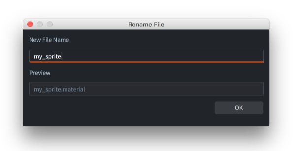
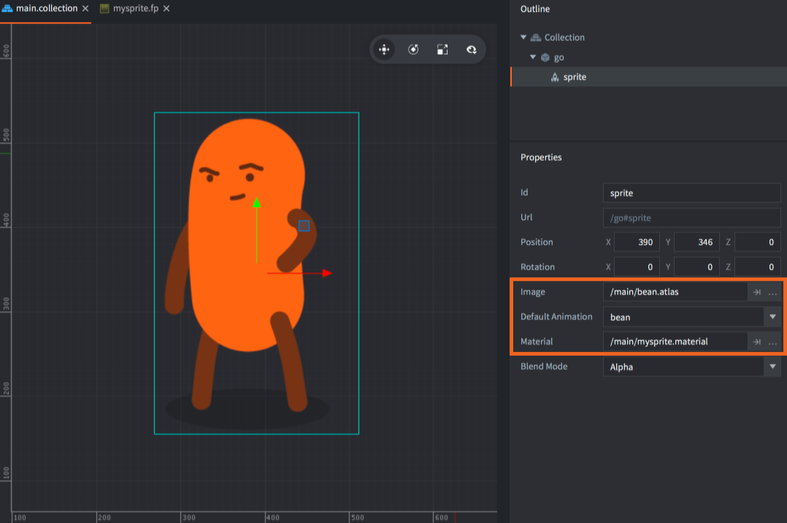
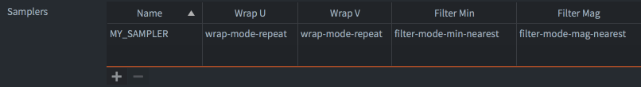
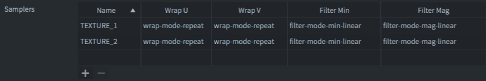

# 材质

材质用以表达可视元素 (sprite, tilemap, font, GUI node, model 等等) 应该如何被渲染.

材质包含 _tags_, 用来在渲染过程中作为选择渲染对象的依据. 材质还具有 _shader programs_ 这是通过显卡驱动编译好并上传至显卡每帧渲染时要使用的程序.

* 关于渲染过程, 详情请见 [渲染教程](/manuals/render).
* 关于着色器, 详情请见 [着色器教程](/manuals/shader).

## 创建材质

要创建材质, 在 *Assets* 浏览器里目标文件夹上 <kbd>右键点击</kbd> 然后选择 <kbd>New... ▸ Material</kbd>. (还可以从菜单选择 <kbd>File ▸ New...</kbd> , 再选择 <kbd>Material</kbd>). 给材质命名并点击 <kbd>Ok</kbd>.

{srcset="images/materials/material_file@2x.png 2x"}

新材质会在 *材质编辑器* 里打开.

{srcset="images/materials/material@2x.png 2x"}

材质文件包含以下信息:

Name
: 材质的 id. 此名称将列于材质 *渲染* 资源内并编译进游戏中. 渲染 API 函数 `render.enable_material()` 也是使用这个名称. 此名称不能与其他名称重名.

Vertex Program
: 顶点着色器程序 (*.vp*) 在渲染材质时使用. 顶点着色器运行于 GPU 以渲染每个组件的顶点. 它会计算顶点的屏幕位置然后经过插值输出 "变化后" 的变量输入给片元着色器程序.

Fragment Program
: 片元着色器程序 (*.fp*) 在渲染材质时使用. 片元着色器运行于 GPU 以渲染每个组件的片元 (像素) 其目的是决定片元的颜色. 通常使用采样纹理或者基于输入变量 (可变变量或常量) 计算的方法得到结果.

Vertex Constants
: 传输给顶点着色器程序的数据. 有效常量列表见下文.

Fragment Constants
:  传输给片元着色器程序的数据. 有效常量列表见下文.

Samplers
: 你也可以在材质文件里指定采样器. 添加采样器, 赋予其在着色器程序里使用的名字再在链接上设置包裹和过滤.

Tags
: 标签与材质相关. 标签在引擎内部表现为 _bitmask_ 并由 [`render.predicate()`](/ref/render#render.predicate) 来收集需要渲染的组件. 如何渲染请见 [Render documentation](/manuals/render). 每个项目最多可以使用32个标签.

## Vertex and fragment constants

着色器常量, 或称 "uniforms" 是从引擎传输给顶点和片元着色器程序的数据. 要使用常量，您可以在材质文件中将其定义为一个 *顶点常量* 属性或 *片元常量* 属性。需要在着色器程序中定义相应的 `uniform` 变量。材质中可以设置以下常量：

CONSTANT_TYPE_WORLD
: The world matrix. Use to transform vertices into world space. For some component types, the vertices are already in world space when they arrive to the vertex program (due to batching). In those cases multiplying with the world matrix in the shader will yield the wrong results.

CONSTANT_TYPE_VIEW
: The view matrix. Use to transform vertices to view (camera) space.

CONSTANT_TYPE_PROJECTION
: The projection matrix. Use to transform vertices to screen space.

CONSTANT_TYPE_VIEWPROJ
: A matrix with the view and projection matrices already multiplied.

CONSTANT_TYPE_WORLDVIEW
: A matrix with the world and view projection matrices already multiplied.

CONSTANT_TYPE_NORMAL
: A matrix to compute normal orientation. The world transform might include non-uniform scaling, which breaks the orthogonality of the combined world-view transform. The normal matrix is used to avoid issues with the direction when transforming normals. (The normal matrix is the transpose inverse of the world-view matrix).

CONSTANT_TYPE_USER
: A vector4 constant that you can use for any custom data you want to pass into your shader programs. You can set the initial value of the constant in the constant definition, but it is mutable through the functions `.set_constant()` and `.reset_constant()` for each component type (`sprite`, `model`, `spine`, `particlefx` and `tilemap`)

## Samplers

Samplers are used to sample the color information from a texture (a tile source or atlas). The color information can then be used for calculations in the shader program.

Sprite, tilemap, GUI and particle effect components automatically gets a `sampler2D` set. The first declared `sampler2D` in the shader program is automatically bound to the image referenced in the graphics component. Therefore there is currently no need to specify any samplers in the materials file for those components. Furthermore, those component types currently only support a single texture. (If you need multiple textures in a shader, you can use [`render.enable_texture()`](/ref/render/#render.enable_texture) and set texture samplers manually from your render script.)

{srcset="images/materials/sprite_sampler@2x.png 2x"}

```glsl
-- mysprite.fp
varying mediump vec2 var_texcoord0;
uniform lowp sampler2D MY_SAMPLER;
void main()
{
    gl_FragColor = texture2D(MY_SAMPLER, var_texcoord0.xy);
}
```

You can specify a component's sampler settings by adding the sampler by name in the materials file. If you don't set up your sampler in the materials file, the global *graphics* project settings are used.

{srcset="images/materials/my_sampler@2x.png 2x"}

For model components, you need to specify your samplers in the material file with the settings you want. The editor will then allow you to set textures for any model component that use the material:

{srcset="images/materials/model_samplers@2x.png 2x"}

```glsl
-- mymodel.fp
varying mediump vec2 var_texcoord0;
uniform lowp sampler2D TEXTURE_1;
uniform lowp sampler2D TEXTURE_2;
void main()
{
    lowp vec4 color1 = texture2D(TEXTURE_1, var_texcoord0.xy);
    lowp vec4 color2 = texture2D(TEXTURE_2, var_texcoord0.xy);
    gl_FragColor = color1 * color2;
}
```

{srcset="images/materials/model@2x.png 2x"}

## Sampler settings

Name
: The name of the sampler. This name should match the `sampler2D` declared in the fragment shader.

Wrap U/W
: The wrap mode for the U and V axes:

  - `WRAP_MODE_REPEAT` will repeat texture data outside the range [0,1].
  - `WRAP_MODE_MIRRORED_REPEAT` will repeat texture data outside the range [0,1] but every second repetition is mirrored.
  - `WRAP_MODE_CLAMP_TO_EDGE` will set texture data for values greater than 1.0 to 1.0, and any values less than 0.0 is set to 0.0---i.e. the edge pixels will be repeated to the edge.

Filter Min/Mag
: The filtering for magnification and minification. Nearest filtering requires less computation than linear interpolation, but can result in aliasing artifacts. Linear interpolation often provides smoother results:

  - `FILTER_MODE_NEAREST` uses the texel with coordinates nearest the center of the pixel.
  - `FILTER_MODE_LINEAR` sets a weighted linear average of the 2x2 array of texels that lie nearest to the center of the pixel.
  - `FILTER_MODE_NEAREST_MIPMAP_NEAREST` chooses the nearest texel value within an individual mipmap.
  - `FILTER_MODE_NEAREST_MIPMAP_LINEAR` selects the nearest texel in the two nearest best choices of mipmaps and then interpolates linearly between these two values.
  - `FILTER_MODE_LINEAR_MIPMAP_NEAREST` interpolates linearly within an individual mipmap.
  - `FILTER_MODE_LINEAR_MIPMAP_LINEAR` uses linear interpolation to compute the value in each of two maps and then interpolates linearly between these two values.

## Constants buffers

When the rendering pipeline draws, it pulls constant values from a default system constants buffer. You can create a custom constants buffer to override the default constants and instead set shader program uniforms programmatically in the render script:

```lua
self.constants = render.constant_buffer() -- <1>
self.constants.tint = vmath.vector4(1, 0, 0, 1) -- <2>
...
render.draw(self.my_pred, self.constants) -- <3>
```
1. Create a new constants buffer
2. Set the `tint` constant to bright red
3. Draw the predicate using our custom constants

Note that the buffer's constant elements are referenced like an ordinary Lua table, but you can't iterate over the buffer with `pairs()` or `ipairs()`.
