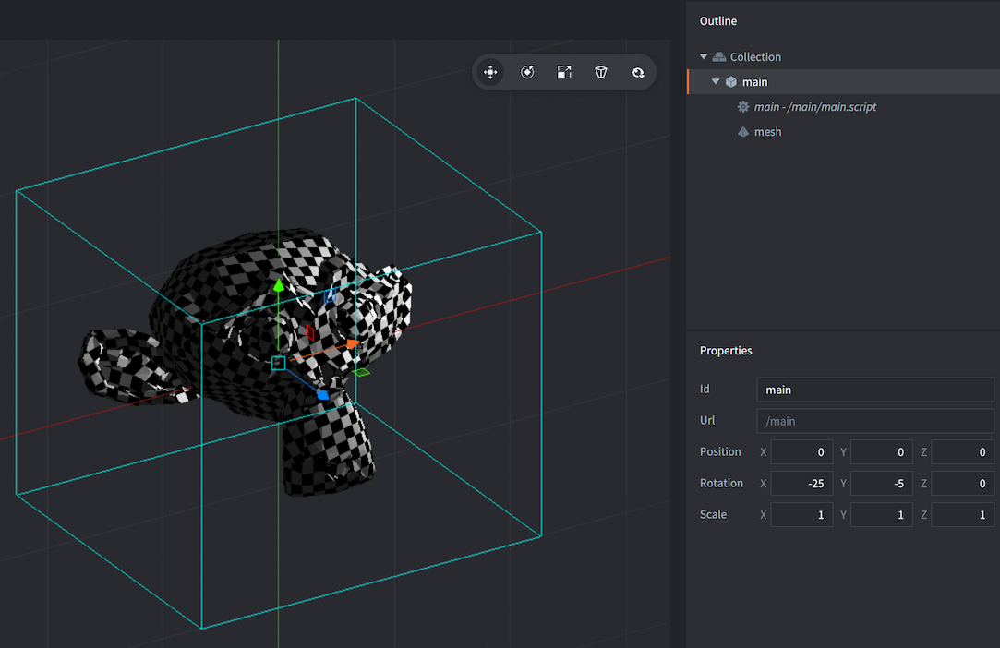

# Mesh 组件

Defold 本质是3D的. 即使 2D 材质也是以 3D 方法进行渲染, 再通过正交投射显示在屏幕上. Defold 也可以使用全3D素材, 也可以在运行时建立3D网格. 纯3D还是混合2D、3D游戏根据需要随意创作.

## 新建 Mesh 组件

Mesh 组件的创建和其他组件一样. 有两种方法:

- 在 *Assets* 浏览器里 的 *Mesh 文件* 上 <kbd>右键单击</kbd> , 然后选择 <kbd>New... ▸ Mesh</kbd>.
- 在 *Outline* 视图里的游戏对象上 <kbd>right-clicking</kbd> 然后选择 <kbd>Add Component ▸ Mesh</kbd>.



Mesh 组件包含一些列属性:

### Mesh 属性

除了 *Id*, *Position* 和 *Rotation*, 还有如下属性:

*Material*
: 3D网格材质.

*Vertices*
: 描述3D网格各种流顶点信息的缓冲文件.

*Primitive Type*
: Lines, Triangles 还是 Triangle Strip.

*Position Stream*
: *位置* 流. 流在顶点着色器输入数据时自动提供.

*Normal Stream*
: *法线* 流. 流在顶点着色器输入数据时自动提供.

*tex0*
: 3D网格的纹理.

## 编辑时操作

3D网格组件建立好之后就可以使用编辑器和 *Scene Editor* 工具, 像普通游戏对象一样, 随意进行旋转缩放.

## 运行时操作

可以使用 Defold 缓存在运行时修改3D网格.

## 材质常量



`tint`
: 3D网格颜色 (`vector4`). 四元数 x, y, z, 和 w 分别对应红, 绿, 蓝和不透明度.

## 顶点的局部/世界坐标空间
如果3D网格材质的坐标空间设为局部坐标空间, 则数据会原封不动传入着色器, 这样通常要在着色器程序里进行GPU顶点/法线的转换.

如果3D网格材质的坐标空间设为世界坐标空间, 则必须要么提供默认的 “位置” 和 “法线”, 流, 要么在编辑3D网格时, 在下拉菜单中选择好. 这样便于引擎把同样是世界坐标系的3D网格进行数据合批.

## 举例
关于3D网格操作及示例项目和代码片段请参考 [这个论坛帖子](https://forum.defold.com/t/mesh-component-in-defold-1-2-169-beta/65137).

用三角形建立方块的例子:

```Lua

-- 方块
local vertices = {
	0, 0, 0,
	0, 1, 0,
	1, 0, 0,
	1, 1, 0,
	1, 1, 1,
	0, 1, 0,
	0, 1, 1,
	0, 0, 1,
	1, 1, 1,
	1, 0, 1,
	1, 0, 0,
	0, 0, 1,
	0, 0, 0,
	0, 1, 0
}

-- 用位置流建立3D网格缓存
local buf = buffer.create(#vertices / 3, {
	{ name = hash("position"), type=buffer.VALUE_TYPE_FLOAT32, count = 3 }
})

-- 读取流数据, 写入三角形数据
local positions = buffer.get_stream(buf, "position")
for i, value in ipairs(vertices) do
	positions[i] = vertices[i]
end

-- 用三角形数据建立方块3D网格
local res = go.get("#mesh", "vertices")
resource.set_buffer(res, buf)
```
