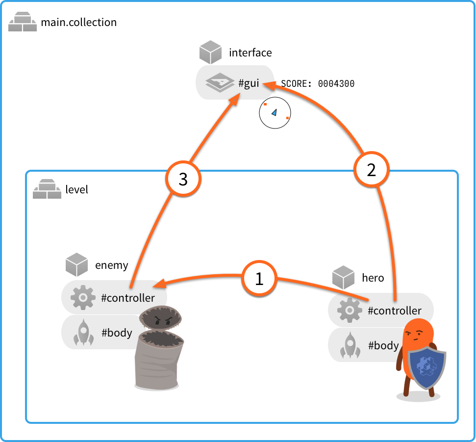
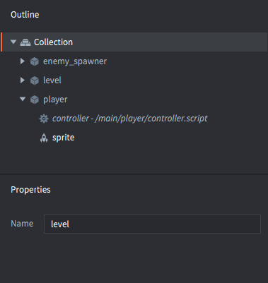

# 消息传递

消息传递是 Defold 游戏对象间互相交流的机制. 本教程假设你已经大概了解了 Defold 的 [定位机制](/manuals/addressing) 和 [基本构成](/manuals/building-blocks).

Defold 不使用类继承对象成员函数 (像 Java, C++ 或者 C#) 这类面向对象的概念. Defold 使用了一个简单有效的面向对象的设计扩展了 Lua, 把对象保存在脚本组件内部, 通过 `self` 引用来进行访问. 对象间通过消息交流机制进一步解耦.


## 使用示例

来看几个简单的例子. 假设你的游戏由以下部分构成:

1. 主启动集合里有一个带 GUI 组件的游戏对象 (GUI 包含一个迷你地图和一个计分器). 还有一个集合 id 叫 "level".
2. 这个 "level" 集合包含两个游戏对象: 一个主角一个敌人.


::: sidenote
本例全部内容分为两个文件. 一个主启动集合文件和一个 id 叫 "level" 的集合文件. 然而, Defold 里文件名叫什么 _没有关系_. 重要的是其 id.
:::

游戏需要一个对象间的交流机制:



① 主角攻击敌人
: 作为机制的一部分, 一个 `"punch"` 消息从 "hero" 脚本组件发送到 "enemy" 脚本组件. 因为两个游戏对象处在集合层级结构的同级, 可以使用相对地址定位:

  ```lua
  -- 从 "hero" 脚本向 "enemy" 脚本发送 "punch" 消息
  msg.post("enemy#controller", "punch")
  ```

  这个消息不带数据, 发送消息明就可以, "punch".

  在敌人的脚本组件里, 使用如下函数接收消息:
  
  ```lua
  function on_message(self, message_id, message, sender)
    if message_id == hash("punch") then
      self.health = self.health - 100
    end
  end
  ```

  像这样, 代码仅查看了消息名 (作为哈希字符串在参数 `message_id` 里接收). 并不关系消息数据和发送者---*任何组件* 只要发送了 "punch" 都会对敌人造成伤害.

② 主角得分
: 主角打败敌人, 获得分数. 一个 `"update_score"` 消息从 "hero" 游戏对象脚本组件发送到 "interface" 游戏对象的 "gui" 组件.

  ```lua
  -- 敌人被击败. 加 100 分.
  self.score = self.score + 100
  msg.post("/interface#gui", "update_score", { score = self.score })
  ```

  这回就不能使用相对地址定位了因为 "interface" 处于层级根部而 "hero" 不是. 消息被发送到 GUI 组件的脚本上, 可被正确响应. 消息可以在脚本, GUI 脚本和渲染脚本间自由发送.

  消息 `"update_score"` 带有分数数据. 数据作为一个 Lua 表由 `message` 参数接收:

  ```lua
  function on_message(self, message_id, message, sender)
    if message_id == hash("update_score") then
      -- 更新计分器为当前分数
      local score_node = gui.get_node("score")
      gui.set_text(score_node, "SCORE: " .. message.score)
    end
  end
  ```

③ 敌人在迷你地图上的位置
: 屏幕上有一个用于定位跟踪敌人的迷你地图. 敌人需要发送 `"update_minimap"` 消息到 "interface" 游戏对象的 "gui" 组件上:

  ```lua
  -- 发送当前位置以更新迷你地图
  local pos = go.get_position()
  msg.post("/interface#gui", "update_minimap", { position = pos })
  ```

  GUI 脚本代码跟踪每个敌人的位置, 如果某个敌人更新了位置, 旧的位置会被替换. 消息发送者 (由 `sender` 参数接收) 可以作为 Lua 位置表的键:

  ```lua
  function init(self)
    self.minimap_positions = {}
  end

  local function update_minimap(self)
    for url, pos in pairs(self.minimap_positions) do
      -- 更新地图上的位置
      ...
    end
  end

  function on_message(self, message_id, message, sender)
    if message_id == hash("update_score") then
      -- 更新计分器为当前分数
      local score_node = gui.get_node("score")
      gui.set_text(score_node, "SCORE: " .. message.score)
    elseif message_id == hash("update_minimap") then
      -- 更新地图上的位置
      self.minimap_positions[sender] = message.position
      update_minimap(self)
    end
  end
  ```

## 发送消息

发送消息机制, 从上面可以看到, 非常简单. 调用函数 `msg.post()` 把消息加入消息队列. 然后, 每一帧, 引擎遍历消息队列把每条消息发送到目标去. 有些系统消息 (像 `"enable"`, `"disable"`, `"set_parent"` 之类的) 引擎自己处理这些消息. 引擎也会发送一些消息 (像物理碰撞的 `"collision_response"` 消息) 到负责接收的游戏对象. 对于那些发送到脚本的消息, 引擎会调用函数 `on_message()`.

可以向存在的对象或者组件发送任意消息. 如果脚本组件收到但不响应消息, 没问题. 响应与否完全取决于接收方.

引擎检查每条消息的目标. 如果消息接收者未知, Defold 会在控制台提示错误:

```lua
-- 尝试向不存在的对象发送消息
msg.post("dont_exist#script", "hello")
```

```txt
ERROR:GAMEOBJECT: Instance '/dont_exists' could not be found when dispatching message 'hello' sent from main:/my_object#script
```

函数 `msg.post()` 完整语法是:

`msg.post(receiver, message_id, [message])`

receiver
: 目标游戏对象或组件的 id. 如果目标是游戏对象, 消息会传播至游戏对象的所有组件上.

message_id
: 消息名字符串或者字符串哈希.

[message]
: 可选参数, 作为消息数据的 Lua 表键-值对. 几乎所有数据都可以存在表里. 可以用来传输数字, 字符串, 布尔值, 地址, 哈希和嵌套表. 不能传输函数.

  ```lua
  -- 发送带嵌套表的数据
  local inventory_table = { sword = true, shield = true, bow = true, arrows = 9 }
  local stats = { score = 100, stars = 2, health = 4, inventory = inventory_table }
  msg.post("other_object#script", "set_stats", stats)
  ```

::: sidenote
对于 `message` 参数的表的大小有硬性限制. 限制最大2KB. 没有具体用来测试表大小的函数但是可以通过插入表之前和之后分别调用 `collectgarbage("count")` 来判断表占用内存的大小.
:::

### 简化符

Defold 提供两种简化写法用来简化消息传递时需要输入的完整地址:

:[Shorthands](../shared/url-shorthands.md)


## 接收消息

接收消息由 `on_message()` 函数完成. 函数接收4个参数:

`function on_message(self, message_id, message, sender)`

`self`
: 对脚本组件自身的引用.

`message_id`
: 消息名. 这个值 _是哈希字符串_.

`message`
: 包含消息数据. 即一个 Lua 表. 如果消息不包含数据, 此表为空.

`sender`
: 发送者绝对路径地址.

```lua
function on_message(self, message_id, message, sender)
    print(message_id) --> hash: [my_message_name]

    pprint(message) --> {
                    -->   score = 100,
                    -->   value = "some string"
                    --> }
    
    print(sender) --> url: [main:/my_object#script]
end
```

## 游戏世界之间的消息传递

如果使用集合代理载入一个新的游戏世界, 你可能需要游戏世界之间的消息传递功能. 假设已经用一个代理载入了一个集合, 其 *Name* 属性是 "level":



当集合被载入, 初始化并开启, 就可以通过指定目标 "接口" 的方法向其中的任何游戏对象和组件发送消息了:

```lua
-- 向新游戏世界的主角发送消息
msg.post("level:/player#controller", "wake_up")
```
关于代理使用详情请见 [集合代理](/manuals/collection-proxy) 教程.

## 消息链

发送的消息最终由接收方 `on_message()` 函数调用接收. 由此函数里再发出消息是很常见的, 消息仍会被加入到消息队列中.

引擎把消息分别发送到接收方的 `on_message()` 函数里直到消息队列为空. 如果接收方还要发送消息, 会进行新一轮消息传输. 然而, 引擎清空消息队列次数有一个限制, 也就相当于每帧消息链长度的限制. 可以使用如下代码在 `update()` 函数里测试出这个限制:

```lua
function init(self)
    -- 初始化时建立一个长消息链
    -- 并在 update() 中记录消息链发送长度.
    print("INIT")
    msg.post("#", "msg")
    self.updates = 0
    self.count = 0
end

function update(self, dt)
    if self.updates < 5 then
        self.updates = self.updates + 1
        print("UPDATE " .. self.updates)
        print(self.count .. " dispatch passes before this update.")
        self.count = 0
    end
end

function on_message(self, message_id, message, sender)
    if message_id == hash("msg") then
        self.count = self.count + 1
        msg.post("#", "msg")
    end
end
```

运行代码输出如下:

```txt
DEBUG:SCRIPT: INIT
INFO:ENGINE: Defold Engine 1.2.36 (5b5af21)
DEBUG:SCRIPT: UPDATE 1
DEBUG:SCRIPT: 10 dispatch passes before this update.
DEBUG:SCRIPT: UPDATE 2
DEBUG:SCRIPT: 75 dispatch passes before this update.
DEBUG:SCRIPT: UPDATE 3
DEBUG:SCRIPT: 75 dispatch passes before this update.
DEBUG:SCRIPT: UPDATE 4
DEBUG:SCRIPT: 75 dispatch passes before this update.
DEBUG:SCRIPT: UPDATE 5
DEBUG:SCRIPT: 75 dispatch passes before this update.
```

可以看到这版 Defold 引擎在 `init()` 到 `update()` 中间发送10轮消息. 然后每帧发送75轮消息.

