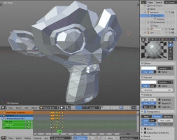
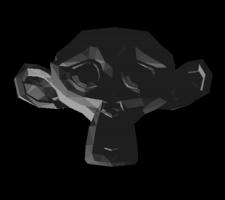

# 3D 蒙皮动画

3D 模型使用骨骼控制模型上各个三角形的移动.

关于如何导入 3D 模型动画, 详情请见 [模型教程](/manuals/model).

{.inline srcset="images/animation/blender_animation@2x.png 2x"}
{.inline}


## 3D Model 动画

通过调用 [`model.play_anim()`](/ref/model#model.play_anim) 函数播放模型动画:

```lua
function init(self)
    -- 在 #model 上来回播放 "wiggle" 动画
    model.play_anim("#model", "wiggle", go.PLAYBACK_LOOP_PINGPONG)
end
```

::: sidenote
Defold 目前只支持烘焙动画. 动画每个骨骼每一帧都要有矩阵数据, 而不是单独的位置, 旋转和缩放数据.

动画是线性插值的. 如果需要曲线插值动画要在输出时烘焙.

不支持 Collada 中的动画剪辑. 想要一个模型多个动画, 就要分别导出为 *.dae* 文件然后在 Defold 里组成 *.animationset* 文件.
:::


### 骨骼层级

模型骨骼作为游戏对象展示出来.

通过骨骼名称, 就可以在运行时得到骨骼实例. 函数 [`model.get_go()`](/ref/model#model.get_go) 返回指定骨骼的 id.

```lua
-- 得到 wiggler 模型的中央骨骼
local bone_go = model.get_go("#wiggler", "Bone_002")

-- 然后可以任意操作该游戏对象...
```

### 播放头

除了调用 `model.play_anim()` 还有更高级的动画播放方法, 可以使用 `go.animate()` (详见 [属性动画](/manuals/property-animation)) 控制 *Model* 组件的 `cursor` 属性实现动画播放控制:

```lua
-- 设置 #model 上的动画但不播放
model.play_anim("#model", "wiggle", go.PLAYBACK_NONE)
-- 把播放头设置为动画起始位置
go.set("#model", "cursor", 0)
-- 基于 in-out quad 缓动对播放头进行从 0 到 1 的 pingpong 补间.
go.animate("#model", "cursor", go.PLAYBACK_LOOP_PINGPONG, 1, go.EASING_INOUTQUAD, 3)
```

## 播放完成回调函数

动画函数 `model.play_anim()` 可以在最后一个参数上传入Lua回调函数. 当动画播放完成时会调用这个函数. 对于循环动画和用 `go.cancel_animations()` 手动取消播放的动画, 不会调用回调函数. 动画播放完成的回调函数里可以发送消息或者继续播放其他动画. 例如:

```lua
local function wiggle_done(self, message_id, message, sender)
    -- 播放完毕
end

function init(self)
    model.play_anim("#model", "wiggle", go.PLAYBACK_ONCE_FORWARD, nil, wiggle_done)
end
```

## 播放模式

动画可以单次播放也可以循环播放. 取决于播放模式:

* go.PLAYBACK_NONE
* go.PLAYBACK_ONCE_FORWARD
* go.PLAYBACK_ONCE_BACKWARD
* go.PLAYBACK_ONCE_PINGPONG
* go.PLAYBACK_LOOP_FORWARD
* go.PLAYBACK_LOOP_BACKWARD
* go.PLAYBACK_LOOP_PINGPONG
