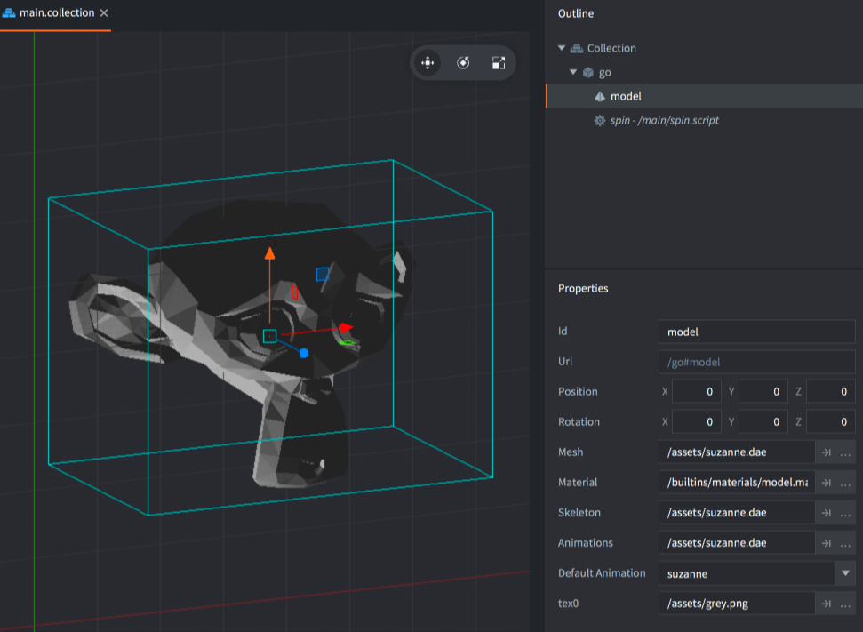
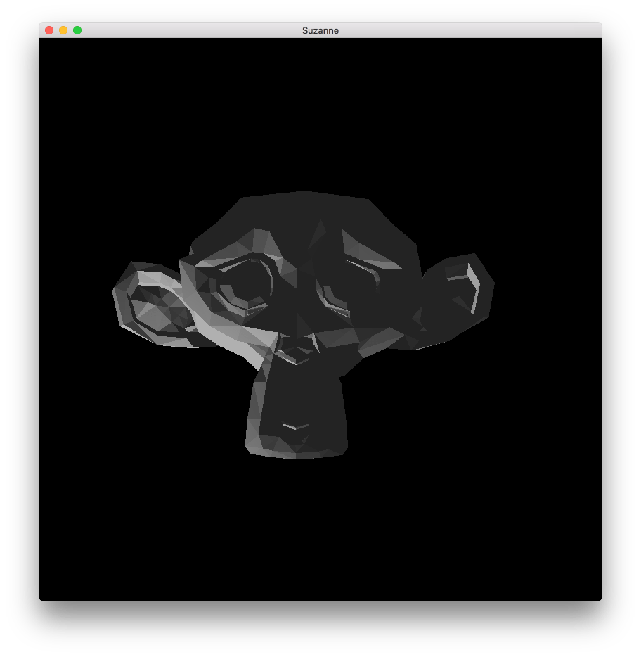

# Model 组件

Defold 核心是3D的. 就算只有2D材质的话渲染也是3D的, 只不过是映射到平面屏幕上而已.  Defold 允许在集合中使用 3D 资源, 或者称作 _模型_ . 你可以用Defold制作全3D的, 或者2D和3D混合的游戏.

## 创建 model 组件

Model 组件和其他游戏对象组件一样, 两种创建办法:

- *Assets* 浏览器里 <kbd>右键点击</kbd> 选择 <kbd>New... ▸ Model</kbd> 创建 *Model 文件*.
- 直接在 *Outline* 视图的游戏对象上 <kbd>右键点击</kbd> 然后选择 <kbd>Add Component ▸ Model</kbd>.



模型组件需要设置一些属性:

### 模型属性

除了常见的 *Id*, *Position* 和 *Rotation* 属性, 模型组件还有如下特有属性:

*Mesh*
: 这个属性指定 glTF *.gltf* 或者 Collada *.dae* 文件的模型网格. 如果文件包含多组网格, 只读取第一个.

*Material*
: 添加合适的材质. 一开始可以使用默认的 *model.material* 材质.

*Texture*
: 指定适当的纹理.

*Skeleton*
: 指定 glTF *.gltf* 或者 Collada *.dae* 文件里的骨骼. 注意Defold只支持一个骨骼树.

*Animations*
: 指定模型的 *动画集文件*.

*Default Animation*
: 指定自动播放的默认动画 (从动画集之中) .

## 编辑时操作

有了模型组件就可以使用随意使用组件功能同时可以使用 *Scene Editor* 工具移动, 旋转和缩放模型游戏对象了.

{srcset="images/model/ingame@2x.png 2x"}

## 运行时操作

有一套用于在运行时修改模型的方法和属性 (参见 [API文档](/ref/model/)).

### 运行时动画

Defold 提供了强大的运行时动画控制方法:

```lua
local play_properties = { blend_duration = 0.1 }
spine.play_anim("#model", "jump", go.PLAYBACK_ONCE_FORWARD, play_properties)
```

可以手动播放动画甚至使用属性动画系统控制播放头:

```lua
-- set the run animation
model.play_anim("#model", "run", go.PLAYBACK_NONE)
-- animate the cursor
go.animate("#model", "cursor", go.PLAYBACK_LOOP_PINGPONG, 1, go.EASING_LINEAR, 10)
```

### 修改属性

使用 `go.get()` 和 `go.set()` 方法可以修改模型的属性:

`animation`
: 当前动画 (`hash`) (只读). 使用 `model.play_anim()` 方法来更改播放动画 (见上文).

`cursor`
: 标准化动画头 (`number`).

`material`
: Spine模型材质 (`hash`). 可使用 `go.set()` 修改. 参见 [这个例子的 API 用法](/ref/model/#material).

`playback_rate`
: 动画播放速率 (`number`).

`textureN`
: 模型材质. 其中 N 的范围是 0-7 (`hash`). 可使用 `go.set()` 修改. 参见 [这个例子的 API 用法](/ref/model/#textureN).


## 材质

3D 一半都有给网格赋予材质的功能, 比如颜色和贴图. 这些信息保存在由 3D 软件输出的 glTF *.gltf* 或者 Collada *.dae* 文件中. 应该基于游戏需要选择或者建造 _高性能_ 材质. 材质由 _着色器程序_ 及其若干相关属性组成.

在内置材质文件夹里有一个3D模型材质. 如果需要自定义材质, 请参考 [材质文档](/manuals/material). [着色器教程](/manuals/shader) 介绍了着色器程序的工作方式.


## 材质常量



`tint`
: 3D网格颜色 (`vector4`). 四元数 x, y, z, 和 w 分别对应红, 绿, 蓝和不透明度.


## 渲染

默认的渲染脚本是为2D游戏而不是3D模型制作的. 但是你可以把默认渲染脚本拷贝出来, 自己加几行代码就能用来渲染模型. 比如:

  ```lua

  function init(self)
    self.model_pred = render.predicate({"model"})
    ...
  end

  function update()
    ...
    render.set_depth_mask(true)
    render.enable_state(render.STATE_DEPTH_TEST)
    render.set_projection(stretch_projection(-1000, 1000))  -- orthographic
    render.draw(self.model_pred)
    render.set_depth_mask(false)
    ...
  end
  ```

关于渲染脚本详情请见 [渲染教程](/manuals/render).
