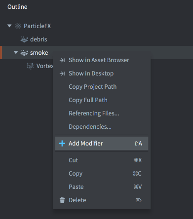
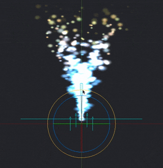
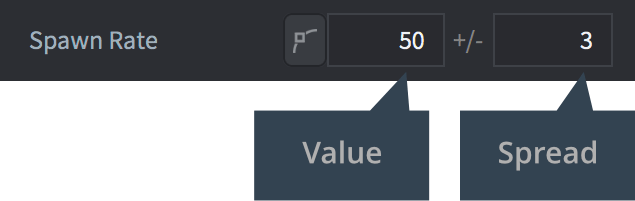
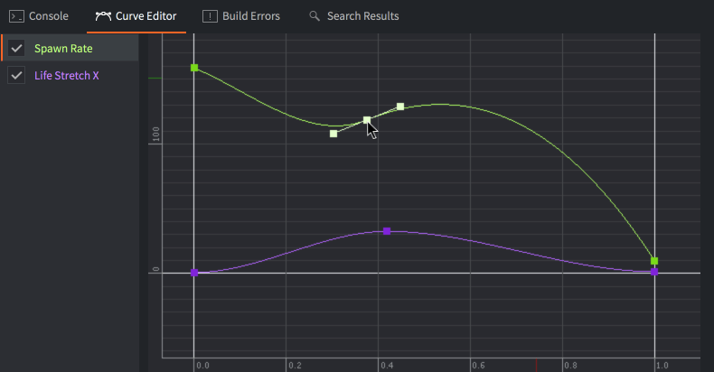
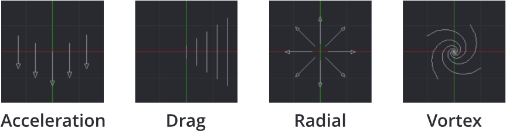

# 粒子特效

粒子特效用于视觉上增强游戏。您可以使用它们来创建爆炸、血溅、拖尾、天气或任何其他效果。


粒子特效由多个发射器和可选的修改器组成：

Emitter
: 发射器是一个定位的形状，它在该形状上均匀地发射粒子。发射器包含控制粒子生成以及单个粒子的图像或动画、生命周期、颜色、形状和速度的属性。

Modifier
: 修改器影响已生成粒子的速度，使它们在特定方向上加速或减速，径向移动或围绕一个点旋转。修改器可以影响单个发射器的粒子或特定发射器。

## 创建特效

在 *Assets* 浏览器的上下文菜单中选择 <kbd>New... ▸ Particle FX</kbd>。为新的粒子特效文件命名。编辑器现在将使用[场景编辑器](/manuals/editor/#the-scene-editor)打开该文件。

*Outline* 面板显示默认的发射器。选择发射器以在下面的 *Properties* 面板中显示其属性。


要向特效添加新的发射器，<kbd>右键单击</kbd> *Outline* 的根目录，然后从上下文菜单中选择 <kbd>Add Emitter ▸ [type]</kbd>。请注意，您可以在发射器属性中更改发射器的类型。

要添加新的修改器，<kbd>右键单击</kbd> *Outline* 中修改器的位置（特效根目录或特定发射器），然后选择 <kbd>Add Modifier</kbd>，再选择修改器类型。




位于特效根目录（不是发射器的子级）的修改器会影响特效中的所有粒子。

作为发射器的子级添加的修改器只会影响该发射器。

## 预览特效

* 从菜单中选择 <kbd>View ▸ Play</kbd> 来预览特效。您可能需要缩小摄像机才能正确看到特效。
* 再次选择 <kbd>View ▸ Play</kbd> 可以暂停特效。
* 选择 <kbd>View ▸ Stop</kbd> 来停止特效。再次播放会从初始状态重新开始。

编辑发射器或修改器时，结果会立即在编辑器中可见，即使特效已暂停：



## 发射器属性

Id
: 发射器标识符（在为特定发射器设置渲染常量时使用）。

Position/Rotation
: 发射器相对于粒子特效组件的变换。

Play Mode
: 控制发射器的播放方式：
  - `Once` 在达到其持续时间后停止发射器。
  - `Loop` 在达到其持续时间后重新启动发射器。

Size Mode
: 控制翻页动画的大小调整方式：
  - `Auto` 保持每个翻页动画帧的大小与源图像相同。
  - `Manual` 根据 size 属性设置粒子大小。

Emission Space
: 生成的粒子将存在的几何空间：
  - `World` 使粒子独立于发射器移动。
  - `Emitter` 使粒子相对于发射器移动。

Duration
: 发射器应该发射粒子的秒数。

Start Delay
: 发射器在发射粒子之前应该等待的秒数。

Start Offset
: 发射器应该在粒子模拟中开始的秒数，或者换句话说，发射器应该预热特效多长时间。

Image
: 用于纹理化和动画粒子的图像文件（Tile source 或 Atlas）。

Animation
: 用于粒子的 *Image* 文件中的动画。

Material
: 用于着色粒子的材质。

Blend Mode
: 可用的混合模式有 `Alpha`、`Add` 和 `Multiply`。

Max Particle Count
: 源自此发射器的粒子可以同时存在的数量。

Emitter Type
: 发射器的形状
  - `Circle` 从圆内的随机位置发射粒子。粒子从中心向外发射。圆的直径由 *Emitter Size X* 定义。

  - `2D Cone` 从扁平锥体（三角形）内的随机位置发射粒子。粒子从锥体顶部向外发射。*Emitter Size X* 定义顶部的宽度，*Y* 定义高度。

  - `Box` 从盒子内的随机位置发射粒子。粒子沿着盒子的本地 Y 轴向上发射。*Emitter Size X*、*Y* 和 *Z* 分别定义宽度、高度和深度。对于 2D 矩形，将 Z 大小保持为零。

  - `Sphere` 从球体内的随机位置发射粒子。粒子从中心向外发射。球的直径由 *Emitter Size X* 定义。

  - `Cone` 从 3D 锥体内的随机位置发射粒子。粒子从锥体的顶部圆盘向外发射。*Emitter Size X* 定义顶部圆盘的直径，*Y* 定义锥体的高度。

  

Particle Orientation
: 发射的粒子的朝向方式：
  - `Default` 将朝向设置为单位朝向
  - `Initial Direction` 保持发射粒子的初始朝向。
  - `Movement Direction` 根据粒子的速度调整其朝向。

Inherit Velocity
: 粒子应该继承发射器速度的比例值。此值仅在 *Space* 设置为 `World` 时可用。发射器的速度每帧都会估算。

Stretch With Velocity
: 勾选以在移动方向上缩放任何粒子拉伸。

### 混合模式
:[blend-modes](../shared/blend-modes.md)

## 可设置关键帧的发射器属性

这些属性有两个字段：一个值和一个抖动。抖动是应用于每个生成粒子的随机变化。例如，如果值是 50，抖动是 3，每个生成的粒子将获得 47 到 53 之间的值（50 +/- 3）。



通过勾选关键帧按钮，属性的值由发射器持续时间内的曲线控制。要重置已设置关键帧的属性，取消勾选关键帧按钮。


*Curve Editor*（在底部视图的选项卡中可用）用于修改曲线。已设置关键帧的属性无法在 *Properties* 视图中编辑，只能在 *Curve Editor* 中编辑。<kbd>单击并拖动</kbd>点和切线来修改曲线的形状。<kbd>双击</kbd>曲线以添加控制点。要删除控制点，<kbd>双击</kbd>它。



要自动缩放曲线编辑器以显示所有曲线，请按 <kbd>F</kbd>。

以下属性可以在发射器的播放时间内设置关键帧：

Spawn Rate
: 每秒发射的粒子数。

Emitter Size X/Y/Z
: 发射器形状的尺寸，请参见上面的 *Emitter Type*。

Particle Life Time
: 每个生成粒子的生命周期，以秒为单位。

Initial Speed
: 每个生成粒子的初始速度。

Initial Size
: 每个生成粒子的初始大小。如果您将 *Size Mode* 设置为 `Automatic` 并使用翻页动画作为图像源，则此属性将被忽略。

Initial Red/Green/Blue/Alpha
: 粒子的初始颜色分量染色值。

Initial Rotation
: 粒子的初始旋转值（以度为单位）。

Initial Stretch X/Y
: 粒子的初始拉伸值（以单位为单位）。

Initial Angular Velocity
: 每个生成粒子的初始角速度（以度/秒为单位）。

以下属性可以在粒子的生命周期内设置关键帧：

Life Scale
: 每个粒子生命周期内的缩放值。

Life Red/Green/Blue/Alpha
: 每个粒子生命周期内的颜色分量染色值。

Life Rotation
: 每个粒子生命周期内的旋转值（以度为单位）。

Life Stretch X/Y
: 每个粒子生命周期内的拉伸值（以单位为单位）。

Life Angular Velocity
: 每个粒子生命周期内的角速度（以度/秒为单位）。

## 修改器

有四种类型的修改器可用，它们影响粒子的速度：

`Acceleration`
: 在一般方向上的加速度。

`Drag`
: 与粒子速度成比例地减少粒子的加速度。

`Radial`
: 向位置吸引或排斥粒子。

`Vortex`
: 在其位置周围以圆形或螺旋方向影响粒子。

  

## 修改器属性

Position/Rotation
: 修改器相对于其父级的变换。

Magnitude
: 修改器对粒子的影响程度。

Max Distance
: 粒子受此修改器影响的最大距离。仅用于 Radial 和 Vortex。

## 控制粒子特效

要从脚本启动和停止粒子特效：

```lua
-- 启动当前游戏对象中的特效组件 "particles"
particlefx.play("#particles")

-- 停止当前游戏对象中的特效组件 "particles"
particlefx.stop("#particles")
```

要从 GUI 脚本启动和停止粒子特效，请参阅 [GUI 粒子特效手册](/manuals/gui-particlefx#controlling-the-effect) 以获取更多信息。

::: sidenote
即使粒子特效组件所属的游戏对象被删除，粒子特效仍将继续发射粒子。
:::
有关更多信息，请参阅 [粒子特效参考文档](/ref/particlefx)。

## 材质常量

默认的粒子特效材质具有以下常量，可以使用 `particlefx.set_constant()` 进行更改，使用 `particlefx.reset_constant()` 进行重置（有关更多详细信息，请参阅[材质手册](/manuals/material/#vertex-and-fragment-constants)）：

`tint`
: 粒子特效的颜色染色（`vector4`）。vector4 用于表示染色，其中 x、y、z 和 w 分别对应红色、绿色、蓝色和 alpha 染色。有关示例，请参阅 [API 参考](/ref/particlefx/#particlefx.set_constant:url-constant-value)。

## 项目配置

*game.project* 文件中有一些与粒子相关的[项目设置](/manuals/project-settings#particle-fx)。
