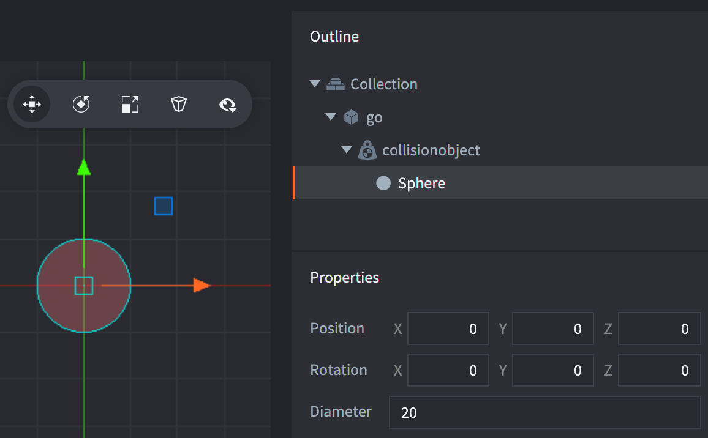
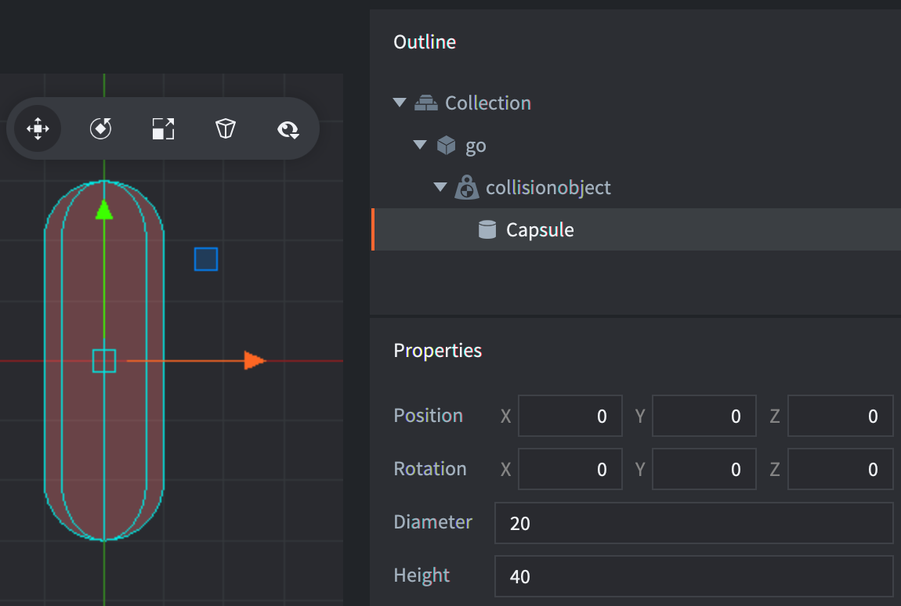
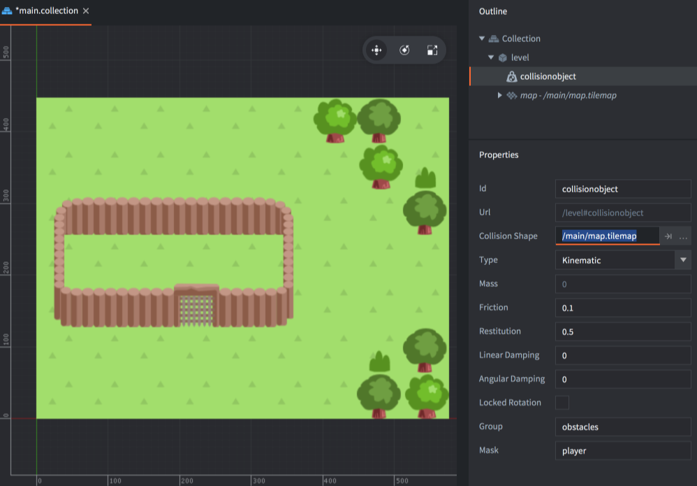

# 碰撞對象形狀

碰撞对象的形状可以包含多个简单形状组成也可以由一个复杂形状代替.

### 简单形状
简单形状有 *box*, *sphere* 和 *capsule*. 要加入简单形状可以在碰撞对象上 <kbd>右键单击</kbd> 选择 <kbd>Add Shape</kbd>:


## 方形
方形设定由位置, 旋转和尺寸 (宽度, 高度和深度) 组成:


## 圓形
圆形设定由位置, 旋转和直径组成:



## 膠囊形
胶囊形设定由位置, 旋转, 直径和高度组成:



::: important
胶囊形仅用于 3D 物理 (在 *game.project* 文件的物理部分进行设置).
:::

### 复杂形状
复杂形状可以由瓷砖地图生成或者使用凸多边形.

## 瓷砖地图碰撞形状
Defold 包含一个功能就是从瓷砖地图中自动生成瓷磚圖源的物理碰撞形状. [瓷砖圖源教程](/manuals/tilesource/#tile-source-collision-shapes) 介绍了新建瓷砖图源的碰撞组与把瓷砖分配给碰撞组的 ([例子](/examples/tilemap/collisions/)).

在瓷砖地图上添加碰撞:

1. <kbd>右键点击</kbd> 游戏对象, 选择 <kbd>Add Component File</kbd>. 来选取瓷砖地图文件.
2. <kbd>右键点击</kbd> 游戏对象, 选择 <kbd>Add Component ▸ Collision Object</kbd> 加入碰撞对象组件.
3. 不加入形状, 而是配置 *Collision Shape* 属性为 *瓷砖地图* 文件.
4. 设置碰撞对象的其他 *属性*.



::: important
这里的 *Group* 属性 **不会** 生效, 因为碰撞组已在瓷砖图源中定义好了.
:::

## 凸多边形
Defold 有一个功能就是让你用3个或多个点建立凸多边形. 可以使用工具 [Defold 多边形编辑器](https://rossgrams.itch.io/defold-polygon-editor) 或者 [物理刚体编辑器](https://selimanac.github.io/physics-body-editor/) 来创建凸多边形.

1. 新建凸多边形文件 (扩展名 `.convexshape`).
2. 不在碰撞对象上加入形状, 而是设置 *Collision Shape* 属性为 *凸多边形文件*.

::: sidenote
编辑器里不显示形状. 只有 [开启物理调试](/manuals/debugging-game-logic/#物理引擎调试) 才能在运行时看到形状.
:::

### 文件格式
凸多边形文件使用和 Defold 里其他资源文件一样的格式, 即 protobuf 文本格式. 凸多边形定义了逆时针顺序的顶点. 例如:

```
shape_type: TYPE_HULL
data: 200.000
data: 100.000
data: 0.0
data: 400.000
data: 100.000
data: 0.0
data: 400.000
data: 300.000
data: 0.0
data: 200.000
data: 300.000
data: 0.0
```

上例中定义了如下的矩形的四个角:

```
 200x300   400x300
    4---------3
    |         |
    |         |
    |         |
    |         |
    1---------2
 200x100   400x100
```

# 缩放碰撞形状
碰撞對象及其形狀繼承于游戲對象. 不想要該功能的話可以取消勾選 *game.project* 中物理部分下的 [Allow Dynamic Transforms](/manuals/project-settings/#allow-dynamic-transforms). 注意只有等比縮放受支持, 數值不等比的話以最小的一項數值為准.


# 改变碰撞形状
运行时可以使用 `physics.set_shape()` 改变碰撞形状. 例如:

```lua
-- 胶囊形状数据
local capsule_data = {
  type = physics.SHAPE_TYPE_CAPSULE,
  diameter = 10,
  height = 20,
}
physics.set_shape("#collisionobject", "my_capsule_shape", capsule_data)

-- 球形数据
local sphere_data = {
  type = physics.SHAPE_TYPE_SPHERE,
  diameter = 10,
}
physics.set_shape("#collisionobject", "my_sphere_shape", sphere_data)

-- 矩形数据
local box_data = {
  type = physics.SHAPE_TYPE_BOX,
  dimensions = vmath.vector3(10, 10, 5),
}
physics.set_shape("#collisionobject", "my_box_shape", box_data)
```

::: sidenote
碰撞对象上必须存在指定 id 的正确形状.
:::


# 旋转碰撞形状

## 在3D物理世界中旋转碰撞形状
在3D物理中物体在各个轴上都可以进行旋转.


## 在2D物理世界中旋转碰撞形状
在3D物理中物体只能在z轴上旋转. 其他轴旋转会造成错误结果, 即使旋转180度用于翻转形状也不行. 要翻转物理形状推荐使用 [`physics.set_hlip(url, flip)`](/ref/stable/physics/?#physics.set_hflip:url-flip) 和 [`physics.set_vlip(url, flip)`](/ref/stable/physics/?#physics.set_vflip:url-flip) 函数.
