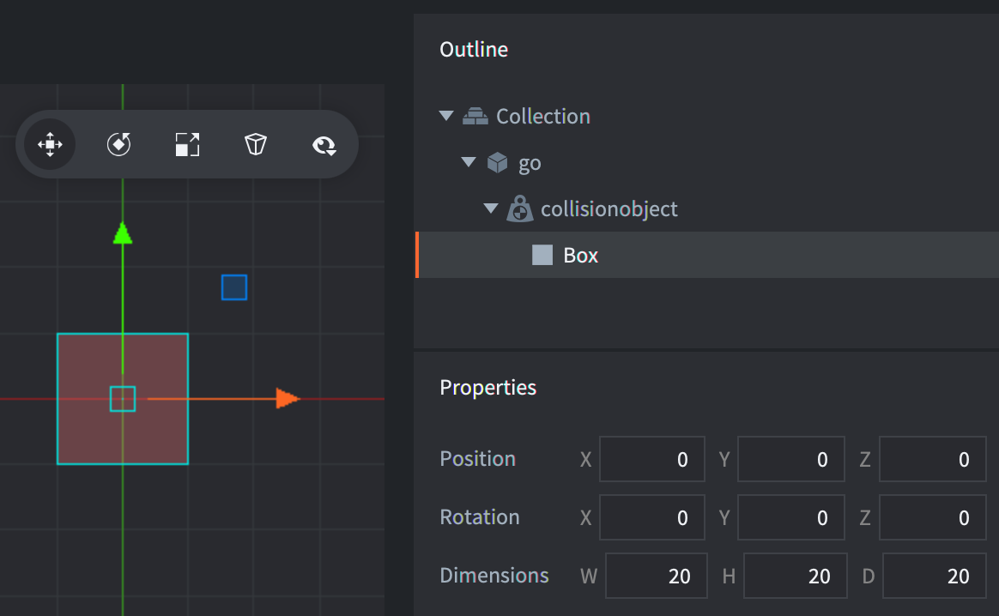
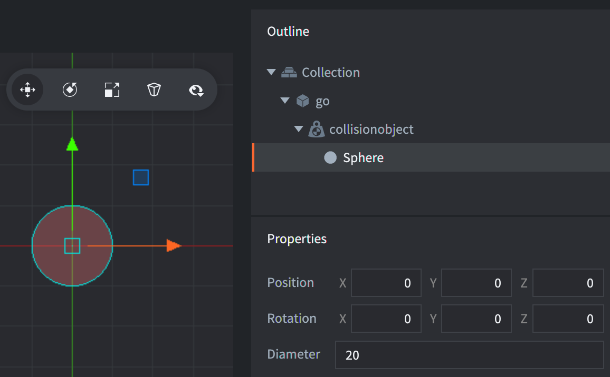
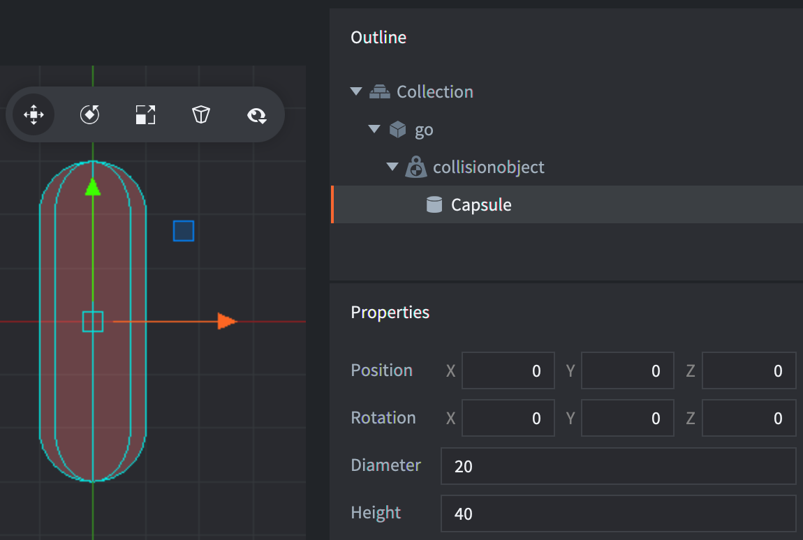

# 碰撞形状

碰撞对象可以包含多个内嵌形状。在 3D 物理中，这些形状可以包括来自 glTF 或 GLB 文件的凸包和三角网格。您也可以通过碰撞对象的 *Collision Shape* 属性使用瓦片地图或凸形状资源。

### 基本形状
基本形状有 *盒形*、*球形* 和 *胶囊形*。您可以通过<kbd>右键单击</kbd>碰撞对象并选择<kbd>Add Shape</kbd>来添加基本形状：


## 盒形
盒形具有位置、旋转和尺寸（宽度、高度和深度）：



## 球形
球形具有位置、旋转和直径：



## 胶囊形
胶囊形具有位置、旋转、直径和高度：



::: important
胶囊形仅在启用3D物理时受支持（在*game.project*文件的物理部分配置）。
:::

### 复杂形状
复杂形状可以使用瓦片地图几何体或凸包数据。自 Defold 1.13.2 起，3D 碰撞对象还可以从 glTF 或 GLB 场景中的网格创建凸包和三角网格形状。

## 3D 中的凸包和网格形状 {#hull-and-mesh-shapes-in-3d}

使用 *Hull* 形状可以得到网格的凸近似；如果碰撞需要遵循网格的三角形，包括关卡几何体开口等凹陷区域，请使用 *Mesh* 形状。

1. 在 *game.project* 中将 **Physics → Type** 设置为 `3D`。
2. 在 *Outline* 中右键点击碰撞对象，选择 <kbd>Add Shape ▸ Hull</kbd> 或 <kbd>Add Shape ▸ Mesh</kbd>。
3. 选择新形状，将其 *Scene* 属性设置为 *.gltf* 或 *.glb* 文件。
4. 从 *Mesh* 字段中选择一个命名网格。如果列表中没有该网格，请在建模工具中为网格命名，然后重新导出场景。
5. 移动并旋转形状，使其与游戏对象的可见几何体对齐。如需更多形状，请重复这些步骤。

所选网格提供其局部几何体；不会应用 glTF 节点变换。Bullet 3D 后端支持网格碰撞形状，包括静态和非静态碰撞对象。2D 物理后端不支持这些形状。

运行时形状 API 只能读取三角网格几何体。要更改其三角形，请编辑源网格并重新构建。有关游戏对象的缩放，请参阅[缩放碰撞形状](#scaling-collision-shapes)。

## 瓦片地图碰撞形状
Defold包含一项功能，允许您轻松为瓦片地图使用的瓦片源生成物理形状。[瓦片源手册](/manuals/tilesource/#tile-source-collision-shapes)解释了如何向瓦片源添加碰撞组以及将瓦片分配给碰撞组（[示例](/examples/tilemap/collisions/)）。

要向瓦片地图添加碰撞：

1. 通过<kbd>右键单击</kbd>游戏对象并选择<kbd>Add Component File</kbd>将瓦片地图添加到游戏对象。选择瓦片地图文件。
2. 通过<kbd>右键单击</kbd>游戏对象并选择<kbd>Add Component ▸ Collision Object</kbd>向游戏对象添加碰撞对象组件。
3. 不要向组件添加形状，而是将*Collision Shape*属性设置为*瓦片地图*文件。
4. 像往常一样设置碰撞对象组件的*属性*。


::: important
请注意，这里的*Group*属性**不**使用，因为碰撞组已在瓦片地图的瓦片源中定义。
:::

## 凸包形状
在 3D 物理中，您可以使用[上述编辑器工作流程](#hull-and-mesh-shapes-in-3d)直接从网格创建凸包。旧的 `.convexshape` 资源仍然受支持，可以使用外部编辑器从点创建：

1. 使用外部编辑器创建凸包形状文件（文件扩展名`.convexshape`）。
2. 使用文本编辑器或外部工具手动编辑文件（见下文）
3. 不要向碰撞对象组件添加形状，而是将*Collision Shape*属性设置为*凸包形状*文件。

### 文件格式
凸包文件格式使用与其他所有Defold文件相同的数据格式，即protobuf文本格式。凸包形状定义了包的点。在2D物理中，点应以逆时针顺序提供。在3D物理模式中使用抽象点云。2D示例：

```
shape_type: TYPE_HULL
data: 200.000
data: 100.000
data: 0.0
data: 400.000
data: 100.000
data: 0.0
data: 400.000
data: 300.000
data: 0.0
data: 200.000
data: 300.000
data: 0.0
```

上面的示例定义了一个矩形的四个角：

```
 200x300   400x300
    4---------3
    |         |
    |         |
    |         |
    |         |
    1---------2
 200x100   400x100
```

## 外部工具

有几种不同的外部工具可用于创建碰撞形状：

* CodeAndWeb的[Physics Editor](https://www.codeandweb.com/physicseditor/tutorials/how-to-create-physics-shapes-for-defold)可用于创建带有精灵和匹配碰撞形状的游戏对象。
* [Defold Polygon Editor](https://rossgrams.itch.io/defold-polygon-editor)可用于创建凸包形状。
* [Physics Body Editor](https://selimanac.github.io/physics-body-editor/)可用于创建凸包形状。

<a id="scaling-collision-shapes"></a>

# 缩放碰撞形状
碰撞对象及其形状继承游戏对象的缩放比例。要禁用此行为，请取消选中*game.project*文件物理部分中的[Allow Dynamic Transforms](/manuals/project-settings/#allow-dynamic-transforms)复选框。请注意，仅支持均匀缩放，如果缩放不均匀，将使用最小的缩放值。

# 调整碰撞形状大小
可以在运行时使用 `physics.set_shape()` 调整基本形状的大小。此函数不会替换凸包顶点或三角网格几何体。示例：

```lua
-- 设置胶囊形状数据
local capsule_data = {
  type = physics.SHAPE_TYPE_CAPSULE,
  diameter = 10,
  height = 20,
}
physics.set_shape("#collisionobject", "my_capsule_shape", capsule_data)

-- 设置球形数据
local sphere_data = {
  type = physics.SHAPE_TYPE_SPHERE,
  diameter = 10,
}
physics.set_shape("#collisionobject", "my_sphere_shape", sphere_data)

-- 设置盒形数据
local box_data = {
  type = physics.SHAPE_TYPE_BOX,
  dimensions = vmath.vector3(10, 10, 5),
}
physics.set_shape("#collisionobject", "my_box_shape", box_data)
```

::: sidenote
碰撞对象上必须已存在具有指定ID的正确类型的形状。
:::

# 旋转碰撞形状

## 在3D物理中旋转碰撞形状
在3D物理中，碰撞形状可以围绕所有轴旋转。


## 在2D物理中旋转碰撞形状
在2D物理中，碰撞形状只能围绕z轴旋转。围绕x或y轴旋转将产生不正确的结果，应避免这样做，即使旋转180度以基本上沿x或y轴翻转形状也不行。要翻转物理形状，建议使用[`physics.set_hlip(url, flip)`](/ref/stable/physics/?#physics.set_hflip:url-flip)和[`physics.set_vlip(url, flip)`](/ref/stable/physics/?#physics.set_vflip:url-flip)。


# 调试
您可以[启用物理调试](/manuals/debugging-game-logic/#debugging-problems-with-physics)以在运行时查看碰撞形状。
