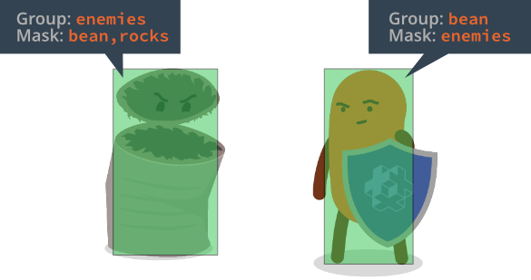
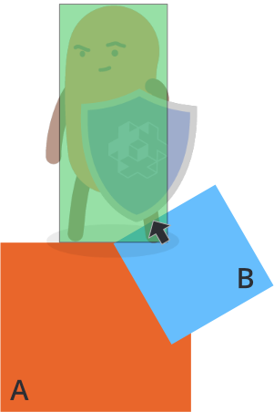

# 物理

Defold 包含一个修改版的 [Box2D](http://www.box2d.org) 物理引擎 (版本 2.1) 用于模拟2D物理效果和一个 Bullet physics 引擎 (版本 2.77) 用来模拟3D物理效果. 物理引擎可以基于牛顿物理定律模拟各种 _碰撞物体_ 运动碰撞时的物理效果. 本教程介绍了物理引擎的使用方法.

## 碰撞对象

碰撞对象是能给与游戏对象物理行为的组件. 碰撞对象包含许多物理属性比如重量, 弹性, 阻力等等. 组件上定义的一个或多个 _形状_ 决定了它在物理空间中的样子. Defold 支持以下的碰撞对象:

Static objects
: 静态对象不会移动但是能和移动物体进行碰撞. 静态对象很适合制作游戏固定场景元素 (比如地板和墙). 它们比动态对象性能消耗少. 静态对象不能被移动和修改.

Dynamic objects
: 动态对象由物理引擎负责计算位移. 处理碰撞然后给予力. 动态对象看起来很有真实感但是你 *不能* 直接控制它的位置与方向. 要想对其施加影响, 只能向它施加力的作用.

Kinematic objects
: 动画对象可以和其他对象产生碰撞, 但是物理引擎并不处理它们. 忽略碰撞, 或者交给你来处理. 动画对象很适合用作由脚本控制的又能对物理做出反应的物体, 比如游戏角色.

Triggers
: 触发器是记录碰撞的物体. 很适合用作碰撞检测 (比如子弹碰撞) 或者接触后触发时间的场景. 触发器比动画对象节省性能所以可以多用一些.

## 加入 collision object 组件

碰撞对象组件包含一系列 *属性* 用以设定其类型和物理特性. 还包含一个或多个 *形状* 用以定义这个物体的物理形态.

在游戏对象上添加碰撞对象组件:

1. 在 *大綱* 視圖中, <kbd>右鍵點擊</kbd> 游戲對象然後在上下文菜單中選擇 <kbd>Add Component ▸ Collision Object</kbd>. 新添加的組件沒有形狀.
2. 在組件上 <kbd>右鍵點擊</kbd> 然後選擇 <kbd>Add Shape ▸ Box / Capsule / Sphere</kbd>. 來為組件添加形狀. 一個組件可以有多個形狀. 還可以使用瓷磚地圖或者凸多邊形頂點文件定義物理對象的形狀.
3. 可以使用移動, 旋轉, 縮放工具修改形狀.
4. 點選組件后可在 *大綱* 視圖中編輯其 *屬性*.

{srcset="images/physics/collision_object@2x.png 2x"}

Id
: 组件名.

Collision Shape
: 这个是针对瓷砖地图的几何形状设置. 详见下文.

Type
: 碰撞对象的类型有: `Dynamic`, `Kinematic`, `Static` 和 `Trigger`. 如果设为动态就 _必须_ 设置其 *Mass* 属性为非0的值. 动态静态碰撞对象都需要为其设置适当的 *Friction* 和 *Restitution* 值.

Friction
: 摩擦可以做出一个物体在另一个物体上滑动的效果. 一般摩擦系数取值范围从 `0` (无摩擦---超级光滑) 到 `1` (强摩擦---超级粗糙) 之间. 但其实任何正数值都有效.

  摩擦力于法方向上的力成正比 (称为库伦摩擦). 计算两个物体 (`A` 和 `B`) 间的摩擦力时, 摩擦系数取两个物体的几何平均值:

  $$
  F_{combined} = \sqrt{ F_A \times F_B }
  $$

  也就是说只要有一个物体是0摩擦的, 两个物体之间就不会有摩擦力.

Restitution
: 弹性是物体的 "反弹性能". 一般取值范围从 0 (非弹性碰撞—一点也不反弹) 到 1 (完全弹性碰撞---物体速度在碰撞后完全反向)

  两个物体 (`A` 和 `B`) 之间的弹性计算基于以下公式:

  $$
  R = \max{ \left( R_A, R_B \right) }
  $$

  当一个形状发生多处碰撞时, 弹性模拟并不精确因为 Box2D 使用的是迭代解算器. Box2D 在碰撞相对速度很小时也使用非弹性碰撞代替, 以防止反弹抖动.


Linear damping
: 线性阻尼会减小刚体的线性速度. 不像摩擦只在物体接触时产生, 线性阻尼始终应用与线性移动的物体上, 给人一种物体飘进比空气密度大的环境中的感觉. 取值范围 0 到 1.

  Box2D 并不精确计算阻尼. 值很小时阻尼与时间无关, 值很大时阻尼随时间变化. 如果时间步固定, 这不会造成问题.

Angular damping
: 角阻尼与线性阻尼类似, 不同的是它减小的是刚体角速度. 取值范围 0 到 1.

Locked rotation
: 关闭碰撞对象的旋转, 无论力如何施加都不会旋转.

Group
: 此碰撞对象所归属的碰撞组. 可以自由定义16个组. 比如 "players", "bullets", "enemies" 或 "world". 如果瓷砖地图上设置了 *Collision Shape*, 则使用的是瓷砖图源里的组名而不是该属性定义的组名.

Mask
: 可以与此对象进行碰撞的 _组_. 如果指定多个, 组名以逗号分割. 如果值为空, 则此对象不与任何物体进行碰撞.

## Collision shapes

碰撞对象的形状可以由多个简单形状组成也可以由一个复杂形状代替. 简单形状有 *box*, *sphere* 和 *capsule*. 复杂形状可以由瓷砖地图生成或者使用凸多边形.

### Box shape
方形设定由位置, 旋转和尺寸 (宽度, 高度和深度) 组成:


### Sphere shape
圆形设定由位置, 旋转和直径组成:


### Capsule shape
胶囊形设定由位置, 旋转, 直径和高度组成:


### 瓷砖地图碰撞形状
Defold 包含一个功能就是从瓷砖地图中自动生成物理碰撞形状. [瓷砖地图教程](/manuals/tilemap/) 介绍了新建瓷砖图源的碰撞组与把瓷砖分配给碰撞组的 ([例子](/examples/tilemap/collisions/)).

在瓷砖地图上添加碰撞:

1. <kbd>右键点击</kbd> 游戏对象, 选择 <kbd>Add Component File</kbd>. 来选取瓷砖地图文件.
2. <kbd>右键点击</kbd> 游戏对象, 选择 <kbd>Add Component ▸ Collision Object</kbd> 加入碰撞对象组件.
3. 不加入形状, 而是配置 *Collision Shape* 属性为 *瓷砖地图* 文件.
4. 设置碰撞对象的其他 *属性*.

{srcset="images/physics/collision_tilemap@2x.png 2x"}

::: 注意
这里的 *Group* 属性 **不** 生效, 因为碰撞组已在瓷砖图源中定义好了.
:::

### 凸多边形
Defold 有一个功能就是让你用3个或多个点建立凸多边形. 可以使用资源 [Defold 多边形编辑器](/assets/defoldpolygoneditor/) 或者 [物理刚体编辑器](/assets/physicsbodyeditor/) 来创建凸多边形.

1. 新建凸多边形文件 (扩展名 `.convexshape`).
2. 不在碰撞对象上加入形状, 而是设置 *Collision Shape* 属性为 *凸多边形文件*.

::: 注意
编辑器里不显示形状. 只有 [开启物理调试](/manuals/debugging-game-logic/#物理引擎调试) 才能在运行时看到形状.
:::


### 缩放碰撞形状

可以让碰撞形状继承游戏对象的缩放. 在 *game.project* 里的物理部分勾选 [Allow Dynamic Transforms](/manuals/project-settings/#Allow Dynamic Transforms) 即可. 注意缩放继承只支持等比缩放, 如果不等比, 去三周最小值.


### 旋转碰撞形状

#### 在3D物理世界中旋转碰撞形状
在3D物理中物体在各个轴上都可以进行旋转.


#### 在2D物理世界中旋转碰撞形状
在3D物理中物体只能在z轴上旋转. 其他轴旋转会造成错误结果, 即使旋转180度用于翻转形状也不行. 要翻转物理形状推荐使用 [`physics.set_hlip(url, flip)`](/ref/stable/physics/?#physics.set_hflip:url-flip) 和 [`physics.set_vlip(url, flip)`](/ref/stable/physics/?#physics.set_vflip:url-flip) 函数.


### 物理引擎单位

设计上按照牛顿物理学单位米, 千克和秒 (MKS) 的标准单位. 模拟物尺寸 0.1 到 10 米范围 (静态对象可以更大) 效果较好, 默认一像素 (pixel) 当作 1 米. 这种转换是物理模拟器层次上的, 对游戏来说并不适用.
默认一个200像素的物体在物理世界相当于200米超过了最佳模拟范围. 一般需要对游戏里的物体进行物理上的缩放. 可以在 `game.project` 里的 [物理缩放设置](/manuals/project-settings/#Physics) 处指定缩放值.
比如设置为 0.02 意味着 1:50, 那么200像素就是 4 米. 注意重力 (也在 `game.project` 里进行设定) 也需要基于缩放值进行调整.

## 碰撞组与碰撞掩码

物理引擎通过组与掩码处理碰撞. 这个组就是 _碰撞组_. 每个碰撞对象都有2个属性用以控制其与其他物体的碰撞, *Group* 和 *Mask*.

碰撞只发生在两个物体所处的组分别被包含在对方的 *碰撞掩码* 之中的情况下.

{srcset="images/physics/collision_group@2x.png 2x"}

*掩码* 可包含多个组名, 以实现复杂的碰撞控制.


## 碰撞消息

两个物体发生碰撞时, 消息会广播到两个物体上的所有组件中:

**`"collision_response"`**

碰撞对象会收到此消息. 其包含以下数据内容:

`other_id`
: 另一个碰撞物的id (`hash`过的)

`other_position`
: 另一个碰撞物的世界坐标 (`vector3`类型)

`other_group`
: 另一个碰撞物所在的碰撞组 (`hash`过的)

如果不需要很详细的信息, 碰撞响应消息就足够了, 比如检测子弹是否碰撞了敌人. 每帧每对碰撞物只有一个能收到此消息.

**`"contact_point_response"`**

这个消息由 dynamic 或 kinematic 碰撞对物体其中之一接收. 附带如下数据:

`position`
: 接触点世界坐标 (`vector3`类型).

`normal`
: 接触点世界坐标系法向量, 方向是从另一物体指向当前物体 (`vector3`类型).

`relative_velocity`
: 两个接触物体之间的相对速度, 方向是从另一物体指向当前物体 (`vector3`类型).

`distance`
: 两个接触物体之间穿透距离 -- 非负数 (`number`类型).

`applied_impulse`
: 两个接触物体间的冲量大小 (`number`类型).

`life_time`
: (*目前未使用*) 接触时长 (`number`类型).

`mass`
: 当前物体质量, 单位千克 (`number`类型).

`other_mass`
: 另一个物体质量, 单位千克 (`number`类型).

`other_id`
: 另一个物体的id (`hash`过的).

`other_position`
: 另一个物体的世界坐标 (`vector3`类型).

`group`
: 另一个物体所处的碰撞组 (`hash`过的).

要让相碰撞的物体好好分离, 用 `"contact_point_response"` 消息里的数据就够了. 注意每帧每对碰撞物可能不止收到一个 `"contact_point_response"` 消息, 取决于接触的多少. 详情请见下文.

## 触发器消息

触发器是精简版的碰撞物体. 根投射射线类似, 它们迭代物理世界物品但不与之进行交互.

触发器碰撞时发出 `"collision_response"` 消息. 而且在碰撞开始和结束时都会发送 `"trigger_response"` 消息. 消息包含如下信息:

`other_id`
: 另一个物体的id (`hash`过的).

`enter`
: 如果另一个物体进入触发器为 `true`, 离开为 `false`. (`boolean`类型).

## 动画碰撞对象

对于动画碰撞对象的碰撞必须手动处理. 一个想当然的处理方法如下:

```lua
function on_message(self, message_id, message, sender)
  -- 处理碰撞
  if message_id == hash("contact_point_response") then
    local newpos = go.get_position() + message.normal * message.distance
    go.set_position(newpos)
  end
end
```

动画碰撞对象的确离开了碰撞穿透, 但是分离之后经常会过冲, 这在许多情况下会产生抖动. 为了便于理解, 想象游戏主角碰到了两个物体, *A* 和 *B*:

{srcset="images/physics/collision_multi@2x.png 2x"}

碰撞发生的那一帧里, 物理引擎发出多个 `"contact_point_response"` 消息, 一个给 *A* 一个给 *B*. 如果按上面那样移动角色, 结果会是这样:

- 根据 *A* 的穿透距离把角色向上移 (黑色箭头)
- 根据 *B* 的穿透距离把角色向左上移 (黑色箭头)

顺序无所谓结果是一样的: 最终位移是 *每个穿透向量的矢量和*:

{srcset="images/physics/separation_naive@2x.png 2x"}

要想正确地将角色移出 *A* 和 *B*, 需要处理碰撞点的穿透距离并检测上一个位移是否, 完全或部分, 分离了它们.

假设第一次碰撞从 *A* 开始, 然后针对 *A* 做位移:

{srcset="images/physics/separation_step1@2x.png 2x"}

这样一来角色也部分离开了 *B*. 最后只剩下 *B* 黑色箭头那点穿透. 这段位移应该是 *A* 向量映射到 *B* 剩余的补偿:

{srcset="images/physics/projection@2x.png 2x"}

$$l = vmath.project(A, B) \times vmath.length(B)$$

补偿向量等于 *B* 向量减去 *l* 向量. 所以计算位移的时候, 对于每个碰撞点, 可以引入矫正向量按以下步骤进行矫正:

1. 把当前矫正向量映射到碰撞穿透向量上.
2. 计算穿透向量的补偿 (按照上述公式).
3. 依照补偿向量移动对象.
4. 把补偿向量累加到矫正向量中.

完整的代码实现如下:

```lua
function init(self)
  -- 校正向量
  self.correction = vmath.vector3()
end

function update(self, dt)
  -- 重置矫正向量
  self.correction = vmath.vector3()
end

function on_message(self, message_id, message, sender)
  -- 处理碰撞
  if message_id == hash("contact_point_response") then
    -- 获取位移计算所需数据. 
    -- 当前帧可能有多个碰撞点需要处理,
    -- 通过累积矫正向量,
    -- 达到正确计算位移的目的:
    if message.distance > 0 then
      -- 第一步, 把矫正向量投射到
      -- 穿透向量上.
      local proj = vmath.project(self.correction, message.normal * message.distance)
      if proj < 1 then
        -- 没有过冲的才需要补偿.
        local comp = (message.distance - message.distance * proj) * message.normal
        -- 应用补偿向量.
        go.set_position(go.get_position() + comp)
        -- 积累矫正向量.
        self.correction = self.correction + comp
      end
    end
  end
end
```

## Ray casts

射线用于收集延一条投射射线所遇到的物理世界的物体. 只要提供起止点和碰撞组, 就可以投射射线了.

射线碰到的物体数据都会被记录下来. 包括动态, 静态和动画碰撞对象. 不包括触发器对象.

```lua
function update(self, dt)
  -- 投射射线
  local my_start = vmath.vector3(0, 0, 0)
  local my_end = vmath.vector3(100, 1000, 1000)
  local my_groups = { hash("my_group1"), hash("my_group2") }

  local result = physics.raycast(my_start, my_end, my_groups)
  if result then
      -- 处理射线碰撞结果 (所有数据参见 'ray_cast_response' 消息)
      print(result.id)
  end
end
```

::: 注意
结果不包括射线起始点位置的碰撞物体. 这是 Box2D 做的限制.
:::

## Joints

Defold 支持物理关节. 一个关键基于某种限制连接两个物体. 支持的关节类型如下:

* Fixed (physics.JOINT_TYPE_FIXED) - 限制两物体最大距离的固定关节. 在 Box2D 被称为绳子关节.
* Hinge (physics.JOINT_TYPE_HINGE) - 把两个物体通过一个锚点钉在一起的钉子关节. 两物体相对位置固定而相对旋转没有限制. 这种关节可以开启马达给一个最大扭力与速度. 在 Box2D 被称为旋转关节.
* Spring (physics.JOINT_TYPE_SPRING) - 限制两个物体之间距离范围的弹簧关节. 弹簧关节通过设定其频率和阻尼比可以让物体像是被软弹簧连接. 在 Box2D 被称为距离关节.
* Slider (physics.JOINT_TYPE_SLIDER) - 限制两物体只能在某个指定轴上相对移动而不允许相对转动的滑动关节. 在 Box2D 被称为活塞关节.

### 建立关节

目前只能使用 [`physics.create_joint()`](/ref/physics/#physics.create_joint:joint_type-collisionobject_a-joint_id-position_a-collisionobject_b-position_b-[properties]) 函数手动建立关节:

::: 注意
编辑器可是环境新建关节在支持计划中但发布时间未知.
:::

```lua
-- 将两个碰撞物体用固定关节连接 (绳子)
physics.create_joint(physics.JOINT_TYPE_FIXED, "obj_a#collisionobject", "my_test_joint", vmath.vector3(10, 0, 0), "obj_b#collisionobject", vmath.vector3(0, 20, 0), { max_length = 20 })
```

上述代码创建了一个固定关节, 其id为 `my_test_joint`, 连接了两个物体 `obj_a#collisionobject` 与 `obj_b#collisionobject`. 关节位于 `obj_a#collisionobject` 偏左10像素, `obj_b#collisionobject` 偏上20像素的位置上. 设定的最大距离是20像素.

### 删除关节

可以使用 [`physics.destroy_joint()`](/ref/physics/#physics.destroy_joint:collisionobject-joint_id) 函数删除关节:

```lua
-- 删除上面提到的第一个物体上的关节
physics.destroy_joint("obj_a#collisionobject", "my_test_joint")
```

### 关节属性及修改

可以使用 [`physics.get_joint_properties()`](/ref/physics/#physics.get_joint_properties:collisionobject-joint_id) 读取关节属性, 使用 [`physics.set_joint_properties()`](/ref/physics/#physics.set_joint_properties:collisionobject-joint_id-properties) 修改关节属性:

```lua
function update(self, dt)
    if self.accelerating then
        local hinge_props = physics.get_joint_properties("obj_a#collisionobject", "my_hinge")
        -- 马达速度提升每秒100转
        hinge_props.motor_speed = hinge_props.motor_speed + 100 * 2 * math.pi * dt
        physics.set_joint_properties("obj_a#collisionobject", "my_hinge", hinge_props)
    end
end
```

### 关节反作用力和扭矩

可以使用 [`physics.get_joint_reaction_force()`](/ref/physics/#physics.get_joint_reaction_force:collisionobject-joint_id) 读取关节反作用力, 使用 [`physics.get_joint_reaction_torque()`](/ref/physics/#physics.get_joint_reaction_torque:collisionobject-joint_id) 读取关节扭力.


## 注意事项

碰撞代理
: 通过碰撞代理可以支持多个物理集合, 或称 *游戏世界*. 但是要记住每个集合都是一个单独的物理世界. 物理现象 (碰撞, 触发, 射线) 之发生在同一世界中. 两个不同集合的物体就算放到一块儿, 也不会发生物理碰撞.

碰撞漏检
: 如果发现碰撞未检测或未处理请先阅读 [调试教程的物理调试部分](/manuals/debugging-game-logic/#物理引擎调试).
