# Profiling

Defold 引擎内置了性能分析工具. 这些工具用来分析查找性能和内存占用的问题. 内置分析器只在打包 debug 版应用中可用.

## 运行时可视分析表

Debug 应用包含运行时可视分析工具可以在应用最上层把分析信息显示出来. 可以向 "system" 接口发送 "toggle_profile" 消息控制其开关:

```lua
function on_reload(self)
    -- 热重载时打开分析表.
    msg.post("@system:", "toggle_profile")
end
```

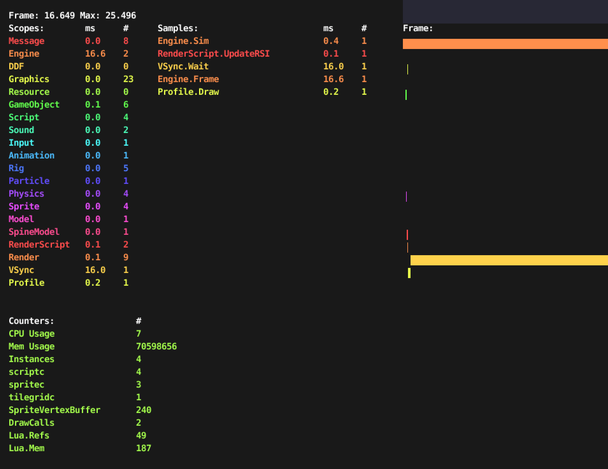

## 网页版分析器

运行debug版游戏时, 也可以从浏览器访问一个基于网页的分析器. 它可以对游戏每一帧进行取样并分析.

访问分析器:

1. 在目标设备上启动游戏.
2. 选择菜单 <kbd> Debug ▸ Open Web Profiler</kbd>. 或者比如说, 同时调试多个设备时, 可以打开浏览器访问地址 `http://<device IP>:8002` 其中 `<device IP>` 是设备 IP 地址. 你可以从菜单 <kbd>Project ▸ Target</kbd> 找到设备的 IP 地址. 如果调试计算机本机游戏, 访问 http://localhost:8002 即可.


最上面, 挨着 *Capture* 按钮有一个开关用来切换 *CPU/Frame 分析器* 和 *Resource 分析器*.

### CPU/Frame 分析器
CPU 分析器对当前采样的数据分析图表分为4个部分. 要更新采样数据, 点击最上面的 *Capture* 按钮即可.

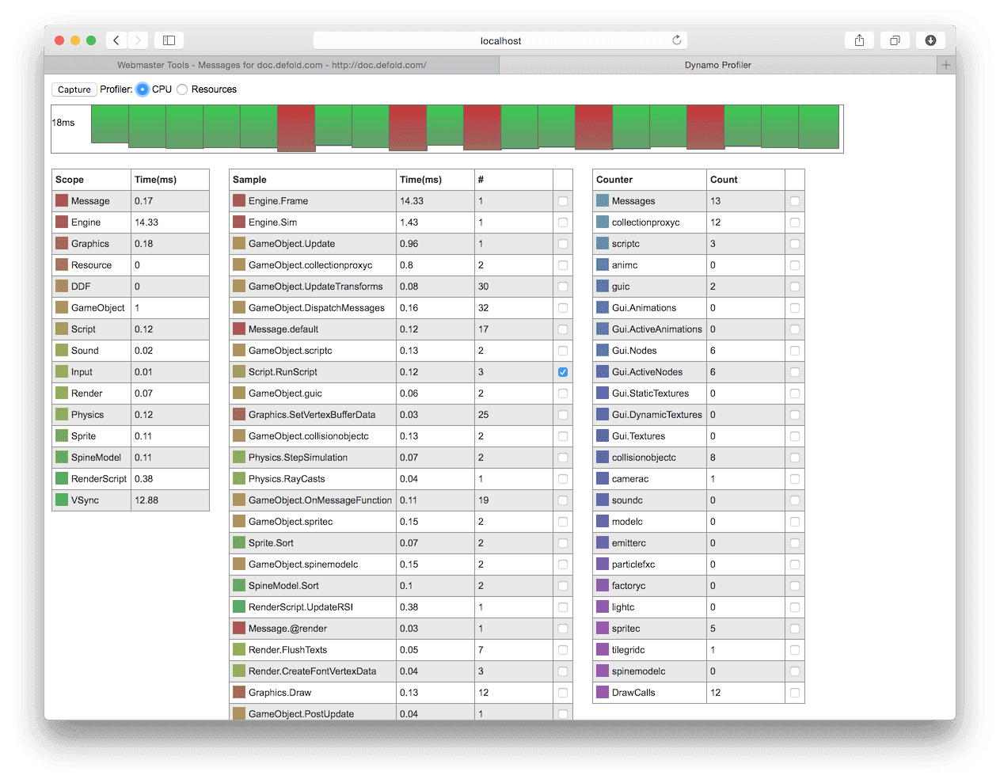

帧预览
: 帧预览视图把最近采集的 20 帧并排放置. 每个方块的高度代表这个帧的耗时. 最左边显示这些帧最大耗时.

  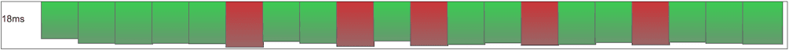

  帧预览下面是采样数据的详细展示.

  点击帧预览视图中的方块就会在下面给出这个帧的详细数据.

帧数据
: 帧数据显示了当前选择帧的详细数据表格. 这里可以看到引擎范围 (左边) 耗时（单位毫秒）和每个范围内的各个采样点 (中间). 右边是计数表格. 便于跟踪每帧 draw call 之类的数据.

  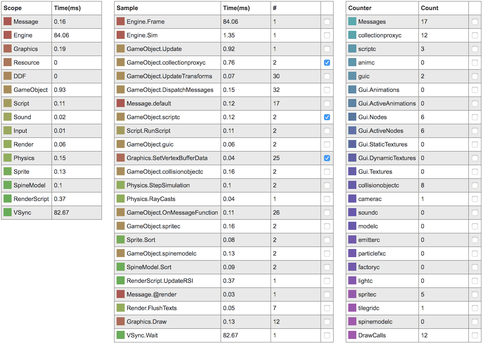

  勾选视图中的复选框可以给出下面的曲线图.

帧曲线图
: 帧曲线图显示了你选择的特定数据项在每个采样帧中的耗时曲线图. X 轴是帧编号 Y 轴是耗时 (单位毫秒). 曲线颜色就是选择的数据项的颜色.

  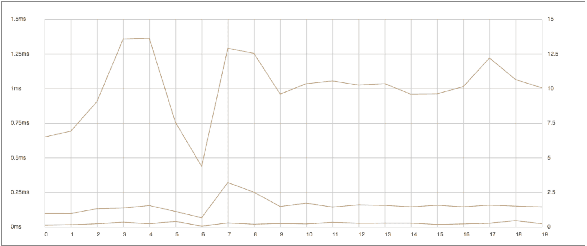

帧瀑布图
:  帧瀑布图展示了一帧中引擎耗时的各个部分.

  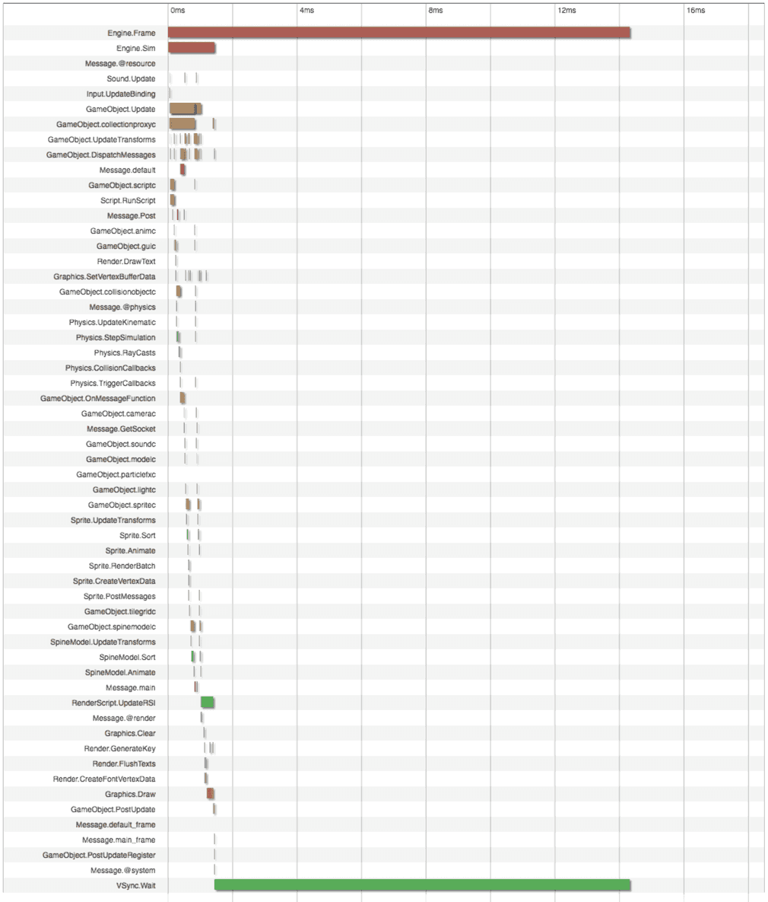

### 资源分析器
资源分析图表分为2个部分, 一个是集合层级关系, 显示了游戏中所有对象和组件实例, 另一个展示了加载的各种资源.

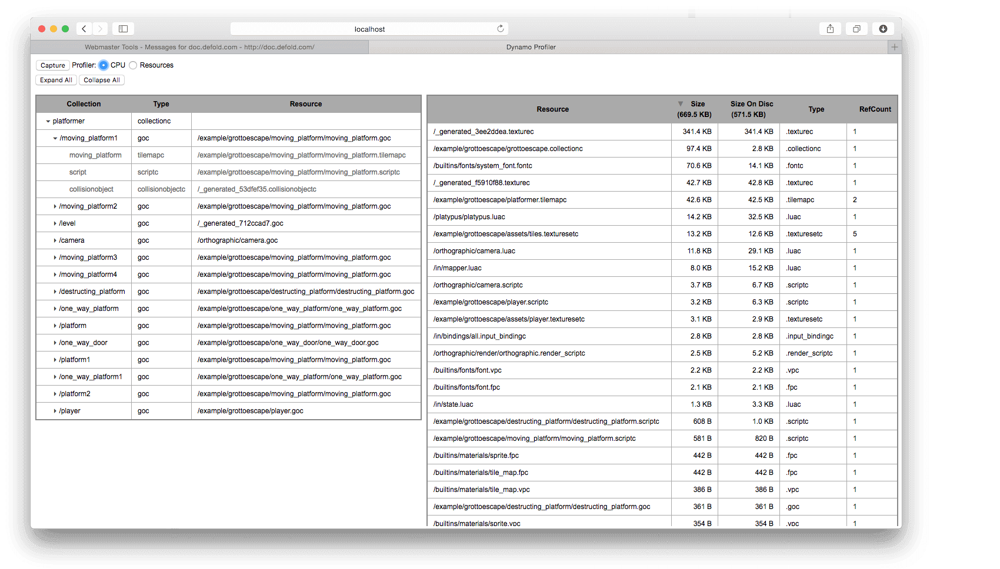

集合视图
: 集合视图展示了游戏里各个集合下所实例化出的各个游戏对象和组件的层级关系. 便于查找实例化对象与其原型的对应关系.

资源视图
: 资源视图展示了当前内存中加载的各种资源, 每个资源的空间占用和引用计数. 便于了解资源加载和优化内存使用.

## 编译报告

编译游戏时有个选项可以生成编译报告. 通过报告可以整体把握游戏包中各个资源的空间占用情况. 编译游戏时开启 *Generate build report* 选项即可.

{srcset="images/profiling/build_report@2x.png 2x"}

游戏编译完成后将生成 "report.html" 文件. 用浏览器打开这个文件进行查阅:

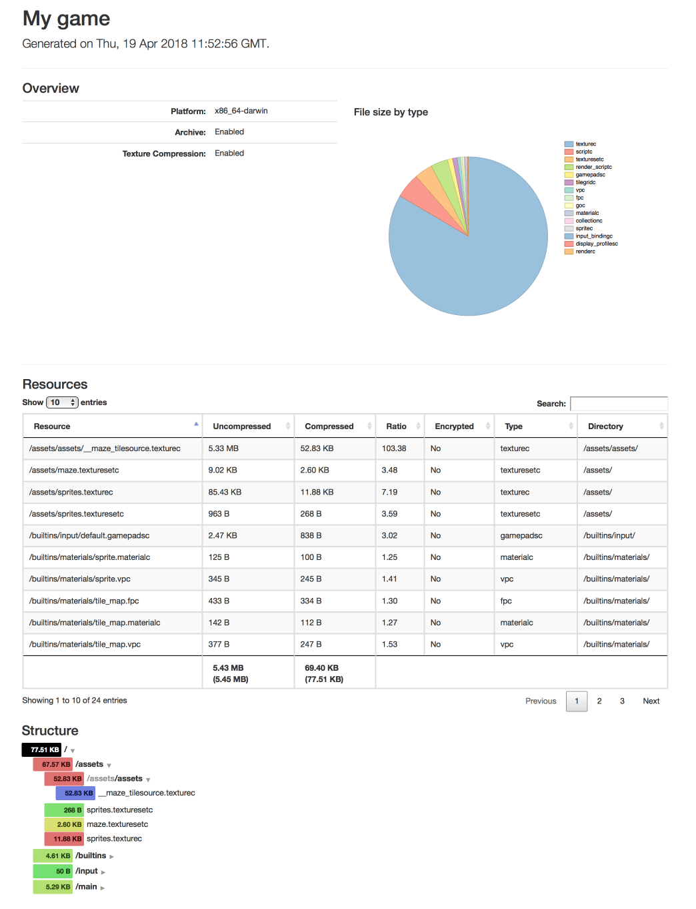{srcset="images/profiling/build_report_html@2x.png 2x"}

*Overview* 按资源类别给出空间占用饼图.

*Resources* 给出更详细的数据表格可以用来按照大小，压缩比, 加密与否, 类别和目录进行排序. 使用 "search" 框还可以对这些数据进行过滤.

*Structure* 基于项目结构给出空间占用树状图. 基于资源文件和目录从绿色 (占用小) 过渡到蓝色 (占用大).

## 外部工具

除了内置工具, 还有许多免费高效的分析跟踪工具. 举例如下:

ProFi (Lua)
: 内置工具里没有针对 Lua 的分析器但是使用外部工具可以做到这一点. 要测量脚本执行时间, 要么在代码里自己编写时间测试代码, 要么使用 ProFi 之类的 Lua 库.

  https://github.com/jgrahamc/ProFi

  注意纯 Lua 分析器使用时会为代码执行增加一些负担. 这可能会造成测量结果不准确. 虽然计数器工具还是蛮准确的.

Instruments (macOS and iOS)
: Xcode 包含一个性能分析可视化工具. 使用它可以跟踪检查一个或多个应用或进程的行为, 测试设备功能 (比如 Wi-Fi 和 Bluetooth) 等等.

  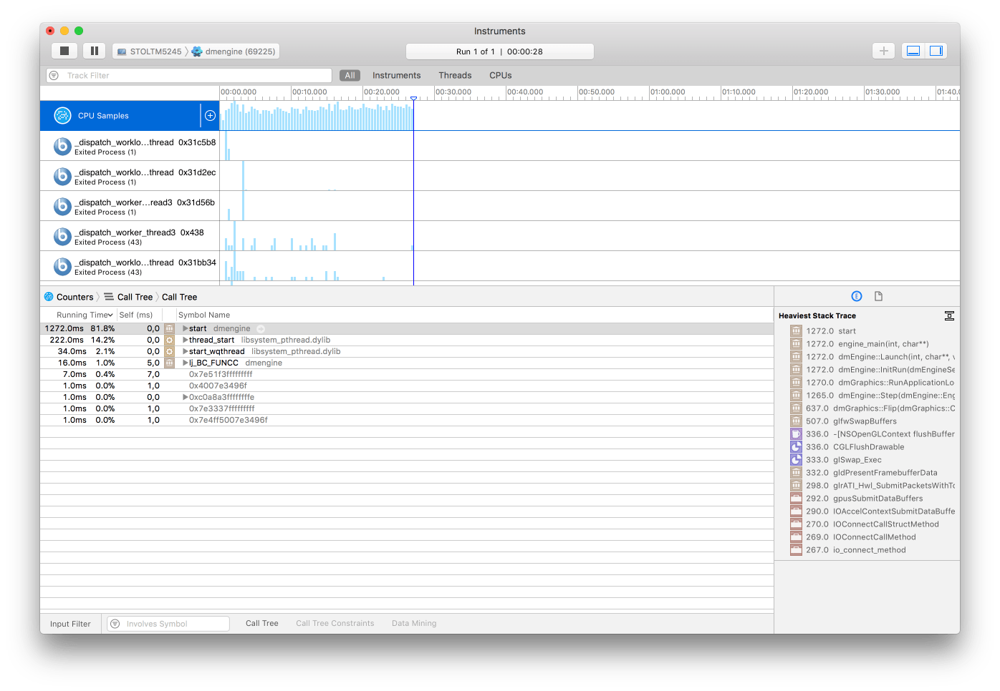{srcset="images/profiling/instruments@2x.png 2x"}

OpenGL 分析器 (macOS)
: 可以将 OpenGL 分析器作为 "Additional Tools for Xcode" 下载下来 (Xcode 菜单选择 <kbd>Xcode ▸ Open Developer Tool ▸ More Developer Tools...</kbd>).

  此工具可以用来分析运行中的 Defold 应用如何使用 OpenGL. 可以用来跟踪 OpenGL 函数调用, 在 OpenGL 函数上打断点, 调查应用资源 (纹理, 程序, 着色器之类的), 查看缓存内容, 以及 OpenGL 的各方面状态.

  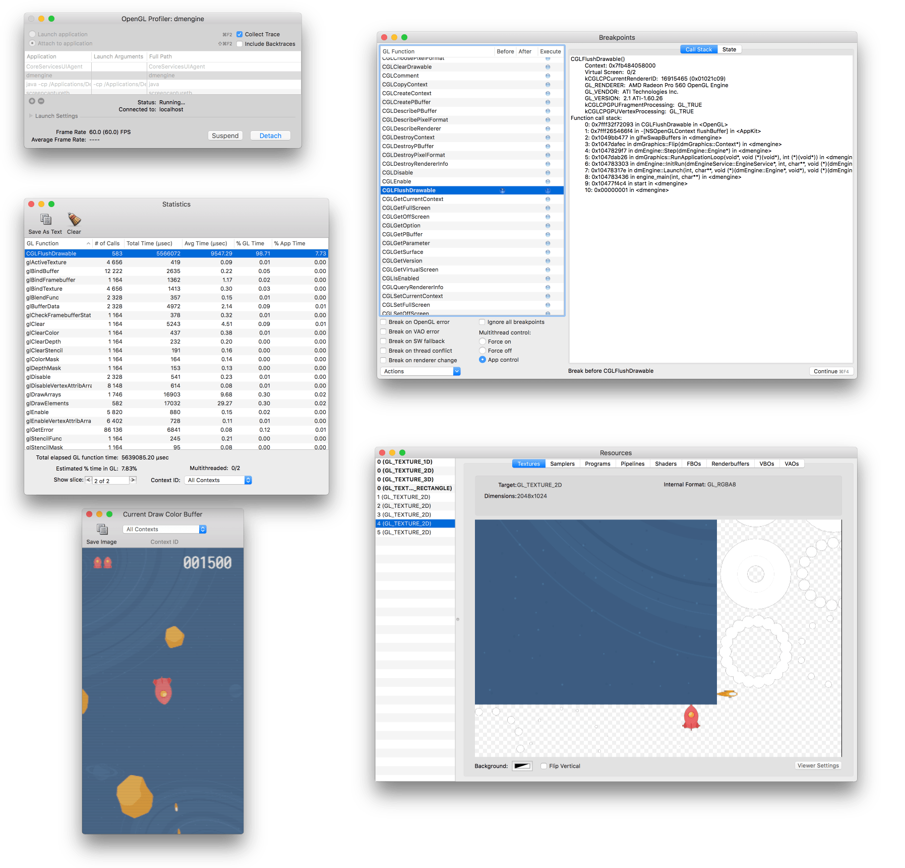{srcset="images/profiling/opengl@2x.png 2x"}

Android 分析器 (Android)
: https://developer.android.com/studio/profile/android-profiler.html

  Android 分析器是一组能够试试捕捉游戏 CPU, 内存及网络使用情况的工具. 可以基于取样跟踪代码执行, 堆栈使用, 内存分配及网络文件传输. 要使用这个工具需要在 "AndroidManifest.xml" 里设置 `android:debuggable="true"`.

  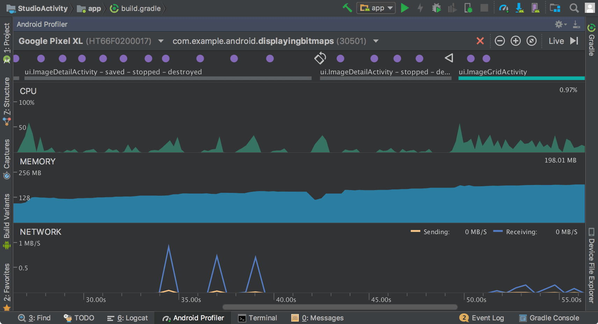

图像 API 调试器 (Android)
: https://github.com/google/gapid

  这组工具可以用来查看, 微调和重放从程序到显卡驱动的功能调用. 要使用这个工具需要在 "AndroidManifest.xml" 里设置 `android:debuggable="true"`.

  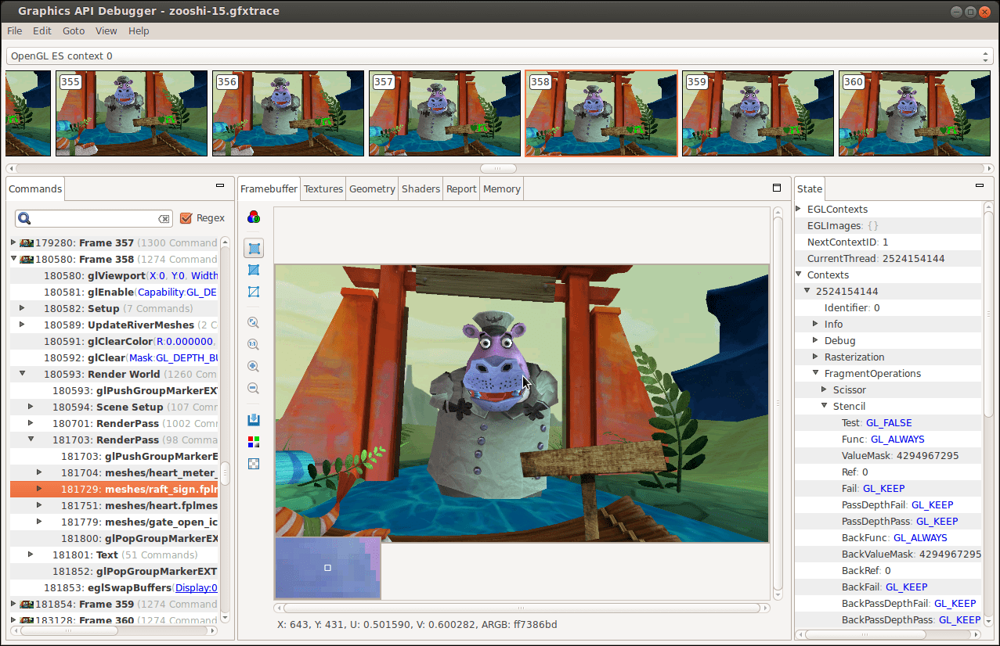
