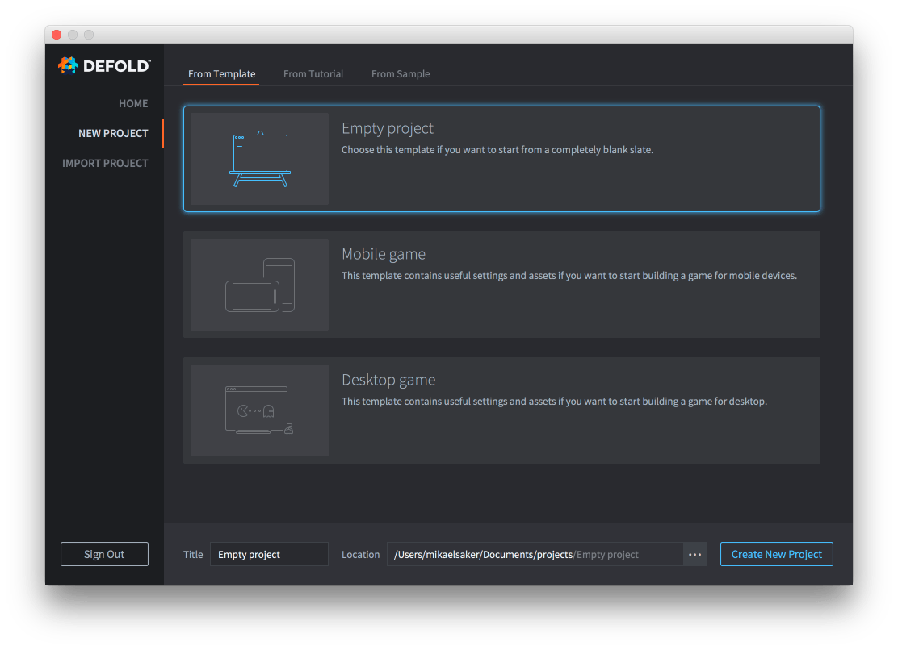
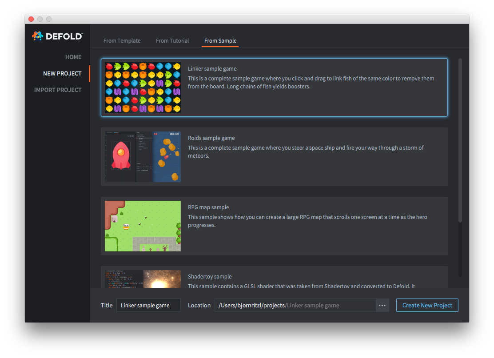
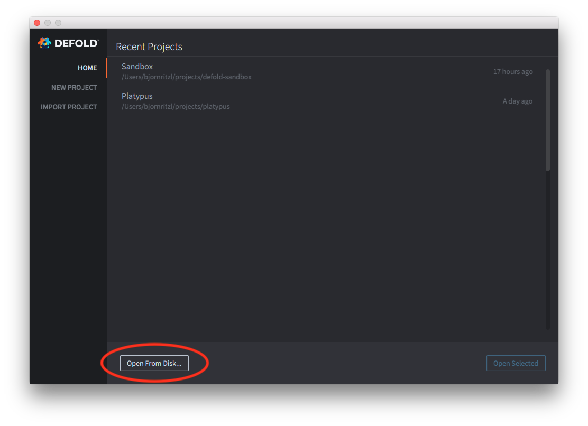

# 项目设立

使用 Defold 编辑器创建项目很简单. 同样也可以使用编辑器打开电脑中已存在的某个项目.

## 创建本地项目

点击 <kbd>New Project</kbd> 选项，然后选择创建何种项目. 为项目指定一个硬盘保存位置. 点击 <kbd>Create New Project</kbd> 即完成项目创建. 还可以使用模板创建项目:

{srcset="images/workflow/open_project@2x.png 2x"}

或者创建教程项目:

亦或是完整的示例项目:

### 上传项目至 GitHub

本地项目没有代码托管功能, 也就是说项目只存在于你的硬盘上. 要是不小心删改了文件，没有备份就再也找不回来了. 所以推荐使用 Git 之类的版本控制系统管理你的项目. 版本控制同样有助于多人合作开发的情况. 向 GitHub 提交文件可以按下列步骤进行:

1. 在 [GitHub](https://github.com/) 上创建一个用户
2. 使用 [New Repository](https://help.github.com/en/articles/creating-a-new-repository) 功能创建代码库
3. 使用 [Upload Files](https://help.github.com/en/articles/adding-a-file-to-a-repository) 功能上传项目文件

此时项目已经由Github托管，你可以通过 [clone项目](https://help.github.com/en/articles/cloning-a-repository) 到本地来开始开发工作.

## 打开已有项目

点击 <kbd>Open From Disk</kbd> 选项以打开已有项目.

## 打开常用项目

项目打开后就会保存在常用项目列表里. 列表里的项目就是你最近常用的项目，可以双击打开这些项目.
