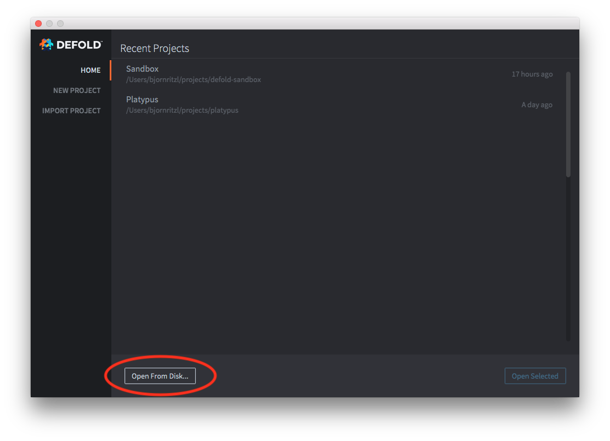

# 项目设置

您可以在 Defold 编辑器中轻松创建新项目。您也可以选择打开计算机上已有的现有项目。

## 创建新的本地项目 {#creating-a-new-project}

点击 <kbd>New Project</kbd> 选项，然后选择您想要创建的项目类型。在硬盘上指定一个位置来存储项目文件。点击 <kbd>Create New Project</kbd> 在您选择的位置创建项目。您可以从模板创建新项目：

或者从带有分步说明的教程创建：

或者从完成的示例游戏创建：

### 将项目添加到 GitHub

本地项目没有与任何版本控制系统集成，这意味着文件仅存在于您的硬盘上，也没有可用于还原更改的历史记录。在支持的情况下，通过编辑器 Assets 面板删除的文件会移到系统废纸篓或回收站；但如果该操作不可用或失败，文件可能会被永久删除。废纸篓无法保护任意编辑，也不提供版本历史记录，因此建议使用 Git 等版本控制系统跟踪文件更改。这也使得与他人协作项目变得非常容易。只需几个步骤即可将本地项目上传到 GitHub：

1. 在 [GitHub](https://github.com/) 上创建或登录账户
2. 使用 [New Repository](https://help.github.com/en/articles/creating-a-new-repository) 选项创建仓库
3. 通过 [Upload Files](https://help.github.com/en/articles/adding-a-file-to-a-repository) 选项上传所有项目文件

现在项目已处于版本控制之下，您应该将项目[克隆到本地硬盘](https://help.github.com/en/articles/cloning-a-repository)，并从这个新位置开始工作。

## 打开现有项目

点击 <kbd>Open From Disk</kbd> 选项以打开计算机上已有的项目。

## 打开最近的项目

一旦项目被打开一次，它就会显示在最近项目列表中。该列表将显示您最近处理过的项目，并允许您通过双击列表中的项目快速打开任何项目。
