# 属性动画

数值类的属性 (numbers, vector3, vector4 和 quaterions) 以及着色器常量都可以由内置的属性动画系统制作属性动画, 即使用 `go.animate()` 函数. 引擎会在属性值之间进行 "补间" 依照指定的播放和缓动模式进行播放. 你也可以自定义缓动函数.

{.inline srcset="images/animation/property_animation@2x.png 2x"}
{.inline}

## 属性动画

制作游戏对象或者组件的属性动画, 可以使用函数 `go.animate()`. 对于 GUI 节点属性, 可以使用函数 `gui.animate()`.

```lua
-- 设置 y 轴位置为 200
go.set(".", "position.y", 200)
-- 制作动画
go.animate(".", "position.y", go.PLAYBACK_LOOP_PINGPONG, 100, go.EASING_OUTBOUNCE, 2)
```

停止某个属性的所有动画, 调用 `go.cancel_animations()`, 对于 GUI 节点, 调用 `gui.cancel_animation()`:

```lua
-- 停止当前游戏对象欧拉 z 轴旋转动画
go.cancel_animations(".", "euler.z")
```

如果取消组合属性的动画, 例如 `position`, 其所有子属性 (`position.x`, `position.y` 和 `position.z`) 动画也会一同取消.

[属性教程](/manuals/properties) 涵盖游戏对象, 组件和 GUI 节点的所有属性.


## GUI 节点属性动画

几乎所有 GUI 节点属性都可以制作动画. 比如说, 把一个节点的 `color` 设置成透明看不见然后制作属性动画到全白使其可见 (也就是没有染色).

```lua
local node = gui.get_node("button")
local color = gui.get_color(node)
-- 节点白色动画
gui.animate(node, gui.PROP_COLOR, vmath.vector4(1, 1, 1, 1), gui.EASING_INOUTQUAD, 0.5)
-- 边框红色动画
gui.animate(node, "outline.x", 1, gui.EASING_INOUTQUAD, 0.5)
-- 位置延 x 轴移动 100 像素动画
gui.animate(node, hash("position.x"), 100, gui.EASING_INOUTQUAD, 0.5)
```

## 播放完成回调函数

动画函数 (`go.animate()` 和 `gui.animate()`) 可以在最后一个参数上传入Lua回调函数. 当动画播放完成时会调用这个函数. 对于循环动画和用 `go.cancel_animations()` 或 `gui.cancel_animation()` 取消的动画,不会调用回调函数. 回调函数里可以发送消息或者继续播放其他动画.

## 缓动

缓动决定动画基于时间的变化. 下面列出了内置的缓动函数.

以下可用于 `go.animate()` 函数:

|---|---|
| go.EASING_LINEAR | |
| go.EASING_INBACK | go.EASING_OUTBACK |
| go.EASING_INOUTBACK | go.EASING_OUTINBACK |
| go.EASING_INBOUNCE | go.EASING_OUTBOUNCE |
| go.EASING_INOUTBOUNCE | go.EASING_OUTINBOUNCE |
| go.EASING_INELASTIC | go.EASING_OUTELASTIC |
| go.EASING_INOUTELASTIC | go.EASING_OUTINELASTIC |
| go.EASING_INSINE | go.EASING_OUTSINE |
| go.EASING_INOUTSINE | go.EASING_OUTINSINE |
| go.EASING_INEXPO | go.EASING_OUTEXPO |
| go.EASING_INOUTEXPO | go.EASING_OUTINEXPO |
| go.EASING_INCIRC | go.EASING_OUTCIRC |
| go.EASING_INOUTCIRC | go.EASING_OUTINCIRC |
| go.EASING_INQUAD | go.EASING_OUTQUAD |
| go.EASING_INOUTQUAD | go.EASING_OUTINQUAD |
| go.EASING_INCUBIC | go.EASING_OUTCUBIC |
| go.EASING_INOUTCUBIC | go.EASING_OUTINCUBIC |
| go.EASING_INQUART | go.EASING_OUTQUART |
| go.EASING_INOUTQUART | go.EASING_OUTINQUART |
| go.EASING_INQUINT | go.EASING_OUTQUINT |
| go.EASING_INOUTQUINT | go.EASING_OUTINQUINT |

以下可用于 `gui.animate()` 函数:

|---|---|
| gui.EASING_LINEAR | |
| gui.EASING_INBACK | gui.EASING_OUTBACK |
| gui.EASING_INOUTBACK | gui.EASING_OUTINBACK |
| gui.EASING_INBOUNCE | gui.EASING_OUTBOUNCE |
| gui.EASING_INOUTBOUNCE | gui.EASING_OUTINBOUNCE |
| gui.EASING_INELASTIC | gui.EASING_OUTELASTIC |
| gui.EASING_INOUTELASTIC | gui.EASING_OUTINELASTIC |
| gui.EASING_INSINE | gui.EASING_OUTSINE |
| gui.EASING_INOUTSINE | gui.EASING_OUTINSINE |
| gui.EASING_INEXPO | gui.EASING_OUTEXPO |
| gui.EASING_INOUTEXPO | gui.EASING_OUTINEXPO |
| gui.EASING_INCIRC | gui.EASING_OUTCIRC |
| gui.EASING_INOUTCIRC | gui.EASING_OUTINCIRC |
| gui.EASING_INQUAD | gui.EASING_OUTQUAD |
| gui.EASING_INOUTQUAD | gui.EASING_OUTINQUAD |
| gui.EASING_INCUBIC | gui.EASING_OUTCUBIC |
| gui.EASING_INOUTCUBIC | gui.EASING_OUTINCUBIC |
| gui.EASING_INQUART | gui.EASING_OUTQUART |
| gui.EASING_INOUTQUART | gui.EASING_OUTINQUART |
| gui.EASING_INQUINT | gui.EASING_OUTQUINT |
| gui.EASING_INOUTQUINT | gui.EASING_OUTINQUINT |


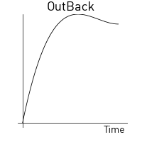


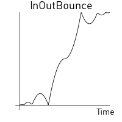
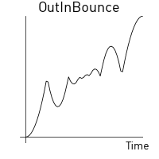


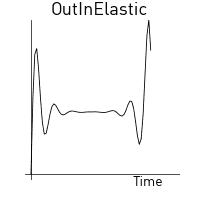


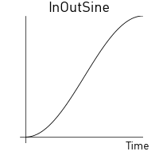
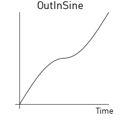
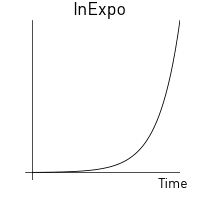
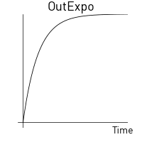


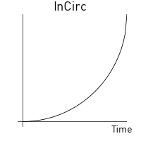


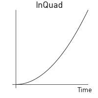


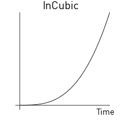


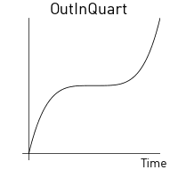

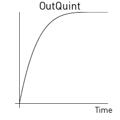

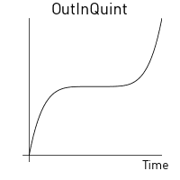

## 自定义缓动

可以使用 `vector` 和其中的一系列值代替预置缓动函数. 矢量值从 (`0`) 过渡到 (`1`). 引擎会从矢量中取样并自动线性插值生成缓动曲线.

示例如下:

```lua
local values = { 0, 0.4, 0.2, 0.2, 0.5. 1 }
local my_easing = vmath.vector(values)
```

生成的缓动曲线如下:

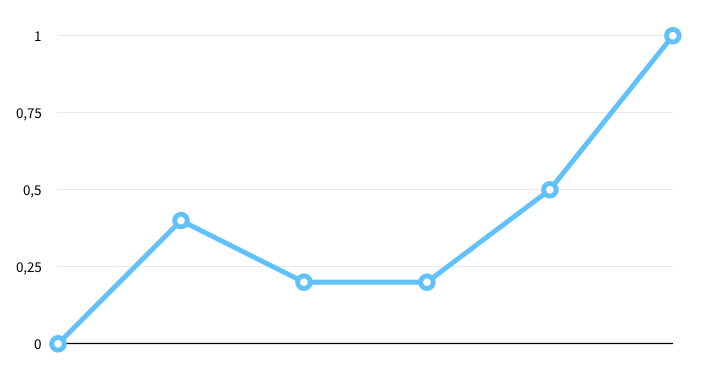

下面的例子是让游戏对象的 y 轴位置依照自定义曲线从当前位置到 200 来回跳跃:

```lua
local values = { 0, 0, 0, 0, 0, 0, 0, 0,
                 1, 1, 1, 1, 1, 1, 1, 1,
                 0, 0, 0, 0, 0, 0, 0, 0,
                 1, 1, 1, 1, 1, 1, 1, 1,
                 0, 0, 0, 0, 0, 0, 0, 0,
                 1, 1, 1, 1, 1, 1, 1, 1,
                 0, 0, 0, 0, 0, 0, 0, 0,
                 1, 1, 1, 1, 1, 1, 1, 1 }
local square_easing = vmath.vector(values)
go.animate("go", "position.y", go.PLAYBACK_LOOP_PINGPONG, 200, square_easing, 2.0)
```


