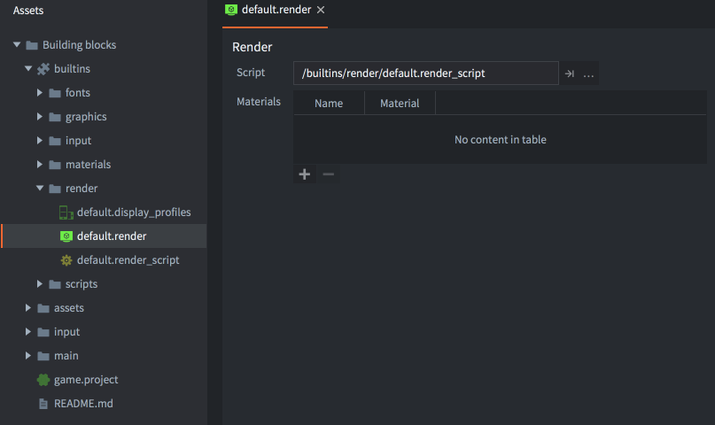
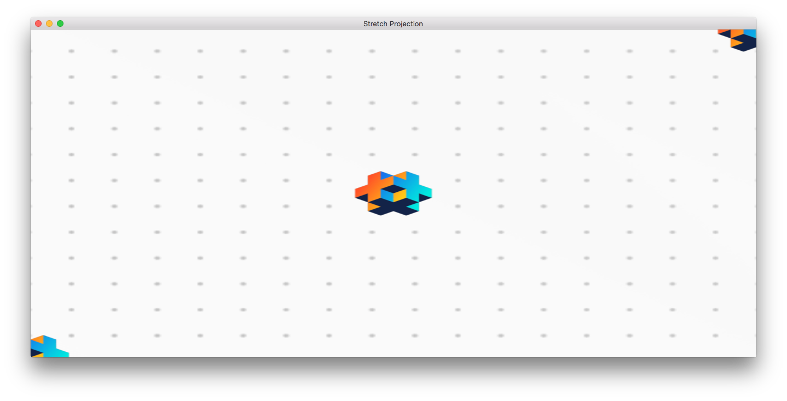
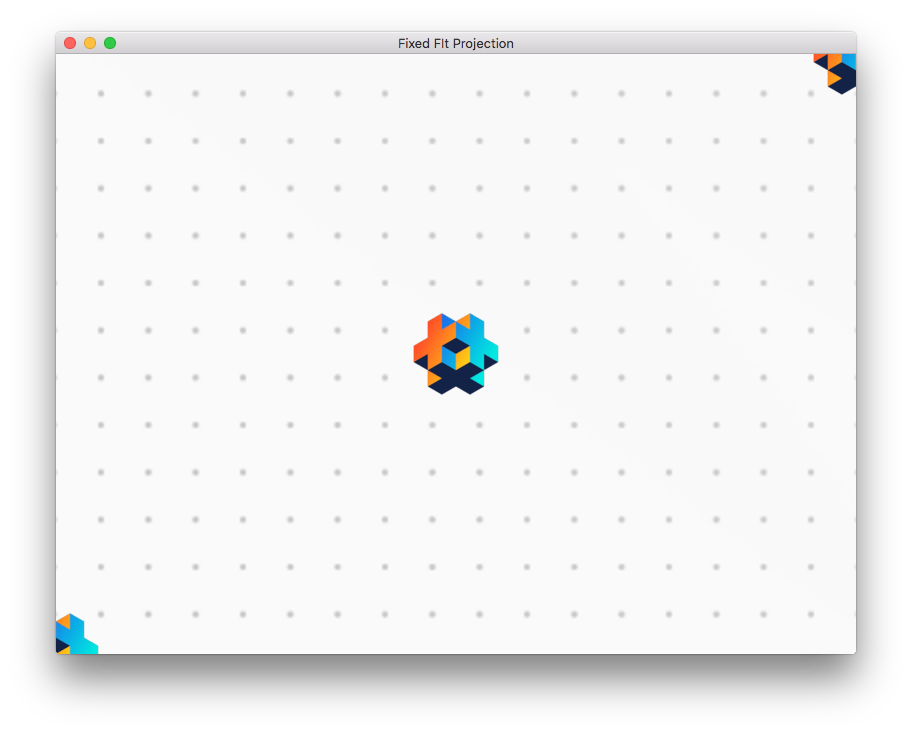
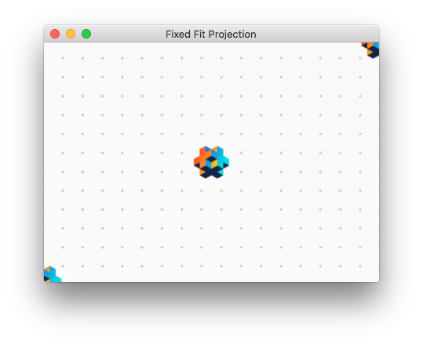
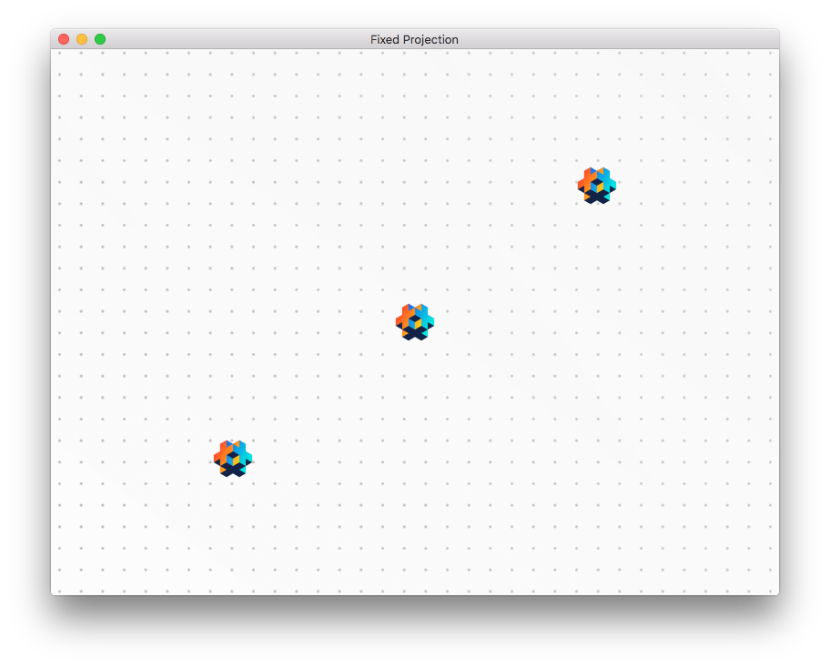
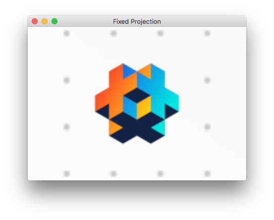

# 渲染

引擎在屏幕上显示的每个对象：精灵、模型、图块、粒子或 GUI 节点均由渲染器绘制。渲染器的核心是控制渲染管线的渲染脚本。默认情况下，每个 2D 对象都使用正确的位图、指定的混合方式和正确的 Z 深度进行绘制——因此，除了排序和简单混合之外，您可能不需要考虑渲染问题。对于大多数 2D 游戏，默认管线功能良好，但如果您的游戏有特殊要求，Defold 允许您编写量身定制的渲染管线。

### 渲染管线 - 是什么、何时以及何处？

渲染管线控制渲染什么、何时渲染以及在哪里渲染。渲染什么由[渲染判定](#render-predicates)控制。何时渲染判定在[渲染脚本](#the-render-script)中控制，在哪里渲染判定由[视图投影](#default-view-projection)控制。渲染管线还可以剔除位于定义边界框或视锥体之外的图形，这些图形由渲染判定绘制。这个过程称为视锥体剔除。


## 默认渲染

渲染文件包含对当前渲染脚本的引用，以及应在渲染脚本中可用的自定义材质（使用 [`render.enable_material()`](/ref/render/#render.enable_material)）

渲染管线的核心是_渲染脚本_。这是一个包含 `init()`、`update()` 和 `on_message()` 函数的 Lua 脚本，主要用于与底层图形 API 交互。渲染脚本在游戏生命周期中具有特殊位置。详细信息可在[应用程序生命周期文档](/manuals/application-lifecycle)中找到。

在项目的"Builtins"文件夹中，您可以找到默认渲染资源（"default.render"）和默认渲染脚本（"default.render_script"）。



要设置自定义渲染器：

1. 将"default.render"和"default.render_script"文件复制到项目层次结构中的某个位置。当然，您可以从头开始创建渲染脚本，但最好从默认脚本的副本开始，特别是如果您是 Defold 和/或图形编程的新手。

2. 编辑"default.render"文件的副本，并将*Script*属性更改为引用您的渲染脚本副本。

3. 在*game.project*设置文件中，将*Render*属性（在*bootstrap*下）更改为引用您的"default.render"文件副本。


## 渲染判定

为了能够控制对象的绘制顺序，您创建渲染_判定_。判定声明基于材质_标签_的选择应绘制什么。

每个绘制到屏幕上的对象都有一个附加的材质，该材质控制对象应如何在屏幕上绘制。在材质中，您指定一个或多个应与材质关联的_标签_。

在您的渲染脚本中，您可以创建一个*渲染判定*并指定哪些标签应属于该判定。当您告诉引擎绘制判定时，每个具有包含为判定指定的所有标签的材质的对象都将被绘制。

```
Sprite 1        Sprite 2        Sprite 3        Sprite 4
Material A      Material A      Material B      Material C
  outlined        outlined        greyscale       outlined
  tree            tree            tree            house
```

```lua
-- 匹配所有带有"tree"标签的精灵的判定
local trees = render.predicate({"tree"})
-- 将绘制精灵 1、2 和 3
render.draw(trees)

-- 匹配所有带有"outlined"标签的精灵的判定
local outlined = render.predicate({"outlined"})
-- 将绘制精灵 1、2 和 4
render.draw(outlined)

-- 匹配所有带有"outlined" AND "tree"标签的精灵的判定
local outlined_trees = render.predicate({"outlined", "tree"})
-- 将绘制精灵 1 和 2
render.draw(outlined_trees)
```


关于材质工作原理的详细描述可在[材质文档](/manuals/material)中找到。


## 默认视图投影

默认渲染脚本配置为使用适合 2D 游戏的正交投影。它提供三种不同的正交投影：`Stretch`（默认）、`Fixed Fit` 和 `Fixed`。作为默认渲染脚本中正交投影的替代方案，您还可以选择使用摄像机组件提供的投影矩阵。

### Stretch 投影

拉伸投影将始终绘制等于*game.project*中设置的尺寸的游戏区域，即使窗口被调整大小。如果宽高比发生变化，将导致游戏内容在垂直或水平方向上被拉伸：


*原始窗口大小的拉伸投影*



*窗口水平拉伸的拉伸投影*

拉伸投影是默认投影，但如果您已更改并需要切换回来，可以通过向渲染脚本发送消息来实现：

```lua
msg.post("@render:", "use_stretch_projection", { near = -1, far = 1 })
```

### Fixed fit 投影

就像拉伸投影一样，固定适配投影将始终显示等于*game.project*中设置尺寸的游戏区域，但如果窗口被调整大小且宽高比发生变化，游戏内容将保持原始宽高比，并且将在垂直或水平方向上显示额外的游戏内容：



*原始窗口大小的固定适配投影*


*窗口水平拉伸的固定适配投影*



*窗口缩小到原始大小 50% 的固定适配投影*

您可以通过向渲染脚本发送消息来启用固定适配投影：

```lua
msg.post("@render:", "use_fixed_fit_projection", { near = -1, far = 1 })
```

### Fixed 投影

固定投影将保持原始宽高比，并以固定的缩放级别渲染游戏内容。这意味着如果缩放级别设置为不是 100% 的值，它将显示比*game.project*中尺寸定义的游戏区域更多或更少的内容：


*缩放设置为 2 的固定投影*



*缩放设置为 0.5 的固定投影*



*缩放设置为 2 且窗口缩小到原始大小 50% 的固定投影*

您可以通过向渲染脚本发送消息来启用固定投影：

```lua
msg.post("@render:", "use_fixed_projection", { near = -1, far = 1, zoom = 2 })
```

### 摄像机投影

当使用默认渲染脚本且项目中有可用的已启用[摄像机组件](/manuals/camera)时，它们将优先于渲染脚本中设置的任何其他视图/投影。要了解有关在渲染脚本中使用摄像机组件的更多信息，请参阅[摄像机文档](/manuals/camera)。

## 视锥体剔除

Defold 中的渲染 API 允许开发人员执行称为视锥体剔除的操作。启用视锥体剔除后，任何位于定义边界框或视锥体之外的图形都将被忽略。在大型游戏世界中，一次只有一部分可见，视锥体剔除可以显著减少需要发送到 GPU 进行渲染的数据量，从而提高性能并节省电池（在移动设备上）。通常使用摄像机的视图和投影来创建边界框。默认渲染脚本使用视图和投影（来自摄像机）来计算视锥体。

视锥体剔除在引擎中按组件类型实现。当前状态（Defold 1.9.0）：

| 组件   | 支持 |
|-------------|-----------|
| Sprite      | 是       |
| Model       | 是       |
| Mesh        | 是 (1)   |
| Label       | 是       |
| Spine       | 是       |
| Particle fx | 否        |
| Tilemap     | 是       |
| Rive        | 否        |

1 = Mesh 边界框需要由开发人员设置。[了解更多](/manuals/mesh/#frustum-culling)。


## 坐标系统

当组件被渲染时，您通常会谈论组件在哪个坐标系统中被渲染。在大多数游戏中，您有一些组件在世界空间中绘制，一些在屏幕空间中绘制。

GUI 组件及其节点通常在屏幕空间坐标中绘制，屏幕左下角具有坐标 (0,0)，右上角是（屏幕宽度，屏幕高度）。屏幕空间坐标系永远不会被摄像机偏移或以其他方式转换。这将保持 GUI 节点始终在屏幕上绘制，无论世界如何渲染。

精灵、瓦片地图和游戏对象使用的其他存在于游戏世界中的组件通常在世界空间坐标系中绘制。如果您不对渲染脚本进行修改并且不使用摄像机组件来更改视图投影，则此坐标系与屏幕空间坐标系相同，但是一旦添加摄像机并移动它或更改视图投影，两个坐标系就会偏离。当摄像机移动时，屏幕左下角将从 (0, 0) 偏移，以便渲染世界的其他部分。如果投影改变，坐标将被平移（即从 0, 0 偏移）并通过缩放因子进行修改。


## 渲染脚本

下面是一个自定义渲染脚本的代码，它是内置版本的稍作修改版本。

init()
: 函数 `init()` 用于设置判定、视图和清除颜色。这些变量将在实际渲染期间使用。

```lua
function init(self)
    -- 定义渲染判定。每个判定都是独立绘制的，
    -- 这允许我们在绘制之间更改 OpenGL 的状态。
    self.predicates = create_predicates("tile", "gui", "text", "particle", "model")

    -- 创建和填充将在 update() 中使用的数据表
    local state = create_state()
    self.state = state
    local camera_world = create_camera(state, "camera_world", true)
    init_camera(camera_world, get_stretch_projection)
    local camera_gui = create_camera(state, "camera_gui")
    init_camera(camera_gui, get_gui_projection)
    update_state(state)
end
```

update()
: `update()` 函数每帧调用一次。其功能是通过调用底层 OpenGL ES API（OpenGL 嵌入式系统 API）来执行实际绘制。要正确理解 `update()` 函数中发生的情况，您需要了解 OpenGL 的工作原理。有许多关于 OpenGL ES 的优秀资源。官方网站是一个很好的起点。您可以在 https://www.khronos.org/opengles/ 找到它。

  本示例包含绘制 3D 模型所需的设置。`init()` 函数定义了一个 `self.predicates.model` 判定。在其他地方创建了一个带有 "model" 标签的材质。还有一些使用该材质的模型组件：

```lua
function update(self)
    local state = self.state
     if not state.valid then
        if not update_state(state) then
            return
        end
    end

    local predicates = self.predicates
    -- 清除屏幕缓冲区
    --
    render.set_depth_mask(true)
    render.set_stencil_mask(0xff)
    render.clear(state.clear_buffers)

    local camera_world = state.cameras.camera_world
    render.set_viewport(0, 0, state.window_width, state.window_height)
    render.set_view(camera_world.view)
    render.set_projection(camera_world.proj)


    -- 渲染模型
    --
    render.set_blend_func(render.BLEND_SRC_ALPHA, render.BLEND_ONE_MINUS_SRC_ALPHA)
    render.enable_state(render.STATE_CULL_FACE)
    render.enable_state(render.STATE_DEPTH_TEST)
    render.set_depth_mask(true)
    render.draw(predicates.model_pred)
    render.set_depth_mask(false)
    render.disable_state(render.STATE_DEPTH_TEST)
    render.disable_state(render.STATE_CULL_FACE)

     -- 渲染世界（精灵、瓦片地图、粒子等）
     --
    render.set_blend_func(render.BLEND_SRC_ALPHA, render.BLEND_ONE_MINUS_SRC_ALPHA)
    render.enable_state(render.STATE_DEPTH_TEST)
    render.enable_state(render.STATE_STENCIL_TEST)
    render.enable_state(render.STATE_BLEND)
    render.draw(predicates.tile)
    render.draw(predicates.particle)
    render.disable_state(render.STATE_STENCIL_TEST)
    render.disable_state(render.STATE_DEPTH_TEST)

    -- 调试
    render.draw_debug3d()

    -- 渲染 GUI
    --
    local camera_gui = state.cameras.camera_gui
    render.set_view(camera_gui.view)
    render.set_projection(camera_gui.proj)
    render.enable_state(render.STATE_STENCIL_TEST)
    render.draw(predicates.gui, camera_gui.frustum)
    render.draw(predicates.text, camera_gui.frustum)
    render.disable_state(render.STATE_STENCIL_TEST)
end
```

到目前为止，这是一个简单直接的渲染脚本。它以相同的方式每一帧都进行绘制。然而，有时希望能够将状态引入渲染脚本并根据状态执行不同的操作。可能还希望从游戏代码的其他部分与渲染脚本进行通信。

on_message()
: 渲染脚本可以定义一个 `on_message()` 函数并接收来自游戏或应用程序其他部分的消息。外部组件向渲染脚本发送信息的常见情况是_摄像机_。获得摄像机焦点的摄像机组件将自动每帧将其视图和投影发送到渲染脚本。此消息名为 `"set_view_projection"`：

```lua
local MSG_CLEAR_COLOR =         hash("clear_color")
local MSG_WINDOW_RESIZED =      hash("window_resized")
local MSG_SET_VIEW_PROJ =       hash("set_view_projection")

function on_message(self, message_id, message)
    if message_id == MSG_CLEAR_COLOR then
        -- 有人发送给我们一个新的要使用的清除颜色。
        update_clear_color(state, message.color)
    elseif message_id == MSG_SET_VIEW_PROJ then
        -- 具有摄像机焦点的摄像机组件将向 @render 套接字发送 set_view_projection
        -- 消息。我们可以使用摄像机信息来
        -- 设置渲染的视图（可能还有投影）。
        camera.view = message.view
        self.camera_projection = message.projection or vmath.matrix4()
        update_camera(camera, state)
    end
end
```

然而，任何脚本或 GUI 脚本都可以通过特殊的 `@render` 套接字向渲染脚本发送消息：

```lua
-- 更改清除颜色。
msg.post("@render:", "clear_color", { color = vmath.vector4(0.3, 0.4, 0.5, 0) })
```

## 渲染资源
要将某些引擎资源传递到渲染脚本中，您可以将它们添加到分配给项目的 .render 文件中的 `Render Resources` 表中：


在渲染脚本中使用这些资源：

```lua
-- "my_material" 现在将用于与判定关联的所有绘制调用
render.enable_material("my_material")
-- 判定绘制的任何内容都将最终出现在 "my_render_target" 中
render.set_render_target("my_render_target")
render.draw(self.my_full_screen_predicate)
render.set_render_target(render.RENDER_TARGET_DEFAULT)
render.disable_material()

-- 将渲染目标结果纹理绑定到通过判定渲染的任何内容
render.enable_texture(0, "my_render_target", render.BUFFER_COLOR0_BIT)
render.draw(self.my_tile_predicate)
```

::: sidenote
Defold 目前仅支持 `Materials` 和 `Render Targets` 作为引用的渲染资源，但随着时间的推移，此系统将支持更多资源类型。
:::

## 纹理句柄

Defold 中的纹理在内部表示为句柄，这本质上等同于一个数字，应该唯一标识引擎中任何位置的纹理对象。这意味着您可以通过在渲染系统和游戏对象脚本之间传递这些句柄来桥接游戏对象世界和渲染世界。例如，脚本可以在附加到游戏对象的脚本中创建动态纹理，并将其发送到渲染器，以用作绘制命令中的全局纹理。

在 `.script` 文件中：

```lua
local my_texture_resource = resource.create_texture("/my_texture.texture", tparams)
-- 注意：my_texture_resource 是资源路径的哈希值，不能用作句柄！
local my_texture_handle = resource.get_texture_info(my_texture_resource)
-- my_texture_handle 包含纹理的信息，如宽度、高度等
-- 它还包含句柄，这正是我们所需要的
msg.post("@render:", "set_texture", { handle = my_texture_handle.handle })
```

在 .render_script 文件中：

```lua
function on_message(self, message_id, message)
    if message_id == hash("set_texture") then
        self.my_texture = message.handle
    end
end

function update(self)
    -- 将自定义纹理绑定到绘制状态
    render.enable_texture(0, self.my_texture)
    -- 进行绘制..
end
```

::: sidenote
目前无法更改资源应指向的纹理，您只能在渲染脚本中使用这样的原始句柄。
:::

## 支持的图形 API
Defold 渲染脚本 API 将渲染操作转换为以下图形 API：

:[Graphics API](../shared/graphics-api.md)


## 系统消息

`"set_view_projection"`
: 此消息从已获得摄像机焦点的摄像机组件发送。

`"window_resized"`
: 引擎将在窗口大小更改时发送此消息。您可以监听此消息以在目标窗口大小更改时更改渲染。在桌面上，这意味着实际的游戏窗口已被调整大小，在移动设备上，每当发生方向更改时都会发送此消息。

```lua
local MSG_WINDOW_RESIZED =      hash("window_resized")

function on_message(self, message_id, message)
  if message_id == MSG_WINDOW_RESIZED then
    -- 窗口已调整大小。message.width 和 message.height 包含新尺寸。
    ...
  end
end
```

`"draw_line"`
: 绘制调试线。用于可视化 ray_casts、向量等。线使用 `render.draw_debug3d()` 调用绘制。

```lua
-- 绘制一条白线
local p1 = vmath.vector3(0, 0, 0)
local p2 = vmath.vector3(1000, 1000, 0)
local col = vmath.vector4(1, 1, 1, 1)
msg.post("@render:", "draw_line", { start_point = p1, end_point = p2, color = col } )  
```

`"draw_text"`
: 绘制调试文本。用于打印调试信息。文本使用内置的 `always_on_top.font` 字体绘制。系统字体具有带有标签 `debug_text` 的材质，并在默认渲染脚本中与其他文本一起渲染。

```lua
-- 绘制文本消息
local pos = vmath.vector3(500, 500, 0)
msg.post("@render:", "draw_text", { text = "Hello world!", position = pos })  
```

通过发送到 `@system` 套接字的 `"toggle_profile"` 消息可访问的可视化分析器不是可脚本渲染器的一部分。它与您的渲染脚本分开绘制。


## 绘制调用和批处理

绘制调用是描述使用纹理和材质以及可选的附加设置来设置 GPU 将对象绘制到屏幕的过程的术语。这个过程通常是资源密集型的，建议尽可能减少绘制调用的数量。您可以使用[内置分析器](/manuals/profiling/)来测量绘制调用的数量以及渲染它们所需的时间。

Defold 将尝试根据下面定义的一组规则批处理渲染操作以减少绘制调用的数量。GUI 组件和所有其他组件类型的规则不同。

### 非 GUI 组件的批处理规则

渲染基于 Z 顺序，从低到高进行。引擎将首先对要绘制的内容列表进行排序，并从低到高 Z 值进行迭代。如果满足以下条件，列表中的每个对象将与前一个对象分组到同一个绘制调用中：

* 属于同一个集合代理
* 是相同的组件类型（精灵、粒子效果、瓦片地图等）
* 使用相同的纹理（图集或瓦片源）
* 具有相同的材质
* 具有相同的着色器常量（如色调）

这意味着，如果同一集合代理中的两个精灵组件具有相邻或相同的 Z 值（因此在排序列表中彼此相邻），使用相同的纹理、材质和常量，它们将被分组到同一个绘制调用中。

### GUI 组件的批处理规则

GUI 组件中节点的渲染是从节点列表的顶部到底部进行的。如果满足以下条件，列表中的每个节点将与前一个节点分组到同一个绘制调用中：

* 是相同的类型（框、文本、饼图等）
* 使用相同的纹理（图集或瓦片源）
* 具有相同的混合模式
* 具有相同的字体（仅文本节点）
* 具有相同的模板设置

::: sidenote
节点的渲染是按组件进行的。这意味着来自不同 GUI 组件的节点将不会被批处理。
:::

能够将节点排列成层次结构使得将节点分组为可管理的单元变得容易。但是，如果混合不同类型的节点，层次结构可能会有效地破坏批处理渲染。使用 GUI 层可以在保持节点层次结构的同时更有效地批处理 GUI 节点。您可以在[GUI 手册](/manuals/gui#layers-and-draw-calls)中阅读有关 GUI 层以及它们如何影响绘制调用的更多信息。
