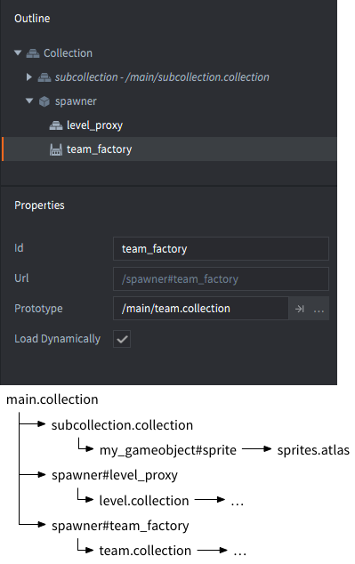
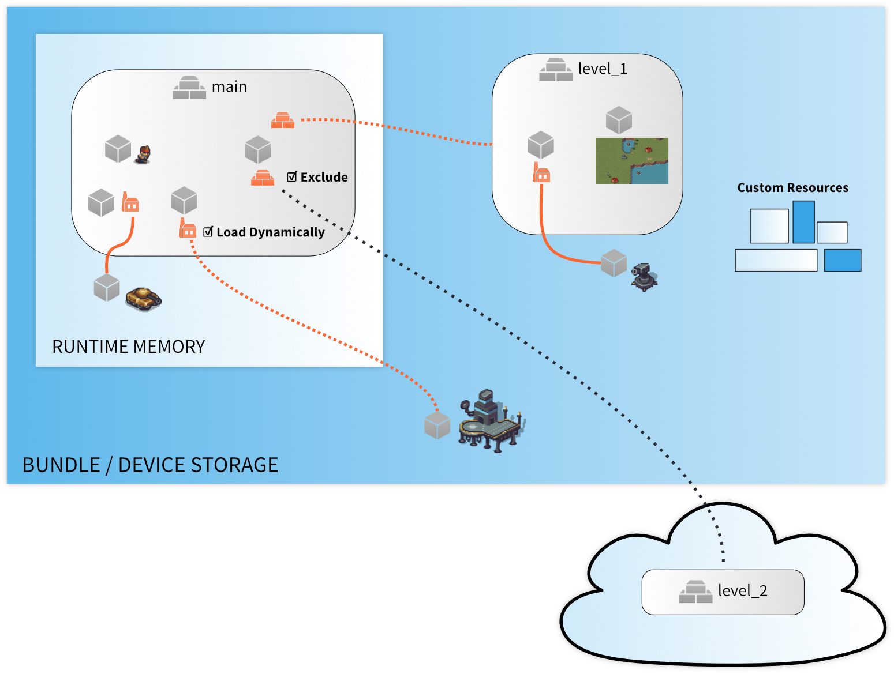
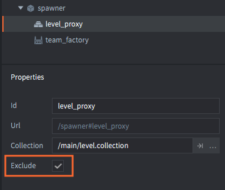

# 资源管理

如果只做小游戏, 目标平台的局限 (内存, 包体, 计算能力和耗电) 基本不是问题. 然而, 做大一些的游戏, 尤其是运行于掌上设备的, 内存资源肯能就成了大问题. 有经验的开发团队都会谨慎处理内存占用问题. Defold 提供了一些用于管理内存和包体的方法. 本教程将简要介绍这些方法.

## 静态资源树

编译 Defold 游戏, 就生成了静态资源树. 游戏里的各个部分都链接在资源树上, 第一个便是引导启动集合 (一般命名为 "main.collection"). 资源树链接了各种各样的资源:

- 游戏对象和组件数据 (图集, 声音之类的).
- 工厂组件原型 (游戏对象和集合).
- 集合代理组件数据 (集合).
- 在 *game.project* 中声明的 [自定义资源](/manuals/project-settings/#custom-resources).

::: sidenote
Defold 还有一个 [捆绑资源](/manuals/project-settings/#bundle-resources) 的概念. 捆绑资源存在于应用包体内, 但不存在于资源树之上. 捆绑资源可以是从平台特定的支持文件到 [文件系统加载](/manuals/file-access/#how-to-access-files-bundled-with-the-application) 的游戏所用的任何外部文件的数据 (例如 FMOD 声音库).
:::

游戏 *打包时*, 只保留资源树链接了的内容. 没被链接到的被剔除. 所以打包时不必手动选择哪些资源需要打包哪些资源不需要打包.

游戏 *运行时*, 引擎会从资源树根开始把资源读入内存中:

- 各种集合及其内容.
- 游戏对象及组件数据.
- 工厂组件原型 (游戏对象和集合).

但是, 运行时引擎不会自动读入以下资源:

- 集合代理未加载内容. 这些内容需要在代码里手动实施加载和卸载. 详情请见 [集合代理教程](/manuals/collection-proxy).
- 在 *game.project* 文件中 *Custom Resources* 里的资源. 这些资源需要手动使用 [sys.load_resource()](/ref/sys/#sys.load_resource) 函数加载.

Defold 打包和加载资源的方法可以被修改具体到如何, 何时把资源读入内存.

## 动态加载的工厂资源

工厂组件所链接的资源一般连同该组件直接载入内存. 这使得工厂组件可以尽快创建所需的游戏对象. 如果希望延迟加载可以开启工厂组件的 *Load Dynamically* 选项.

开启动态加载后, 引擎打包时会加入工厂链接资源, 但是加载工厂组件时不会主动加载这些资源. 需要加载时, 有两个办法:

1. 调用 [`factory.create()`](/ref/factory/#factory.create) 或者 [`collectionfactory.create()`](/ref/collectionfactory/#collectionfactory.create) 函数. 这样资源会被同步加载, 然后通过工厂创建出实例.
2. 调用 [`factory.load()`](/ref/factory/#factory.load) 或者 [`collectionfactory.load()`](/ref/collectionfactory/#collectionfactory.load) 函数来异步加载资源. 一旦资源加载完成, 会调用回调函数.

详情请见 [工厂教程](/manuals/factory) 和 [集合工厂教程](/manuals/collection-factory).

## 动态资源卸载

Defold 持有所有资源的引用计数. 引用数为0则表示资源不被使用. 这样的资源会从内存自动卸载. 比如, 如果你删除了工厂所有实例连同工厂组件所在的游戏对象, 那么此工厂引用的资源就会被自动释放.

对于标记为 *Load Dynamically* 的工厂, 可以调用 [`factory.unload()`](/ref/factory/#factory.unload) 或者 [`collectionfactory.unload()`](/ref/collectionfactory/#collectionfactory.unload) 函数. 这样就手动释放了动态加载工厂所引用的资源. 如果一个资源没有任何引用 (比如, 所有引用它的游戏对象都被删除了), 则它也会从内存中被卸载.

## 打包排除资源

使用集合代理, 就可以把一些资源从打包排除出去. 这样有助于保持包体最小化. 因为比如, 浏览器在运行 HTML5 游戏时会先下载完整的游戏包体再启动游戏.

开启 *Exclude* 选项的集合代理的资源会被排除在打包之外. 所以, 你需要把这些被排除的集合保存在云端. 详情请见 [热更新教程](/manuals/live-update/).
