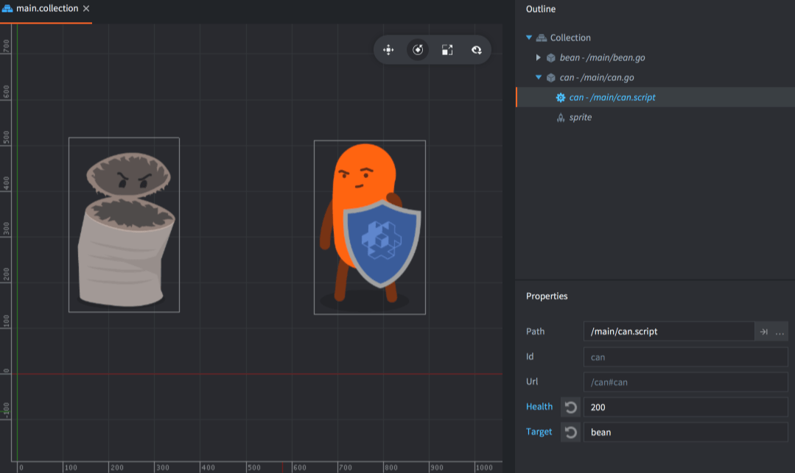
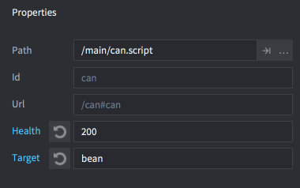

# 脚本属性

脚本属性提供了一个定义并暴露游戏对象自定义属性的手段. 游戏对象上的脚本属性可以在编辑器里直接编辑也可以在代码里使用. 许多情况下使用脚本属性非常方便:

* 当你想在编辑器中修改对象属性, 从而提高脚本重用性的时候.
* 当你想用初始值创建游戏对象的时候.
* 当你想创建属性值动画的时候.
* 当你想从脚本里存取另一个脚本里的状态值的时候. (注意如果对象之间需要频繁访问互相的属性, 最好把数据共享到一个地方.)

常用于设置敌人的血量或者速度, 物品的颜色, 或者按钮被按下时需要向谁发送什么消息.

## 定义脚本属性

脚本组件中属性由 `go.property()` 函数定义. 函数应位于顶级---不应在 `init()` 和 `update()` 之类的函数内部调用. 默认值决定了值类型: number, boolean, hash, `msg.url`, `vmath.vector3`, `vmath.vector4` 还是 `vmath.quaternion`. （好像最新版已经提供了属性类型的设置功能）

```lua
-- Define script properties for health and an attack target
go.property("health", 100)
go.property("target", msg.url())

function init(self)
  -- store initial position of target.
  -- self.target is an url referencing another objects.
  self.target_pos = go.get_position(self.target)
  ...
end

function on_message(self, message_id, message, sender)
  if message_id == hash("take_damage") then
    -- decrease the health property
    self.health = self.health - message.damage
    if self.health <= 0 then
      go.delete()
    end
  end
end
```

加入此脚本组件的任何对象都可以设置属性值了.

{srcset="images/script-properties/component@2x.png 2x"}

在编辑器里选择 *Outline* 视图,  可编辑的属性值会出现在 *Properties* 部分:

{srcset="images/script-properties/properties@2x.png 2x"}

被修改过的属性值以蓝色显示. 点击属性名旁边的重置按钮可以重置回默认值 (脚本里定义属性时的初始值).

## 访问脚本属性

被定义好的脚本属性存在于 `self` 之中, 由脚本实例保存:

```lua
-- my_script.script
go.property("my_property", 1)

function update(self, dt)
  -- Read and write the property
  if self.my_property == 1 then
      self.my_property = 3
  end
end
```

自定义脚本属性也可使用 get, set 和动画函数进行访问, 与其他属性一样:

```lua
-- another.script

-- increase "my_property" in "myobject#script" by 1
local val = go.get("myobject#my_script", "my_property")
go.set("myobject#my_script", "my_property", val + 1)

-- animate "my_property" in "myobject#my_script"
go.animate("myobject#my_script", "my_property", go.PLAYBACK_LOOP_PINGPONG, 100, go.EASING_LINEAR, 2.0)
```

## Factory 创建的对象

如果使用工厂创建对象, 可以在创建时赋初值:

```lua
local props = { health = 50, target = msg.url("player") }
factory.create("#can_factory", nil, nil, props)
```

当使用 `collectionfactory.create()` 创建对象时需要匹配id与对应的属性. 保存在一个表里传入 `create()` 函数:

```lua
local props = {}
props[hash("/can1")] = { health = 150 }
props[hash("/can2")] = { health = 250, target = msg.url("player") }
props[hash("/can3")] = { health = 200 }

local ids = collectionfactory.create("#cangang_factory", nil, nil, props)
```

使用 `factory.create()` 和 `collectionfactory.create()` 创建的对象属性值会覆盖原型文件和脚本定义的初始值.

如果一个游戏对象上附加了多个脚本组件定义了同名的属性, 每一个属性都会用提供给 `factory.create()` 或 `collectionfactory.create()` 的值来初始化.
