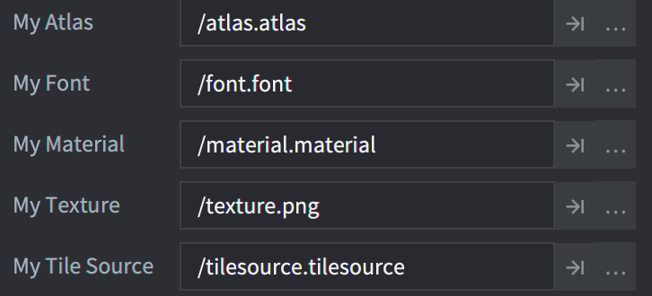

# 脚本属性

脚本属性提供了一种简单而强大的方式，用于定义和暴露特定游戏对象实例的自定义属性。脚本属性可以在编辑器中直接在特定实例上编辑，并且它们的设置可以在代码中使用，以改变游戏对象的行为。在许多情况下，脚本属性非常有用：

* 当您想在编辑器中为特定实例覆盖值，从而提高脚本的可重用性时。
* 当您想用初始值生成游戏对象时。
* 当您想为属性的值创建动画时。
* 当您想从一个脚本访问另一个脚本中的状态数据时。（请注意，如果您在对象之间频繁访问属性，最好将数据移动到共享存储中。）

常见的用例是设置特定敌人AI的生命值或速度、拾取对象的色调颜色、精灵的图集，或者按钮对象在被按下时应该发送什么消息---以及/或者发送到哪里。

## 定义脚本属性

脚本属性是通过使用`go.property()`特殊函数将它们添加到脚本组件中的。该函数必须在顶层使用---在任何生命周期函数（如`init()`和`update()`）之外。为属性提供的默认值决定了属性的类型：`number`、`boolean`、`hash`、`msg.url`、`vmath.vector3`、`vmath.vector4`、`vmath.quaternion`和`resource`（见下文）。

::: important
请注意，哈希值的反转仅在Debug构建中有效，以方便调试。在Release构建中，反转的字符串值不存在，因此对`hash`值使用`tostring()`来从中提取字符串是没有意义的。
:::


```lua
-- can.script
-- 为生命值和攻击目标定义脚本属性
go.property("health", 100)
go.property("target", msg.url())

function init(self)
  -- 存储目标的初始位置。
  -- self.target 是引用另一个对象的url。
  self.target_pos = go.get_position(self.target)
  ...
end

function on_message(self, message_id, message, sender)
  if message_id == hash("take_damage") then
    -- 减少生命值属性
    self.health = self.health - message.damage
    if self.health <= 0 then
      go.delete()
    end
  end
end
```

然后，任何由此脚本创建的脚本组件实例都可以设置属性值。


 在编辑器中的*Outline*视图中选择脚本组件，属性会出现在*Properties*视图中，允许您编辑它们：


任何被新的实例特定值覆盖的属性都会标记为蓝色。单击属性名称旁边的重置按钮可以将值恢复为默认值（在脚本中设置）。


::: important
脚本属性在构建项目时被解析。值表达式不会被计算。这意味着像`go.property("hp", 3+6)`这样的东西不会工作，而`go.property("hp", 9)`会工作。
:::

## 访问脚本属性

任何定义的脚本属性都作为存储的成员在`self`中可用，self是脚本实例引用：

```lua
-- my_script.script
go.property("my_property", 1)

function update(self, dt)
  -- 读取和写入属性
  if self.my_property == 1 then
      self.my_property = 3
  end
end
```

用户定义的脚本属性也可以通过get、set和animate函数访问，与任何其他属性一样：

```lua
-- another.script

-- 将"myobject#script"中的"my_property"增加1
local val = go.get("myobject#my_script", "my_property")
go.set("myobject#my_script", "my_property", val + 1)

-- 为"myobject#script"中的"my_property"创建动画
go.animate("myobject#my_script", "my_property", go.PLAYBACK_LOOP_PINGPONG, 100, go.EASING_LINEAR, 2.0)
```

## 工厂创建的对象

如果您使用工厂创建游戏对象，可以在创建时设置脚本属性：

```lua
local props = { health = 50, target = msg.url("player") }
local id = factory.create("#can_factory", nil, nil, props)

-- 访问工厂创建的脚本属性
local url = msg.url(nil, id, "can")
local can_health = go.get(url, "health")
```

当通过`collectionfactory.create()`生成游戏对象层次结构时，您需要将对象ID与属性表配对。这些表被放在一起并传递给`create()`函数：

```lua
local props = {}
props[hash("/can1")] = { health = 150 }
props[hash("/can2")] = { health = 250, target = msg.url("player") }
props[hash("/can3")] = { health = 200 }

local ids = collectionfactory.create("#cangang_factory", nil, nil, props)
```

通过`factory.create()`和`collectionfactory.create()`提供的属性值将覆盖原型文件中设置的任何值以及脚本中的默认值。

如果附加到游戏对象的几个脚本组件定义了相同的属性，每个组件都将使用提供给`factory.create()`或`collectionfactory.create()`的值进行初始化。


## 资源属性

资源属性的定义与基本数据类型的脚本属性类似：

```lua
go.property("my_atlas", resource.atlas("/atlas.atlas"))
go.property("my_font", resource.font("/font.font"))
go.property("my_material", resource.material("/material.material"))
go.property("my_texture", resource.texture("/texture.png"))
go.property("my_tile_source", resource.tile_source("/tilesource.tilesource"))
```

当定义资源属性时，它会像任何其他脚本属性一样显示在*Properties*视图中，但作为文件/资源浏览器字段：



您可以使用`go.get()`或通过`self`脚本实例引用并使用`go.set()`来访问和使用资源属性：

```lua
function init(self)
  go.set("#sprite", "image", self.my_atlas)
  go.set("#label", "font", self.my_font)
  go.set("#sprite", "material", self.my_material)
  go.set("#model", "texture0", self.my_texture)
  go.set("#tilemap", "tile_source", self.my_tile_source)
end
```
