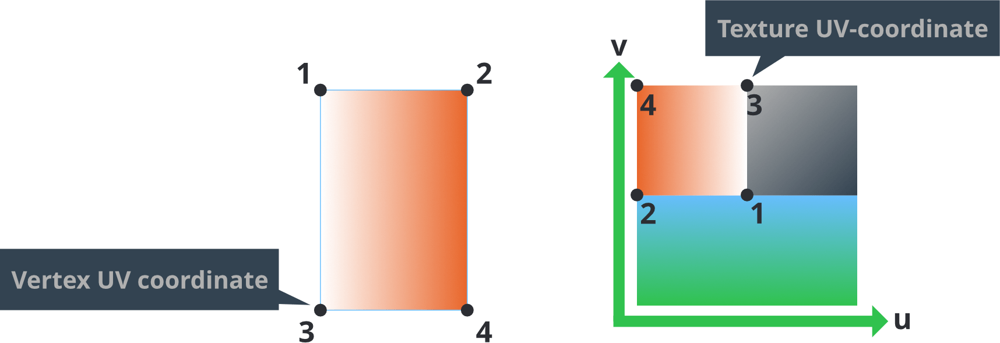
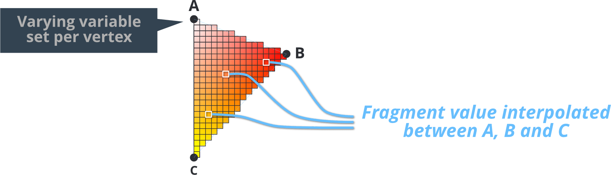
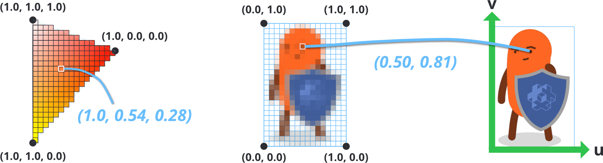
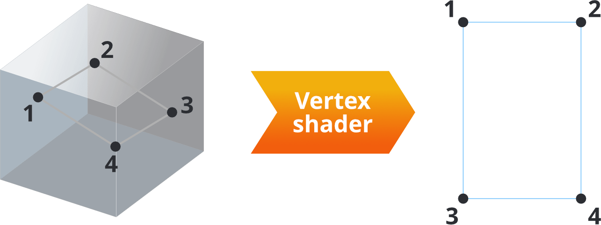
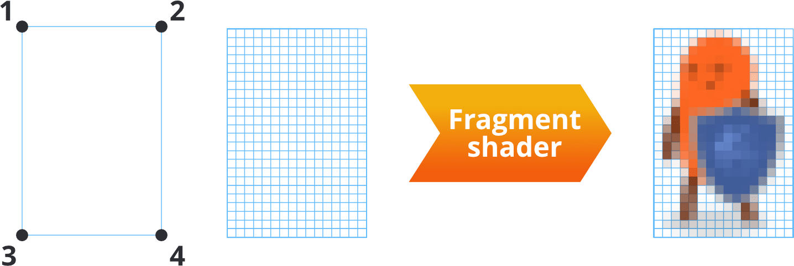

# Shaders

着色程序是图像渲染的核心. 由类似 C 语言的 GLSL (GL 着色语言) 语言编写而成供图形设备和操作系统操作 3D 数据 (称为顶点) 和屏幕上的像素 (称为片元). 着色器可以用来渲染图像, 3D 模型, 灯光和全屏的后期特效等等等等.

本教程介绍了 Defold 的渲染管线中的顶点/片元着色器接口. 为了编写着色器, 你还需要理解材质的概念, 以及渲染管线工作原理.

* 关于渲染管线详情请见 [渲染教程](/manuals/render).
* 关于材质详情请见 [材质教程](/manuals/material).

OpenGL ES 2.0 (OpenGL for Embedded Systems) 和 OpenGL ES 着色语言官方说明请见 https://www.khronos.org/registry/gles/

注意桌面设备渲染功能大于 OpenGL ES 2.0. 电脑显卡支持的效果在移动设备上可能无法使用.


## 概念

Vertex shader
: 顶点着色器不新建也不删除顶点, 只是计算顶点的位置. 顶点着色器一般用于把3D空间的顶点位置转换到2D屏幕空间之中.

  输入的是顶点数据 (以 `attributes` 的形式) 和常量 (`uniforms`). 通常常量是用于位置转换计算的矩阵.

  输出的是屏幕空间顶点坐标 (`gl_Position`). 也可以通过 `varying` 变量向片元着色器传递数据.

Fragment shader
: 顶点处理结束后, 由片元着色器来接手处理每个片元 (像素) 的颜色数据.

  输入的是常量 (`uniforms`) 还有从顶点着色器发来的 `varying` 变量.

  输出的是单个片元的颜色 (`gl_FragColor`).

World matrix
: 模型顶点的位置基于模型原点. 这被称作 "模型空间". 而游戏使用的是 "世界空间" 也就是每个点的位置旋转和缩放都是基于世界坐标系原点的. 把两者区别开便于引擎实现导入模型的移动, 旋转和缩放而不会破坏模型组件里存储的顶点数据.

  把模型放置于游戏世界时, 模型顶点要改成基于世界坐标系的. 这就需要一个 *世界变换矩阵* 来确定多少移动, 旋转和缩放应该应用于模型顶点以修正其基于世界坐标系的位置.

  

View 和 projection matrix
: 为了把游戏世界物体投射到屏幕上, 每个矩阵的3D坐标先是转换为基于摄像机的坐标. 这时使用的是 _视口矩阵_. 然后, 顶点再被转换为屏幕空间坐标, 这时使用的是 _投射矩阵_:

  

Attributes
: 顶点上的相关属性. 属性经由引擎传送给着色器. 只要在着色程序中声明一下即可使用. 不同类型组件有不同的属性:
  - Sprite 有 `position` 和 `texcoord0`.
  - Tilegrid 有 `position` 和 `texcoord0`.
  - GUI node 有 `position`, `textcoord0` 和 `color`.
  - ParticleFX 有 `position`, `texcoord0` 和 `color`.
  - Model 有 `position`, `texcoord0` 和 `normal`.
  - Font 有 `position`, `texcoord0`, `face_color`, `outline_color` 和 `shadow_color`.

Constants
: 着色器常量保持在渲染器的一个 draw call 之内. 常量位于材质的 *Constants* 部分并且在着色器程序里声明为 `uniform`. 取样器位于材质的 *Samplers* 部分并且在着色程序里声明为 `uniform`. 在顶点着色器里作为常量提供矩阵是执行顶点转换所必需的:

  - `CONSTANT_TYPE_WORLD` 是 *world matrix* 用于把物体本地空间坐标映射到世界坐标系中.
  - `CONSTANT_TYPE_VIEW` 是 *view matrix* 用于世界空间到摄像机空间的映射.
  - `CONSTANT_TYPE_PROJECTION` 是 *projection matrix* 用于摄像机空间到屏幕空间的映射.
  -  还有预乘的 $world * view$, $view * projection$ 和 $world * view$ 矩阵都可使用.
  - `CONSTANT_TYPE_USER` 是 `vec4` 可以自由使用的四元组.

  关于着色器常量的用法详情请见 [材质教程](/manuals/material).

Samplers
: 着色器可以声明 *采样器* 类型 uniform 变量. 采样器用于从图片中读取数值:

  - `sampler2D` 从2D纹理中采样.
  - `samplerCube` 从六图 cubemap 纹理中采样.

  只能在 GLSL 标准库的纹理查找函数里使用采样器. 关于采样器设置详情请见 [材质教程](/manuals/material).

UV 坐标
: 2D纹理上的坐标. 用于将纹理对应到顶点组成的模型上.

  

  UV图由3D建模软件生成并且存储在网格之中. 每个顶点的纹理坐标作为属性提供给顶点着色器. 然后用 varying 变量来给从顶点数据插值产生的片元顶点查找UV坐标.

Varying 变量
: Varying 变量被用作从顶点到片元程序的数据传递媒介.

  1. varying 由顶点着色器为每个顶点所设立.
  2. 在栅格化期间, 将为被渲染物每个片元间内插该值. 插值取决于片元到顶点间的距离.
  3. 此变量在每次调用片元着色器时被设置传递可以用来进行片元着色计算.

  

  比如说设定 varying 为三角面的顶点赋予 `vec3` RGB 颜色, 那么这个面上的片元都会根据此变量进行插值. 类似地, 设置四顶点平面的纹理采样坐标 (或称 *UV坐标*) 就可以让片元着色器查找到整个平面各个片元的颜色.

  

## 在 shader 中引入代码片段

Defold 中的 shader 支持引入项目文件内以 `.glsl` 为扩展名的着色器代码. 要将 glsl 代码引入 shader, 请使用 `#include` 关键字后跟双引号或小括号. 引入的文件要么是基于项目的相对路径, 要么是基于引入文件的相对路径:

```glsl
// 需要引入代码的文件 /main/my-shader.fp

// 完整路径
#include "/main/my-snippet.glsl"
// 同目录文件
#include "my-snippet.glsl"
// 文件位于 'my-shader' 下的子目录中
#include "sub-folder/my-snippet.glsl"
// 文件位于父级的子目录中, 例如 /some-other-folder/my-snippet.glsl
#include "../some-other-folder/my-snippet.glsl"
// 文件位于父级目录中, 例如 /root-level-snippet.glsl
#include "../root-level-snippet.glsl"
```

::: sidenote
着色器导入语句自从 1.4.2 版本可用
:::

寻找引入文件注意以下几点:

  - 文件必须在基于项目目录的相对路径, 也就是说被引入文件必须存在于项目中. 基于项目目录的相对路径开头应该是 `/`
  - 文件任何地方都可以声明引入, 只是不能把引入写进语句中. 比如 `const float #include "my-float-name.glsl" = 1.0` 就不行

### Header guards

被引入片段仍然可以引入其他 `.glsl` 文件, 也就是说成品 shader 可以引入同一片段代码很多次, 而这样有可能导致重复定义元素的错误. 为了避免这样的错误, 可以使用 *header guards*, 这是很多编程语言中的一个通用的概念. 比如:

```glsl
// In my-shader.vs
#include "math-functions.glsl"
#include "pi.glsl"

// In math-functions.glsl
#include "pi.glsl"

// In pi.glsl
const float PI = 3.14159265359;
```

本例中, `PI` 常量被定义了两次, 运行时将导致编译错误. 这种情况下可以使用 header guards 来保护常量定义:

```glsl
// In pi.glsl
#ifndef PI_GLSL_H
#define PI_GLSL_H

const float PI = 3.14159265359;

#endif // PI_GLSL_H
```

`pi.glsl` 在 `my-shader.vs` 被引用了两次, 但是通过 header guards 的保护 PI 实际上只被定义了一次, 所以编译会顺利通过.

然而, 根据不同用法这也不一定是必须的. 如果你的 shader 想在本地函数里使用或者在某处不需要使用全局有效的值的时候, 大体不必用到 header guards. 比如:

```glsl
// In red-color.glsl
vec3 my_red_color = vec3(1.0, 0.0, 0.0);

// In my-shader.fp
vec3 get_red_color()
{
  #include "red-color.glsl"
  return my_red_color;
}

vec3 get_red_color_inverted()
{
  #include "red-color.glsl"
  return 1.0 - my_red_color;
}
```


## 渲染过程

数据被投入屏幕之前, 要经过一系列步骤:


可视组件 (sprite, GUI 节点, 粒子特效和模型) 都由顶点构成, 位于3D坐标系的顶点描述了组件的形状. 好处是从任何角度任何距离都可以观察这些组件. 顶点着色器的工作就是获取每个顶点并把它转换成视口坐标系的坐标以便投射到屏幕上. 对于一个四顶点形状来说, 顶点着色器要并行运行四次.



顶点着色程序输入的是顶点位置 (及顶点属性数据) 而输出的是一个新的顶点坐标 (`gl_Position`) 连同片元间插值的 `varying` 变量.

最简单的顶点着色程序大概就是全部输出为0坐标 (没啥用):

```glsl
void main()
{
    gl_Position = vec4(0.0,0.0,0.0,1.0);
}
```

复杂点的像sprite的顶点着色程序:

```glsl
-- sprite.vp
uniform mediump mat4 view_proj;             // [1]

attribute mediump vec4 position;            // [2]
attribute mediump vec2 texcoord0;

varying mediump vec2 var_texcoord0;         // [3]

void main()
{
  gl_Position = view_proj * vec4(position.xyz, 1.0);    // [4]
  var_texcoord0 = texcoord0;                            // [5]
}
```
1. 一个 uniform (常量) 包含视口和投射预乘矩阵.
2. 顶点属性. `position` 已被转换为世界坐标. `texcoord0` 包含顶点的UV坐标.
3. 声明输出变量. 变量基于顶点数据为每个片元插值然后传送给片元着色器.
4. `gl_Position` 被设置为当前顶点在投射空间的输出坐标. 包含四项: `x`, `y`, `z` 和 `w`. 其中 `w` 用于计算透视校正插值. 应用转换矩阵前一般都取值为 1.0.
5. 设置当前顶点的 varying UV 坐标. 栅格化之后它会为每个片元进行插值计算然后发送给片元着色器.


顶点着色器运行完, 组件的屏幕投射形状已被计算出来: 原始形状生成并被栅格化, 就是显卡把要显示的东西分解成 *片元*, 或理解为像素. 然后运行片元着色器, 每个片元处理运行一次. 对于屏幕上显示的 16x24 像素大小的图片, 片元着色程序要并行运行384次.



片元着色程序输入的是渲染管线和顶点着色器发来的数据, 一般是片元的 *uv坐标*, 染色颜色之类的. 而输出的是最终颜色值 (`gl_FragColor`).

最简单的片元着色程序大概就是把每个像素设置为黑色 (还是没什么用):

```glsl
void main()
{
    gl_FragColor = vec4(0.0,0.0,0.0,1.0);
}
```

复杂一点的比如sprite的片元着色程序:

```glsl
// sprite.fp
varying mediump vec2 var_texcoord0;             // [1]

uniform lowp sampler2D DIFFUSE_TEXTURE;         // [2]
uniform lowp vec4 tint;                         // [3]

void main()
{
  lowp vec4 tint_pm = vec4(tint.xyz * tint.w, tint.w);          // [4]
  lowp vec4 diff = texture2D(DIFFUSE_TEXTURE, var_texcoord0.xy);// [5]
  gl_FragColor = diff * tint_pm;                                // [6]
}
```
1. 声明 varying 纹理坐标变量. 此变量基于形状顶点为每个片元进行插值.
2. 声明 `sampler2D` uniform 变量. 取样器, 连同插值纹理坐标, 用于sprite的纹理采样. 对于sprite来说, 引擎会自动把要采样的纹理对应到sprite的 *Image* 属性上.
3. 定义 `CONSTANT_TYPE_USER` 材质常量并且声明为 `uniform`. 用来给sprite设置染色颜色. 默认值纯白.
4. 染色颜色于其不透明度相乘, 因为运行时纹理颜色都是经过不透明度预乘的.
5. 在插值坐标处采样并返回颜色值.
6. `gl_FragColor` 代表片元最终颜色结果: 漫反射纹理颜色于其染色颜色的乘积.

得到片元的最终颜色后还要经过一系列测试. 常见的有 *深度检测*, 看片元深度值是否与像素深度缓存相匹配. 经过测试后, 片元可能被丢弃或者深度缓存被赋予新的值. 这个检测常用于计算远离摄像机物体的渲染剔除工作.

如果这个片元被保留下来, 它还要与早先进入帧缓存的像素数据进行 *混合*. 渲染脚本基于混合参数将源颜色 (片元着色器输出颜色) 与目标颜色 (帧缓存里已有颜色) 进行混合计算. 混合计算常见用法如显示半透明图像等.

## 深入学习

- [Shadertoy](https://www.shadertoy.com) 上有大量开发者开源着色器. 可以通过学习各种着色技术作为自己的灵感源泉. 其中很多着色器改改就能应用到 Defold 中去. [Shadertoy 教程](https://www.defold.com/tutorials/shadertoy/) 介绍了把网站着色器用于 Defold 的具体步骤.

- [渐变教程](https://www.defold.com/tutorials/grading/) 介绍了使用纹理采样进行全屏颜色渐变效果的编写方法.

- [The Book of Shaders](https://thebookofshaders.com/00/) 介紹了將著色器應用於項目的方法, 有利於提高性能和視覺效果.
