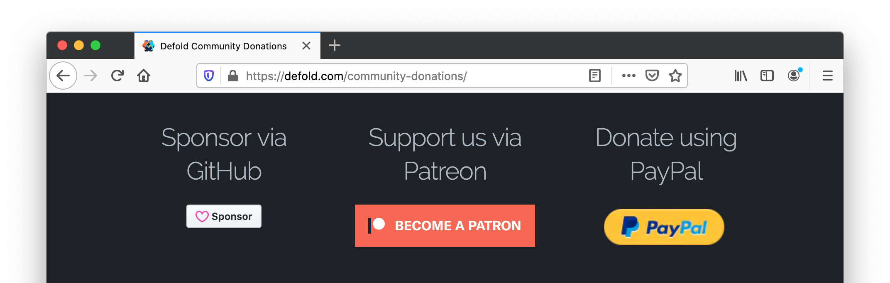

# Sony PlayStation 支持

Defold 基金会是 PlayStation® 中间件提供商, 我们正积极筹备从 Defold 到 PlayStation 的应用输出. 这项工作将于 2022 年第三季度完成.

# 注册成为 PlayStation 开发者

标准版 Defold 不包含对 PlayStation 平台的支持. 为能使用 Defold 开发 PlayStation 应用你需要:

1. 成为 Defold 社区捐助者, 会员等级要包含 PlayStation 访问权限.
2. 成为 Sony PlayStation 合作伙伴.

## 成为 Defold 社区捐助者, 包含 PlayStation® 访问权限

可以在 [Defold 社区捐助页面](/community-donations/) 捐款成为捐助会员. 可以在 GitHub Sponsors 或 Patreon 平台页面捐款获取 PlayStation 访问权限. 注意选择包含 PlayStation 访问权限的捐助等级.

## 注册成为 Sony PlayStation 合作伙伴

可以在 [Sony PlayStation Partner 页面](https://register.playstation.net/) 注册成为 PlayStation 开发者:

注册成为 PlayStation 开发者之后即可获得适用于当前 Sony 平台的开发工具和资源.

### 获取 Defold 的访问权

经由 Sony 审核通过之后即可登录 PlayStation 开发者大厅获取工具然后访问中间件页面注册 Defold 访问权. 注册 Defold 访问权之后会收到 Sony 发来的电子邮件, 用于验证用户的 PlayStation 合作伙伴身份. 然后我们会验证用户的捐款等级是否包含了 Sony PlayStation 访问权.

验证成功之后我们会向您提供:

* 包含 PlayStation 平台输出支持的 Defold 编辑器及其命令行工具 (bob.jar).
* 能够获得 PlayStation 支持的私人论坛组.
* PlayStation 文档
* PlayStation 引擎功能 API.

## 常见问题
:[主机相关常见问题](../shared/consoles-faq.md)