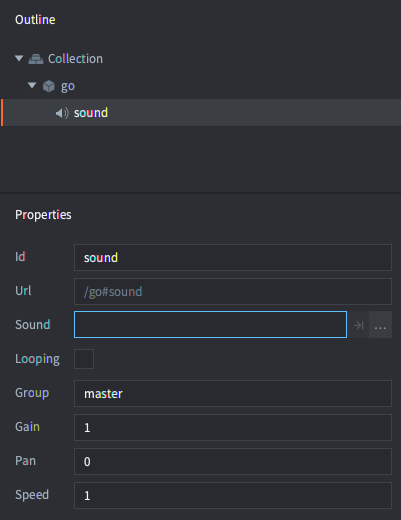
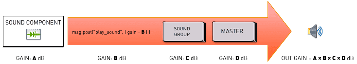
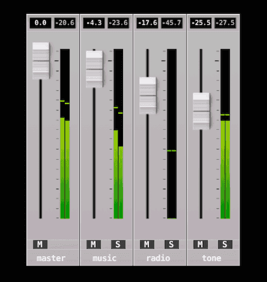

# 声音

Defold 的声音实现简单但强大。您只需要了解两个概念：

声音组件
: 这些组件包含应该播放的实际声音，并且能够播放声音。

声音组
: 每个声音组件可以被指定属于一个 _组_。组提供了一种直观的方式来管理属于一起的声音。例如，可以设置一个 "sound_fx" 组，任何属于该组的声音都可以通过简单的函数调用进行减弱。

## 创建声音组件

声音组件只能在游戏对象中原地实例化。创建一个新的游戏对象，右键单击它并选择 <kbd>Add Component ▸ Sound</kbd>，然后按 *OK*。


创建的组件有一组应该设置的属性：



*Sound*
: 应该设置为项目中的声音文件。文件应该是 _Wave_、_Ogg Vorbis_ 或 _Ogg Opus_ 格式。Defold 支持以 16bit 位深保存的声音文件。

*Looping*
: 如果选中，声音将播放 _Loopcount_ 次或直到明确停止。

*Loopcount*
: 循环声音在停止前将播放的次数（0 表示声音应该循环直到明确停止）。

*Group*
: 声音应该属于的声音组的名称。如果此属性留空，声音将被分配到内置的 "master" 组。

*Gain*
: 您可以直接在组件上设置声音的增益。这使您可以轻松调整声音的增益，而无需返回声音程序并重新导出。有关增益计算方式的详细信息，请参见下文。

*Pan*
: 您可以直接在组件上设置声音的声像值。声像必须是介于 -1（左 45 度）和 1（右 45 度）之间的值。

*Speed*
: 您可以直接在组件上设置声音的速度值。1.0 的值是正常速度，0.5 是半速，2.0 是双倍速度。


## 播放声音

当您正确设置了声音组件后，可以通过调用 [`sound.play()`](/ref/sound/#sound.play:url-[play_properties]-[complete_function]) 使其播放声音：

```lua
sound.play("go#sound", {delay = 1, gain = 0.5, pan = -1.0, speed = 1.25})
```

::: sidenote
即使声音组件所属的游戏对象被删除，声音也会继续播放。您可以调用 [`sound.stop()`](/ref/sound/#sound.stop:url) 来停止声音（见下文）。
:::
发送到组件的每条消息都会导致它播放另一个声音实例，直到可用的声音缓冲区已满，引擎将在控制台中打印错误。建议您实现某种门控和声音分组机制。

## 停止声音

如果您希望停止播放声音，可以调用 [`sound.stop()`](/ref/sound/#sound.stop:url)：

```lua
sound.stop("go#sound")
```

## 增益



声音系统有 4 级增益：

- 在声音组件上设置的增益。
- 在通过调用 `sound.play()` 启动声音时或通过调用 `sound.set_gain()` 更改声音上的增益时设置的增益。
- 通过 [`sound.set_group_gain()`](/ref/sound#sound.set_group_gain) 函数调用在组上设置的增益。
- 在 "master" 组上设置的增益。这可以通过 `sound.set_group_gain(hash("master"))` 来更改。

输出增益是这 4 个增益相乘的结果。默认增益在任何地方都是 1.0（0 dB）。

## 声音组

任何指定了声音组名称的声音组件都将被放入具有该名称的声音组中。如果您不指定组，声音将被分配到 "master" 组。您还可以将声音组件上的组显式设置为 "master"，这具有相同的效果。

有一些函数可用于获取所有可用的组，获取字符串名称，获取和设置增益、均方根（参见 http://en.wikipedia.org/wiki/Root_mean_square）和峰值增益。还有一个函数允许您测试目标设备的音乐播放器是否正在运行：

```lua
-- 如果在此 iPhone/Android 设备上播放声音，请将所有内容静音
if sound.is_music_playing() then
    for i, group_hash in ipairs(sound.get_groups()) do
        sound.set_group_gain(group_hash, 0)
    end
end
```

组通过哈希值标识。字符串名称可以通过 [`sound.get_group_name()`](/ref/sound#sound.get_group_name) 检索，可用于在开发工具中显示组名称，例如用于测试组电平的混音器。



::: important
您不应该编写依赖声音组的字符串值的代码，因为它们在发布版本中不可用。
:::

所有值在 0 和 1.0（0 dB）之间都是线性的。要转换为分贝，只需使用标准公式：

```math
db = 20 \times \log \left( gain \right)
```

```lua
for i, group_hash in ipairs(sound.get_groups()) do
    -- 字符串名称仅在调试中可用。在发布版本中返回 "unknown_*"。
    local name = sound.get_group_name(group_hash)
    local gain = sound.get_group_gain(group_hash)

    -- 转换为分贝。
    local db = 20 * math.log10(gain)

    -- 获取 RMS（增益均方根）。左右声道分别计算。
    local left_rms, right_rms = sound.get_rms(group_hash, 2048 / 65536.0)
    left_rmsdb = 20 * math.log10(left_rms)
    right_rmsdb = 20 * math.log10(right_rms)

    -- 获取增益峰值。左右声道分别计算。
    left_peak, right_peak = sound.get_peak(group_hash, 2048 * 10 / 65536.0)
    left_peakdb = 20 * math.log10(left_peak)
    right_peakdb = 20 * math.log10(right_peak)
end

-- 将主增益设置为 +6 dB（math.pow(10, 6/20)）。
sound.set_group_gain("master", 1.995)
```

## 声音门控

如果您的游戏在某个事件上播放相同的声音，并且该事件经常被触发，您可能会冒着几乎同时播放相同声音两次或更多次的风险。如果发生这种情况，声音将 _相位偏移_，这可能导致一些非常明显的伪影。


处理这个问题的最简单方法是构建一个门控，过滤声音消息，不允许在设定的时间间隔内多次播放相同的声音：

```lua
-- 不允许在 "gate_time" 间隔内播放相同的声音。
local gate_time = 0.3

function init(self)
    -- 将播放的声音计时器存储在一个表中，每帧倒计时，直到它们在表中存在了 "gate_time" 秒。然后删除它们。
    self.sounds = {}
end

function update(self, dt)
    -- 倒计时存储的计时器
    for k,_ in pairs(self.sounds) do
        self.sounds[k] = self.sounds[k] - dt
        if self.sounds[k] < 0 then
            self.sounds[k] = nil
        end
    end
end

function on_message(self, message_id, message, sender)
    if message_id == hash("play_gated_sound") then
        -- 只播放当前不在门控表中的声音。
        if self.sounds[message.soundcomponent] == nil then
            -- 将声音计时器存储在表中
            self.sounds[message.soundcomponent] = gate_time
            -- 播放声音
            sound.play(message.soundcomponent, { gain = message.gain })
        else
            -- 尝试播放声音被门控
            print("gated " .. message.soundcomponent)
        end
    end
end
```

要使用门控，只需向其发送 `play_gated_sound` 消息并指定目标声音组件和声音增益。如果门控打开，门控将使用目标声音组件调用 `sound.play()`：

```lua
msg.post("/sound_gate#script", "play_gated_sound", { soundcomponent = "/sounds#explosion1", gain = 1.0 })
```

::: important
让门控监听 `play_sound` 消息是行不通的，因为该名称由 Defold 引擎保留。如果您使用保留的消息名称，将会得到意外的行为。
:::


## 运行时操作
您可以通过许多不同的属性在运行时操作声音（有关用法，请参阅 [API 文档](/ref/sound/)）。可以使用 `go.get()` 和 `go.set()` 操作以下属性：

`gain`
: 声音组件的增益（`number`）。

`pan`
: 声音组件的声像（`number`）。声像必须是介于 -1（左 45 度）和 1（右 45 度）之间的值。

`speed`
: 声音组件的速度（`number`）。1.0 的值是正常速度，0.5 是半速，2.0 是双倍速度。

`sound`
: 声音的资源路径（`hash`）。您可以使用资源路径通过 `resource.set_sound(path, buffer)` 更改声音。示例：

```lua
local boom = sys.load_resource("/sounds/boom.wav")
local path = go.get("#sound", "sound")
resource.set_sound(path, boom)
```


## 项目配置

*game.project* 文件有一些与声音组件相关的[项目设置](/manuals/project-settings#sound)。

## 声音流传输

也可以支持[声音流传输](/manuals/sound-streaming)
