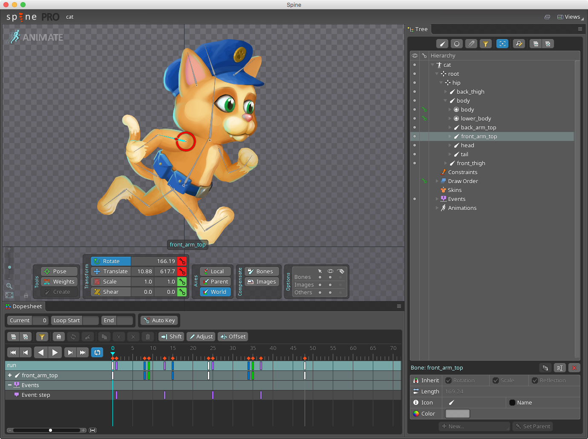
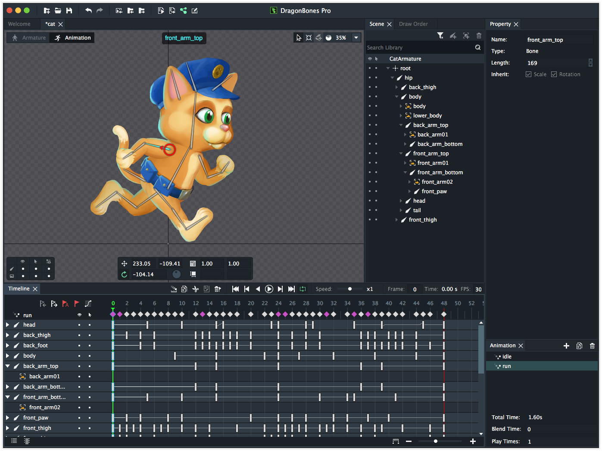
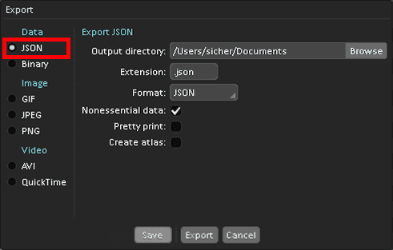
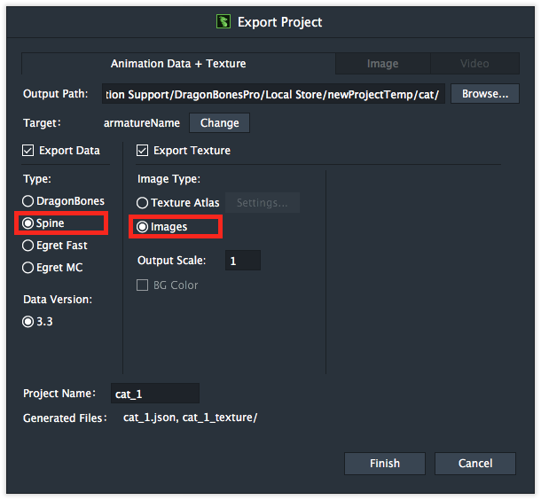
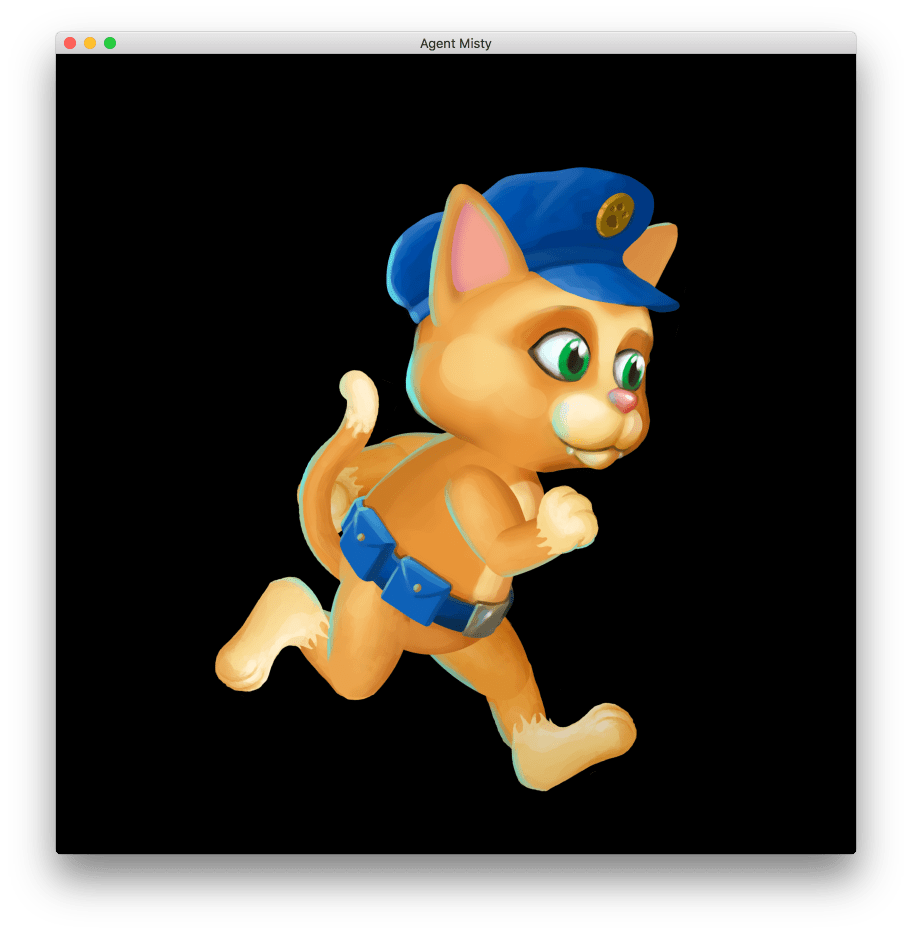
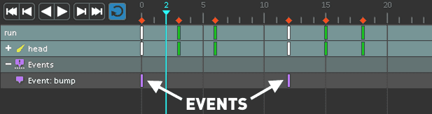
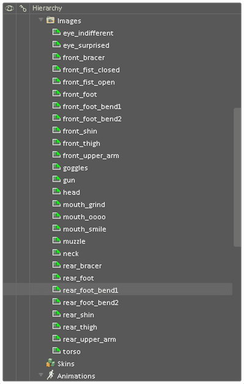
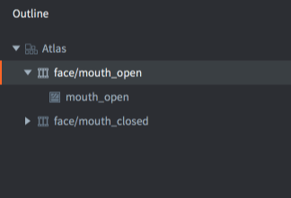

# Spine 动画

_Spine_ 是由 Esoteric Software 开发的第三方动画工具, 可以让你使用 _骨骼_ 绑定的技术创建动画. 这对于角色或者动物动画非常方便, 对制作其他动画也很有帮助, 比如绳子, 车辆或者树叶.

{.inline}
{.inline}

Defold 实现了 [Spine JSON 格式](http://esotericsoftware.com/spine-json-format) 的运行时和动画表达.

Defold 支持了主要的 Spine 动画功能, 包括反向运动学 (IK).

::: 注意
目前, Defold 不支持翻转 X 或者 Y 轴的动画关键帧. Defold 只支持骨骼驱动的网格动画, 不支持单个三角形顶点动画. 一定要做的话就用骨骼 100% 绑定一个三角形来做骨骼动画.
:::

::: 注意
Defold 支持 Spine runtime 2.x 功能. 少量支持 Spine 3.x 功能. 为了保证兼容性请只使用 Spine 2.x 功能!
:::

## 概念

*Spine JSON 数据文件*
: 此数据文件包含骨架, 所有图片插槽名, 皮肤和动画数据. 虽然图片文件并不嵌入在这个文件里. Spine 和 Dragon Bones 都可以生成这个文件, 喜欢用哪个就用哪个.

*Spine scene*
: 把 Spine JSON 数据文件和 Defold 图集文件做捆绑以便在骨骼插槽上显示图片内容.

*Spine model*
: _SpineModel_ 组件是最终游戏对象里用的用于显示动画的组件. 此组件包含骨骼游戏对象树状关系, 要播放的动画, 要使用的皮肤以及渲染时要使用的材质. 详情请见 [SpineModel 教程](/manuals/spinemodel).

*Spine Node*
: 在 GUI 场景播放 Spine 动画用的组件, 相当于游戏场景的 Spine model 组件. 详情请见 [GUI spine 教程](/manuals/gui-spine).

## 动画工具

Defold 支持的 Spine JSON 数据文件可以用 Esoteric Software 的 _Spine_ 软件, 或者 _Dragon Bones_ 软件输出.

_Spine_ 软件主页 http://esotericsoftware.com



_Dragon Bones_ 软件主页 http://dragonbones.com



::: 注意
_Dragon Bones_ 输出的 Spine JSON 数据文件应该能正常使用. 如果发现 _Dragon Bones_ 输出文件在 Defold 中显示不正确, 我们推荐先用官方 [Spine Skeleton Viewer](http://esotericsoftware.com/spine-skeleton-viewer) 检查数据是否能正确读出. Spine Skeleton Viewer 能够指出数据文件问题所在, 比如实例或者数据项缺失.
:::


## 导入 Spine 角色和动画

在 Spine 创建好模型和动画之后, 可以方便地导入到 Defold 中:

- 把动画输出为 Spine JSON 版本文件.
- 把输出的 JSON 文件放入项目目录中.
- 把所需所有碎图放入项目目录中.
- 把所有碎图建立 _图集_. (建立图集相关内容请参考 [2D 图像教程](/manuals/2dgraphics) 以及下面列举的一些注意事项)



如果使用 _Dragon Bones_, 选择 *Spine* 作为输出类型. 选择 *Images* 作为图片类型. 这样可以把 *.json* 及其所需图片输出到一个文件夹中. 如上所属导入 Defold 即可.



数据存入 Defold 后, 就可以创建 _Spine scene_ 资源文件了:

- 新建 _Spine scene_ 资源文件 (从主菜单选择 <kbd>New ▸ Spine Scene File</kbd>)
- 双击文件打开 spine scene 编辑器.
- 设置 *Properties*.

{srcset="images/spine/spinescene@2x.png 2x"}

Spine Json
: Spine JSON 数据文件.

Atlas
: Spine 动画需要的图集.

## 创建 Spine model 组件

创建并配置好 _Spine scene_ 之后, 就可以创建 SpineModel 组件了. 详情请见 [SpineModel 教程](/manuals/spinemodel).

## 创建 Spine GUI nodes

在 GUI 场景也可以使用 Spine 动画. 详情请见 [GUI spine 教程](/manuals/gui-spine).

## 播放 Spine 动画
在 Spine 模型上播放动画, 只需调用 [`spine.play_anim()`](/ref/spine#spine.play_anim) 函数:

```lua
local function anim_done(self)
    -- 动画播放完成, 做其他事情...
end

function init(self)
    -- 在 "spinemodel" 组件上播放 "walk" 动画同时与上一个动画
    -- 在前 0.1 内混合, 然后进行回调.
    local anim_props = { blend_duration = 0.1 }
    spine.play_anim("#spinemodel", "run", go.PLAYBACK_LOOP_FORWARD, anim_props, anim_done)
end
```

{srcset="images/animation/spine_ingame@2x.png 2x"}

如果动画是以 `go.PLAYBACK_ONCE_*` 模式播放, 然后在 `spine.play_anim()` 里指定回调函数, 则动画播放完成后会调用回调函数. 关于回调函数详见下文.

### 播放头

除了 `spine.play_anim()` 还有更高级的方法, *Spine Model* 组件暴露了一个 "cursor" 属性可以通过 `go.animate()` 进行控制:

```lua
-- 设置 spine model 动画但是不播放.
spine.play_anim("#spinemodel", "run_right", go.PLAYBACK_NONE)

-- 设置播放头为 0
go.set("#spinemodel", "cursor", 0)

-- 基于 in-out quad 缓动慢慢对播放头进行从 0 到 1 的 pingpong 补间.
go.animate("#spinemodel", "cursor", go.PLAYBACK_LOOP_PINGPONG, 1, go.EASING_INOUTQUAD, 6)
```

::: 注意
补间和设置播放头时, 时间轴事件不会被触发.
:::

### 骨骼层级

Spine 骨架的各个骨骼实例在游戏对象内展示出来. 在 Spine model 组件的 *Outline* 视图内, 可以看到完整的嵌套关系. 在此层级嵌套关系中你可以看到骨骼的名称和其所在的位置.

{srcset="images/animation/spine_bones@2x.png 2x"}

通过骨骼名称, 就可以在运行时得到骨骼实例. 函数 [`spine.get_go()`](/ref/spine#spine.get_go) 返回指定骨骼的 id, 然后就可以用来进行设置父级之类的操作:

```lua
-- 把手枪绑定到英雄手上
local hand = spine.get_go("heroine#spinemodel", "front_hand")
msg.post("pistol", "set_parent", { parent_id = hand })
```

### 时间轴事件

Spine 动画可以基于精确的时间触发事件. 对于需要做同步行为的功能非常有帮助, 例如播放走路声音, 场景粒子效果, 在骨骼层级上进行绑定和解绑或者实现你需要的其他功能.

在 Spine 软件里可以使用时间轴设置事件:



各种事件由事件 id 表示 (上例中是 "bump") 而且时间轴上的事件可以包含一些数据:

Integer
: 整数值.

Float
: 浮点数值.

String
: 字符串值.

动画播放遇到事件时, `spine_event` 消息会被发回到调用 `spine.play()` 函数的脚本上. 消息数据参数就是事件附带的数据, 连同其他一些有用的数据:

`t`
: 自动画播放第一帧开始经过的时间.

`animation_id`
: 动画名, 哈希值.

`string`
: 事件附带字符串值, 哈希值.

`float`
: 事件附带浮点数值.

`integer`
: 事件附带整数值.

`event_id`
: 事件 id, 哈希值.

`blend_weight`
: 此时动画混合情况. 0 表示动画还没有被混合, 1 当前动画混合 100%.

```lua
-- Spine 动画包含与动画同步的音效.
-- 作为消息传到这里.
function on_message(self, message_id, message, sender)
  if message_id == hash("spine_event") and message.event_id == hash("play_sound") then
    -- 播放动画音效. 事件数据包括声音组件和声音增益.
    local url = msg.url("sounds")
    url.fragment = message.string
    sound.play(url, { gain = message.float })
  end
end
``````

## 播放完成回调函数

动画播放函数 `spine.play_anim()` 可以在最后一个参数上传入Lua回调函数. 当动画播放完成时会调用这个函数. 对于循环动画, 不会调用回调函数, 也不能通过调用 `go.cancel_animations()` or `gui.cancel_animation()` 取消动画. 动画播放完成的回调函数里可以发送消息或者继续播放其他动画.

```lua
local function anim_done(self)
    -- 播放完成, 做点什么...
end

function init(self)
    -- 在组件 "spinemodel" 上播放 "walk" 并且与上个动画
    -- 进行 0.1 秒的混合, 然后调用回调函数.
    local anim_props = { blend_duration = 0.1 }
    spine.play_anim("#spinemodel", "run", go.PLAYBACK_LOOP_FORWARD, anim_props, anim_done)
end
```

## 播放模式

动画可以单次播放也可以循环播放. 取决于播放模式:

* go.PLAYBACK_NONE
* go.PLAYBACK_ONCE_FORWARD
* go.PLAYBACK_ONCE_BACKWARD
* go.PLAYBACK_ONCE_PINGPONG
* go.PLAYBACK_LOOP_FORWARD
* go.PLAYBACK_LOOP_BACKWARD
* go.PLAYBACK_LOOP_PINGPONG

pingpong 模式先正向播放, 再反向播放.


## 图集相关注意事项

动画通过去掉图片文件后缀的方法识别引用图片. 在 Spine 软件里图片文件位于 *Images* 目录下:



上图中图片没有嵌套关系. 但是通常, 图片会被分组放入子目录下, 其引用就包含了子目录前缀. 比如, 骨骼插槽对文件 *head_parts/eyes.png* 的引用就是 *head_parts/eyes*. 输出的 JSON 文件图片引用也是这个所以 Defold 图集中图片名要与之相匹配.

在 Defold 里 <kbd>Add Images</kbd> 时, 图片会以文件名去掉后缀的方法命名. 所以对于 *eyes.png* 自动命名就是 "eyes". 这样正好但是这是不带路径的情况.

对于带路径的 "head_parts/eyes" 该怎么办? 最简单的办法就是建立动画组 (图集 *Outline* 视图根节点右键选择 *Add Animation Group*). 然后手动命名为 "head_parts/eyes" (名字里的 `/` 字符合法) 再把 "eyes.png" 放入这个动画组.

{srcset="images/spine/atlas_names@2x.png 2x"}

关于 Spine 动画控制详情请见 [动画教程](/manuals/animation).
