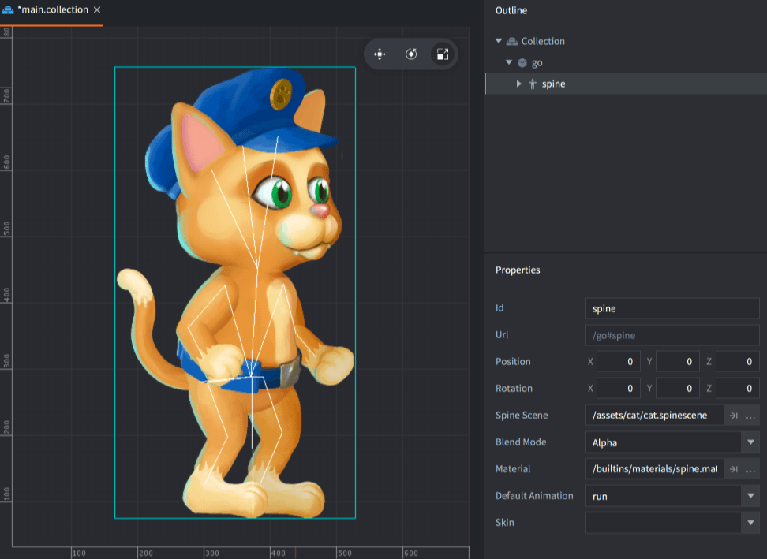

# Spine 模型

SpineModel 组件用于把 _Spine_ 骨骼动画在 Defold 中呈现出来.

## 创建 SpineModel 组件

选择一个游戏对象:

方法一 直接创建组件(<kbd>右键点击</kbd> 游戏对象选择 <kbd>Add Component ▸ Spine Model</kbd>)

方法二 先创建文件 (在 *资源* 浏览器中 <kbd>右键点击</kbd>, 在上下文菜单中选择 <kbd>New... ▸ Spine Model</kbd>), 再在游戏对象上 <kbd>右键点击</kbd> ，选择 <kbd>Add Component File</kbd>).

设置组件 *Properties*:

Spine scene
: 设置先前创建的 Spine Scene.

Blend Mode
: 默认混合模式是 `Alpha`, 想用别的可以修改这个属性.

Material
: 如果想要使用自定义材质显示Spine模型, 在此指定.

Default animation
: 设置Spine模型默认的动画.

Skin
: 设置Spine模型的皮肤.

此时就可以在编辑器里看到Spine模型了:

{srcset="images/spinemodel/spinemodel@2x.png 2x"}

## 运行时动画

Defold 提供运行时控制动画的功能:

```lua
local play_properties = { blend_duration = 0.1 }
spine.play_anim("#spinemodel", "jump", go.PLAYBACK_ONCE_FORWARD, play_properties)
```

可以手动播放动画甚至使用属性动画系统控制播放头:

```lua
-- set the run animation
spine.play_anim("#spinemodel", "run", go.PLAYBACK_NONE)
-- animate the cursor
go.animate("#spinemodel", "cursor", go.PLAYBACK_LOOP_PINGPONG, 1, go.EASING_LINEAR, 10)
```

