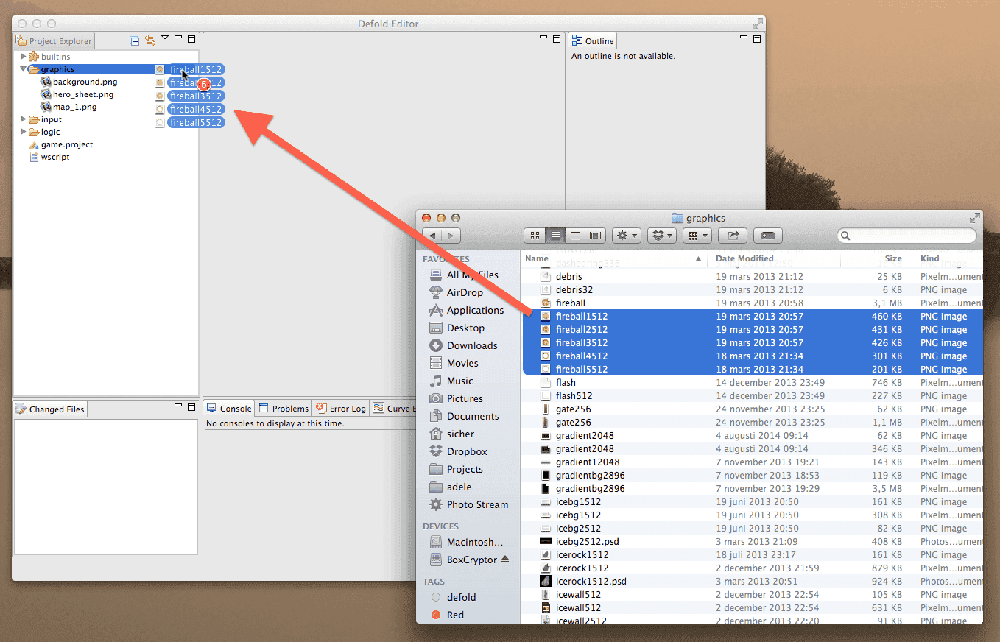

# Defold Markdown 测试

所有 Defold 手册和教程都是用 Markdown 编写的。本文档概述了如何使用各种格式，以确保所有文档的外观一致。

尝试以与用户交谈的方式写作。保持语言直接和主动，除非与问题相关，否则避免陈述意见。尝试写出流畅的段落，不要不必要地打断它们。

您确实有一些排版标记可供使用。最简单的是*强调*标记。它给单词增加了一些压力，将其标记为重要。此标记还应用于引起用户在 Defold 中可能遇到的特定事物的注意，例如属性、按钮等的名称。例如，精灵组件的*位置*，一个显示*保存...*的按钮等。文件名也是这样输入的：*game.project* 或 *main/images/logo.png*。

不要使用**粗体文本**强调。不要***永远***用粗体和强调标记任何内容。

通常，使用引号时，您可以输入直引号（`""`），它们会自动转换为"排版正确的漂亮引号"。此外，en 和 em 破折号是很容易输入的好东西。您可以通过输入 `--` 来输入 en 破折号，输入 `---` 来输入 em 破折号。所以现在您可以获得漂亮排版的数字间隔，如 23--24，如果您想在句子中使用 em 破折号作为标点符号---也很容易。只要记住不要在它们周围放置空格。每当您连续输入两个以上的空格时，也会自动插入一个漂亮的省略号字符...

按键组合，如 <kbd>⌘ + T</kbd> 被写在 `<kbd>` 标签内，菜单选项的引用也是如此，如 <kbd>文件 ▸ 另存为...</kbd>。注意使菜单选项突出的小右指三角形。

对于下标和上标，您输入 `~下标~` 和 `^上标^`。例如：<code>X~N~ = y^N^ + O~N~</code>，其中 `N` 是一个变量。为了清晰起见，数学公式可以放在 `<code>` 标签内，或者更好的是---使用 LaTeX 数学扩展。内联数学被写在 $ 符号之间。例如，$\int\frac {d\theta}{1+\theta^2} = \tan^{-1} \theta+ C$。单独的数学块由 $$ 对分隔：

```math
\int\frac {d\theta}{1+\theta^2} = \tan^{-1} \theta+ C
```

对于用户将输入的内容，如函数名、消息名、字符串值和类似内容，使用`代码标记`。例如，`go.some_function()` 或一个`变量`名，一个`message_name` 或一个`"字符串值"`。对于更大的代码块或配置文本，使用带有语言规范的代码围栏以启用语法高亮：

```lua
local pieces = { "ground0", "ground1", "ground2", "ground3",
                    "ground4", "ground5", "ground6" } -- <1>

function init(self) -- <2>
    self.speed = 6
end

-- 这是对函数功能的注释，它运行得相当长以强制换行
function update(self, dt)
    for i, p in ipairs(pieces) do -- <3>
        local pos = go.get_position(p)
        if pos.x <> -228 then
            pos.x = 1368 + (pos.x + 228)
        end
        pos.x = pos.x - self.speed
        go.set_position(pos, p)
    end
end
-- 这是对函数功能的注释，它运行得相当长以强制换行
```
1. 注意，源代码中的 `-- <1>` 被更改为数字标注，不再是源代码的一部分。
2. 根据您输入的源语言，标注的输入方式不同。在类似 C 的语言中，您会输入 `// <2>`
3. 在类似 shell 的语言中，您会输入 `# <3>`。

## 两个级别的标题、列表和表格

不要使用超过两个级别的标题。如果您需要描述您认为需要第三级标题的特定事物，请改用定义列表：

某事物
: 在这里您可以解释"某事物"是什么，它做什么等等。您可以在描述中使用所有的 markdown，只需确保正确缩进：
  - 一个要点
  - 另一个要点

另一个要解释的事物
: 在这里您解释另一个要解释的事物。在描述事物时，请尽量具体，避免模糊的语言。

定义列表在您可以为每个项目命名时很有用。有时项目符号列表或编号列表更好。您可以混合搭配这些：

- 项目符号列表，用行首的 `-` 或 `*` 或 `+` 表示。
- 另一个项目。
- 第三个项目。我们也可以制作子项目，可以是项目符号或数字：
    1. 一个编号的子项目。编号列表项目写作 `1.` 或 `1)`。
    2. 数字从第一个开始自动增加。
- 第四个项目符号项目。这标志着列表的结束。

23. 让我们创建一个从数字 23 开始的编号列表。
1. 另一个项目。注意，无论我输入什么，这都会得到数字 24。
0. 无论我输入什么，这都会得到数字 25。

定义列表对于事物的自由流解释很有用。有时表格可以更好地完成工作。左对齐：

| 快捷键                  | 目的               | 上下文        |
| ------------------------- | --------------------- | -------------- |
| <kbd>F11</kbd>            | 切换全屏     | 在应用程序中 |
| <kbd>⌘ + T</kbd>         | 打开新标签页        | 在应用程序中 |
| <kbd>⌘ + Shift + N</kbd> | 新建隐身窗口  | 在应用程序中 |

或者右对齐

| 快捷键                  | 目的               | 上下文        |
| ------------------------: | --------------------: | -------------: |
| <kbd>F11</kbd>            | 切换全屏     | 在应用程序中 |
| <kbd>⌘ + T</kbd>         | 打开新标签页        | 在应用程序中 |
| <kbd>⌘ + Shift + N</kbd> | 新建隐身窗口  | 在应用程序中 |

## 注释和图像

您可以在文本中插入两种类型的注释。由于这不是印刷媒体，脚注的概念并不真正适用。相反，我们将注释与文本保持在一起。对这些使用 `::: sidenote` 块。

::: sidenote
`::: sidenote` 块用于向文本添加类似脚注的信息。它可以用于添加不重要或指向其他资源的进一步解释。它们显示在它们前面的文本旁边。
:::

当您真的想让用户意识到某些事情时，使用 `::: important` 块：

::: important
这是用户不会错过的一段文本。请谨慎使用这些来处理确实需要大量注意的事情。如果您发现您的文档中充斥着这些，您可能想要对信息进行一些分组。
:::

图像是这样插入文档的：



{.left} 放在段落开头的图像---带有 `.left` 类的内联图像。这对于小图像如图标等很有用。这些的渲染不是最佳的，因为需要图像大小来计算图像相对于文本的位置。尽管如此，在某些情况下它可能有用，用于段落装饰或类似用途。

{.right} 放在段落开头的图像---带有 `.right` 类的内联图像。这对于小图像如图标等很有用。这些的渲染不是最佳的，因为需要图像大小来计算图像相对于文本的位置。尽管如此，在某些情况下它可能有用，用于段落装饰或类似用途。

{.icon} 带有 `.icon` 类的图像被渲染为与文本对齐的内联图像。使用它将非常小的图像（如 {.icon}）插入到正在运行的文本中。

请注意，图像通常在自己的段落中居中渲染。如果您有几个图像作为同一段落的一部分，并且您想要排列几个图像，请应用 `.inline` 类以获得内联行为，如下所示：

{.inline}
{.inline}

## 包含

在多个地方使用的文本片段可以包含到文档中。有关使用的包含插件的详细信息，请参阅 https://github.com/jamesramsay/hercule。

:[link](../shared/test.md)

结束
