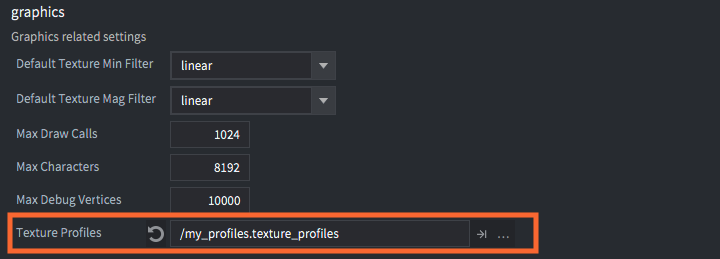
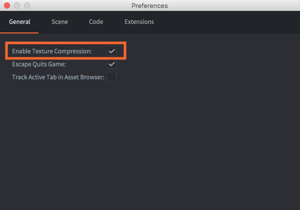
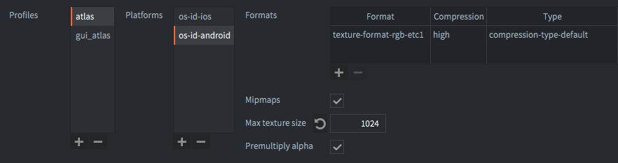

# 纹理档案

Defold 可以自动把图片数据处理成纹理并进行压缩 (称为 *Atlas*, *Tile sources*, *Cubemaps* 和模型纹理, GUI资源等等).

压缩有两种, 图片软件压缩与纹理硬件压缩.

1. 软件压缩 (比如 PNG 和 JPEG) 减少了图片占用空间. 可以让成品打包小一点. 但是读取到内存的时候必须解压, 硬盘上很小的图片, 都可能占用大量内存空间.

2. 硬件压缩也是减小图片占用空间. 区别于软件压缩的是, 纹理的内存占用也能减少. 这是因为图像硬件可以直接处理压缩图片而省去了解压过程.

纹理的处理基于纹理档案的设定. _Profiles_ 描述了不同平台下使用哪种压缩格式和纹理类型. _Profiles_ 绑定了 _paths patterns_, 用以微调和确定实际的压缩算法.

因为所有硬件压缩都是有损的, 纹理数据可能会不如压缩前好看. 造成这种现象的原因高度取决于材质和压缩算法. 为了得到最好的效果就需要多多尝试. 别忘了 Google 是你的好伙伴.

软件压缩方面可以在打包时选择如何保存纹理数据 (压缩或者原图). Defold 支持 WebP 和 ZLib (默认) 算法. WebP 支持有损无损两种方式, 通常比 ZLib 效果好, ZLib 效果一般.

::: 注意
压缩属于资源密集型耗时操作, 图片多的话可以 _大大_ 增加编译时间. 就连选择纹理压缩格式和类型也非常耗时.
:::

## 纹理档案

每个项目都有 *.texture_profiles* 文件用来进行纹理压缩设置. 默认情况下, 这个文件位于 *builtins/graphics/default.texture_profiles* 并且设置为所有纹理都绑定一个档案就是使用 RGBA 不进行硬件压缩并且使用默认 ZLib 压缩算法.

新增纹理压缩:

- 点击 <kbd>File ▸ New...</kbd> 选择 *Texture Profiles* 来新建纹理档案文件. (或者把 *default.texture_profiles* 拷贝到 *builtins* 之外的项目文件夹下)
- 命名文件.
- 在 *game.project* 里的 *texture_profiles* 项上引用这个文件.
- 打开 *.texture_profiles* 文件进行自己需要的配置.

你可以选择启用还是禁用纹理档案. 点击 <kbd>File ▸ Preferences...</kbd>. 在 *General* 部分就有 *Enable texture profiles* 选项.

## 路径设置

纹理档案的 *Path Settings* 部分是一个 *profile* 表格用以引用各种档案路径. 路径使用 "Ant Glob" 样式 (详情请见 http://ant.apache.org/manual/dirtasks.html#patterns) 表示. 样式中可以使用通配符:

`*`
: 匹配0个或多个字符. 例如 `sprite*.png` 匹配文件 *sprite.png*, *sprite1.png* 和 *sprite_with_a_long_name.png*.

`?`
: 匹配1个字符. 例如 `sprite?.png` 匹配文件 *sprite1.png*, *spriteA.png*, 但是不匹配文件 *sprite.png* 和 *sprite_with_a_long_name.png*.

`**`
: 匹配一个目录树, 或者在目录名中使用时可匹配多个目录. 例如 `/gui/**` 匹配 */gui* 及其所有子目录下的文件.

本例中引用了两个档案路径.

`/gui/**/*.atlas`
: 在 */gui* 下及其子目录下的所有 *.atlas* 文件被描述为 "gui_atlas" 档案.

`/**/*.atlas`
: 项目中所有 *.atlas* 文件被描述为 "atlas" 档案.

注意把广泛匹配放在下面. 文件匹配是从上到下进行的. 上面的匹配优先与下面的. 下面的档案不会覆盖上面的. 否则的话所有 "atlas" 都被第二条匹配了, 包括第一条 */gui* 下的.

对于 _没有被_ 匹配到的纹理会被编译且缩放为最近的2次方幂大小, 或者不做任何压缩处理.

## 档案

*profiles* 包含与上述对应的档案表. 每个档案包含一个或多个 *platforms*, 每个平台又包括一系列属性设定.

*Platforms*
: 指定平台. `OS_ID_GENERIC` 匹配所有平台, `OS_ID_WINDOWS` 对应 Windows 平台, `OS_ID_IOS` 对应 iOS 平台. 注意如果使用 `OS_ID_GENERIC`, 设定将会对所有平台生效.

::: 注意
如果两个 [路径样式](#path-settings) 匹配一个文件并且这两个路径分别指定不同的平台, 那么这 **两个** 档案都会生效, 所以会生成 **两个** 纹理.
:::

*Formats*
: 纹理格式. 如果指定多个, 每个格式都会生效. 引擎会在运行时选择合适的纹理格式.

*Mipmaps*
: 是否生成mipmap. 默认勾选.

*Premultiply alpha*
: 是否预乘alpha. 默认勾选.

*Max Texture Size*
: 如果填入非0值, 纹理将限制最大尺寸为填入值. 如果图片本身比填入值打, 纹理会被缩小.

对于每个档案的每个 *Formats*, 又有以下属性设定:

*Format*
: 纹理编码格式. 可用格式见下文.

*Compression*
: 压缩图片的质量等级. 取值从 `FAST` (质量最差, 速度最快) 到 `BEST` (质量最高, 速度最慢).

*Type*
: 压缩类型, 可选值有 `COMPRESSION_TYPE_DEFAULT`, `COMPRESSION_TYPE_WEBP` 和 `COMPRESSION_TYPE_WEBP_LOSSY`. 详见下文 [压缩类型](#compression-types).

## 纹理格式

硬件可以直接处理未压缩纹理以及 *有损* 压缩纹理. 固定硬件压缩意思是纹理大小是一定的, 而不论纹理的内容. 一定意义上原图内容决定了硬件压缩后纹理的质量.

目前支持以下有损压缩.

<!--
DXT
: 也叫 S3 纹理压缩. 原本只在Windows上应用, 但是 OS X 支持了这种格式的读取而 Linux 可以用安装软件的方法支持这种格式. 其原理是把图片分为 4x4 像素大小的图块每个图块每个像素四个颜色通道.
-->

PVRTC
: 也是一种图块压缩方法. 在4比特模式 (4BPP) 下每个图块 4×4 像素. 在2比特模式 (2BPP) 下每个图块 8×4 像素. 每个图块占用 64 比特 (8 字节) 内存空间.  这种格式原本用于 iPhone, iPod Touch, 和 iPad. 目前使用 PowerVR GPU 的 Android 设备, 也支持这种格式. Defold 支持 PVRTC1, 在格式id中用后缀 "V1" 表示.

ETC
: 爱立信纹理压缩格式. 4×4 像素块再次压缩为 64 比特数据. 4×4 像素块一分为二然后给每块指定一个基础颜色. 每个像素编码为这个基础颜色的四通道偏移量. Android 从 2.2 版 (Froyo) 开始支持 ETC1. Defold 支持 ETC1 纹理压缩格式.

| 格式                            | 压缩 | 描述  |
| --------------------------------- | ----------- | -------------------------------- | ---- |
| `TEXTURE_FORMAT_RGB`              | none        | 3 颜色通道. Alpha 被丢弃 |
| `TEXTURE_FORMAT_RGBA`             | none        | 3 颜色通道和 1 alpha 通道.    |
| `TEXTURE_FORMAT_RGB_16BPP`        | none        | 3 颜色通道. 5+6+5 比特. |
| `TEXTURE_FORMAT_RGBA_16BPP`       | none        | 3 颜色通道和 1 alpha 通道. 4+4+4+4 比特. |
| `TEXTURE_FORMAT_LUMINANCE`        | none        | 1 灰度通道, 无 alpha 通道. RGB 编码为 1 颜色通道. Alpha 被丢弃. |
| `TEXTURE_FORMAT_LUMINANCE_ALPHA`  | none        | 1 灰度通道和 1 alpha 通道. RGB 编码为 1 颜色通道. |
| `TEXTURE_FORMAT_RGB_PVRTC2BPPV1`  | 1:16 固定. | 无 alpha 通道. 正方形图片. 非正方形图片会被裁剪. |
| `TEXTURE_FORMAT_RGB_PVRTC4BPPV1`  | 1:8 固定   | 无 alpha 通道. 正方形图片. 非正方形图片会被裁剪. |
| `TEXTURE_FORMAT_RGBA_PVRTC2BPPV1` | 1:16 固定 | 预乘 alpha. 正方形图片. 非正方形图片会被裁剪. |
| `TEXTURE_FORMAT_RGBA_PVRTC4BPPV1` | 1:8 固定. | 预乘 alpha. 正方形图片. 非正方形图片会被裁剪. |
| `TEXTURE_FORMAT_RGB_ETC1`         | 1:6 固定  | 无 alpha 通道. |

<!---
| TEXTURE_FORMAT_RGB_DTX1
| 1:8 fixed
| No alpha
| Can be compressed on Windows only

| TEXTURE_FORMAT_RGBA_DTX1
| 1:8 fixed
| 1 bit alpha
| Can be compressed on Windows only

| TEXTURE_FORMAT_RGBA_DXT3
| 1:4 fixed
| 4 bit fixed alpha
| Can be compressed on Windows only

| TEXTURE_FORMAT_RGBA_DXT5
| 1:4 fixed
| Interpolated smooth alpha
| Can be compressed on Windows only
-->

## 压缩类型

支持以下软件压缩类型. 载入内存时需要解压.

| 类型                              | 格式                   | 描述 |
| --------------------------------- | ------------------------- | ---- |
| `COMPRESSION_TYPE_DEFAULT`        | 所有格式               | 简单无损压缩, 默认值. |
| `COMPRESSION_TYPE_WEBP`           | 所有格式               | WebP 无损压缩. 高质量小体积. |
| `COMPRESSION_TYPE_WEBP_LOSSY`     | 所有非硬件压缩格式 | WebP 有损压缩. 降低质量再降低体积. |

对于硬件压缩纹理格式PVRTC或ETC, WebP无损压缩过程使用内部中间格式将压缩的硬件纹理格式数据转换为更适合WebP图像压缩的数据. 然后在运行时加载时将其转换回压缩的硬件纹理格式. 硬件压缩纹理格式PVRTC和ETC目前不支持WebP有损类型.
