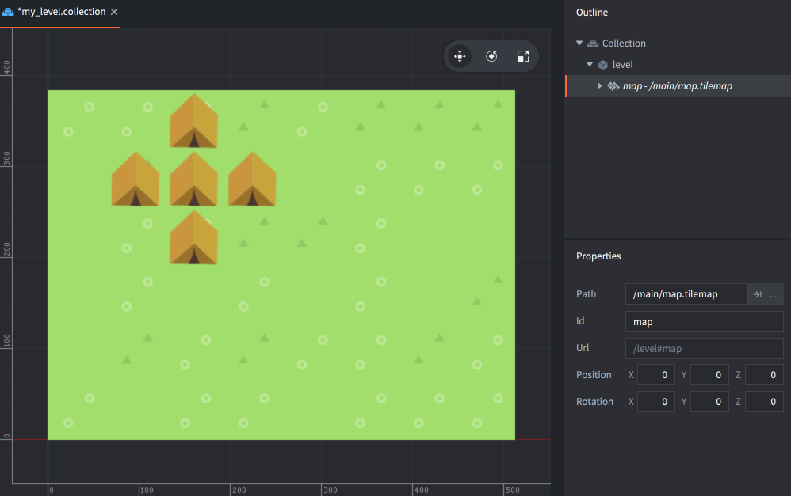

# Tile map （瓷砖地图）

*瓷砖地图* 是一个可以借由瓷砖图源装配, 绘制成一个大网格地图的组件. 瓷砖地图一般用来作为游戏关卡环境. 你可以在地图上使用瓷砖图源里设置的 *碰撞形状* 来进行碰撞检测或者模拟物理效果 ([example](/examples/tilemap/collisions/)).

创建瓷砖地图之前要先创建好瓷砖图源. 关于如何创建瓷砖图源, 详情请见 [瓷砖图源教程](/manuals/tilesource).

## 创建瓷砖地图

创建瓷砖地图的步骤:

- 在 *Assets* 浏览器中<kbd>右键点击</kbd>, 然后选择 <kbd>New... ▸ Tile Map</kbd>).
- 新的瓷砖地图会在瓷砖地图编辑器中打开.
- 给新文件命名.

  {srcset="images/tilemap/tilemap@2x.png 2x"}

- 用事先准备好的瓷砖图源设置 *Tile Source* 属性.

在瓷砖地图上绘制瓷砖的方法:

1. 在 *Outline* 视图中选择或者创建一个 *Layer* 用于绘制瓷砖.
2. 选取一个瓷砖当作笔刷 (按 <kbd>空格</kbd> 键显示瓷砖表)

   {srcset="images/tilemap/palette@2x.png 2x"}

3. 用选取的笔刷铺设瓷砖. 要清除一个瓷砖, 可以选择一个空白瓷砖当笔刷覆盖掉它, 也可以使用橡皮擦工具 (<kbd>Edit ▸ Select Eraser</kbd>).

   {srcset="images/tilemap/paint_tiles@2x.png 2x"}

你可以直接从层里选择一块瓷砖当作笔刷. 按住 <kbd>Shift</kbd> 键点击瓷砖即可把它用作当前笔刷. 按住 <kbd>Shift</kbd> 键并拖动还可以选择一片瓷砖作为大笔刷.

{srcset="images/tilemap/pick_tiles@2x.png 2x"}

## 把瓷砖地图加入到游戏中

把瓷砖地图加入游戏的步骤:

1. 建立一个游戏对象用以承载瓷砖地图组件. 这个游戏对象可以来自文件或者直接在集合里创建.
2. 右键点击游戏对象根节点选择 <kbd>Add Component File</kbd>.
3. 选取瓷砖地图文件.

{srcset="images/tilemap/use_tilemap@2x.png 2x"}

## 运行时操作

有一套用于在运行时修改瓷砖地图的方法和属性 (参见 [API文档](/ref/tilemap/)).

### 用脚本更改瓷砖

游戏运行时可以使用脚本动态读写瓷砖地图的内容. 通过调用 [`tilemap.get_tile()`](/ref/tilemap/#tilemap.get_tile) 和 [`tilemap.set_tile()`](/ref/tilemap/#tilemap.set_tile) 函数:

```lua
local tile = tilemap.get_tile("/level#map", "ground", x, y)

if tile == 2 then
    -- Replace grass-tile (2) with dangerous hole tile (number 4).
    tilemap.set_tile("/level#map", "ground", x, y, 4)
end
```

## 瓷砖地图属性

除了 *Id*, *Position*, *Rotation* 和 *Scale*, 瓷砖地图还有如下属性:

*Tile Source*
: 瓷砖地图的图源.

*Material*
: 瓷砖地图的材质.

*Blend Mode*
: 瓷砖地图的混合模式.

### 混合模式
:[blend-modes](../shared/blend-modes.md)

### 修改属性

使用 `go.get()` 和 `go.set()` 方法可以修改瓷砖地图的属性:

`tile_source`
: 瓷砖图源 (`hash`). 可以使用 `go.set()` 方法指定瓷砖图源. 参见 [这个例子的 API 用法](/ref/tilemap/#tile_source).

`material`
: 瓷砖地图材质 (`hash`). 可以使用 `go.set()` 方法指定瓷砖地图材质. 参见 [这个例子的 API 用法](/ref/tilemap/#material).

### 材质常量



`tint`
: 3D网格颜色 (`vector4`). 四元数 x, y, z, 和 w 分别对应红, 绿, 蓝和不透明度.

## 相关项目配置

在 *game.project* 文件里有些关于瓷砖地图的 [设置项目](/manuals/project-settings#tilemap).
